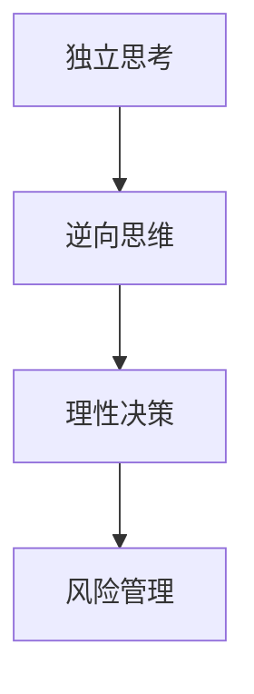
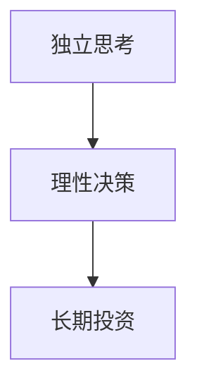
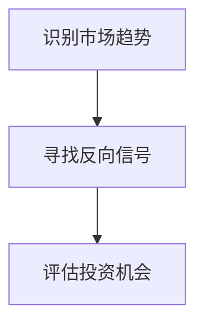
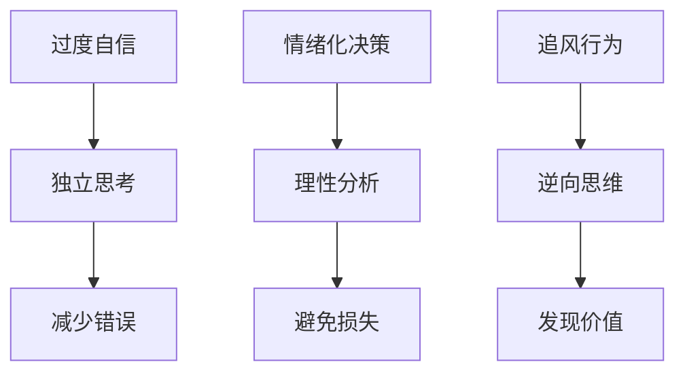
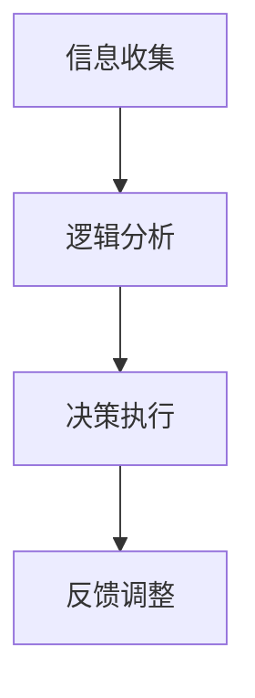
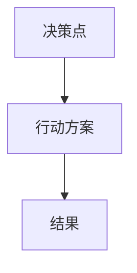
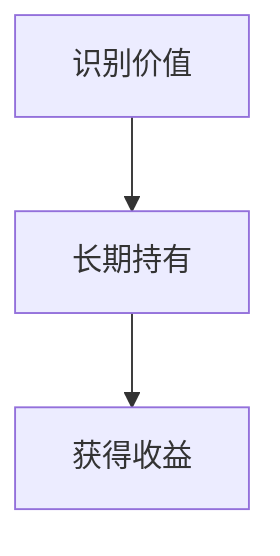
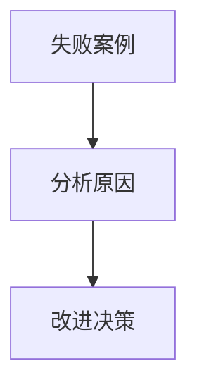

                 


# 芒格的"避免愚蠢"原则：明智投资的基础

---

## 关键词：
芒格、避免愚蠢、投资原则、理性决策、独立思考、逆向思维、风险管理

---

## 摘要：
本文深入探讨了芒格提出的“避免愚蠢”原则，分析其如何成为明智投资的基础。通过背景介绍、核心概念解析、数学模型构建、系统架构设计和实际案例分析，详细阐述了独立思考、逆向思维和理性决策的重要性。结合芒格的投资哲学，本文提供了从理论到实践的完整框架，帮助读者理解如何在复杂的投资环境中做出明智决策。

---

## 第1章: 芒格的生平与"避免愚蠢"原则的提出

### 1.1 芒格的早年经历
芒格的早年生活充满智慧和勤奋的特质，他在求学期间展现了对知识的极大渴求。他的哲学思想和阅读习惯为他后来的投资哲学奠定了基础。图1-1展示了芒格早年生活的关键节点。

**图1-1: 芒格早年生活的时间线**

```mermaid
timeline
    title 芒格的早年生活
    :1941: "出生在奥马哈，美国内布拉斯州"
    :1960: "进入哈佛大学，主修政治学"
    :1963: "开始对投资产生兴趣"
```

### 1.2 "避免愚蠢"原则的提出背景
芒格在投资领域观察到许多投资者因情绪化决策和非理性行为而遭受损失。他提出“避免愚蠢”原则，旨在帮助投资者在决策中保持理性。图1-2展示了“避免愚蠢”原则的核心要素。

**图1-2: "避免愚蠢"原则的核心要素**



---

## 第2章: "避免愚蠢"原则的核心要素

### 2.1 独立思考的实践
独立思考是芒格原则的核心。芒格强调投资者必须具备独立思考的能力，避免被市场情绪左右。图2-1展示了独立思考与投资决策的关系。

**图2-1: 独立思考与投资决策的关系**



### 2.2 逆向思维的策略
逆向思维是一种有效的决策策略，芒格将其应用到投资中，帮助投资者发现市场中的价值低估机会。图2-2展示了逆向思维的应用步骤。

**图2-2: 逆向思维的应用步骤**



---

## 第3章: "避免愚蠢"原则在投资中的应用

### 3.1 投资决策中的常见错误
投资者常犯的错误包括过度自信、情绪化决策和追风行为。这些错误可以通过芒格的“避免愚蠢”原则来克服。图3-1展示了常见投资错误及其解决方案。

**图3-1: 常见投资错误与解决方案**



### 3.2 "避免愚蠢"原则的投资策略
芒格的投资策略包括长期投资、价值投资和风险管理。这些策略通过数学模型得以验证，确保投资决策的科学性。图3-2展示了这些策略的数学模型。

**图3-2: 投资策略的数学模型**

$$
\text{投资回报} = \text{价值} \times \text{风险调整}
$$

---

## 第4章: 芒格决策框架的系统分析

### 4.1 芒格决策框架的构成
芒格的决策框架包括信息收集、逻辑分析和执行反馈三个部分。图4-1展示了决策框架的构成。

**图4-1: 芒格决策框架的构成**



### 4.2 芒格决策框架的数学模型
芒格的决策框架可以用决策树模型和风险评估模型来描述。图4-2展示了决策树模型。

**图4-2: 决策树模型**



---

## 第5章: 实际案例分析与经验总结

### 5.1 芒格的经典投资案例
芒格的经典投资案例包括可口可乐和伯克希尔哈撒韦。图5-1展示了可口可乐投资的决策过程。

**图5-1: 可口可乐投资的决策过程**



### 5.2 投资失败的教训
芒格也经历过投资失败，这些教训为他的投资哲学提供了宝贵的改进意见。图5-2展示了失败教训的学习过程。

**图5-2: 失败教训的学习过程**



---

## 第6章: "避免愚蠢"原则的未来展望

### 6.1 未来投资环境的挑战
随着市场的复杂化，投资者需要不断更新自己的知识和策略。芒格的“避免愚蠢”原则将继续为明智投资提供指导。

### 6.2 投资者应具备的技能
未来的投资者需要具备独立思考、风险管理和技术分析等多方面的能力。

---

## 作者：AI天才研究院/AI Genius Institute & 禅与计算机程序设计艺术 /Zen And The Art of Computer Programming

---

### 项目总结：
通过芒格的“避免愚蠢”原则，投资者可以在复杂的市场环境中保持理性，避免常见错误。本文提供了从理论到实践的完整框架，帮助读者在投资决策中应用这些原则。未来，随着市场的变化，这些原则将继续为投资者提供指导。

---

### 最佳实践 tips：
1. **独立思考**：投资者应保持独立思考，避免被市场情绪左右。
2. **逆向思维**：在市场低估时寻找机会，避免追风。
3. **风险管理**：合理配置资产，降低投资风险。
4. **持续学习**：不断更新知识，适应市场变化。

---

### 注意事项：
- 投资有风险，需谨慎决策。
- 本文内容仅为参考，不构成投资建议。

---

### 拓展阅读：
1. 查理·芒格的《穷查理宝典》
2. 巴菲特的《投资的艺术》
3. 《投资学原理》

---

通过以上步骤，芒格的“避免愚蠢”原则为明智投资提供了坚实的基础。希望本文能为读者在投资决策中提供有价值的指导。

