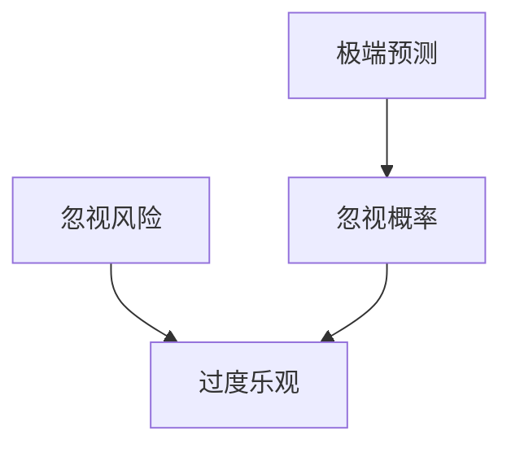
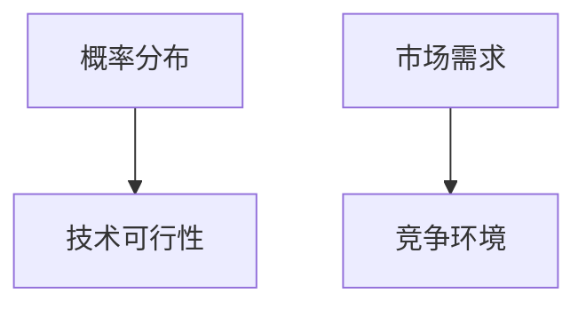
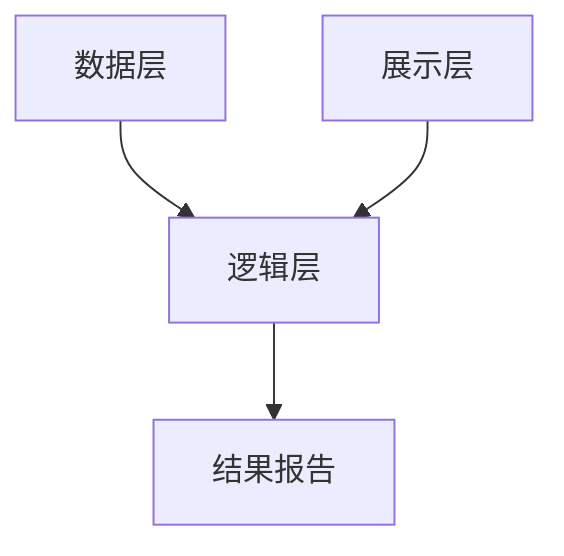

                 


# 芒格的"避免极端预测"在新兴技术估值中的应用

> 关键词：芒格，避免极端预测，新兴技术估值，技术经济性分析，技术可行性分析

> 摘要：本文探讨了芒格的“避免极端预测”思维模型在新兴技术估值中的应用，通过分析概率分布、贝叶斯定理等方法，结合实际案例，展示了如何系统地避免极端预测，提高技术估值的准确性。

---

## 第一部分：背景介绍

### 第1章：芒格的“避免极端预测”概述

#### 1.1 芒格的“避免极端预测”核心思想

芒格的“避免极端预测”是一种思维方式，强调在决策中避免过于乐观或悲观的极端预测。这种思维模型通过关注概率和可能性，帮助投资者在技术估值中保持理性。例如，芒格曾指出，过度乐观的预测往往忽略了潜在风险，导致估值过高。

#### 1.2 新兴技术估值的背景与挑战

新兴技术如人工智能和区块链具有高度不确定性和快速变化的特点，传统估值方法往往依赖于历史数据和简单线性模型，难以捕捉新兴技术的复杂性和潜在风险。例如，过度乐观的预测可能导致估值过高，而忽视风险的预测可能导致估值过低。

---

### 第2章：芒格思维模型与技术估值

#### 2.1 芒格思维模型的系统分析

芒格的思维模型通过关注概率和可能性，帮助投资者避免极端预测。例如，芒格强调关注“反事实”分析，即考虑在不同情况下技术发展的可能性。下图展示了芒格思维模型的结构：



#### 2.2 技术估值中的关键因素

新兴技术的估值需要考虑技术可行性、市场需求和竞争环境。例如，人工智能技术的可行性取决于数据质量和算法复杂度，市场需求取决于应用场景的潜力，竞争环境则取决于技术的壁垒和市场的进入门槛。

---

## 第二部分：核心概念与联系

### 第3章：概率分布与贝叶斯定理

#### 3.1 概率分布的应用

概率分布是芒格思维模型的重要工具。通过分析技术发展的概率分布，可以更好地理解技术发展的不确定性。例如，下图展示了技术发展的概率分布曲线：



#### 3.2 贝叶斯定理在估值中的应用

贝叶斯定理是一种用于更新概率的数学工具，可以帮助投资者根据新信息调整对技术的估值。例如，假设我们有一个技术，其成功的概率为0.6，但后来发现市场需求低于预期，概率调整为0.4。贝叶斯定理可以帮助我们根据新数据更新概率。

公式：
$$P(A|B) = \frac{P(B|A)P(A)}{P(B)}$$

---

### 第4章：技术经济性分析

#### 4.1 技术经济性分析的方法

技术经济性分析是新兴技术估值的重要部分，需要综合考虑技术的经济性、社会性和环境性。例如，人工智能技术的经济性分析需要考虑研发投入、市场规模和边际成本。

#### 4.2 技术可行性分析

技术可行性分析是技术经济性分析的基础，需要评估技术的实现难度、技术成熟度和应用场景。例如，区块链技术的实现难度较高，但其在供应链管理中的应用潜力巨大。

---

## 第三部分：算法原理讲解

### 第5章：概率分布的应用

#### 5.1 概率分布的数学模型

概率分布是芒格思维模型的核心工具之一。通过分析技术发展的概率分布，可以更好地理解技术的不确定性。例如，正态分布和泊松分布常用于技术估值。

#### 5.2 贝叶斯定理的应用

贝叶斯定理是一种用于更新概率的数学工具，可以帮助投资者根据新信息调整对技术的估值。例如，假设我们有一个技术，其成功的概率为0.6，但后来发现市场需求低于预期，概率调整为0.4。贝叶斯定理可以帮助我们根据新数据更新概率。

公式：
$$P(A|B) = \frac{P(B|A)P(A)}{P(B)}$$

---

### 第6章：技术经济性分析的算法实现

#### 6.1 技术经济性分析的Python代码示例

以下是一个简单的技术经济性分析的Python代码示例：

```python
import numpy as np
import matplotlib.pyplot as plt

# 生成概率分布
dist = np.random.normal(0.5, 0.1, 1000)
plt.hist(dist, bins=20)
plt.show()
```

#### 6.2 贝叶斯定理的代码实现

以下是一个贝叶斯定理的Python代码示例：

```python
def bayes_theorem(P_A, P_B_given_A, P_B):
    return (P_B_given_A * P_A) / P_B

# 示例
P_A = 0.6
P_B_given_A = 0.8
P_B = 0.5
result = bayes_theorem(P_A, P_B_given_A, P_B)
print(result)
```

---

## 第四部分：系统分析与架构设计方案

### 第7章：系统功能设计

#### 7.1 系统功能模块

系统功能模块包括数据采集、数据分析和结果报告生成。例如，数据采集模块需要从多个来源收集技术数据，数据分析模块需要应用概率分布和贝叶斯定理进行分析，结果报告生成模块需要生成技术估值报告。

#### 7.2 系统架构设计

系统架构设计采用分层架构，包括数据层、逻辑层和展示层。例如，数据层负责存储技术数据，逻辑层负责数据分析，展示层负责生成报告。



---

## 第五部分：项目实战

### 第8章：环境安装与代码实现

#### 8.1 环境安装

需要安装Python、NumPy和Matplotlib等库。例如：

```bash
pip install numpy matplotlib
```

#### 8.2 核心代码实现

以下是一个技术估值的核心代码示例：

```python
import numpy as np
import matplotlib.pyplot as plt

# 生成概率分布
dist = np.random.normal(0.5, 0.1, 1000)
plt.hist(dist, bins=20)
plt.show()

# 贝叶斯定理应用
def bayes_theorem(P_A, P_B_given_A, P_B):
    return (P_B_given_A * P_A) / P_B

result = bayes_theorem(0.6, 0.8, 0.5)
print(result)
```

---

### 第9章：案例分析与总结

#### 9.1 案例分析

以人工智能技术为例，假设其成功的概率为0.6，市场需求的影响概率为0.8，总体概率为0.5。通过贝叶斯定理计算更新后的概率：

$$P(A|B) = \frac{0.8 \times 0.6}{0.5} = 0.96$$

#### 9.2 总结

芒格的“避免极端预测”思维模型为新兴技术估值提供了重要的方法论支持。通过概率分布和贝叶斯定理的应用，可以帮助投资者更理性地评估技术的潜力和风险。

---

## 总结与展望

芒格的“避免极端预测”思维模型在新兴技术估值中的应用具有重要意义。通过概率分布和贝叶斯定理的应用，可以帮助投资者更理性地评估技术的潜力和风险。未来，随着技术的不断发展，芒格的思维模型将在技术估值中发挥更大的作用。

---

作者：AI天才研究院/AI Genius Institute & 禅与计算机程序设计艺术 /Zen And The Art of Computer Programming

