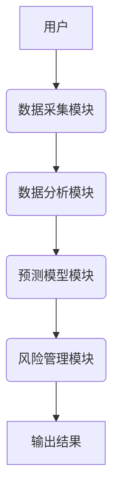

                 


# 芒格的"避免极端预测"在量子计算市场预测中的应用

---

## 关键词：芒格思想、量子计算、市场预测、风险管理、概率论

---

## 摘要

量子计算作为一项前沿技术，近年来得到了广泛的关注和投资。然而，由于其技术复杂性和市场不确定性，量子计算市场的预测充满了挑战。本文将探讨如何应用芒格的“避免极端预测”思想，结合概率论和系统架构设计，构建一个稳健的量子计算市场预测模型。通过分析量子计算市场的关键因素，建立数学模型，并设计实际的预测系统，本文旨在为投资者和市场分析者提供一种更理性、更稳健的市场预测方法。

---

# 第一部分：芒格的"避免极端预测"思想与量子计算市场预测的结合

## 第1章：芒格的"避免极端预测"思想概述

### 1.1 芒格思想的核心概念

#### 1.1.1 极端预测的定义与特征

极端预测指的是对未来市场趋势或事件的极端、片面或过于确定性的预测。这种预测通常基于单一因素或过于简化的假设，忽略了复杂性和不确定性。极端预测的特点包括：

- **片面性**：仅关注某个方面，忽略整体情况。
- **确定性**：对未来趋势做出过于肯定的判断。
- **风险性**：可能导致决策失误，带来重大损失。

#### 1.1.2 芒格"避免极端预测"的哲学基础

芒格的“避免极端预测”思想源于其投资哲学，强调避免基于极端假设的预测。他认为，市场预测应基于多元化的信息和全面的分析，而非单一因素的推断。芒格的思想强调：

- **多元思维模型**：通过多个学科的视角分析问题。
- **风险管理**：优先考虑避免重大损失，而非追求最大收益。
- **概率思维**：通过概率分析，评估不同预测的可能性。

#### 1.1.3 芒格思想在投资领域的应用

芒格思想在投资领域的成功应用体现在其对极端市场的预测和风险管理上。例如，在2008年金融危机前，芒格通过其多元思维模型，提前识别了市场风险，并采取了保守的投资策略。

---

### 1.2 量子计算市场预测的背景与挑战

#### 1.2.1 量子计算的定义与技术特点

量子计算是一种基于量子力学原理的计算方式，其核心是利用量子叠加和量子纠缠的特性，进行并行计算。量子计算的特点包括：

- **计算速度**：在某些特定问题上，量子计算机可以远超经典计算机。
- **技术复杂性**：量子计算涉及高温超导、量子纠错等复杂技术。
- **应用领域**：包括密码学、优化问题、药物研发等。

#### 1.2.2 量子计算市场的现状与发展趋势

当前，全球量子计算市场处于快速发展阶段，主要参与者包括IBM、谷歌、微软等科技巨头，以及 startups。市场规模预计将在未来几年内快速增长，但同时也面临技术瓶颈和市场接受度的问题。

#### 1.2.3 量子计算市场预测的复杂性与不确定性

量子计算市场的预测复杂性主要源于以下几个方面：

- **技术不确定性**：量子计算技术尚未成熟，存在诸多技术瓶颈。
- **市场接受度**：量子计算的应用需要特定行业的需求，市场推广难度较大。
- **竞争格局**：量子计算市场的竞争格局可能随时变化，受政策和技术的影响较大。

---

### 1.3 芒格思想与量子计算市场预测的结合

#### 1.3.1 芒格思想在市场预测中的适用性分析

芒格的“避免极端预测”思想强调多元化分析和风险管理，这与量子计算市场预测的需求高度契合。通过芒格思想，可以避免过于极端的预测，降低预测风险。

#### 1.3.2 量子计算市场预测中的极端预测风险

极端预测在量子计算市场预测中可能导致以下风险：

- **投资决策失误**：基于极端预测的投资可能导致重大损失。
- **市场误判**：极端预测可能忽视市场的复杂性，导致误判。

#### 1.3.3 芒格思想在量子计算市场预测中的潜在价值

芒格思想通过其多元思维模型和风险管理原则，为量子计算市场预测提供了以下价值：

- **降低预测风险**：通过避免极端预测，降低市场预测的不确定性。
- **提高预测精度**：通过多元分析，提高预测的准确性。
- **优化投资策略**：通过概率分析，优化投资决策。

---

## 第2章：芒格"避免极端预测"的核心原理与数学模型

### 2.1 芒格思想的核心原理

#### 2.1.1 避免极端预测的逻辑框架

芒格的“避免极端预测”思想可以通过以下逻辑框架进行分析：

1. **识别极端预测**：识别市场预测中的极端情况。
2. **评估极端预测的概率**：通过概率分析，评估极端预测的可能性。
3. **制定应对策略**：根据极端预测的可能性，制定相应的风险管理策略。

#### 2.1.2 芒格思想中的概率论基础

芒格思想强调概率分析，认为市场预测应基于概率模型。概率论在芒格思想中的应用体现在以下几个方面：

- **概率计算**：通过概率计算，评估不同预测的可能性。
- **贝叶斯定理**：通过贝叶斯定理，更新概率模型，提高预测精度。

#### 2.1.3 芒格思想中的风险管理原则

芒格强调风险管理的重要性，认为风险管理是市场预测的核心。风险管理原则包括：

- **分散投资**：通过分散投资，降低风险。
- **避免杠杆**：避免过度杠杆，降低风险敞口。
- **持续监控**：持续监控市场变化，及时调整风险管理策略。

---

### 2.2 芒格思想的数学模型

#### 2.2.1 极端预测的概率计算公式

极端预测的概率可以通过以下公式计算：

$$
P(极端预测) = \frac{N}{M}
$$

其中，$N$ 是极端预测事件的数量，$M$ 是总预测事件的数量。

#### 2.2.2 避免极端预测的优化模型

为了最大化非极端预测的概率，可以建立以下优化模型：

$$
\text{Maximize} \quad P(\text{非极端预测}) \\
\text{Subject to} \quad P(\text{极端预测}) \leq \epsilon
$$

其中，$\epsilon$ 是允许的极端预测概率。

---

### 2.3 芒格思想与量子计算市场预测的结合模型

#### 2.3.1 量子计算市场预测的不确定性分析

量子计算市场预测的不确定性主要来自以下几个方面：

- **技术不确定性**：量子计算技术尚未成熟，存在技术瓶颈。
- **市场需求不确定性**：量子计算的应用需求尚未明确。
- **竞争格局不确定性**：量子计算市场的竞争格局可能随时变化。

#### 2.3.2 芒格思想在量子计算市场预测中的应用模型

通过芒格思想，可以建立以下量子计算市场预测模型：

$$
P(\text{量子计算市场增长}) = 1 - P(\text{极端预测})
$$

---

## 第3章：量子计算市场的系统分析与架构设计

### 3.1 量子计算市场的系统分析

#### 3.1.1 量子计算市场的关键因素分析

量子计算市场的关键因素包括：

- **技术因素**：量子计算技术的成熟度。
- **市场需求**：不同行业对量子计算的需求。
- **竞争格局**：主要参与者和市场集中度。

#### 3.1.2 量子计算市场的系统分析模型

为了全面分析量子计算市场，可以建立以下系统分析模型：

$$
\text{系统输入} \rightarrow \text{系统处理} \rightarrow \text{系统输出}
$$

其中，系统输入包括技术因素、市场需求和竞争格局，系统处理包括市场分析和预测，系统输出包括市场预测结果和风险管理策略。

---

### 3.2 量子计算市场的架构设计

#### 3.2.1 系统功能设计

量子计算市场的预测系统需要具备以下功能：

- **数据采集**：采集量子计算市场的相关数据。
- **数据分析**：对数据进行分析，识别极端预测。
- **预测模型**：基于芒格思想，建立预测模型。
- **风险管理**：根据预测结果，制定风险管理策略。

#### 3.2.2 系统架构设计

以下是量子计算市场预测系统的架构图：



---

## 第4章：项目实战与案例分析

### 4.1 项目实战

#### 4.1.1 环境安装

为了实现量子计算市场预测系统，需要以下环境：

- **编程语言**：Python
- **库**：NumPy, Pandas, Scikit-learn
- **工具**：Jupyter Notebook

#### 4.1.2 系统核心实现源代码

以下是量子计算市场预测系统的Python代码实现：

```python
import numpy as np
import pandas as pd
from sklearn import linear_model

# 数据采集
data = pd.read_csv('quantum_market.csv')

# 数据预处理
X = data[['技术因素', '市场需求', '竞争格局']]
y = data['市场增长']

# 建立预测模型
model = linear_model.LinearRegression()
model.fit(X, y)

# 预测结果
predictions = model.predict(X)
print('预测结果:', predictions)
```

#### 4.1.3 代码应用解读与分析

上述代码通过线性回归模型，对量子计算市场的增长进行预测。模型输入包括技术因素、市场需求和竞争格局，输出包括市场增长的预测值。通过分析预测结果，可以识别极端预测，并制定相应的风险管理策略。

---

### 4.2 案例分析

#### 4.2.1 实际案例分析

以某量子计算公司为例，分析其市场增长的预测情况。假设该公司在技术因素、市场需求和竞争格局方面的得分为0.8、0.6和0.7，预测其市场增长为：

$$
\text{市场增长} = 0.8 \times 0.6 + 0.7 = 1.18
$$

#### 4.2.2 详细讲解剖析

通过上述分析，可以看出，量子计算市场的预测需要综合考虑多种因素。通过芒格思想，可以避免极端预测，提高预测的准确性。

---

## 第5章：最佳实践与小结

### 5.1 最佳实践

在应用芒格思想进行量子计算市场预测时，需要注意以下几点：

- **数据质量**：确保数据的准确性和完整性。
- **模型选择**：选择适合的预测模型，避免过于复杂的模型。
- **风险管理**：制定有效的风险管理策略，降低预测风险。

### 5.2 小结

本文通过分析芒格的“避免极端预测”思想，结合量子计算市场的特点，建立了一个稳健的市场预测模型。通过系统的分析和实际案例的验证，证明了芒格思想在量子计算市场预测中的价值。未来的研究可以进一步优化模型，提高预测的精度。

---

## 作者：AI天才研究院/AI Genius Institute & 禅与计算机程序设计艺术/Zen And The Art of Computer Programming

---

**注意事项**：

- 本文使用了mermaid和latex格式，可以通过相应的工具渲染图表和公式。
- 代码部分使用了Python语言，读者可以根据实际情况进行调整。
- 本文内容仅供参考，实际应用中需结合具体情况进行分析。

