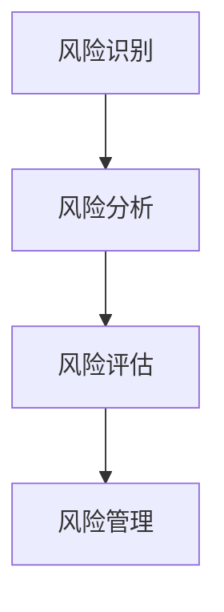
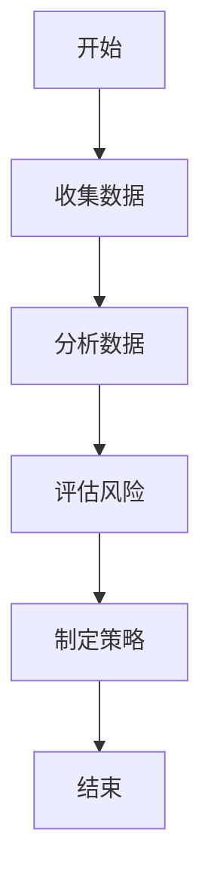

                 


# 芒格的"避免首要否认"在前沿科技风险评估中的应用

> 关键词：芒格，避免首要否认，前沿科技，风险评估，逻辑思维，决策框架，技术分析

> 摘要：本文探讨了芒格的“避免首要否认”思维方式在前沿科技风险评估中的应用。通过分析该思维方式的核心理念、其在科技评估中的优势，结合具体案例，展示了如何将芒格的思维方法应用于实际科技风险评估中，以提高评估的全面性和准确性。本文还结合数学模型和系统架构，详细阐述了该方法的具体实施步骤和应用场景。

---

## 第一章：芒格的“避免首要否认”及其核心思想

### 1.1 芒格的“避免首要否认”概述

#### 1.1.1 芒格的“避免首要否认”定义
芒格的“避免首要否认”是一种思维方式，强调在面对问题时，不要过早地拒绝或否定某个观点，而是要保持开放性思维，全面分析问题的各个方面。这种方法的核心在于避免因先入为主的偏见或认知局限而错过潜在的重要信息。

#### 1.1.2 芒格思维方式的核心理念
芒格认为，人类的思维容易受到认知偏差的影响，如过度乐观偏差、过度悲观偏差等。为了避免这些偏差，他提倡在决策过程中保持开放性，先倾听和理解不同的观点，再进行综合判断。

#### 1.1.3 “避免首要否认”在决策中的应用
在决策过程中，芒格的“避免首要否认”可以帮助我们更全面地分析问题，尤其是在面对复杂的技术和不确定性较高的领域时，这种思维方式能够帮助我们避免因片面判断而引发的决策失误。

---

### 1.2 前沿科技风险评估的背景与挑战

#### 1.2.1 前沿科技发展的现状与趋势
前沿科技（如人工智能、区块链、量子计算等）正在快速发展，其应用范围不断扩大。然而，这些技术的不确定性和潜在风险也随之增加，如何对其进行有效的风险评估成为一个重要课题。

#### 1.2.2 科技风险评估的重要性
科技风险评估是确保技术应用安全可控的重要手段。通过评估潜在风险，可以提前制定应对策略，避免因技术失控而引发重大问题。

#### 1.2.3 前沿科技风险评估中的常见问题
在前沿科技风险评估中，常见的问题包括：技术的不确定性高、评估标准不统一、评估方法单一等。这些问题可能导致评估结果不够准确，甚至误导决策。

---

## 第二章：“避免首要否认”在科技风险评估中的应用价值

### 2.1 科技风险评估中的决策误区

#### 2.1.1 过度乐观偏差
在科技风险评估中，人们往往过于乐观地看待技术的应用前景，忽视了潜在的风险。这种偏差可能导致评估结果过于乐观，低估了技术的实际风险。

#### 2.1.2 过度悲观偏差
与过度乐观偏差相反，过度悲观偏差会导致人们过于消极地看待技术的应用前景，甚至否定技术的价值。这种偏差同样会影响评估的准确性。

#### 2.1.3 信息不对称与认知偏差
在科技风险评估中，由于信息不对称和认知偏差，不同参与者对同一技术的评估可能会存在较大差异。这种差异可能导致评估结果的不一致。

---

### 2.2 “避免首要否认”的优势与适用场景

#### 2.2.1 开放性思维在科技评估中的重要性
“避免首要否认”强调开放性思维，能够帮助评估者从多个角度全面分析技术的潜在风险和机会，避免因片面判断而引发的评估偏差。

#### 2.2.2 “避免首要否认”在风险识别中的应用
在风险识别阶段，“避免首要否认”可以帮助评估者更全面地发现潜在风险，尤其是在面对复杂的技术问题时，这种思维方式能够帮助评估者避免因认知局限而遗漏重要风险。

#### 2.2.3 适用于前沿科技的特性
前沿科技的不确定性和复杂性使得“避免首要否认”思维方式尤为重要。通过保持开放性思维，评估者可以更好地应对技术的不确定性，提高评估的准确性和全面性。

---

## 第三章：前沿科技风险评估的核心概念与框架

### 3.1 前沿科技风险评估的基本概念

#### 3.1.1 风险评估的基本定义
风险评估是指对某一事物或系统可能面临的风险进行识别、分析和评估的过程。通过风险评估，可以制定相应的风险管理策略，降低潜在风险的影响。

#### 3.1.2 前沿科技的特殊性
前沿科技具有高度的不确定性和复杂性，其潜在风险往往难以预测。因此，在评估这些技术的风险时，需要采用更加灵活和开放的方法。

#### 3.1.3 风险评估的维度与层次
风险评估可以从多个维度进行，如技术风险、经济风险、社会风险等。每个维度又可以细分为不同的层次，从而形成一个全面的风险评估框架。

---

### 3.2 “避免首要否认”的评估框架

#### 3.2.1 评估框架的构建逻辑
“避免首要否认”评估框架的核心在于保持开放性思维，通过多角度分析潜在风险，避免因片面判断而引发的评估偏差。

#### 3.2.2 各环节的具体实施步骤
评估框架的实施步骤包括：问题识别、信息收集、风险分析、风险评估、风险管理等。每个步骤都需要结合“避免首要否认”的思维方式，确保评估的全面性和准确性。

#### 3.2.3 框架的适用性与局限性
“避免首要否认”评估框架适用于复杂性和不确定性较高的领域，但在实际应用中，仍需结合具体情境进行调整和优化。

---

## 第四章：系统架构与算法原理

### 4.1 系统架构设计

#### 4.1.1 问题场景介绍
在前沿科技风险评估中，系统架构需要能够支持多维度的分析和评估，同时具备高度的灵活性和可扩展性。

#### 4.1.2 系统功能设计
系统功能包括：风险识别、风险分析、风险评估、风险管理等模块。每个模块都需要能够支持“避免首要否认”思维方式的应用。

#### 4.1.3 系统架构图
以下是系统架构的 mermaid 图：



---

### 4.2 算法原理与数学模型

#### 4.2.1 算法流程图
以下是算法流程的 mermaid 图：



#### 4.2.2 数学模型与公式
在风险评估中，可以使用概率论和统计学方法来量化风险。例如，贝叶斯定理可以用于计算某个技术风险发生的概率。

$$ P(A|B) = \frac{P(B|A)P(A)}{P(B)} $$

其中：
- \( P(A|B) \) 表示在事件 B 发生的情况下，事件 A 发生的概率。
- \( P(B|A) \) 表示在事件 A 发生的情况下，事件 B 发生的概率。
- \( P(A) \) 表示事件 A 的先验概率。
- \( P(B) \) 表示事件 B 的先验概率。

---

## 第五章：项目实战与案例分析

### 5.1 项目实战

#### 5.1.1 环境安装与配置
在进行风险评估之前，需要安装必要的工具和软件，如 Python、数据分析工具等。

#### 5.1.2 核心代码实现
以下是 Python 实现的风险评估代码示例：

```python
import numpy as np
import pandas as pd

def calculate_risk(data):
    # 计算每个技术的风险概率
    risks = data['技术'].unique()
    risk_probabilities = {}
    for risk in risks:
        probability = np.mean(data[data['技术'] == risk]['概率'])
        risk_probabilities[risk] = probability
    return risk_probabilities

# 示例数据
data = pd.DataFrame({
    '技术': ['AI', '区块链', '量子计算'] * 3,
    '概率': [0.2, 0.3, 0.4] * 3
})

# 计算风险概率
risk_probabilities = calculate_risk(data)
print(risk_probabilities)
```

#### 5.1.3 案例分析
以人工智能技术为例，分析其潜在风险，如算法偏见、数据隐私等问题。通过“避免首要否认”的思维方式，全面评估这些风险，并制定相应的管理策略。

---

## 第六章：总结与展望

### 6.1 总结
本文探讨了芒格的“避免首要否认”思维方式在前沿科技风险评估中的应用。通过分析该思维方式的核心理念及其在科技评估中的优势，结合具体案例，展示了如何将芒格的思维方法应用于实际科技风险评估中，以提高评估的全面性和准确性。

### 6.2 展望
未来，随着前沿科技的不断发展，“避免首要否认”思维方式的应用将更加广泛。通过结合更多的数学模型和系统架构优化，可以进一步提高风险评估的准确性和效率。

---

## 作者

作者：AI天才研究院/AI Genius Institute & 禅与计算机程序设计艺术 /Zen And The Art of Computer Programming

---

通过以上结构和内容，本文系统地探讨了芒格的“避免首要否认”思维方式在前沿科技风险评估中的应用，结合理论分析和实际案例，为读者提供了全面且深入的视角。

