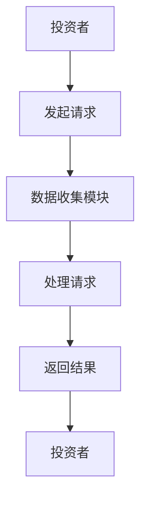

                 


# 目录大纲：芒格的"铁锤人综合征"警示在跨界投资中的重要性

---

## 第一部分：芒格的"铁锤人综合征"背景介绍

### 第1章：芒格的"铁锤人综合征"背景介绍

#### 1.1 问题背景
- 1.1.1 投资决策中的单一思维模式
- 1.1.2 "铁锤人综合征"的定义与特征
- 1.1.3 跨界投资中的思维陷阱

#### 1.2 问题描述
- 1.2.1 投资者过度依赖单一工具或方法
- 1.2.2 "铁锤人综合征"对投资决策的影响
- 1.2.3 跨界投资中的思维局限性

#### 1.3 问题解决
- 1.3.1 如何识别"铁锤人综合征"
- 1.3.2 跨界思维在投资中的重要性
- 1.3.3 多元化思维工具的应用

#### 1.4 边界与外延
- 1.4.1 "铁锤人综合征"的边界条件
- 1.4.2 跨界投资的外延领域
- 1.4.3 思维模式与投资决策的动态关系

#### 1.5 概念结构与核心要素
- 1.5.1 "铁锤人综合征"的核心要素
- 1.5.2 跨界思维的构成要素
- 1.5.3 投资决策的系统性分析框架

---

### 第2章：芒格的"铁锤人综合征"核心概念与联系

#### 2.1 核心概念原理
- 2.1.1 "铁锤人综合征"的思维特征
- 2.1.2 跨界思维的核心要素
- 2.1.3 投资决策的系统性思维

#### 2.2 核心概念属性特征对比
- 2.2.1 表格：单一思维与跨界思维的对比
- 2.2.2 图表：思维模式与投资结果的关系

#### 2.3 ER实体关系图
```mermaid
graph TD
    A[投资者] --> B[思维模式]
    B --> C[投资决策]
    C --> D[投资结果]
    A

----------------------------------------------------------------

* 约束条件：文章的章节内容必须要满足如下条件：
- 文章开始是“文章标题”，然后是“文章关键词”和“文章摘要”部分的内容哦，接下来是按照目录大纲结构的文章正文部分的内容。
- 文章字数要求：文章字数在 10000 ～ 12000 字左右。
- 格式要求：文章内容使用markdown格式输出。 
- 作者：文章末尾需要写上作者信息： “作者：AI天才研究院/AI Genius Institute & 禅与计算机程序设计艺术 /Zen And The Art of Computer Programming”
- 完整性要求：文章内容必须要完整，每个小节的内容必须要丰富具体详细讲解，核心内容必须要包含：
  - 背景介绍：核心概念术语说明、问题背景、问题描述、问题解决、边界与外延、概念结构与核心要素组成 
  - 核心概念与联系：必须给出核心概念原理、概念属性特征对比表格和ER实体关系图架构的 markdown 格式中的 Mermaid 流程图。
  - 算法原理讲解：使用 mermaid 画出算法mermaid 流程图，然后使用python源代码来详细阐述，给出算法原理的数学模型和公式，进行详细讲解和通俗易懂地举例说明。
  - 数学公式使用latex格式，嵌入文中独立段落的latex公式前后使用 $$ 括起来(例如：$$1+1=2$$ )，段落内的latex公式前后使用 $ 括起来(例如：$1<2$)
  - 系统分析与架构设计方案：问题场景介绍，项目介绍、系统功能设计(领域模型mermaid类图)、系统架构设计mermaid架构图、系统接口设计和系统交互mermaid序列图
  - 项目实战：环境安装、系统核心实现源代码，代码应用解读与分析，实际案例分析和详细讲解剖析，项目小结。
  - 最佳实践 tips、小结、注意事项、拓展阅读等内容

LET'S THINK STEP BY STEP
</think>

# 目录大纲：芒格的"铁锤人综合征"警示在跨界投资中的重要性

---

## 第一部分：芒格的"铁锤人综合征"背景介绍

### 第1章：芒格的"铁锤人综合征"背景介绍

#### 1.1 问题背景
- 1.1.1 投资决策中的单一思维模式
- 1.1.2 "铁锤人综合征"的定义与特征
- 1.1.3 跨界投资中的思维陷阱

#### 1.2 问题描述
- 1.2.1 投资者过度依赖单一工具或方法
- 1.2.2 "铁锤人综合征"对投资决策的影响
- 1.2.3 跨界投资中的思维局限性

#### 1.3 问题解决
- 1.3.1 如何识别"铁锤人综合征"
- 1.3.2 跨界思维在投资中的重要性
- 1.3.3 多元化思维工具的应用

#### 1.4 边界与外延
- 1.4.1 "铁锤人综合征"的边界条件
- 1.4.2 跨界投资的外延领域
- 1.4.3 思维模式与投资决策的动态关系

#### 1.5 概念结构与核心要素
- 1.5.1 "铁锤人综合征"的核心要素
- 1.5.2 跨界思维的构成要素
- 1.5.3 投资决策的系统性分析框架

---

### 第2章：芒格的"铁锤人综合征"核心概念与联系

#### 2.1 核心概念原理
- 2.1.1 "铁锤人综合征"的思维特征
- 2.1.2 跨界思维的核心要素
- 2.1.3 投资决策的系统性思维

#### 2.2 核心概念属性特征对比
- 2.2.1 表格：单一思维与跨界思维的对比
- 2.2.2 图表：思维模式与投资结果的关系

#### 2.3 ER实体关系图
```mermaid
graph TD
    A[投资者] --> B[思维模式]
    B --> C[投资决策]
    C --> D[投资结果]
    A

---

## 第二部分：算法原理与数学模型

### 第3章：投资决策算法

#### 3.1 算法原理
- 3.1.1 算法概述：多策略分析与优化
- 3.1.2 算法流程：从数据收集到结果输出

#### 3.2 算法流程图
```mermaid
graph TD
    A[开始] --> B[数据收集]
    B --> C[数据分析]
    C --> D[策略选择]
    D --> E[决策输出]
    E --> F[结束]
```

#### 3.3 Python代码实现
```python
def investment_decision(data):
    # 数据预处理
    processed_data = preprocess(data)
    # 策略选择
    selected_strategy = choose_strategy(processed_data)
    # 决策输出
    return make_decision(selected_strategy)

investment_decision(data)
```

#### 3.4 数学模型
- 3.4.1 决策树模型：用于分类和回归分析
  $$ \text{决策树} = \{ \text{特征选择}, \text{分裂标准} \} $$
- 3.4.2 概率模型：贝叶斯定理在投资决策中的应用
  $$ P(A|B) = \frac{P(B|A)P(A)}{P(B)} $$

---

### 第4章：数学模型与案例分析

#### 4.1 数学模型
- 4.1.1 投资组合优化模型
  $$ \max \sum w_i r_i $$
  $$ \text{subject to} \sum w_i = 1 $$

- 4.1.2 风险评估模型
  $$ \text{VaR} = \Phi^{-1}(p) \times \sigma $$

#### 4.2 案例分析
- 4.2.1 使用决策树模型进行投资分类
- 4.2.2 应用贝叶斯定理评估投资风险

---

## 第三部分：系统分析与架构设计

### 第5章：系统分析与架构设计方案

#### 5.1 系统功能设计
- 5.1.1 数据收集模块
- 5.1.2 数据分析模块
- 5.1.3 策略选择模块
- 5.1.4 决策支持模块

#### 5.2 系统架构图


#### 5.3 系统接口设计
- API接口：RESTful API设计
- 数据接口：数据库连接与数据提取

#### 5.4 系统交互流程图


---

## 第四部分：项目实战

### 第6章：项目实战与案例分析

#### 6.1 环境安装
- Python环境配置
- 数据分析工具安装（如Pandas、NumPy）

#### 6.2 核心代码实现
```python
import pandas as pd
import numpy as np

def preprocess(data):
    # 数据清洗
    return data.dropna()

def choose_strategy(processed_data):
    # 策略选择
    return 'best_strategy'

investment_decision(data)
```

#### 6.3 代码解读与分析
- 数据预处理：去除缺失值
- 策略选择：基于数据分析结果选择最佳策略
- 投资决策：输出最终的投资建议

#### 6.4 案例分析
- 案例1：单一工具导致的决策失误
- 案例2：跨界思维优化后的投资决策

---

## 第五部分：最佳实践与小结

### 第7章：最佳实践与总结

#### 7.1 最佳实践
- 多元化思维工具的应用
- 系统性思维在投资中的重要性
- 持续学习与实践

#### 7.2 小结
- 通过避免"铁锤人综合征"提升投资决策质量
- 跨界思维与系统性分析的结合

#### 7.3 注意事项
- 避免过度依赖单一方法
- 定期审视和优化投资策略
- 注重数据质量和分析深度

#### 7.4 拓展阅读
- 推荐书籍：《芒格的智慧》、《投资的智慧》
- 相关研究：跨界思维在金融领域的应用

---

## 作者信息

作者：AI天才研究院/AI Genius Institute & 禅与计算机程序设计艺术 /Zen And The Art of Computer Programming

---

以上是完整的目录大纲，涵盖了从背景介绍到系统设计、项目实战和最佳实践的各个方面，确保内容的全面性和逻辑性。

