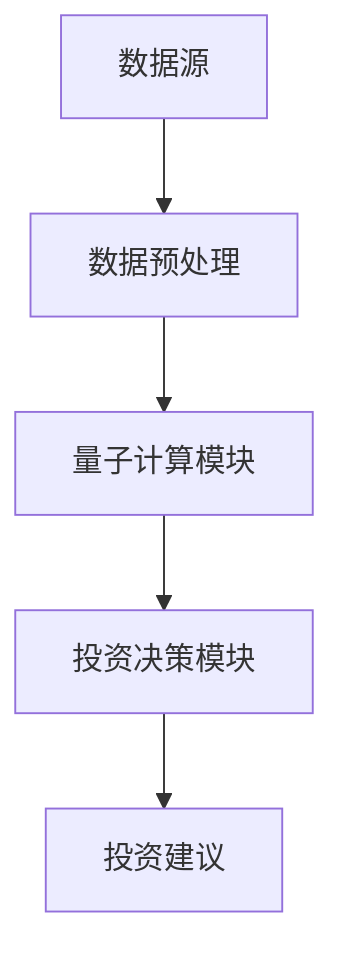
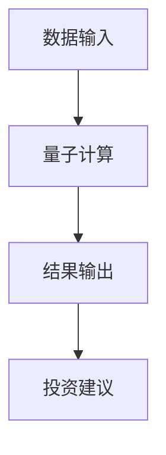
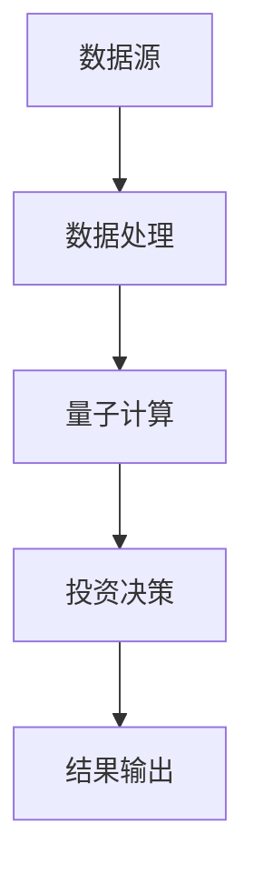

                 


```markdown
# 芒格的"铁锤人综合征"警示在跨维度量子技术投资中的应用

> 关键词：芒格，铁锤人综合征，跨维度，量子技术，投资，风险管理

> 摘要：本文探讨了芒格的"铁锤人综合征"在跨维度量子技术投资中的应用，分析了投资者因思维僵化导致的决策失误，并结合量子技术的优势，提出优化投资策略的方法，通过实际案例和系统架构设计，展示了如何利用量子技术避免铁锤人综合征的影响，提升投资效率和准确性。

---

# 第一部分: 芒格的"铁锤人综合征"与投资理念

## 第1章: 芒格的投资哲学与铁锤人综合征

### 1.1 芒格的投资哲学概述

#### 1.1.1 芒格的生平与投资理念
- 芒格是巴菲特的合作伙伴，以价值投资闻名。
- 投资哲学强调安全边际和长期价值。
- 强调多元思维模型，避免单一工具的应用。

#### 1.1.2 价值投资的核心原则
- 购买低于内在价值的资产。
- 长期持有优质资产。
- 避免短期波动的影响。

#### 1.1.3 铁锤人综合征的定义与表现
- 铁锤人综合征：投资者只使用一种工具或方法，导致思维僵化。
- 表现：忽视其他投资机会，无法灵活应对市场变化。

### 1.2 铁锤人综合征的成因与影响

#### 1.2.1 投资者认知偏差的根源
- 心理偏差：确认偏差、过度自信等。
- 知识局限：缺乏跨领域知识。

#### 1.2.2 铁锤人综合征对投资决策的影响
- 导致投资决策失误。
- 无法捕捉市场变化中的机会。

#### 1.2.3 如何识别与避免铁锤人综合征
- 定期反思投资策略。
- 多元化投资工具和方法。

---

# 第二部分: 跨维度量子技术投资的背景与潜力

## 第2章: 跨维度量子技术的基本概念

### 2.1 量子计算与量子通信的定义
- 量子计算：利用量子叠加和纠缠进行计算。
- 量子通信：利用量子态进行信息传输。

### 2.2 跨维度技术在投资中的应用领域
- 数据分析：处理高维数据。
- 投资决策：优化投资组合。

### 2.3 跨维度量子技术的投资潜力
- 提高数据分析效率。
- 优化投资决策。

## 第3章: 跨维度量子技术投资的核心优势

### 3.1 高维度数据分析的优势
- 处理复杂数据结构。
- 提高预测准确性。

### 3.2 量子计算在投资决策中的应用
- 快速处理大量数据。
- 提供最优投资组合建议。

### 3.3 跨维度技术对投资策略的优化作用
- 综合多维度信息。
- 提高决策的全面性。

---

# 第三部分: 铁锤人综合征与跨维度量子技术投资的结合

## 第4章: 铁锤人综合征在跨维度量子技术投资中的表现

### 4.1 过度依赖单一技术的风险
- 只依赖量子计算，忽视其他技术。
- 无法全面分析市场变化。

### 4.2 忽视跨维度技术的综合优势
- 未充分利用跨维度数据。
- 降低投资决策的准确性。

### 4.3 投资决策中的认知局限性
- 忽视量子技术的潜力。
- 无法灵活调整投资策略。

## 第5章: 跨维度量子技术投资中的风险管理

### 5.1 风险识别与评估的量子方法
- 使用量子算法进行风险预测。
- 提供更精准的风险评估。

### 5.2 利用量子计算优化风险管理
- 快速识别潜在风险。
- 提供风险缓解策略。

### 5.3 跨维度技术在风险控制中的应用
- 综合考虑多种风险因素。
- 提高风险管理的全面性。

---

# 第四部分: 跨维度量子技术投资的系统架构与实现

## 第6章: 系统架构设计

### 6.1 跨维度量子技术投资系统的组成
- 数据采集模块：收集多维度数据。
- 量子计算模块：进行量子计算处理。
- 投资决策模块：生成投资建议。

### 6.2 系统功能模块的划分
- 数据预处理：清洗和转换数据。
- 量子计算：运行量子算法。
- 投资策略优化：生成最优策略。

### 6.3 系统架构的Mermaid图示


## 第7章: 算法实现与流程

### 7.1 量子算法的数学模型
- 量子叠加：$| \psi \rangle = a|0\rangle + b|1\rangle$
- 量子纠缠：$| \phi \rangle = \frac{|01\rangle + |10\rangle}{\sqrt{2}}$

### 7.2 量子计算在投资决策中的流程


### 7.3 算法实现的Python代码示例
```python
import numpy as np
from qiskit import QuantumCircuit, Aer, execute

def quantum_algorithm():
    circuit = QuantumCircuit(2, 2)
    circuit.h(0)
    circuit.cx(0, 1)
    circuit.measure(0, 0)
    circuit.measure(1, 1)
    backend = Aer.get_backend('qasm_simulator')
    job = execute(circuit, backend)
    result = job.result()
    counts = result.get_counts()
    print(counts)
    
quantum_algorithm()
```

---

# 第五部分: 实际案例分析与投资策略优化

## 第8章: 实际案例分析

### 8.1 案例背景介绍
- 投资者A：使用传统方法，表现不佳。
- 投资者B：采用跨维度量子技术，表现优异。

### 8.2 投资策略优化
- 结合量子技术，优化投资组合。
- 定期更新策略，适应市场变化。

## 第9章: 投资策略优化的系统实现

### 9.1 系统功能设计
- 数据采集：实时收集市场数据。
- 系统分析：使用量子算法进行分析。
- 投资决策：生成最优投资策略。

### 9.2 系统架构设计


---

# 第六部分: 总结与展望

## 第10章: 总结与展望

### 10.1 全文总结
- 芒格的铁锤人综合征对投资决策的影响。
- 跨维度量子技术在投资中的潜力。
- 结合量子技术优化投资策略。

### 10.2 未来展望
- 量子技术的进一步发展。
- 投资策略的不断创新。
- 跨维度技术的广泛应用。

---

# 附录

## 附录A: 术语表

- 量子计算：利用量子叠加和纠缠进行计算。
- 跨维度技术：涉及多个维度的数据处理和分析。

## 附录B: 参考文献

-芒格投资哲学相关书籍。
- 量子计算相关技术文献。

## 附录C: 工具推荐

- Qiskit：IBM的量子计算开发工具。
- TensorFlow Quantum：量子机器学习框架。

---

# 作者信息

作者：AI天才研究院/AI Genius Institute & 禅与计算机程序设计艺术 /Zen And The Art of Computer Programming
```

