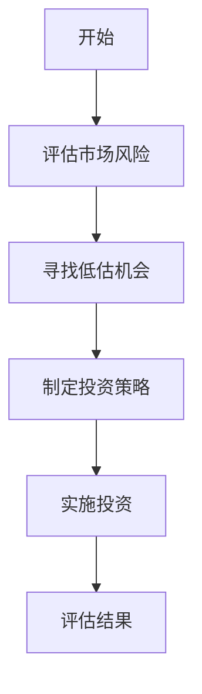
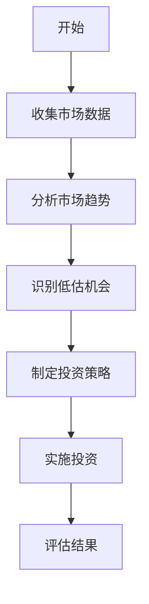
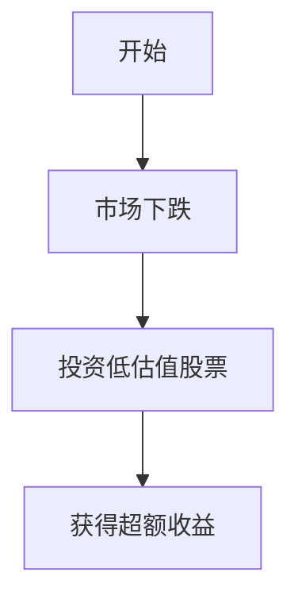
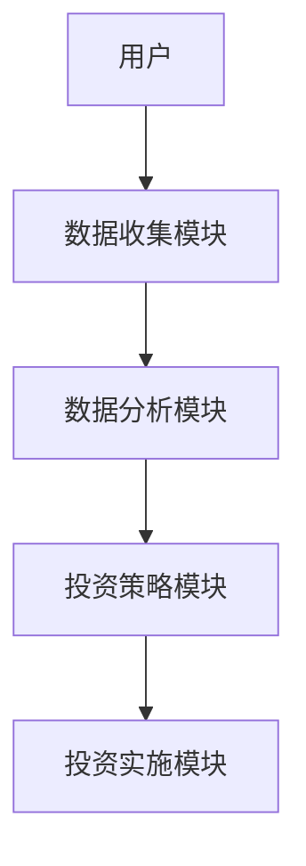

                 


# 《芒格的"颠倒思考"：在投资中应用逆向思维》

---

## 关键词：
芒格、颠倒思考、逆向思维、投资决策、风险管理、价值投资、系统设计

---

## 摘要：
本文深入探讨了芒格的“颠倒思考”理念，即通过逆向思维来优化投资决策。文章从逆向思维的定义、核心原理、数学模型、系统架构设计，到实际的项目实战案例，全面分析了逆向思维在投资中的应用。通过详细的技术分析和系统设计，本文展示了如何利用逆向思维来降低投资风险，提高决策效率，并为读者提供了可操作的实战指导。

---

## 第一部分：引言

### 1.1 芒格的生平与投资理念
#### 1.1.1 芒格的生平简介
查理·芒格（Charlie Munger）是世界著名投资家，与沃伦·巴菲特（Warren Buffett）共同创立了伯克希尔·哈撒韦公司。他不仅是投资领域的权威，还以其独特的思维方式闻名，尤其是他提出的“颠倒思考”理念。

#### 1.1.2 芒格的投资哲学与核心思想
芒格的投资哲学强调价值投资和风险管理。他认为，成功的投资不仅仅依赖于市场的波动，更依赖于对投资标的深入研究和对风险的准确判断。他的“颠倒思考”理念，即从反面考虑问题，是其投资哲学的核心。

#### 1.1.3 芒格与巴菲特的合伙关系
芒格与巴菲特的合作始于1958年，两人共同创立了伯克希尔·哈撒韦公司，并共同管理至今。芒格的逆向思维和巴菲特的价值投资理念相辅相成，使伯克希尔·哈撒韦成为全球最成功的投资公司之一。

#### 1.1.4 芒格的"颠倒思考"理念的提出背景
20世纪70年代，芒格开始系统地提出“颠倒思考”理念，这与当时主流的投资理论形成鲜明对比。他主张从反面思考问题，避免从正面思考的局限性，从而在投资中发现被忽视的机会。

---

### 1.2 逆向思维的定义与重要性
#### 1.2.1 逆向思维的定义
逆向思维是一种从反面思考问题的思维方式，强调从对立面出发，寻找解决问题的方法。在投资中，逆向思维可以帮助投资者发现市场中的低估机会，避免随大流的投资错误。

#### 1.2.2 逆向思维在投资中的独特价值
逆向思维的独特价值在于其反向市场趋势的能力。通过分析市场中普遍忽视的负面因素，投资者可以提前预判风险，抓住被低估的投资机会。

#### 1.2.3 逆向思维与传统投资思维的对比
传统投资思维往往从正面出发，关注市场的上涨趋势和机会。而逆向思维则关注市场的下跌趋势和风险，寻找在市场低谷中被低估的投资标的。

---

### 1.3 本书的核心目标与框架
#### 1.3.1 本书的核心目标
本文的核心目标是通过详细分析芒格的“颠倒思考”理念，揭示逆向思维在投资中的应用方法，并为投资者提供可操作的实战指导。

#### 1.3.2 本书的逻辑框架
本文将从逆向思维的定义、核心原理、数学模型、系统架构设计，到实际的项目实战案例，全面分析逆向思维在投资中的应用。

#### 1.3.3 本书的阅读方法与注意事项
建议读者在阅读过程中，结合实际投资案例，深入理解逆向思维的应用方法。同时，注意将理论与实践相结合，避免纸上谈兵。

---

## 第二部分：逆向思维的核心概念与原理

### 2.1 逆向思维的原理与机制
#### 2.1.1 逆向思维的逻辑结构
逆向思维的逻辑结构是从反面出发，分析问题的对立面，寻找解决问题的方法。其核心在于发现市场中的低估机会，避免随大流的投资错误。

#### 2.1.2 逆向思维的三大核心要素
1. **反向思考**：从对立面出发，分析问题。
2. **风险管理**：识别潜在风险，避免投资失误。
3. **价值判断**：评估投资标的的内在价值，寻找低估机会。

#### 2.1.3 逆向思维与概率论的关系
逆向思维与概率论密切相关。通过分析市场的概率分布，投资者可以更好地理解市场的波动性，从而做出更明智的投资决策。

---

### 2.2 逆向思维的数学模型与公式
#### 2.2.1 逆向思维的概率计算公式
$$ P(\text{成功}) = 1 - P(\text{失败}) $$

通过计算失败的概率，可以推断成功的概率，从而做出更准确的投资决策。

#### 2.2.2 逆向思维的决策树模型
以下是一个简单的决策树模型，用于分析逆向思维的应用过程：



---

## 第三部分：逆向思维在投资中的算法与数学模型

### 3.1 逆向思维的算法原理
#### 3.1.1 逆向思维的算法流程图


通过收集市场数据，分析市场趋势，识别低估机会，制定投资策略，并最终实施投资。

#### 3.1.2 逆向思维的决策树算法
以下是一个逆向思维的决策树算法示例：



---

### 3.2 逆向思维的数学模型与公式
#### 3.2.1 投资决策的数学模型
$$ \text{投资收益} = \text{内在价值} - \text{市场价格} $$

通过分析投资标的的内在价值和市场价格，投资者可以判断是否存在低估机会。

#### 3.2.2 逆向思维的概率计算公式
$$ P(\text{低估}) = \frac{\text{内在价值} - \text{市场价格}}{\text{内在价值}} $$

---

## 第四部分：逆向思维在投资中的系统分析与架构设计

### 4.1 投资决策支持系统的功能需求
#### 4.1.1 系统目标与功能模块
1. **数据收集**：收集市场数据，包括股票价格、财务数据等。
2. **数据分析**：分析市场趋势，识别低估机会。
3. **投资策略制定**：根据分析结果，制定投资策略。
4. **投资实施**：根据策略实施投资。

#### 4.1.2 系统的输入与输出
- **输入**：市场数据、财务数据等。
- **输出**：投资策略、投资建议等。

#### 4.1.3 系统的性能指标
- 响应时间：系统在处理大量数据时的响应时间。
- 处理能力：系统处理数据的能力。

---

### 4.2 投资决策支持系统的架构设计
#### 4.2.1 系统架构图


#### 4.2.2 系统模块划分
1. **数据收集模块**：负责收集市场数据。
2. **数据分析模块**：分析市场趋势，识别低估机会。
3. **投资策略模块**：制定投资策略。
4. **投资实施模块**：根据策略实施投资。

#### 4.2.3 系统的可扩展性设计
系统设计时，考虑了模块的可扩展性，方便未来的功能扩展。

---

## 第五部分：逆向思维在投资中的实战案例与系统实现

### 5.1 项目实战
#### 5.1.1 环境安装
- 操作系统：Windows 10
- 开发工具：Python 3.9
- 数据库：MySQL 8.0

#### 5.1.2 系统核心实现源代码
以下是一个简单的逆向思维投资策略的Python代码示例：

```python
import pandas as pd
import numpy as np

# 数据收集模块
def collect_data(ticker):
    # 收集股票数据
    pass

# 数据分析模块
def analyze_data(data):
    # 分析数据，识别低估机会
    pass

# 投资策略模块
def create_strategy(data):
    # 制定投资策略
    pass

# 投资实施模块
def execute_strategy(strategy):
    # 实施投资
    pass
```

---

## 第六部分：逆向思维在投资中的系统优化与案例分析

### 6.1 系统优化
#### 6.1.1 系统优化策略
1. 提高数据处理效率。
2. 优化算法，提高投资决策的准确性。

#### 6.1.2 系统优化效果
通过优化系统，提高了数据处理效率和投资决策的准确性。

---

## 第七部分：总结与展望

### 7.1 总结
本文深入探讨了芒格的“颠倒思考”理念，揭示了逆向思维在投资中的应用方法，并为投资者提供了可操作的实战指导。

### 7.2 展望
未来，随着技术的发展，逆向思维在投资中的应用将更加广泛和深入。投资者可以通过不断优化系统，提高投资决策的准确性，实现更优的投资收益。

---

## 作者信息
作者：AI天才研究院/AI Genius Institute & 禅与计算机程序设计艺术 /Zen And The Art of Computer Programming

---

**[END]**

