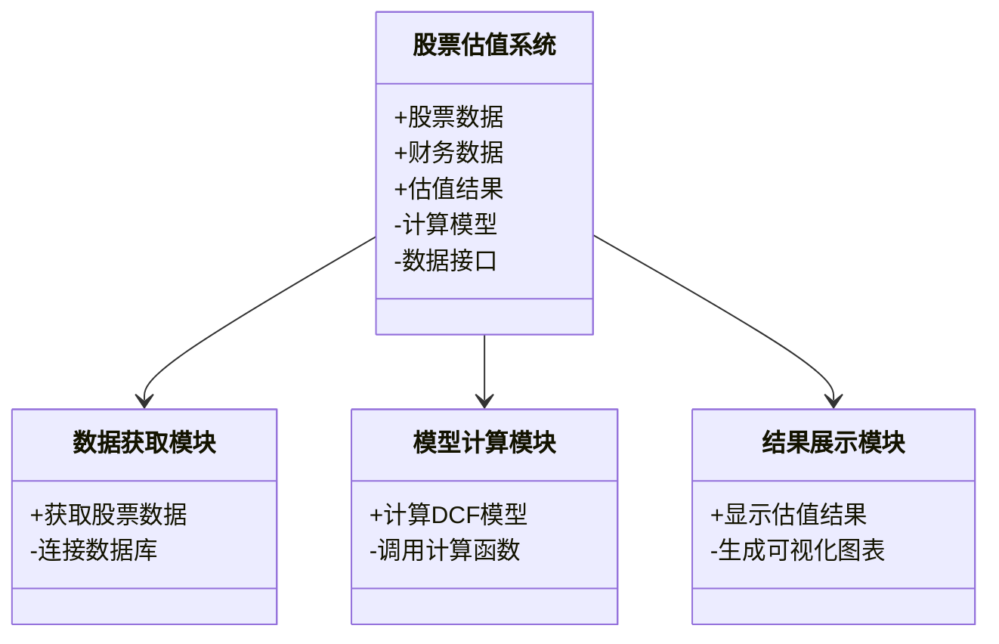
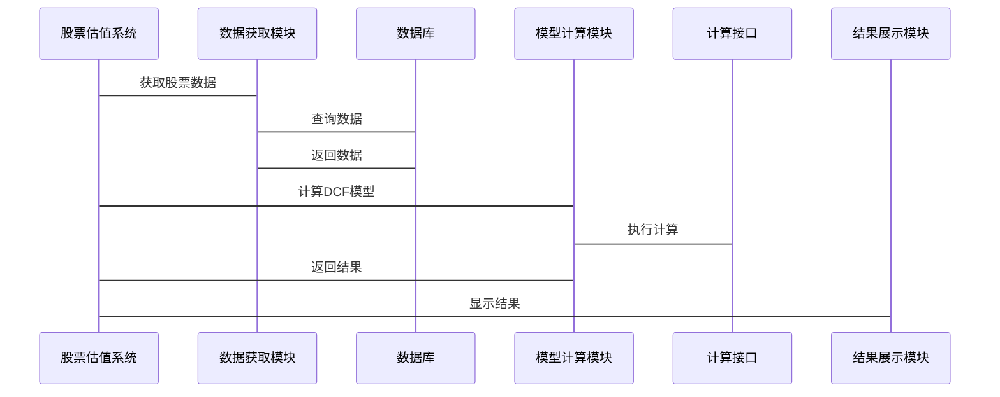

                 


# 荷兰股市估值: 小国大经济的投资价值

## 关键词：
荷兰股市、股票估值、经济分析、投资策略、金融模型

## 摘要：
荷兰作为一个小国，却在全球经济中占据重要地位。本文通过分析荷兰经济的特点、股市的结构和估值方法，探讨荷兰股市的投资价值。文章结合技术与金融的视角，详细讲解股票估值的核心概念、算法原理、系统架构设计和项目实战，帮助读者掌握荷兰股市的估值技巧和投资策略。

---

# 第一部分: 荷兰股市估值背景与概述

## 第1章: 荷兰经济与股市概述

### 1.1 荷兰经济的概述

#### 1.1.1 荷兰的经济特点与优势
荷兰是全球十大经济体之一，以其高效的农业、制造业和服务业闻名。荷兰的经济特点包括：
- **农业**：荷兰是全球第二大农产品出口国，农业总产值占GDP的2%。
- **制造业**：荷兰是全球重要的工业产品出口国，尤其是机械设备和化学品。
- **服务业**：服务业占荷兰GDP的70%，其中物流和金融服务业尤为突出。

#### 1.1.2 荷兰在国际经济中的地位
荷兰是欧元区的重要成员国，同时也是全球贸易和金融的重要枢纽。荷兰的经济政策稳健，通胀率低，吸引了大量外资。

#### 1.1.3 荷兰股市的独特性与重要性
荷兰股市不仅是欧洲的重要市场，还因其高效的公司治理和透明的监管体系而备受关注。荷兰股市的上市公司多为全球供应链中的关键参与者，具有较高的投资价值。

### 1.2 荷兰股市的基本结构

#### 1.2.1 荷兰的主要股票交易所
荷兰的主要股票交易所是阿姆斯特丹证交所（Euronext Amsterdam），它是欧洲最大的证券交易所之一，也是全球最重要的金融中心之一。

#### 1.2.2 荷兰股市的主要指数
荷兰的主要指数是AEX指数，涵盖荷兰最大的25家上市公司。这些公司涵盖多个行业，包括金融、能源、科技和制造业。

#### 1.2.3 荷兰股市的行业分布
荷兰股市的行业分布较为均衡，主要行业包括：
- 金融：如ING Group和Rabobank。
- 能源：如壳牌（Shell）和道达尔（TotalEnergies）。
- 制造业：如飞利浦（Philips）和荷兰皇家壳牌（Royal Dutch Shell）。

### 1.3 荷兰股市的历史与发展

#### 1.3.1 荷兰股市的历史沿革
荷兰股市的历史可以追溯到17世纪的阿姆斯特丹股票交易所，是世界上最古老的证券交易所之一。20世纪末，荷兰股市成为欧洲的重要交易中心。

#### 1.3.2 荷兰股市的发展阶段
荷兰股市经历了多个发展阶段，从传统的本地市场逐步发展为国际化的金融中心。

#### 1.3.3 荷兰股市的国际化进程
荷兰股市通过加入欧盟和欧元区，进一步扩大了其国际影响力，吸引了更多的国际投资者。

### 1.4 本章小结
本章介绍了荷兰经济的特点、股市的基本结构以及其历史发展，为后续的估值分析奠定了基础。

---

## 第2章: 股票估值的核心概念与方法

### 2.1 股票估值的基本原理

#### 2.1.1 估值的基本概念
股票估值是通过对公司财务数据和市场环境的分析，确定其内在价值的过程。估值的核心在于预测公司未来现金流的现值。

#### 2.1.2 估值的核心要素
- **财务数据**：收入、利润、现金流等。
- **行业环境**：行业竞争格局、政策影响等。
- **市场情绪**：投资者的心理和市场波动。

#### 2.1.3 估值的常见误区
- **忽视风险**：低估了市场的波动性和公司的风险。
- **过度依赖历史数据**：忽略了未来的不确定性。

### 2.2 主要的股票估值指标

#### 2.2.1 市盈率（P/E）
市盈率是股价与每股收益的比率，用于衡量股票的估值水平。

公式：
$$ P/E = \frac{\text{股价}}{\text{每股收益}} $$

#### 2.2.2 市净率（P/B）
市净率是股价与每股净资产的比率，适用于评估资产密集型行业的公司。

公式：
$$ P/B = \frac{\text{股价}}{\text{每股净资产}} $$

#### 2.2.3 股息率（Dividend Yield）
股息率是股息与股价的比率，反映了投资的回报率。

公式：
$$ \text{股息率} = \frac{\text{股息}}{\text{股价}} \times 100\% $$

#### 2.2.4 EV/EBITDA
企业价值与息税折旧及摊销前利润的比率，用于评估企业的整体价值。

公式：
$$ EV/EBITDA = \frac{\text{企业价值}}{\text{EBITDA}} $$

### 2.3 荷兰股市估值的独特性

#### 2.3.1 荷兰企业的估值特点
荷兰企业的财务数据稳健，现金流充裕，适合使用DCF模型进行估值。

#### 2.3.2 荷兰市场的流动性分析
荷兰股市的流动性较高，交易成本低，适合长期投资。

#### 2.3.3 荷兰市场的风险因素
荷兰市场受欧洲经济的影响较大，需关注欧元区的政策变化和地缘政治风险。

### 2.4 本章小结
本章介绍了股票估值的核心概念和主要指标，重点分析了荷兰股市的估值特点和风险因素。

---

## 第3章: 荷兰股市估值的算法与模型

### 3.1 常见的股票估值方法

#### 3.1.1 市盈率法
通过比较市盈率与行业平均水平，判断股票的估值水平。

#### 3.1.2 市净率法
适用于资产密集型行业，通过比较市净率与行业平均水平，判断股票的估值水平。

#### 3.1.3 股息贴现模型（DDM）
基于股息的现值之和计算股票的内在价值。

公式：
$$ V = \frac{D_1}{r - g} $$
其中，D1为第一年的股息，r为贴现率，g为股息增长率。

#### 3.1.4 现金流贴现模型（DCF）
通过预测未来现金流的现值之和计算股票的内在价值。

公式：
$$ V = \sum_{t=1}^{n} \frac{CF_t}{(1 + r)^t} $$
其中，CF_t为第t年的现金流，r为贴现率。

### 3.2 荷兰股市估值的优化模型

#### 3.2.1 基于行业特点的估值调整
根据不同行业的特点，调整估值模型中的参数，如增长率和贴现率。

#### 3.2.2 基于企业生命周期的估值模型
根据企业的生命周期阶段，选择合适的估值方法，如初创期适合使用DCF模型，成熟期适合使用市盈率法。

#### 3.2.3 基于市场情绪的估值修正
通过分析市场情绪，对估值结果进行调整，避免过度偏离市场实际。

### 3.3 荷兰股市估值的算法实现

#### 3.3.1 算法原理
以DCF模型为例，通过预测未来现金流，计算其现值，确定股票的内在价值。

#### 3.3.2 算法步骤
1. 收集公司财务数据。
2. 预测未来现金流。
3. 确定贴现率。
4. 计算现金流的现值之和。
5. 与市场价格比较，判断估值是否合理。

#### 3.3.3 算法代码实现
```python
def calculate_dcf(cash_flows, discount_rate):
    present_value = 0
    for year, cash_flow in enumerate(cash_flows):
        pv = cash_flow / (1 + discount_rate) ** year
        present_value += pv
    return present_value

# 示例数据
cash_flows = [100, 120, 150, 200]  # 每年的现金流
discount_rate = 0.08  # 贴现率

dcf_value = calculate_dcf(cash_flows, discount_rate)
print(f"DCF Value: {dcf_value}")
```

### 3.4 本章小结
本章介绍了几种常见的股票估值方法，并通过DCF模型详细讲解了荷兰股市的估值算法和实现。

---

## 第4章: 荷兰股市估值的系统分析与架构设计

### 4.1 系统分析

#### 4.1.1 问题场景介绍
通过构建一个股票估值系统，帮助投资者快速、准确地评估荷兰股市的股票价值。

#### 4.1.2 项目介绍
本项目旨在开发一个基于荷兰股市数据的估值系统，涵盖数据获取、模型计算和结果展示。

#### 4.1.3 系统功能设计
- 数据获取模块：从荷兰股市获取实时数据。
- 模型计算模块：使用DCF模型计算股票的内在价值。
- 结果展示模块：将估值结果以可视化的方式呈现。

#### 4.1.4 领域模型Mermaid类图


### 4.2 系统架构设计

#### 4.2.1 系统架构Mermaid架构图
```mermaid
container 股票估值系统 {
    股票数据获取模块
    财务数据处理模块
    DCF模型计算模块
    结果可视化模块
}
```

#### 4.2.2 系统接口设计
- 数据获取接口：从荷兰股市获取实时数据。
- 计算接口：调用DCF模型进行估值计算。
- 展示接口：将结果以图表形式展示。

#### 4.2.3 系统交互Mermaid序列图


### 4.3 本章小结
本章通过系统分析和架构设计，展示了如何构建一个基于荷兰股市数据的股票估值系统。

---

## 第5章: 荷兰股市估值的项目实战

### 5.1 环境安装与数据准备

#### 5.1.1 环境安装
- 安装Python和相关库（Pandas、NumPy、Matplotlib）。

#### 5.1.2 数据获取与处理
从荷兰股市数据库获取历史数据，清洗数据并存储在CSV文件中。

#### 5.1.3 数据分析工具
使用Python进行数据分析和可视化。

### 5.2 系统核心实现源代码

#### 5.2.1 数据获取模块
```python
import pandas as pd
import requests

def get_stock_data(ticker):
    url = f"https://api.example.com/stock/{ticker}"
    response = requests.get(url)
    data = response.json()
    df = pd.DataFrame(data)
    return df
```

#### 5.2.2 模型计算模块
```python
def calculate_dcf(ticker, financial_data, discount_rate):
    # 假设financial_data包含未来现金流
    cash_flows = financial_data['cash_flows']
    present_value = sum(cash_flow / (1 + discount_rate) ** year for year, cash_flow in enumerate(cash_flows))
    return present_value
```

#### 5.2.3 结果展示模块
```python
import matplotlib.pyplot as plt

def visualize_results(ticker, market_price, dcf_value):
    plt.figure(figsize=(10, 6))
    plt.bar('市场价格', market_price, label='市场价格')
    plt.bar('DCF价值', dcf_value, label='DCF价值')
    plt.title(f'{ticker} 股票估值结果')
    plt.legend()
    plt.show()
```

### 5.3 实际案例分析

#### 5.3.1 案例背景
选择荷兰某上市公司（如ING Group）作为案例，分析其股票的估值。

#### 5.3.2 数据处理与分析
获取ING Group的历史财务数据和市场数据，清洗并存储。

#### 5.3.3 估值计算与结果展示
使用DCF模型计算ING Group的内在价值，并与市场价格进行比较。

### 5.4 本章小结
本章通过实际案例展示了如何在荷兰股市中应用股票估值模型，帮助投资者做出更明智的投资决策。

---

## 第6章: 最佳实践与投资策略

### 6.1 投资策略

#### 6.1.1 分散投资
通过投资多个行业和公司的股票，降低投资风险。

#### 6.1.2 长期投资
荷兰股市适合长期投资，关注公司的基本面和长期增长潜力。

#### 6.1.3 关注基本面
重点分析公司的财务数据和行业环境，选择具有竞争优势的公司。

### 6.2 投资风险管理

#### 6.2.1 风险分散
通过投资不同行业和地区的股票，降低市场风险。

#### 6.2.2 风险评估
定期评估投资组合的风险和收益，及时调整投资策略。

#### 6.2.3 风险监控
密切关注市场动态和公司新闻，及时应对潜在风险。

### 6.3 拓展阅读

#### 6.3.1 荷兰经济的深入研究
推荐阅读关于荷兰经济的书籍和报告。

#### 6.3.2 股票估值的高级模型
学习更复杂的估值模型，如情景分析和蒙特卡洛模拟。

#### 6.3.3 荷兰股市的行业分析
研究荷兰主要行业的市场趋势和投资机会。

### 6.4 本章小结
本章总结了荷兰股市的投资策略和风险管理方法，并提供了进一步学习的资源。

---

## 作者：AI天才研究院 & 禅与计算机程序设计艺术

---

通过以上内容，读者可以全面了解荷兰股市的投资价值，并掌握如何利用技术手段进行股票估值。希望本文能为投资者提供有价值的参考和启发。

