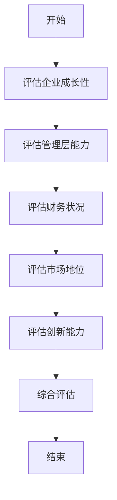
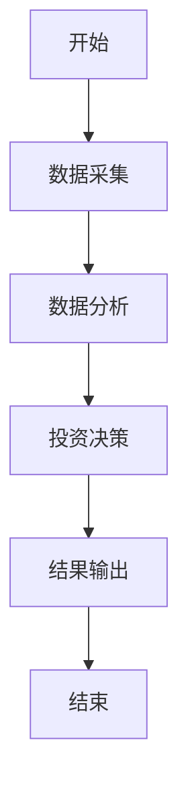
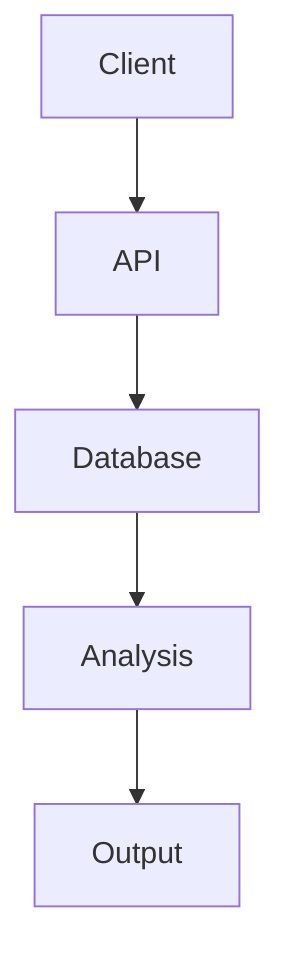

                 


# 菲利普·费雪的创新企业投资准则

> 关键词：菲利普·费雪，创新企业，投资准则，成长股，价值投资，投资策略

> 摘要：菲利普·费雪是投资界的传奇人物，他的成长股投资理念深刻影响了现代投资理论。本文将详细解读菲利普·费雪的创新企业投资准则，分析其背后的逻辑与数学模型，探讨其在现代投资中的应用，并通过实际案例展示如何运用这些准则进行投资决策。文章结构清晰，内容详实，适合投资专业人士和对投资感兴趣读者参考。

---

## 第1章：菲利普·费雪投资理念的背景与核心概念

### 1.1 投资的哲学与方法

#### 1.1.1 投资的基本概念与分类
投资是将资金投入某个领域以期获得未来收益的行为。常见的投资类型包括股票、债券、房地产和货币市场等。股票投资因其高成长性，成为许多投资者的首选。

#### 1.1.2 菲利普·费雪的成长股投资哲学
菲利普·费雪主张长期持有优质成长股，而非短期交易。他认为，选择一家具有持续增长潜力的企业，比频繁买卖更能创造长期价值。这种投资策略要求投资者深入分析企业的基本面，寻找那些能够持续增长的企业。

#### 1.1.3 股票投资的核心要素与误区
股票投资的核心要素包括企业盈利能力、成长潜力、财务健康和市场地位等。误区包括盲目跟风、过度依赖技术分析和忽视长期价值。

### 1.2 菲利普·费雪的创新企业分析框架

#### 1.2.1 创新企业的定义与特征
创新企业是指在技术和商业模式上具有创新性，能够持续推出新产品或服务的企业。这类企业通常具有较高的成长潜力。

#### 1.2.2 菲利普·费雪的创新企业筛选标准
费雪提出了一套筛选标准，包括企业是否具有创新性、管理层是否优秀、财务是否稳健等。

#### 1.2.3 创新企业投资的边界与外延
投资创新企业的边界在于企业的成长性和财务健康，外延则包括技术、市场和管理等多个方面。

---

## 第2章：菲利普·费雪的核心投资准则

### 2.1 股票选择的十二条准则

#### 2.1.1 第一条准则：成长股的定义与特征
成长股是指那些收入和利润能够持续增长的股票。这类股票通常具有较高的市盈率，但长期回报率高。

#### 2.1.2 第二条准则：管理层的品质与决策
管理层的决策能力和企业战略直接影响企业的成长性。优秀的管理层能够带领企业持续创新和增长。

#### 2.1.3 第三条准则：企业的财务健康状况
健康的财务状况包括低债务、高利润率和稳健的现金流。财务健康的企业具有更强的抗风险能力。

#### 2.1.4 第四条准则：企业的市场地位与竞争优势
市场地位和竞争优势是企业能否持续增长的关键因素。龙头企业通常具有更强的市场影响力。

#### 2.1.5 第五条准则：企业的创新能力与研发投入
创新能力决定企业的成长潜力。持续的研发投入是保持技术领先的关键。

#### 2.1.6 第六条准则：企业的盈利能力和成长性
盈利能力是企业成长的基础，成长性则是未来盈利能力的保障。

#### 2.1.7 第七条准则：企业的财务杠杆与风险控制
合理的财务杠杆可以放大收益，但过高杠杆会增加企业风险。

#### 2.1.8 第八条准则：企业的现金流与资金流动性
现金流是企业运营的血液，良好的资金流动性确保企业能够持续发展。

#### 2.1.9 第九条准则：企业的管理团队稳定性
稳定的管理团队是企业持续发展的保障。

#### 2.1.10 第十条准则：企业的市场前景与行业地位
市场前景和行业地位决定了企业的成长空间和潜力。

#### 2.1.11 第十一条准则：企业的社会责任与声誉
良好的企业声誉和社会责任有助于企业获得更多的支持和信任。

#### 2.1.12 第十二条准则：企业的长期投资价值
长期投资价值是综合考虑企业基本面后的结果，是投资决策的关键因素。

### 2.2 核心准则之间的关系与对比

#### 2.2.1 准则间的相互作用与影响
企业成长性与财务健康相互影响，创新能力与市场地位相辅相成。

#### 2.2.2 准则特征对比表格
| 准则 | 特征 |
|------|------|
| 成长股 | 高成长性 |
| 管理层 | 高素质 |
| 财务 | 健康稳健 |

#### 2.2.3 ER实体关系图
```mermaid
erd
  股票
  管理层
  财务状况
  竞争优势
  市场地位
  创新能力
```

---

## 第3章：菲利普·费雪投资准则的算法原理

### 3.1 投资准则的评估流程

#### 3.1.1 算法流程图


#### 3.1.2 算法步骤说明
1. 评估企业成长性：分析企业的收入和利润增长率。
2. 评估管理层能力：考察管理层的决策能力和战略规划。
3. 评估财务状况：分析企业的负债、利润和现金流。
4. 评估市场地位：考察企业的市场份额和品牌影响力。
5. 评估创新能力：评估企业的研发投入和技术领先性。
6. 综合评估：根据各准则的评分，综合判断企业的投资价值。

#### 3.1.3 算法实现的Python代码示例
```python
def evaluate_growth(company):
    # 评估成长性
    pass

def evaluate_management(company):
    # 评估管理层
    pass

def evaluate_financials(company):
    # 评估财务状况
    pass

def evaluate_market_position(company):
    # 评估市场地位
    pass

def evaluate_innovation(company):
    # 评估创新能力
    pass

def overall_evaluation(company):
    growth = evaluate_growth(company)
    management = evaluate_management(company)
    financials = evaluate_financials(company)
    market = evaluate_market_position(company)
    innovation = evaluate_innovation(company)
    return (growth + management + financials + market + innovation) / 5
```

---

## 第4章：投资准则的数学模型与公式

### 4.1 股票估值的数学模型

#### 4.1.1 股票内在价值的计算公式
股票的内在价值可以通过未来现金流的现值计算：
$$ V = \sum_{t=1}^{n} \frac{CF_t}{(1 + r)^t} $$

#### 4.1.2 股东权益的计算公式
$$ \text{股东权益} = \text{资产} - \text{负债} $$

#### 4.1.3 股票成长性的数学模型
$$ \text{成长性} = \frac{\text{收入增长率} + \text{利润增长率}}{2} $$

### 4.2 投资组合优化的数学模型

#### 4.2.1 马科维茨投资组合理论
$$ \text{收益} = \sum_{i=1}^{n} w_i \cdot r_i $$
$$ \text{风险} = \sum_{i=1}^{n} \sum_{j=1}^{n} w_i w_j \sigma_i \sigma_j $$

#### 4.2.2 菲利普·费雪的成长股投资组合优化公式
$$ \text{最优组合} = \arg\min \sigma^2 \quad \text{subject to} \quad \sum_{i=1}^{n} w_i = 1 \quad \text{且} \quad \sum_{i=1}^{n} w_i r_i = \text{目标收益} $$

---

## 第5章：系统分析与架构设计方案

### 5.1 投资分析系统的功能设计

#### 5.1.1 系统功能模块划分
- 数据采集模块：收集企业财务数据和市场信息。
- 数据分析模块：评估企业的各项准则。
- 投资决策模块：根据评估结果生成投资建议。

#### 5.1.2 系统功能流程图


### 5.2 系统架构设计

#### 5.2.1 系统架构图


---

## 第6章：项目实战

### 6.1 投资案例分析

#### 6.1.1 案例背景
以某创新企业为例，分析其是否符合费雪的投资准则。

#### 6.1.2 数据收集与分析
收集企业的财务数据、管理层信息和市场地位等。

#### 6.1.3 投资决策
根据分析结果，评估企业是否具备投资价值。

---

## 第7章：最佳实践与小结

### 7.1 小结
菲利普·费雪的投资准则为投资者提供了系统化的投资框架，强调长期价值和企业基本面分析。

### 7.2 注意事项
投资者需结合市场环境和个人风险承受能力，灵活运用这些准则。

### 7.3 拓展阅读
推荐阅读《成长股投资》和《投资学》等书籍。

---

作者：AI天才研究院/AI Genius Institute & 禅与计算机程序设计艺术 /Zen And The Art of Computer Programming

