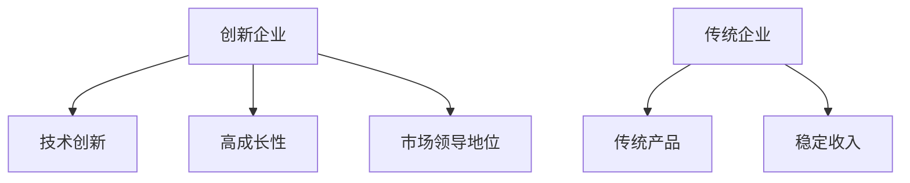
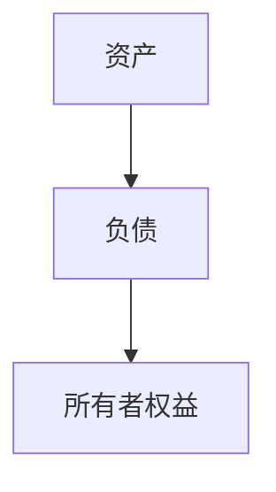
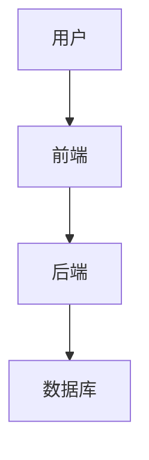

                 


# 菲利普费雪的创新企业特征

> 关键词：菲利普·费雪，创新企业，投资特征，数学模型，系统架构

> 摘要：本文系统地分析了菲利普·费雪的创新企业特征，从背景介绍到核心概念，再到数学模型和系统架构，结合实际案例进行详细解读，帮助读者深入理解创新企业的评估方法。

---

## 第1章: 菲利普·费雪投资理念概述

### 1.1 菲利普·费雪的投资哲学

#### 1.1.1 费雪的成长股投资理论
菲利普·费雪是成长股投资的鼻祖，主张长期投资于那些具有持续增长潜力的企业。他认为，市场波动是短期的，而企业的成长才是长期的驱动力。

#### 1.1.2 费雪对创新企业的关注点
费雪特别关注那些具有创新能力的企业，认为这些企业能够通过技术创新或商业模式创新持续增长。

#### 1.1.3 费雪投资理念的核心要素
1. 长期成长：关注企业的长期增长潜力。
2. 创新能力：企业必须具备持续创新的能力。
3. 管理质量：管理层的素质和决策能力直接影响企业的成长。

### 1.2 创新企业的定义与特征

#### 1.2.1 创新企业的定义
创新企业是指那些能够持续推出新产品、服务或商业模式，并在市场中占据领先地位的企业。

#### 1.2.2 创新企业的核心特征
| 特征 | 描述 |
|------|------|
| 技术创新 | 持续推出新技术或产品 |
| 市场领导地位 | 在目标市场中占据领先地位 |
| 高成长性 | 收入和利润持续增长 |
| 良好的财务状况 | 健康的资产负债表和利润表 |

#### 1.2.3 创新企业与传统企业的对比


### 1.3 费雪的创新企业评估方法

#### 1.3.1 费雪的“检查清单法”
费雪使用一个包含15个问题的清单来评估企业的成长潜力，包括管理层质量、财务状况等。

#### 1.3.2 费雪的“成长性”评估标准
1. 收入增长率。
2. 净利润增长率。
3. 资产回报率。

#### 1.3.3 费雪的“管理层质量”评估
1. 管理层的稳定性。
2. 管理层的决策风格。
3. 管理层的道德与诚信。

### 1.4 费雪投资理念的实际案例

#### 1.4.1 费雪的经典投资案例分析
以可口可乐为例，费雪长期投资于该公司，因为其具备持续的创新能力、强大的市场地位和稳定的财务状况。

#### 1.4.2 案例中的创新企业特征
1. 技术创新：可口可乐不断推出新产品。
2. 市场领导地位：全球碳酸饮料市场的领导者。
3. 高成长性：收入和利润持续增长。

#### 1.4.3 案例对现代投资的启示
费雪的案例表明，创新企业特征的评估对于长期投资决策至关重要。

### 1.5 本章小结
本章介绍了菲利普·费雪的投资理念，重点分析了创新企业的定义、核心特征和评估方法。

---

## 第2章: 创新企业的核心特征分析

### 2.1 创新企业的管理质量

#### 2.1.1 管理层的稳定性与能力
管理层的稳定性直接影响企业的持续创新能力。

#### 2.1.2 管理层的决策风格
决策风格影响企业的战略方向和创新能力。

#### 2.1.3 管理层的道德与诚信
管理层的道德素质影响企业的长期发展和声誉。

### 2.2 创新企业的财务状况

#### 2.2.1 财务健康状况的评估
1. 资产负债表分析。
2. 利润表分析。
3. 现金流分析。

#### 2.2.2 资产负债表分析


#### 2.2.3 利润表与现金流分析
利润表反映企业的收入和利润，现金流表反映企业的现金流动情况。

### 2.3 创新企业的市场地位

#### 2.3.1 市场领导地位的定义
市场领导地位指企业在目标市场中的占有率和影响力。

#### 2.3.2 市场地位与竞争优势
竞争优势来源于技术创新、成本优势和品牌影响力。

#### 2.3.3 市场地位的动态变化
市场地位会随着竞争环境的变化而变化。

### 2.4 创新企业的创新能力

#### 2.4.1 技术创新的核心作用
技术创新是企业持续增长的核心驱动力。

#### 2.4.2 创新文化与组织结构
创新文化促进企业的持续创新能力，组织结构影响创新效率。

#### 2.4.3 创新能力的可持续性
可持续创新能力是企业长期发展的关键。

### 2.5 本章小结
本章详细分析了创新企业的管理质量、财务状况、市场地位和创新能力，为后续分析奠定了基础。

---

## 第3章: 费雪创新企业特征的数学模型与算法原理

### 3.1 费雪创新企业特征的多因素分析模型

#### 3.1.1 模型的构建逻辑
多因素分析模型综合考虑多个因素对企业创新特征的影响。

#### 3.1.2 模型的输入变量
- 管理质量。
- 财务状况。
- 市场地位。
- 创新能力。

#### 3.1.3 模型的输出结果
- 创新特征评分。
- 投资建议。

### 3.2 创新企业特征的权重分配算法

#### 3.2.1 权重分配的理论基础
权重分配基于各个因素对创新特征的影响程度。

#### 3.2.2 权重分配的具体步骤
1. 确定各个因素的重要性。
2. 赋予各因素相应的权重。
3. 计算综合评分。

#### 3.2.3 权重分配的实际应用


### 3.3 费雪创新企业特征的评分系统

#### 3.3.1 评分系统的构建逻辑
评分系统通过综合评估各因素对企业创新特征的影响，给出综合评分。

#### 3.3.2 评分系统的实现步骤
1. 收集企业数据。
2. 评估各个因素。
3. 综合评分。

#### 3.3.3 评分系统的优缺点分析
优点：综合考虑多因素，评分客观。缺点：依赖于数据质量和模型准确性。

### 3.4 本章小结
本章介绍了费雪创新企业特征的数学模型和评分系统，为后续系统设计提供了理论基础。

---

## 第4章: 创新企业特征的系统分析与架构设计

### 4.1 创新企业特征分析系统的功能需求

#### 4.1.1 系统的目标与范围
系统旨在帮助投资者评估企业的创新特征，辅助投资决策。

#### 4.1.2 系统的主要功能模块
- 数据采集模块。
- 特征评估模块。
- 投资建议模块。

#### 4.1.3 系统的用户角色与权限
- 用户：普通用户。
- 管理员：系统管理员。

### 4.2 系统的架构设计

#### 4.2.1 系统的分层架构


#### 4.2.2 数据流的交互流程
用户输入企业数据，系统进行特征评估并给出投资建议。

#### 4.2.3 系统的可扩展性
系统架构设计具有良好的扩展性，方便后续功能的增加。

### 4.3 本章小结
本章详细分析了创新企业特征分析系统的架构设计和功能需求。

---

## 第5章: 费雪创新企业特征的项目实战

### 5.1 项目环境安装

#### 5.1.1 安装Python
```bash
pip install python3
```

#### 5.1.2 安装数据分析库
```bash
pip install pandas numpy
```

### 5.2 系统核心功能实现

#### 5.2.1 数据采集模块
```python
import pandas as pd

def collect_data():
    # 数据采集逻辑
    pass
```

#### 5.2.2 特征评估模块
```python
def assess_features():
    # 特征评估逻辑
    pass
```

#### 5.2.3 投资建议模块
```python
def generate_recommendations():
    # 投资建议逻辑
    pass
```

### 5.3 项目总结

#### 5.3.1 代码实现
系统实现了数据采集、特征评估和投资建议的核心功能。

#### 5.3.2 案例分析
以具体企业为例，展示系统的实际应用。

#### 5.3.3 实践中的注意事项
数据质量和模型准确性是系统应用的关键。

### 5.4 本章小结
本章通过实际项目展示如何应用费雪的创新企业特征分析方法。

---

## 第6章: 最佳实践与总结

### 6.1 小结
本文系统地分析了菲利普·费雪的创新企业特征，从背景介绍到数学模型，再到系统设计和项目实战，为投资者提供了全面的指导。

### 6.2 注意事项
在实际应用中，需注意数据质量和模型的动态调整。

### 6.3 拓展阅读
建议阅读菲利普·费雪的经典著作《共同致富》和相关投资策略书籍。

---

## 作者：AI天才研究院 & 禅与计算机程序设计艺术

---

**摘要**：本文通过系统分析菲利普·费雪的创新企业特征，结合数学模型和系统架构设计，为投资者提供了一套完整的评估方法，帮助其做出明智的投资决策。

