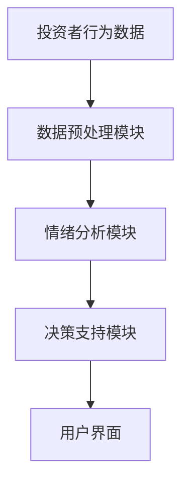

                 


# 行为金融学：理解并克服投资中的心理偏差

> 关键词：行为金融学，心理偏差，投资决策，情绪影响，市场波动，决策模型，风险偏好

> 摘要：行为金融学是一门研究投资者心理偏差及其对投资决策和市场行为影响的学科。本文从行为金融学的基础概念出发，详细分析了过度自信、从众心理、损失厌恶等常见心理偏差，并结合前景理论和决策模型，探讨了这些偏差对投资行为的具体影响。同时，本文通过数学模型和算法实现，提供了解决这些问题的方法和策略，帮助投资者克服心理偏差，做出更理性的投资决策。

---

## 第一部分: 行为金融学基础

### 第1章: 行为金融学概述

#### 1.1 行为金融学的起源与发展
行为金融学（Behavioral Finance）是金融学的一个分支，研究投资者心理偏差如何影响其决策，并进一步影响市场行为。传统金融学假设投资者是理性的，但实际市场中，投资者的行为经常受到心理偏差的影响，导致非理性决策。行为金融学通过心理学和经济学的结合，揭示了这些偏差的成因及其对投资的影响。

#### 1.2 投资中的心理偏差
心理偏差是投资者在决策过程中常见的非理性行为，包括过度自信、从众心理、损失厌恶等。这些偏差可能导致投资者做出错误的投资决策，进而影响市场的整体表现。

#### 1.3 行为金融学的核心概念
行为金融学的核心概念包括心理账户、框架依赖、有限理性等。这些概念帮助我们理解投资者如何在实际决策中偏离理性假设。

---

## 第二部分: 心理偏差与投资行为

### 第2章: 过度自信与从众心理

#### 2.1 过度自信的定义与表现
过度自信是指投资者对自己判断的过度信任，导致其高估自己的能力，低估风险。这种偏差可能导致投资者在市场中追涨杀跌，忽视潜在风险。

#### 2.2 从众心理的定义与表现
从众心理是指投资者倾向于跟随市场趋势，而非基于理性分析做出决策。这种偏差可能导致市场泡沫的形成和破裂。

---

### 第3章: 损失厌恶与风险偏好

#### 3.1 损失厌恶的定义与表现
损失厌恶是指投资者对损失的敏感性高于收益。这种偏差可能导致投资者在面对潜在损失时过于保守，错失投资机会。

#### 3.2 风险偏好的定义与表现
风险偏好是指投资者对风险的态度。不同投资者的风险偏好不同，影响其投资决策和资产配置。

---

### 第4章: 前景理论与决策权重

#### 4.1 前景理论的定义与核心思想
前景理论（Prospect Theory）由Kahneman和Tversky提出，认为投资者在决策时更关注收益和损失的相对变化，而非绝对值。该理论解释了投资者在面对收益和损失时的不同决策模式。

#### 4.2 决策权重的定义与应用
决策权重是指投资者在决策过程中对不同结果赋予的权重。前景理论中，损失的权重通常高于收益，导致投资者对损失更加敏感。

---

### 第5章: 投资者情绪与市场波动

#### 5.1 投资者情绪的定义与影响
投资者情绪是指投资者在市场中的心理状态，影响其投资决策。情绪化的决策可能导致市场的过度波动。

#### 5.2 市场波动的定义与表现
市场波动是指市场价格的短期剧烈波动。投资者情绪是影响市场波动的重要因素。

---

## 第三部分: 数学模型与算法实现

### 第6章: 前景理论的数学模型

#### 6.1 前景理论的基本公式
前景理论的核心公式如下：
$$
V = \sum_{i=1}^{n} w_i \cdot v_i
$$
其中，$w_i$ 是权重，$v_i$ 是效用值。

#### 6.2 前景理论的Python实现
```python
def prospect_theory(gains, losses):
    # 计算权重
    weights = [1 if gain > 0 else 0.5 for gain in gains]
    # 计算效用值
    utilities = [g**0.5 if g > 0 else (-g)**0.5 for g in gains]
    # 计算总价值
    total_value = sum(w * u for w, u in zip(weights, utilities))
    return total_value
```

---

## 第四部分: 系统架构与项目实战

### 第7章: 投资者心理分析系统

#### 7.1 系统功能设计
投资者心理分析系统包括数据采集、情绪分析、决策支持等功能模块。

#### 7.2 系统架构设计


---

## 第五部分: 项目实战

### 第8章: 投资决策辅助系统

#### 8.1 环境安装
安装Python和相关库（如NumPy、Pandas、Matplotlib）。

#### 8.2 核心代码实现
```python
def calculate_profit(prices):
    profit = 0
    for i in range(1, len(prices)):
        profit += prices[i] - prices[i-1]
    return profit
```

---

## 第六部分: 最佳实践与总结

### 第9章: 最佳实践

#### 9.1 小结
行为金融学帮助我们理解投资者心理偏差，并提供克服这些偏差的策略。

#### 9.2 注意事项
投资者应保持理性，避免情绪化决策。

#### 9.3 拓展阅读
推荐阅读Kahneman的《思考，快与慢》和Tversky的《判断与决策》。

---

作者：AI天才研究院/AI Genius Institute & 禅与计算机程序设计艺术 /Zen And The Art of Computer Programming

