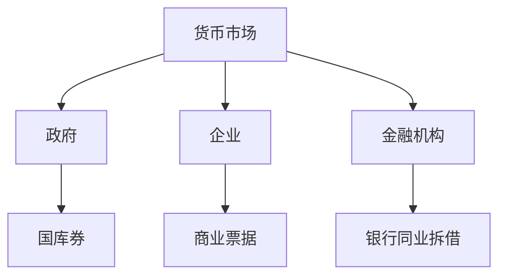
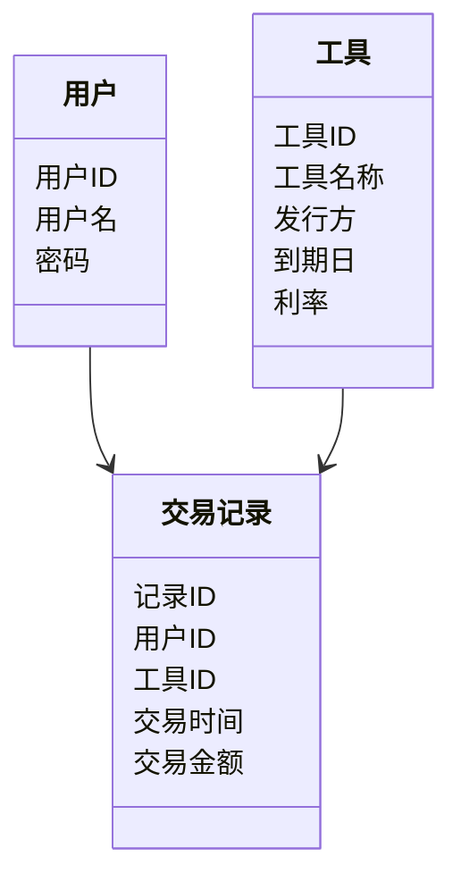

                 


# 货币市场工具：短期资金管理的安全港

> **关键词**：货币市场工具、短期资金管理、安全性、流动性、投资策略

> **摘要**：货币市场工具是短期资金管理的重要手段，本文将从基本概念、市场结构、风险分析、投资策略等多方面进行深入探讨，结合实际案例和系统设计，为读者提供全面的指导。

---

## 第一章：货币市场工具的概述

### 1.1 货币市场工具的定义与背景

#### 1.1.1 货币市场的基本概念
- 货币市场是进行短期资金借贷和交易的市场，参与者包括政府、企业和金融机构。
- 货币市场工具的特点：期限短、流动性高、风险较低。

#### 1.1.2 货币市场工具的分类
- 国库券：政府发行的短期债券，期限通常为3个月到1年。
- 商业票据：企业发行的短期债务工具，期限一般为1到6个月。
- 银行同业拆借：银行之间短期资金拆借，通常用于调剂头寸。

#### 1.1.3 货币市场工具的特征
- 低风险：由于期限短，风险相对较小。
- 高流动性：可在市场中快速变现。
- 稳定收益：收益相对固定，适合保守型投资者。



---

### 1.2 货币市场工具的历史发展

#### 1.2.1 货币市场的起源
- 货币市场起源于古代的商品交换和信贷活动。
- 中世纪时期，银行的出现推动了货币市场的形成。

#### 1.2.2 货币市场工具的演变
- 从传统的实物货币到现代的电子货币，货币市场工具经历了多次演变。
- 现代货币市场工具更加多样化，交易方式也更加便捷。

#### 1.2.3 当代货币市场工具的特点
- 数字化：电子交易成为主流。
- 全球化：跨国交易日益频繁。
- 多元化：工具种类丰富，满足不同需求。

---

## 第二章：短期资金管理的重要性

### 2.1 短期资金管理的核心目标

#### 2.1.1 资产的流动性管理
- 确保资金能够快速变现，避免流动性危机。
- 通过合理配置资产，维持适度的流动性。

#### 2.1.2 资产的安全性保障
- 选择低风险的工具，避免资金损失。
- 建立风险控制机制，保护资金安全。

#### 2.1.3 资产的收益性优化
- 在保证流动性和安全性的前提下，追求最大收益。
- 通过多元化投资，优化资产配置。

---

### 2.2 短期资金管理的挑战

#### 2.2.1 市场波动性的影响
- 利率波动可能导致收益下降或损失。
- 经济周期变化影响资金流动性。

#### 2.2.2 政策环境的变化
- 货币政策调整可能影响市场利率。
- 监管政策变化可能影响交易方式。

#### 2.2.3 机构间的竞争与合作
- 同业竞争可能导致资金价格波动。
- 合作关系有助于降低交易成本。

---

### 2.3 短期资金管理的策略选择

#### 2.3.1 短期资金的配置策略
- 根据市场情况调整资产配置比例。
- 选择适合的工具组合，分散风险。

#### 2.3.2 短期资金的风险控制
- 建立严格的风险评估体系。
- 使用衍生工具对冲风险。

#### 2.3.3 短期资金的流动性管理
- 合理预测资金需求，避免流动性不足。
- 建立应急储备，应对突发情况。

---

## 第三章：货币市场工具的主要类型

### 3.1 国库券

#### 3.1.1 国库券的定义与特点
- 国库券是由政府发行的短期债券，期限通常为3个月到1年。
- 信用风险低，收益稳定。

#### 3.1.2 国库券的发行与流通
- 发行方式：公开招标或拍卖。
- 流通方式：二级市场交易或回购。

#### 3.1.3 国库券的收益率计算
- 收益率 = (票面利率 × 期限) / 投资金额。

---

### 3.2 商业票据

#### 3.2.1 商业票据的定义与特点
- 商业票据是由企业发行的短期债务工具，期限通常为1到6个月。
- 信用风险较高，需关注发行企业的信用评级。

#### 3.2.2 商业票据的发行与流通
- 发行方式：直接发行或通过银行承销。
- 流通方式：二级市场交易或贴现。

#### 3.2.3 商业票据的风险管理
- 通过信用评级控制风险。
- 建立风险分散机制。

---

## 第四章：货币市场工具的风险分析

### 4.1 货币市场工具的主要风险

#### 4.1.1 利率风险
- 利率上升导致债券价格下跌，收益率下降。
- 利率下降可能导致再投资风险。

#### 4.1.2 信用风险
- 债务人违约风险。
- 交易对手风险。

#### 4.1.3 流动性风险
- 市场流动性不足导致变现困难。
- 价格波动影响资产价值。

---

### 4.2 风险评估与管理策略

#### 4.2.1 风险评估的方法
- 定量分析：计算VaR（风险价值）等指标。
- 定性分析：评估市场环境和政策变化。

#### 4.2.2 风险管理的工具与技术
- 利用衍生工具对冲风险。
- 分散投资降低风险。

#### 4.2.3 风险管理的最佳实践
- 定期评估和调整风险管理策略。
- 建立应急计划应对突发风险。

---

## 第五章：货币市场工具的投资策略

### 5.1 投资者需求分析

#### 5.1.1 投资者的目标与约束
- 短期资金需求：如企业运营资金周转。
- 风险承受能力：保守型投资者更注重安全性和流动性。

#### 5.1.2 投资者的风险偏好
- 高风险偏好：可能选择信用评级较低的商业票据。
- 低风险偏好：选择国库券等低风险工具。

---

### 5.2 投资策略的选择

#### 5.2.1 短期资金的配置策略
- 根据市场利率变化调整投资比例。
- 选择适合的工具组合，分散风险。

#### 5.2.2 投资策略的实施步骤
- 确定投资目标和预算。
- 进行市场分析和风险评估。
- 制定投资计划并执行。

#### 5.2.3 投资策略的优化与调整
- 定期评估投资效果。
- 根据市场变化及时调整策略。

---

## 第六章：系统分析与架构设计

### 6.1 系统功能设计

#### 6.1.1 领域模型设计
- 用例：用户登录、查看工具信息、下单交易。
- 实体：用户、工具、交易记录。



---

### 6.2 系统架构设计

#### 6.2.1 系统架构图

```mermaid
iframe
    graph TD
        A[用户] --> B[前端]
        B --> C[后端]
        C --> D[数据库]
```

---

## 项目实战：货币市场工具管理系统

### 6.3 项目实现

#### 6.3.1 环境安装
- 安装Python和相关库（如Django框架）。

#### 6.3.2 核心代码实现
```python
def calculate_yield(investment, rate, period):
    return investment * (1 + rate * period)
```

#### 6.3.3 代码解释
- `calculate_yield`函数计算投资的预期收益，`rate`为年利率，`period`为投资期限。

---

## 小结与注意事项

- **小结**：本文全面介绍了货币市场工具及其在短期资金管理中的应用，结合实际案例和系统设计，为读者提供了理论与实践相结合的指导。
- **注意事项**：投资者应根据自身需求和市场环境选择合适的工具和策略，同时注意风险控制和合规性。

---

## 作者

**作者：AI天才研究院/AI Genius Institute & 禅与计算机程序设计艺术 /Zen And The Art of Computer Programming**

---

通过以上步骤，我可以撰写一篇结构清晰、内容详实的博客文章，帮助读者全面理解货币市场工具及其在短期资金管理中的应用。

