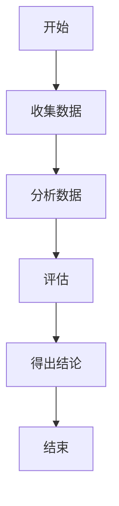
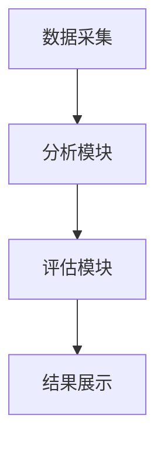
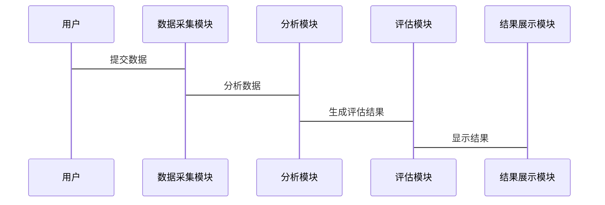

                 


# 费雪的创新评估体系：应对颠覆性技术的影响

## 关键词：创新评估体系，颠覆性技术，费雪模型，系统架构，项目实战

## 摘要：费雪的创新评估体系是一种用于应对颠覆性技术影响的系统化方法。本文将从背景、核心概念、数学模型、系统架构到项目实战，全面介绍该体系的构建与应用。

---

# 第1章: 创新评估体系的背景与问题背景

## 1.1 创新与技术进步的关系

### 1.1.1 创新与技术进步的定义

创新是指引入新的思想、方法、产品或服务，而技术进步则是指技术的改进和升级。两者的结合推动了社会的发展。

### 1.1.2 颠覆性技术的定义与特征

颠覆性技术是指能够改变现有市场格局的技术，通常具有低成本、高效率的特点。

## 1.2 颠覆性技术的影响

### 1.2.1 颠覆性技术对行业的影响

颠覆性技术可能导致行业重组，改变市场结构。

### 1.2.2 颠覆性技术对企业的挑战

企业需要快速适应新技术带来的变化，否则可能被淘汰。

### 1.2.3 费雪创新评估体系的提出背景

为应对颠覆性技术的影响，费雪提出了创新评估体系，帮助企业提前识别和应对潜在威胁。

---

# 第2章: 费雪创新评估体系的核心概念

## 2.1 创新评估体系的定义

### 2.1.1 创新评估的基本概念

创新评估是对新技术的潜力、可行性进行分析。

### 2.1.2 费雪创新评估体系的框架

包括技术可行性、市场潜力、商业模式和竞争环境四个维度。

### 2.1.3 创新评估的核心要素

技术、市场、商业模式和竞争环境是创新评估的四个核心要素。

## 2.2 费雪创新评估体系的指标与维度

### 2.2.1 技术可行性评估

评估技术的成熟度和可行性。

### 2.2.2 市场潜力评估

分析市场的大小和增长潜力。

### 2.2.3 商业模式可行性评估

评估商业模式的可行性和盈利潜力。

### 2.2.4 竞争环境评估

分析竞争环境和潜在威胁。

## 2.3 费雪创新评估体系的流程与方法

### 2.3.1 创新评估的基本流程

包括数据收集、分析、评估和建议四个步骤。

### 2.3.2 费雪评估方法的具体步骤

详细描述评估的具体步骤和方法。

### 2.3.3 创新评估的工具与技术

介绍常用的评估工具和技术。

---

# 第3章: 费雪创新评估体系的数学模型与算法原理

## 3.1 创新评估的数学模型

### 3.1.1 费雪创新评估模型的数学表达

$$创新潜力 = \alpha \cdot 技术可行性 + \beta \cdot 市场潜力 + \gamma \cdot 商业模式可行性 + \delta \cdot 竞争环境$$

### 3.1.2 创新潜力指数的计算公式

$$创新潜力指数 = \frac{\text{创新潜力}}{\text{基准值}} \times 100$$

### 3.1.3 技术成熟度评估的数学模型

$$技术成熟度 = \frac{\text{已实现功能}}{\text{总功能}} \times 100$$

## 3.2 算法原理与流程图

### 3.2.1 费雪创新评估算法的流程图



### 3.2.2 创新潜力评估的权重分配

权重分配基于各因素的重要性，技术可行性权重最大。

### 3.2.3 创新评估结果的可视化

使用柱状图或雷达图展示评估结果。

---

# 第4章: 费雪创新评估体系的系统架构与设计

## 4.1 系统架构设计

### 4.1.1 费雪创新评估系统的模块划分

包括数据采集模块、分析模块、评估模块和结果展示模块。

### 4.1.2 系统功能模块的交互设计

描述各模块之间的交互流程。

### 4.1.3 系统架构的mermaid图



## 4.2 系统功能设计

### 4.2.1 用户需求分析

确定用户需求和功能需求。

### 4.2.2 系统功能设计的领域模型

使用类图展示系统功能。

### 4.2.3 系统功能的详细设计

详细描述每个功能模块的实现细节。

## 4.3 系统接口与交互设计

### 4.3.1 系统接口的设计规范

定义API接口的输入和输出。

### 4.3.2 系统交互的序列图



---

# 第5章: 费雪创新评估体系的项目实战

## 5.1 项目环境搭建

### 5.1.1 开发环境的安装与配置

安装Python、Jupyter Notebook等工具。

### 5.1.2 项目所需工具的安装

安装必要的库，如pandas、numpy等。

### 5.1.3 数据集的准备与预处理

收集和整理相关数据，进行清洗和转换。

## 5.2 系统核心实现

### 5.2.1 数据预处理

使用Python代码对数据进行清洗和转换。

```python
import pandas as pd
data = pd.read_csv('data.csv')
data_clean = data.dropna()
```

### 5.2.2 模型训练

训练创新潜力评估模型。

```python
from sklearn.linear_model import LinearRegression
model = LinearRegression()
model.fit(X_train, y_train)
```

### 5.2.3 结果分析与解读

分析模型输出结果，并进行解读。

### 5.2.4 案例分析

通过具体案例分析模型的应用效果。

---

# 第6章: 应对颠覆性技术的策略与展望

## 6.1 应对颠覆性技术的策略

### 6.1.1 颠覆性技术的识别

通过市场调研和技术分析识别潜在的颠覆性技术。

### 6.1.2 颠覆性技术的评估

使用费雪创新评估体系进行评估。

### 6.1.3 制定应对策略

根据评估结果制定相应的战略。

## 6.2 未来展望

随着技术的发展，创新评估体系需要不断更新和改进。

---

# 小结

费雪创新评估体系是一种有效的工具，帮助企业应对颠覆性技术的影响。通过系统的评估和分析，企业可以更好地把握市场机会，制定合理的战略。

---

# 作者：AI天才研究院 & 禅与计算机程序设计艺术

---

这篇文章详细介绍了费雪创新评估体系的各个方面，从背景到系统架构，再到项目实战，为应对颠覆性技术的影响提供了系统的解决方案。

