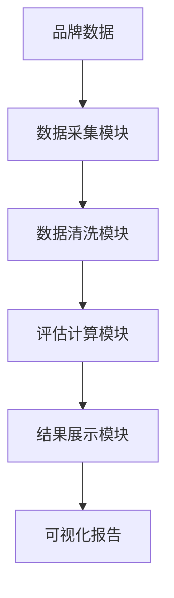

                 


# 费雪的品牌价值评估

> 关键词：品牌价值评估，费雪方法，品牌资产，品牌忠诚度，品牌知名度，数学模型，系统架构

> 摘要：本文详细介绍了费雪的品牌价值评估方法，从理论基础到数学模型，从系统设计到项目实战，全面解析品牌价值评估的核心概念、评估方法、系统架构及实际应用。通过丰富的案例和详细的代码实现，帮助读者掌握品牌价值评估的核心技巧。

---

# 第一部分：品牌价值评估的背景与概念

## 第1章：品牌价值评估的背景与重要性

### 1.1 品牌价值评估的定义与意义

品牌价值是衡量企业无形资产的重要指标，反映了品牌在市场中的竞争力和消费者心中的地位。准确评估品牌价值，可以帮助企业制定科学的市场策略、优化资源配置并提升品牌影响力。

### 1.2 费雪评估方法的独特性

费雪方法是一种结合定量分析与定性评估的综合品牌价值评估方法，特别适用于数据驱动的品牌管理。它不仅考虑了品牌的市场表现，还涵盖了消费者认知和情感因素。

---

# 第二部分：费雪的品牌价值评估方法

## 第2章：费雪评估的核心概念与指标

### 2.1 品牌资产的构成要素

品牌资产由品牌知名度、美誉度和忠诚度三部分构成。通过表格对比，我们可以清晰地看到每个指标的特征：

| 指标 | 特征 | 描述 |
|------|------|------|
| 品牌知名度 | 客观性 | 品牌在市场中的普及程度 |
| 品牌美誉度 | 情感性 | 消费者对品牌的满意程度 |
| 品牌忠诚度 | 行为性 | 消费者重复购买意愿 |

### 2.2 品牌价值的数学模型

费雪评估方法的数学模型如下：

$$
品牌价值 = \sum (权重_i \times 评分_i)
$$

其中，权重_i是各指标的权重，评分_i是各指标的评分。

---

## 第3章：品牌价值评估的系统架构

### 3.1 系统功能设计

一个完整的品牌价值评估系统应包括：

- 数据采集模块：收集品牌相关数据。
- 评估计算模块：基于费雪方法计算品牌价值。
- 结果展示模块：以图表形式展示评估结果。

### 3.2 系统架构设计

以下是系统架构的Mermaid图：



---

## 第4章：项目实战

### 4.1 环境配置与工具安装

- **Python环境**：安装Anaconda或Miniconda。
- **数据分析工具**：安装Pandas、NumPy、Matplotlib等库。
- **开发工具**：推荐使用Jupyter Notebook进行开发。

### 4.2 核心代码实现

以下是一个基于费雪方法的Python代码示例：

```python
import pandas as pd
import numpy as np

# 数据准备
data = {
    '品牌': ['A', 'B', 'C'],
    '知名度': [85, 70, 90],
    '美誉度': [90, 80, 85],
    '忠诚度': [75, 65, 95]
}

df = pd.DataFrame(data)

# 定义权重
weights = {'知名度': 0.4, '美誉度': 0.3, '忠诚度': 0.3}

# 计算品牌价值
brand_value = []
for i in range(len(df)):
    value = 0
    for key in weights:
        value += df.iloc[i][key] * weights[key]
    brand_value.append(value)

# 输出结果
print(df['品牌'], brand_value)
```

### 4.3 案例分析

以品牌A为例，计算其品牌价值：

- 知名度：85
- 美誉度：90
- 忠诚度：75

$$
品牌价值 = (0.4 \times 85) + (0.3 \times 90) + (0.3 \times 75) = 34 + 27 + 22.5 = 83.5
$$

---

## 第5章：最佳实践与总结

### 5.1 最佳实践 Tips

1. 数据来源必须准确，确保评估结果的可靠性。
2. 模型选择要考虑实际应用场景，避免过度复杂化。
3. 持续优化模型，结合市场变化进行调整。

### 5.2 小结

费雪的品牌价值评估方法通过定量分析与定性评估的结合，为企业提供了科学的品牌价值评估工具。通过本文的详细解析和代码实现，读者可以掌握该方法的核心思想，并在实际应用中灵活运用。

---

# 作者

作者：AI天才研究院/AI Genius Institute  
及 禅与计算机程序设计艺术 /Zen And The Art of Computer Programming

