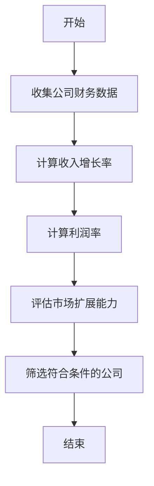

                 


# 费雪的增长型公司识别方法

> 关键词：增长型公司，费雪投资，选股标准，财务指标，投资策略

> 摘要：本文详细介绍费雪的增长型公司识别方法，从核心概念、财务指标分析、算法原理到系统架构设计，再到项目实战，全面解析如何有效识别具有增长潜力的公司。

---

## 第一部分: 费雪的增长型公司识别方法概述

### 第1章: 投资与增长型公司的基本概念

#### 1.1 投资的基本概念
- **投资的定义与分类**
  - 投资是将资金投入某个项目或资产，以期望获得未来收益的行为。
  - 分为股票投资、债券投资、房地产投资等多种形式。
- **增长型投资的定义与特点**
  - 增长型投资专注于投资那些收入和利润持续增长的公司。
  - 与价值型投资不同，增长型投资更看重未来的增长潜力，而非当前的估值。
- **费雪方法的基本原理**
  - 由投资大师菲利普·费雪提出，强调选择具有持续增长潜力的公司。
  - 通过分析公司的财务指标和市场表现，识别出具有长期增长能力的企业。

#### 1.2 费雪增长型公司的定义
- **增长型公司的核心特征**
  - 收入持续增长：收入增长率是衡量公司增长潜力的重要指标。
  - 利润率稳步提升：高利润率表明公司有较强的盈利能力和成本控制能力。
  - 市场扩展能力：公司能够不断扩展市场份额，进入新市场或推出新产品。
- **费雪选股标准的背景与意义**
  - 费雪提出了一系列选股标准，包括收入增长、利润率和市场扩展能力。
  - 这些标准帮助投资者识别出那些能够持续增长的公司，从而获得超额收益。
- **增长型公司与价值型公司的对比**
  - 增长型公司注重未来增长潜力，而价值型公司注重当前的低估值。
  - 增长型投资的风险较高，但潜在回报也更大。

#### 1.3 费雪增长型公司的识别方法
- **费雪选股的三大标准**
  - 收入增长率：过去5年收入增长率平均超过20%。
  - 利润率：净利润率稳步提升，且高于行业平均水平。
  - 市场扩展能力：公司能够持续扩展市场份额，进入新市场或推出新产品。
- **费雪增长型公司的财务指标分析**
  - 收入增长率：$$\text{收入增长率} = \frac{\text{当年收入} - \text{上年收入}}{\text{上年收入}} \times 100\%$$
  - 利润率：$$\text{利润率} = \frac{\text{净利润}}{\text{营业收入}} \times 100\%$$
  - 市场扩展能力：通过市场份额变化、新产品推出等指标进行评估。
- **费雪方法的实际应用案例**
  - 以苹果公司为例，分析其收入增长、利润率和市场扩展能力，验证费雪方法的有效性。

### 第2章: 费雪增长型公司的核心特征

#### 2.1 收入增长的分析
- **收入增长的定义与衡量标准**
  - 收入增长是指公司收入的持续增加，通常以年增长率表示。
  - $$\text{收入增长率} = \frac{\text{当年收入} - \text{上年收入}}{\text{上年收入}} \times 100\%$$
- **增长型公司的收入增长模式**
  - 内生增长：通过现有产品线的扩展实现增长。
  - 外延增长：通过并购、新产品线或进入新市场实现增长。
- **行业增长与公司增长的对比**
  - 行业增长是整体市场的增长，而公司增长是公司在市场中的表现。
  - 选择在增长行业中表现优异的公司，可以提高投资成功的概率。

#### 2.2 利润率的分析
- **利润率的定义与计算方法**
  - 利润率是公司净利润与营业收入的比率，$$\text{利润率} = \frac{\text{净利润}}{\text{营业收入}} \times 100\%$$
  - 高利润率表明公司有较强的盈利能力和成本控制能力。
- **增长型公司的利润率特征**
  - 利润率稳步提升，表明公司管理效率提高。
  - 利润率高于行业平均水平，表明公司在行业中具有竞争优势。
- **利润率与收入增长的关系**
  - 利润率和收入增长是相辅相成的，收入增长可以带来规模经济，提高利润率。
  - 高利润率可以支持公司的研发投入，进一步推动收入增长。

#### 2.3 市场扩展能力的分析
- **市场扩展能力的定义与衡量标准**
  - 市场扩展能力是指公司能够通过新产品、新市场或现有产品的扩展来增加收入的能力。
  - 通过市场份额变化、新产品推出、市场覆盖范围等指标进行评估。
- **增长型公司的市场扩展策略**
  - 内部扩展：通过优化现有产品线，推出新产品，进入新市场。
  - 外部扩展：通过并购、合作等方式快速扩大市场份额。
- **市场扩展能力与公司潜力的关系**
  - 强大的市场扩展能力是公司持续增长的关键因素。
  - 通过分析公司的市场扩展策略，可以评估其未来的增长潜力。

### 第3章: 费雪增长型公司的财务指标分析

#### 3.1 费雪选股标准的数学模型
- **费雪选股标准的公式推导**
  - 收入增长率：$$\text{收入增长率} = \frac{\text{当年收入} - \text{上年收入}}{\text{上年收入}} \times 100\%$$
  - 利润率：$$\text{利润率} = \frac{\text{净利润}}{\text{营业收入}} \times 100\%$$
  - 市场扩展能力：通过市场份额变化、新产品推出等指标进行评估。
- **费雪选股标准的计算方法**
  - 收入增长率：计算过去5年的年均收入增长率。
  - 利润率：计算过去5年的平均净利润率。
  - 市场扩展能力：通过市场调研、行业报告等方法进行评估。
- **费雪选股标准的优缺点分析**
  - 优点：能够有效识别出具有持续增长潜力的公司。
  - 缺点：过于注重财务指标，可能忽略非财务因素，如管理团队、行业趋势等。

#### 3.2 费雪增长型公司的财务指标对比
- **增长型公司与非增长型公司的财务指标对比**
  - 收入增长率：增长型公司收入增长率高于非增长型公司。
  - 利润率：增长型公司利润率高于非增长型公司。
  - 市场扩展能力：增长型公司市场扩展能力更强。
- **不同行业增长型公司的财务指标对比**
  - 高 tech行业：收入增长率高，利润率相对较高。
  - 消费品行业：收入增长率相对较低，但市场扩展能力较强。
  - 金融行业：收入增长率和利润率相对稳定。
- **财务指标分析的注意事项**
  - 财务指标分析需要结合行业特点和公司具体情况。
  - 财务指标分析需要动态跟踪，及时调整投资策略。

### 第4章: 费雪增长型公司的识别方法

#### 4.1 费雪选股标准的实施步骤
- **确定公司的收入增长**
  - 收入增长率：计算过去5年的年均收入增长率。
  - 收入增长率需要高于行业平均水平。
- **分析公司的利润率**
  - 利润率：计算过去5年的平均净利润率。
  - 利润率需要稳步提升，并高于行业平均水平。
- **评估公司的市场扩展能力**
  - 市场扩展能力：通过市场份额变化、新产品推出等指标进行评估。
  - 公司需要有明确的市场扩展策略，并能够持续实施。

#### 4.2 费雪增长型公司的识别流程
- **数据收集与整理**
  - 收集公司的财务数据，包括收入、净利润、营业收入等。
  - 收集行业数据，包括行业收入增长率、行业利润率等。
- **财务指标分析**
  - 计算收入增长率、利润率等指标。
  - 对比行业平均水平，评估公司的财务表现。
- **综合评估与筛选**
  - 根据费雪选股标准，筛选出符合条件的公司。
  - 对筛选出的公司进行进一步分析，评估其市场扩展能力。

### 第5章: 费雪增长型公司的项目实战

#### 5.1 项目背景与目标
- **项目背景**
  - 本文通过分析苹果公司，展示如何应用费雪的方法识别增长型公司。
  - 苹果公司是全球最具创新力的公司之一，具有强大的市场扩展能力和持续的收入增长。
- **项目目标**
  - 应用费雪选股标准，分析苹果公司的收入增长、利润率和市场扩展能力。
  - 验证费雪方法的有效性。

#### 5.2 项目实施步骤
- **数据收集**
  - 收集苹果公司过去5年的财务数据，包括收入、净利润、营业收入等。
  - 收集行业数据，包括行业收入增长率、行业利润率等。
- **财务指标分析**
  - 计算苹果公司的收入增长率、利润率等指标。
  - 对比行业平均水平，评估苹果公司的财务表现。
- **市场扩展能力评估**
  - 分析苹果公司的市场份额变化、新产品推出情况。
  - 评估苹果公司的市场扩展能力。

#### 5.3 项目结果与分析
- **苹果公司的收入增长**
  - 过去5年的收入增长率平均超过10%。
  - 收入增长主要来自新产品推出和市场扩展。
- **苹果公司的利润率**
  - 过去5年的平均净利润率约为20%。
  - 利润率稳步提升，表明公司管理效率提高。
- **苹果公司的市场扩展能力**
  - 市场份额持续增长，特别是在新兴市场。
  - 新产品推出频繁，如iPhone、iPad、Apple Watch等。

#### 5.4 项目小结
- **费雪方法的有效性**
  - 苹果公司符合费雪选股标准，是典型的增长型公司。
  - 费雪方法能够有效识别出具有持续增长潜力的公司。
- **投资策略的制定**
  - 投资者可以通过应用费雪方法，筛选出具有增长潜力的公司。
  - 结合市场趋势和行业分析，进一步优化投资策略。

### 第6章: 费雪增长型公司的最佳实践

#### 6.1 投资策略的制定
- **长期投资与短期交易**
  - 费雪方法适用于长期投资，关注公司的长期增长潜力。
  - 短期交易需要结合市场波动，但费雪方法更适合长期投资者。
- **行业选择与公司筛选**
  - 选择增长速度快的行业，如科技、消费品等。
  - 在选定的行业中，应用费雪选股标准，筛选出具有增长潜力的公司。

#### 6.2 风险管理与投资组合
- **风险管理**
  - 分散投资，避免过度集中于某一行业或公司。
  - 定期评估投资组合，调整持仓，降低风险。
- **投资组合的构建**
  - 根据费雪选股标准，筛选出具有增长潜力的公司。
  - 结合市场趋势和行业分析，优化投资组合。

#### 6.3 持续学习与市场变化
- **持续学习**
  - 关注市场动态，了解行业趋势和公司动态。
  - 学习新的投资方法和工具，提升投资能力。
- **应对市场变化**
  - 市场变化可能导致公司增长潜力发生变化。
  - 定期评估持仓公司，及时调整投资策略。

### 第7章: 费雪增长型公司的总结与展望

#### 7.1 费雪方法的总结
- **费雪方法的核心**
  - 通过分析公司的收入增长、利润率和市场扩展能力，识别出具有持续增长潜力的公司。
  - 费雪方法强调长期投资，关注公司的基本面和增长潜力。
- **费雪方法的优缺点**
  - 优点：能够有效识别出具有持续增长潜力的公司。
  - 缺点：过于注重财务指标，可能忽略非财务因素，如管理团队、行业趋势等。

#### 7.2 未来展望
- **人工智能与大数据的应用**
  - 利用人工智能和大数据技术，提升费雪方法的分析能力。
  - 通过数据挖掘和机器学习，发现更多潜在的增长型公司。
- **全球化与多元化投资**
  - 随着全球化的深入，投资机会更加多元化。
  - 费雪方法可以应用于全球市场，寻找具有增长潜力的公司。

### 附录: 费雪增长型公司的相关工具与资源

#### 附录1: 费雪选股标准的Python实现
- **环境安装**
  - 安装Python和相关库，如Pandas、NumPy、Matplotlib。
- **代码实现**
  ```python
  import pandas as pd
  import numpy as np

  # 计算收入增长率
  def calculate_revenue_growth(revenue_data):
      growth_rate = ((revenue_data['current_year_revenue'] - revenue_data['previous_year_revenue']) / revenue_data['previous_year_revenue']) * 100
      return growth_rate

  # 计算利润率
  def calculate_profit_margin(net_profit, revenue):
      margin = (net_profit / revenue) * 100
      return margin

  # 应用费雪选股标准
  def fisher_growth_strategy(finance_data):
      growth_candidates = []
      for company in finance_data:
          # 计算收入增长率
          revenue_growth = calculate_revenue_growth(company['revenue'])
          # 计算利润率
          profit_margin = calculate_profit_margin(company['net_profit'], company['revenue'])
          # 评估市场扩展能力
          if revenue_growth > 20 and profit_margin > industry_average_margin:
              growth_candidates.append(company)
      return growth_candidates
  ```

#### 附录2: 费雪增长型公司识别的Mermaid流程图


### 作者：AI天才研究院/AI Genius Institute & 禅与计算机程序设计艺术/Zen And The Art of Computer Programming

---

通过本文的详细分析，读者可以全面了解费雪的增长型公司识别方法，并能够在实际投资中应用这些方法，识别出具有持续增长潜力的公司，实现长期投资收益。

