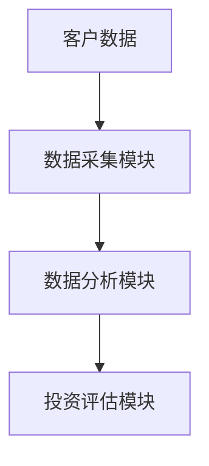
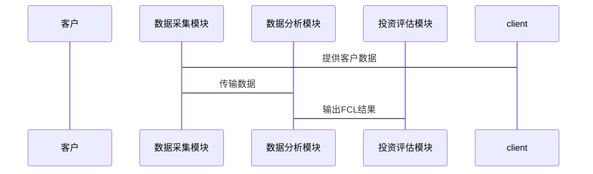

                 


# 费雪的客户忠诚度分析在投资中的应用

> 关键词：费雪客户忠诚度分析，投资分析，客户忠诚度，投资回报，企业估值，客户生命周期

> 摘要：本文深入探讨了费雪的客户忠诚度分析在投资中的应用，从理论基础、算法原理、系统架构到实际案例，全面解析了如何通过客户忠诚度评估企业投资价值，优化投资策略。

---

# 第一部分：客户忠诚度分析的背景与基础

## 第1章：客户忠诚度分析的背景与意义

### 1.1 费雪客户忠诚度分析的背景

- **客户忠诚度的定义**：客户忠诚度是指客户对企业产品或服务的持续购买和使用意愿，是客户满意度的长期结果。
- **投资分析的演变**：传统的投资分析方法主要关注财务指标，而费雪客户忠诚度分析则引入客户行为和心理因素，提供了更全面的评估维度。
- **费雪分析的核心理念**：通过分析客户的忠诚度，评估企业的长期盈利能力，从而优化投资决策。

### 1.2 费雪客户忠诚度分析的意义

- **客户忠诚度与企业价值的关系**：忠诚客户能够为企业带来稳定的收入流和更高的利润，同时降低客户获取成本。
- **投资决策的优化**：通过费雪分析，投资者可以更准确地评估企业的长期发展潜力，从而做出更明智的投资决策。

### 1.3 费雪分析的适用场景

- **企业估值**：在企业估值中，费雪分析可以帮助投资者更准确地评估企业的未来收益。
- **投资组合优化**：通过分析客户忠诚度，投资者可以优化投资组合，选择更具成长潜力的企业。
- **风险评估**：客户忠诚度高的企业通常具有更强的抗风险能力，能够在市场波动中保持稳定。

## 第2章：客户忠诚度分析的核心要素

### 2.1 客户生命周期与忠诚度

- **客户生命周期的定义**：客户从首次购买到最终流失的整个过程。
- **忠诚度与生命周期的关系**：客户在生命周期的不同阶段，忠诚度的表现不同，需要针对性地进行分析。

### 2.2 客户满意度与忠诚度

- **客户满意度的定义**：客户对产品或服务的满意程度，是忠诚度的基础。
- **满意度与忠诚度的关联**：高满意度的客户更有可能成为忠诚客户，但高满意度并不必然导致忠诚。

### 2.3 费雪分析的指标体系

- **核心指标**：客户保留率、客户购买频率、客户生命周期价值等。
- **指标权重**：根据行业特点，确定各指标的权重，进行综合评估。

---

# 第二部分：费雪客户忠诚度分析的理论与算法

## 第3章：费雪客户忠诚度分析的理论基础

### 3.1 费雪分析的原理

- **基本假设**：客户忠诚度是企业长期盈利能力的重要驱动因素。
- **数学模型**：通过客户忠诚度指数（FCL Index）评估企业的投资价值。

### 3.2 费雪分析与传统投资分析的对比

- **传统分析方法的局限性**：传统方法主要关注财务指标，忽视客户行为和心理因素。
- **费雪分析的独特优势**：引入客户忠诚度因素，提供更全面的评估视角。

## 第4章：费雪客户忠诚度分析的数学模型

### 4.1 费雪忠诚度指数的公式推导

$$
FCL = \frac{C}{P} \times \left(1 + \frac{L}{T}\right)
$$

其中：
- $C$ 表示客户忠诚度评分
- $P$ 表示客户满意度评分
- $L$ 表示客户生命周期长度
- $T$ 表示市场平均生命周期

### 4.2 费雪分析的算法流程

1. 收集客户数据，包括购买频率、满意度评分等。
2. 计算客户忠诚度指数（FCL）。
3. 根据FCL对客户进行分类，评估企业投资价值。

---

# 第三部分：费雪客户忠诚度分析的系统架构与应用

## 第5章：系统架构与设计

### 5.1 系统功能设计

- **数据采集模块**：收集客户行为数据。
- **数据分析模块**：计算客户忠诚度指数。
- **投资评估模块**：根据FCL评估企业投资价值。

### 5.2 系统架构图



### 5.3 系统交互流程



## 第6章：项目实战与案例分析

### 6.1 项目环境安装

- **工具安装**：安装Python、Pandas、Matplotlib等工具。
- **数据获取**：收集客户数据，包括购买记录、满意度评分等。

### 6.2 核心代码实现

```python
import pandas as pd
import numpy as np

def fisher_cl_index(customers):
    C = customers['loyalty_score']
    P = customers['satisfaction_score']
    L = customers['lifetime']
    T = customers['market_lifetime']
    FCL = (C / P) * (1 + (L / T))
    return FCL

# 示例数据
data = {
    'loyalty_score': [0.8, 0.9, 0.7],
    'satisfaction_score': [0.8, 0.7, 0.9],
    'lifetime': [3, 4, 2],
    'market_lifetime': [2, 3, 3]
}
customers = pd.DataFrame(data)

# 计算FCL
FCL = fisher_cl_index(customers)
print(FCL)
```

### 6.3 案例分析

- **案例背景**：某零售企业希望评估其客户忠诚度，优化投资策略。
- **数据分析**：通过费雪分析，计算客户忠诚度指数，识别高忠诚度客户。
- **投资建议**：基于FCL结果，优化投资组合，选择具有高忠诚度客户的业务部门进行投资。

---

# 第四部分：总结与展望

## 第7章：总结与展望

### 7.1 本章总结

- **费雪客户忠诚度分析的核心内容**：通过客户忠诚度指数评估企业投资价值。
- **实际应用价值**：帮助企业优化投资策略，提升长期盈利能力。

### 7.2 未来展望

- **智能化发展**：结合人工智能技术，提升费雪分析的精准度。
- **多维度分析**：引入更多客户行为数据，提升分析的全面性。

## 第8章：最佳实践与注意事项

### 8.1 最佳实践

- **数据质量**：确保数据的准确性和完整性。
- **模型优化**：根据实际情况，动态调整模型参数。

### 8.2 注意事项

- **行业差异**：不同行业客户忠诚度的影响因素不同，需针对性分析。
- **数据隐私**：在数据采集和分析过程中，注意保护客户隐私。

---

# 作者

作者：AI天才研究院/AI Genius Institute & 禅与计算机程序设计艺术 /Zen And The Art of Computer Programming

---

**注**：以上目录和内容仅为示例，实际撰写时需要根据具体需求进一步扩展和完善。

