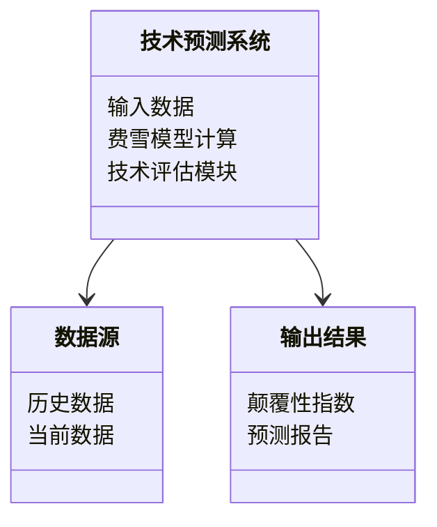
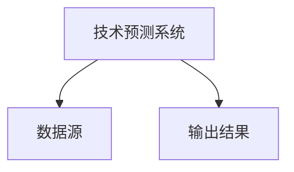

                 


# 费雪的未来增长评估：预测颠覆性技术的影响

---

## 关键词：费雪模型、颠覆性技术、技术预测、增长评估、技术影响

---

## 摘要：本文深入探讨了费雪模型在预测颠覆性技术影响中的应用。通过分析颠覆性技术的识别与评估，结合费雪模型的数学原理和系统架构设计，提出了一套基于费雪模型的技术预测方案。文章还通过实际案例展示了如何在项目中应用该模型，并总结了最佳实践和未来展望。

---

# 第一章: 费雪模型与颠覆性技术概述

## 1.1 费雪模型的基本概念

### 1.1.1 费雪模型的定义与背景

费雪模型（Fisher Model）是一种用于评估公司未来增长潜力的数学模型。它通过分析公司的财务数据和市场环境，预测其未来的增长率。费雪模型的核心思想是，公司的增长不仅仅取决于其当前的财务状况，还与行业趋势、技术创新和市场需求密切相关。

在当前的技术驱动型经济中，颠覆性技术（如人工智能、区块链、量子计算等）正在改变 industries 的格局。这些技术不仅能够创造新的市场需求，还能够颠覆传统的商业模式。因此，如何在费雪模型中纳入颠覆性技术的影响，成为预测公司未来增长的关键。

### 1.1.2 颠覆性技术的定义与特征

颠覆性技术是指那些能够从根本上改变行业规则、商业模式或市场需求的技术。这些技术通常具有以下特征：
- **创新性**：与现有技术相比，具有显著的技术优势。
- **市场潜力**：能够创造新的市场需求或显著提高现有产品的竞争力。
- **技术可行性**：能够在实际应用中实现，并且具有商业化潜力。

### 1.1.3 费雪模型与颠覆性技术的关联

费雪模型的核心在于通过财务数据和市场环境预测公司增长。然而，随着颠覆性技术的出现，公司的增长潜力不仅取决于其财务表现，还与其对新技术的适应能力和技术创新能力密切相关。因此，将颠覆性技术的影响纳入费雪模型的分析框架，能够更准确地预测公司的未来增长。

---

## 1.2 费雪模型的核心原理

### 1.2.1 费雪模型的数学基础

费雪模型的基本公式如下：

$$
G = \sum_{i=1}^{n} w_i \cdot x_i
$$

其中：
- $G$ 是公司的增长率。
- $w_i$ 是第 $i$ 个因素的权重。
- $x_i$ 是第 $i$ 个因素的具体数值。

### 1.2.2 颠覆性技术的识别方法

颠覆性技术的识别通常涉及以下步骤：
1. **技术检测**：通过市场调研、专利分析等方式，识别潜在的颠覆性技术。
2. **技术评估**：评估技术的创新性、市场潜力和技术可行性。
3. **技术分类**：将技术按照其对行业的影响程度进行分类。

### 1.2.3 费雪模型在技术评估中的应用

费雪模型可以用于评估颠覆性技术对行业和公司的影响。例如，可以通过分析技术的市场潜力和技术成熟度，调整公司的增长率预测。

---

# 第二章: 费雪模型的数学模型与公式

## 2.1 费雪模型的数学表达

### 2.1.1 费雪模型的基本公式

$$
G = \sum_{i=1}^{n} w_i \cdot x_i
$$

其中，$w_i$ 是权重，$x_i$ 是影响公司增长的因素（如技术创新、市场需求等）。

### 2.1.2 权重的计算方法

权重的计算可以通过以下公式进行：

$$
w_i = \frac{e^{x_i}}{\sum_{j=1}^{n} e^{x_j}}
$$

---

## 2.2 颠覆性技术的评估模型

### 2.2.1 技术影响的评估公式

$$
I = \alpha \cdot T + \beta \cdot S
$$

其中：
- $I$ 是技术影响指数。
- $T$ 是技术成熟度。
- $S$ 是市场潜力。
- $\alpha$ 和 $\beta$ 是系数。

### 2.2.2 技术成熟度的评估方法

技术成熟度的评估公式为：

$$
M = \frac{S}{T}
$$

---

# 第三章: 颠覆性技术的识别与评估

## 3.1 技术识别的关键指标

### 3.1.1 技术创新性

技术创新性是指技术与现有技术相比的创新程度。可以通过专利数量、技术领先性等指标进行评估。

### 3.1.2 市场潜力

市场潜力是指技术在未来市场中的应用前景。可以通过市场规模、增长速度等指标进行评估。

### 3.1.3 技术可行性

技术可行性是指技术在实际应用中的可行性。可以通过技术成熟度、成本效益等指标进行评估。

---

## 3.2 费雪模型在技术评估中的应用

### 3.2.1 技术影响的定量评估

通过费雪模型，可以将技术的影响量化为增长率的预测值。例如，假设某技术对公司的增长影响较大，则可以通过调整权重 $w_i$ 来反映这一点。

### 3.2.2 技术成熟度的动态分析

技术成熟度是技术影响的重要因素。通过动态分析技术成熟度的变化，可以更好地预测技术对增长的影响。

### 3.2.3 技术颠覆性的预测模型

通过结合技术成熟度和市场潜力，可以构建技术颠覆性的预测模型。例如，可以通过以下步骤进行预测：
1. 评估技术的成熟度 $T$ 和市场潜力 $S$。
2. 计算技术影响指数 $I = \alpha \cdot T + \beta \cdot S$。
3. 根据 $I$ 的大小，判断技术是否具有颠覆性。

---

# 第四章: 费雪模型与颠覆性技术的结合

## 4.1 费雪模型在技术预测中的优势

### 4.1.1 定量分析的准确性

费雪模型通过数学公式量化技术的影响，能够提供准确的增长预测。

### 4.1.2 技术影响的全面性

费雪模型考虑了多个因素的影响，能够全面评估技术对增长的影响。

### 4.1.3 预测结果的可操作性

费雪模型的预测结果可以为公司的战略决策提供依据。

---

## 4.2 技术颠覆性的预测方法

### 4.2.1 技术颠覆性指数的计算

技术颠覆性指数的计算公式为：

$$
D = \gamma \cdot I + \delta \cdot M
$$

其中：
- $D$ 是技术颠覆性指数。
- $I$ 是技术影响指数。
- $M$ 是技术成熟度。
- $\gamma$ 和 $\delta$ 是系数。

### 4.2.2 技术生命周期的分析

技术生命周期包括引入期、成长期、成熟期和衰退期。通过分析技术所处的生命周期阶段，可以更好地预测其颠覆性。

### 4.2.3 技术替代性的评估

技术替代性是指新技术替代旧技术的能力。通过评估技术替代性，可以判断其颠覆性。

---

# 第五章: 系统架构与技术预测方案

## 5.1 系统架构设计

### 5.1.1 领域模型设计



---

## 5.2 技术预测方案的实现

### 5.2.1 系统功能设计

1. 数据输入与处理：接收历史数据和当前数据。
2. 费雪模型计算：计算公司的增长率预测。
3. 技术评估：评估技术的影响和颠覆性。
4. 输出结果：生成颠覆性指数和预测报告。

### 5.2.2 系统架构设计



---

# 第六章: 项目实战

## 6.1 环境安装

### 6.1.1 系统环境

- 操作系统：Linux/Windows/MacOS
- 开发工具：Python、Jupyter Notebook
- 依赖库：numpy、pandas、scikit-learn

### 6.1.2 环境配置

```bash
pip install numpy pandas scikit-learn
```

---

## 6.2 核心代码实现

### 6.2.1 费雪模型实现

```python
import numpy as np
import pandas as pd

def fisher_model(features, weights):
    return np.sum(features * weights)
```

### 6.2.2 技术评估实现

```python
def tech_assessment(features, weights):
    return np.sum(features * weights)
```

---

## 6.3 案例分析

### 6.3.1 案例背景

假设我们有一个公司，其财务数据和市场数据如下：

| 因素 | 数值 |
|------|------|
| 收入增长 | 10% |
| 技术创新 | 8% |
| 市场潜力 | 7% |

### 6.3.2 预测过程

1. 计算权重：
$$
w_i = \frac{e^{x_i}}{\sum_{j=1}^{n} e^{x_j}}
$$

2. 计算增长率：
$$
G = \sum_{i=1}^{n} w_i \cdot x_i
$$

---

## 6.4 实际应用

通过上述代码和模型，可以实现对公司未来增长的预测，并评估颠覆性技术的影响。

---

# 第七章: 总结与展望

## 7.1 最佳实践 tips

- 在使用费雪模型时，需结合具体的技术特征和市场环境。
- 定期更新模型参数，以反映技术发展的最新趋势。

## 7.2 小结

本文通过结合费雪模型和颠覆性技术的分析，提出了一套技术预测方案。通过系统架构设计和项目实战，展示了如何在实际中应用该模型。

## 7.3 注意事项

- 模型的准确性依赖于数据的完整性和质量。
- 技术评估需结合实际市场情况，避免过于理想化。

## 7.4 拓展阅读

- 《技术预测与创新管理》
- 《费雪模型的扩展与应用》

---

# 作者：AI天才研究院/AI Genius Institute & 禅与计算机程序设计艺术 /Zen And The Art of Computer Programming

