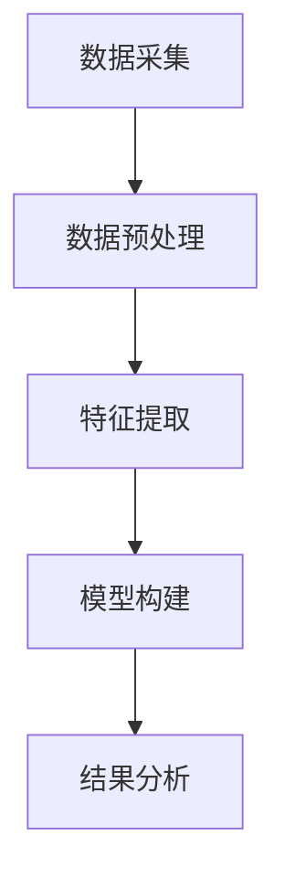

                 


# 费雪的研发投入分析：创新能力的指标

> 关键词：研发支出，创新能力，费雪分析，资本化，企业价值

> 摘要：本文深入探讨了费雪的研发投入分析方法，通过背景介绍、核心概念、数学模型、系统架构、项目实战等多维度分析，揭示了研发支出作为创新能力的指标的重要性，并通过具体案例展示了如何应用这些方法进行分析。

---

## 第一部分：研发投入分析的背景与概念

### 第1章：研发投入分析的基本概念

#### 1.1 研发投入的基本概念

##### 1.1.1 研发投入的定义与范围
研发支出（Research and Development Expenditure）是企业在研究与开发活动中所投入的资金，包括人员工资、设备采购、材料费用等。这些支出通常用于开发新产品、改进现有产品或提升生产效率。

##### 1.1.2 研发投入与企业创新的关系
研发投入是企业创新能力的核心驱动力。通过研发投入，企业能够开发新技术、新产品，从而在市场中获得竞争优势。研究表明，研发投入强度与企业的创新绩效呈正相关。

##### 1.1.3 研发投入的分类与衡量标准
研发投入可以分为内部研发支出和外部研发支出。内部研发支出是指企业内部的研发部门所产生的费用，而外部研发支出则是企业委托外部机构进行研发所支付的费用。衡量标准包括研发投入占销售收入的比例（研发强度）和研发投入资本化率。

---

#### 1.2 研发投入分析的必要性

##### 1.2.1 研发投入对企业竞争力的影响
研发投入决定了企业的技术储备和创新能力。高研发投入的企业通常在技术领先性和产品创新性方面具有竞争优势。

##### 1.2.2 研发投入对行业发展的意义
行业整体研发投入水平反映了行业的技术进步速度。高研发投入的行业通常具有更高的增长潜力和市场吸引力。

##### 1.2.3 研发投入与企业价值的关系
研发投入是企业价值的重要组成部分。高研发投入的企业通常具有更强的市场竞争力和长期增长潜力，从而能够获得更高的市场估值。

---

#### 1.3 研发投入分析的方法论

##### 1.3.1 费雪的研发投入分析方法
费雪（Fisher）提出，企业应将符合条件的研发支出资本化，而非将其全部费用化。资本化的条件包括：研发支出能够为企业带来长期经济利益，并且能够可靠地计量。

##### 1.3.2 表外研发投入分析法
表外分析法是将研发支出视为一种投资，而非费用。这种方法通过将研发支出资本化，能够更准确地反映企业的资产状况和未来盈利能力。

##### 1.3.3 其他相关分析方法的对比
传统的研发支出费用化方法与资本化方法在会计处理上存在显著差异。资本化方法能够更准确地反映企业的长期资产价值，而费用化方法则更注重当期损益的计算。

---

#### 1.4 研发投入分析的边界与外延

##### 1.4.1 研发投入的边界条件
研发投入的资本化需要满足一定的条件，如技术可行性、经济利益性和可计量性。

##### 1.4.2 研发投入的外延领域
研发投入的外延包括技术转移、技术合作和外部技术采购等。

##### 1.4.3 研发投入与其他财务指标的关系
研发投入与销售收入、净利润、资产总额等财务指标密切相关。通过分析这些指标之间的关系，可以更全面地评估企业的创新能力。

---

#### 1.5 研发投入分析的核心要素

##### 1.5.1 研发投入强度
研发投入强度是指研发支出占销售收入的比例，是衡量企业研发投入力度的重要指标。

##### 1.5.2 研发投入周期
研发投入周期是指从研发开始到最终产品商业化的时间跨度。周期长短与技术复杂性和市场需求密切相关。

##### 1.5.3 研发投入效率
研发投入效率是指单位研发投入所产生的创新产出，通常通过创新绩效指数来衡量。

---

## 第二部分：费雪的研发投入分析理论

### 第2章：费雪的研发投入分析方法

#### 2.1 费雪理论的核心观点

##### 2.1.1 费雪理论的提出背景
费雪理论提出于20世纪60年代，当时企业普遍将研发支出费用化，未能准确反映企业的技术积累和长期资产价值。

##### 2.1.2 费雪理论的核心假设
费雪理论认为，符合条件的研发支出应资本化，而非费用化。资本化条件包括技术可行性、经济利益性和可计量性。

##### 2.1.3 费雪理论的创新点
费雪理论首次将研发支出资本化，并提出了资本化条件和计量方法。

---

#### 2.2 费雪的研发投入分析模型

##### 2.2.1 模型的结构与功能
费雪模型通过将符合条件的研发支出资本化，能够更准确地反映企业的资产价值和未来盈利能力。

##### 2.2.2 模型的实现步骤
1. 数据收集：收集企业的研发支出数据。
2. 识别符合条件的支出：判断支出是否符合资本化条件。
3. 资本化处理：将符合条件的支出资本化。
4. 计算创新绩效指数：通过创新绩效指数衡量创新产出。

##### 2.2.3 模型的数学表达

$$
创新绩效指数 = \frac{\text{研发支出资本化率} \times \text{销售收入增长率}}{\text{行业平均研发支出资本化率}}
$$

---

## 第三部分：数学模型与系统架构

### 第3章：数学模型与系统架构

#### 3.1 数学模型

##### 3.1.1 模型的实现步骤
1. 数据预处理：清洗和整理研发支出数据。
2. 特征提取：提取研发支出相关的特征变量。
3. 建模：使用机器学习算法进行建模。
4. 模型验证：通过交叉验证评估模型性能。

##### 3.1.2 模型的数学表达

$$
\text{创新绩效指数} = \beta_0 + \beta_1 \times \text{研发支出} + \beta_2 \times \text{销售收入} + \epsilon
$$

其中，$\beta_0$ 是截距项，$\beta_1$ 和 $\beta_2$ 是回归系数，$\epsilon$ 是误差项。

---

## 第四部分：系统分析与架构设计

### 第4章：系统分析与架构设计

#### 4.1 系统功能设计

##### 4.1.1 系统功能模块
1. 数据采集模块：负责采集企业的研发支出数据。
2. 数据处理模块：对数据进行清洗和预处理。
3. 模型构建模块：基于费雪理论构建数学模型。
4. 结果分析模块：对模型结果进行解读和分析。

##### 4.1.2 系统功能流程



---

## 第五部分：项目实战

### 第5章：项目实战

#### 5.1 项目环境与工具安装

##### 5.1.1 环境要求
- Python 3.8+
- Jupyter Notebook
- Pandas、Scikit-learn

##### 5.1.2 工具安装
```bash
pip install pandas scikit-learn
```

---

## 结语

### 6.1 最佳实践 tips
- 定期更新模型参数，以适应市场变化。
- 结合行业特点，灵活调整分析方法。

### 6.2 小结
本文深入探讨了费雪的研发投入分析方法，通过理论分析、数学建模和系统设计，揭示了研发支出作为创新能力的指标的重要性。

### 6.3 注意事项
- 数据质量对分析结果影响重大，需谨慎处理。
- 模型结果需结合企业实际情况进行解读。

### 6.4 拓展阅读
- 费雪的其他相关著作。
- 现代资本预算理论与实践。

---

作者：AI天才研究院/AI Genius Institute & 禅与计算机程序设计艺术 /Zen And The Art of Computer Programming

