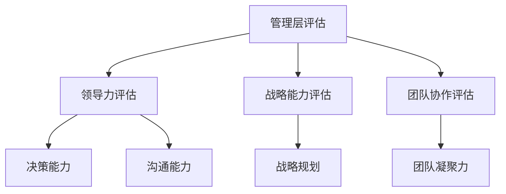

                 

# 费雪的管理层评估：优秀的公司需要优秀的领导

## 关键词：管理层评估，领导力，公司治理，费雪模型，管理优化

## 摘要：  
本文探讨了费雪的管理层评估方法，分析了如何通过优秀的领导力来提升公司绩效。文章详细介绍了费雪评估模型的构建、关键指标、评估方法，结合实际案例分析，展示了如何应用这些方法来优化公司管理。通过本文，读者将了解如何科学评估管理层，从而帮助公司实现可持续发展。

---

## 第一部分：管理层评估的背景与基础

### 第1章：管理层评估的背景与重要性

#### 1.1 管理层评估的定义与核心概念

管理层评估是对公司领导层的能力、绩效和潜在问题进行全面分析的过程。其核心在于通过科学的方法，识别管理层的优势与不足，从而优化公司治理和战略执行。

**核心概念：**

- **领导力**：领导者在组织中的影响力和决策能力。
- **战略规划**：管理层制定的长期目标和实现路径。
- **公司治理**：公司内部的权力结构和管理机制。

#### 1.2 费雪的管理层评估理论基础

**问题背景：**  
传统的管理层评估方法往往过于主观，缺乏系统性和科学性。费雪通过研究发现，管理层的绩效不仅影响公司短期表现，还决定了公司的长期发展潜力。

**核心观点：**  
费雪提出，优秀的管理层应具备战略思维、决策能力和团队协作能力。通过量化评估这些维度，可以更客观地评价管理层的绩效。

**概念结构：**  
费雪的评估模型包括领导力、战略能力、团队协作和绩效表现四个核心要素。

---

## 第二部分：费雪的管理层评估模型

### 第2章：费雪评估模型的构建与分析

#### 2.1 费雪评估模型的结构

**模型输入：**  
- 领导力：包括决策能力、沟通能力、创新意识。
- 战略能力：包括战略规划、目标设定、风险控制。
- 团队协作：包括团队凝聚力、团队结构、团队文化。

**模型处理：**  
通过数据收集、分析和权重赋值，对管理层的各个维度进行综合评估。

**模型输出：**  
- 综合评分：管理层的整体绩效表现。
- 改进建议：针对不足之处提出优化方案。

**mermaid图示：**

#### 2.2 费雪评估模型的数学基础

**关键公式：**  
$$
\text{综合评分} = w_1 \times L + w_2 \times S + w_3 \times T
$$  
其中，$L$ 表示领导力评分，$S$ 表示战略能力评分，$T$ 表示团队协作评分，$w_1, w_2, w_3$ 为各维度的权重。

**公式推导：**  
通过层次分析法确定各维度的权重，确保评估结果的科学性和公平性。

---

## 第三部分：管理层评估的指标与方法

### 第3章：关键评估指标

#### 3.1 领导力评估指标

- **决策能力**：包括决策的准确性和及时性。
- **沟通能力**：包括内部沟通和外部沟通的效果。
- **创新意识**：包括创新思维和创新能力。

#### 3.2 企业绩效评估指标

- **财务表现**：包括净利润率、营业收入增长率等。
- **市场份额**：包括市场占有率、品牌影响力。
- **创新能力**：包括新产品开发速度、研发投入占比。

---

## 第四部分：评估方法与应用

### 第4章：评估方法与工具

#### 4.1 定量评估方法

- **数据分析法**：通过财务数据、市场数据等进行定量分析。
- **绩效指标评估**：利用KPI（关键绩效指标）进行评估。

#### 4.2 定性评估方法

- **面谈与观察**：通过与管理层和员工的访谈，了解管理风格和实际表现。
- **360度评估**：从上下级、同事等多个角度全面评估管理层的绩效。

---

## 第五部分：案例分析与实践

### 第5章：实际案例分析

#### 5.1 案例一：科技公司领导力评估

**背景**：某科技公司面临市场竞争加剧，管理层决策效率低下。

**评估过程**：  
- **领导力评估**：发现部分领导沟通能力不足，团队协作能力较弱。
- **战略能力评估**：战略目标不清晰，风险控制能力有待提升。
- **改进措施**：制定沟通培训计划，优化团队结构。

**结果**：公司领导力和团队协作能力显著提升，市场竞争力增强。

#### 5.2 案例二：制造业管理层优化

**背景**：某制造企业产品质量不稳定，生产效率低下。

**评估过程**：  
- **团队协作评估**：发现部门间协作不足，资源浪费严重。
- **战略能力评估**：战略目标与实际生产脱节。
- **改进措施**：优化生产流程，加强部门间协作。

**结果**：产品质量提升，生产效率提高，成本降低。

---

## 第六部分：结果应用与提升策略

### 第6章：评估结果的应用与领导力提升

#### 6.1 结果反馈与改进计划

- **反馈机制**：将评估结果反馈给管理层，明确改进方向。
- **改进措施**：制定个性化培训计划，优化公司治理结构。

#### 6.2 领导力提升策略

- **培训计划**：定期开展领导力培训，提升管理能力。
- **激励机制**：建立绩效奖励机制，激励管理层积极性。
- **职业规划**：为管理层制定清晰的职业发展路径。

---

## 第七部分：总结与展望

### 第7章：总结与未来趋势

#### 7.1 本书的核心观点回顾

- 费雪的评估模型为科学评估管理层提供了理论依据。
- 优秀的领导力是公司持续发展的关键。
- 通过科学的评估和改进，可以显著提升公司绩效。

#### 7.2 未来发展趋势

- **数字化评估工具**：利用大数据和人工智能技术，提高评估效率和准确性。
- **全球化领导力评估**：在跨国公司中，领导力评估将更加注重跨文化适应能力。
- **人工智能的应用**：AI技术将帮助预测管理层的潜在问题，优化评估流程。

---

## 附录

### 附录A：费雪评估模型的数学公式

$$
\text{综合评分} = 0.4 \times L + 0.3 \times S + 0.3 \times T
$$  

### 附录B：评估工具与模板

提供具体的评估问卷和数据分析模板，方便读者实际操作。

### 附录C：相关文献与推荐阅读

列出与管理层评估相关的书籍和文献，供读者深入研究。

---

## 作者：AI天才研究院/AI Genius Institute & 禅与计算机程序设计艺术 /Zen And The Art of Computer Programming

---

通过本文，读者可以全面了解费雪的管理层评估方法，并掌握如何通过科学的评估和优化，提升公司领导力，实现公司绩效的持续提升。

