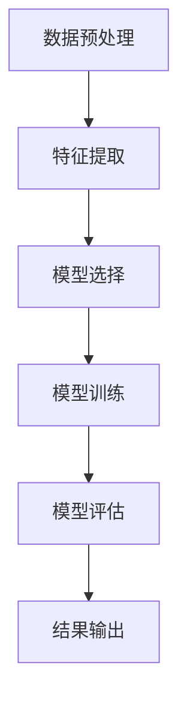
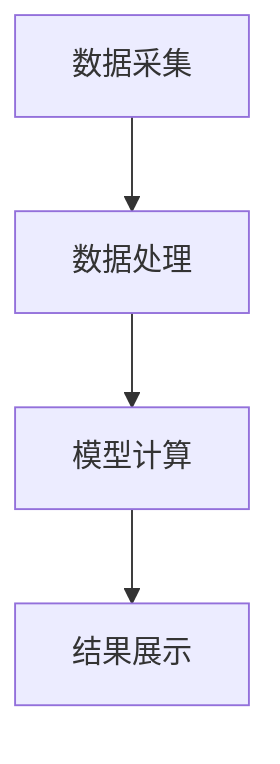

                 


# 费雪的管理层诚信评估

> **关键词**: 管理层诚信评估, 投资决策, 费雪投资理念, 企业治理, 数学模型构建

> **摘要**: 本文深入探讨了费雪提出的管理层诚信评估方法，分析了其在投资决策中的重要性。通过定性与定量相结合的评估方法，构建了数学模型，并结合实际案例进行了系统分析。本文还介绍了评估系统的架构设计与实现方案，为投资者提供了实用的工具与方法。

---

## 第一部分: 费雪的管理层诚信评估概述

### 第1章: 费雪的生平与投资理念

#### 1.1 费雪的生平简介
- **费雪的背景**: 弗雷德里克·费雪（Frederick Fisher）是一位投资大师，以其独特的投资理念闻名。
- **投资理念**: 费雪认为，成功的投资不仅依赖于市场分析，还必须关注管理层的诚信与决策能力。
- **诚信的重要性**: 在费雪看来，管理层的诚信是企业长期发展的基石，也是投资决策的核心因素。

#### 1.2 管理层诚信评估的背景与重要性
- **背景**: 费雪提出管理层诚信评估的初衷是为了筛选出值得长期投资的企业。
- **重要性**: 诚信的管理层能够做出有利于企业长期发展的决策，从而为投资者带来稳定收益。
- **评估目标**: 通过评估管理层的诚信，投资者可以更准确地判断企业的潜在价值。

#### 1.3 本章小结
- 费雪的管理层诚信评估是一种基于企业治理和管理层决策能力的分析方法。
- 该方法通过定性和定量相结合的方式，帮助企业识别具备长期投资价值的企业。

---

## 第二部分: 管理层诚信评估的核心概念与维度

### 第2章: 管理层诚信的定义与维度

#### 2.1 管理层诚信的定义
- **诚信的定义**: 管理层诚信指管理层在决策过程中坚持道德标准、遵守企业治理原则、避免短期行为的能力。
- **多维度解释**: 诚信不仅包括高管的个人品德，还包括团队协作、企业治理结构等因素。

#### 2.2 管理层诚信的评估维度
- **领导力与决策能力**: 包括高管团队的经验、决策风格和应对危机的能力。
- **透明度与信息披露**: 包括企业是否及时、准确地披露信息，以及信息披露的透明度。
- **责任感与道德标准**: 包括高管是否遵守职业道德，是否避免利益冲突。
- **团队协作与企业治理**: 包括团队合作的默契度和企业治理结构的合理性。

#### 2.3 核心概念对比表格
| 维度                | 定义与特征                              |
|---------------------|---------------------------------------|
| 领导力与决策能力    | 高管团队的经验、决策风格和危机应对能力 |
| 透明度与信息披露    | 企业信息披露的及时性、准确性和透明度   |
| 责任感与道德标准    | 高管是否遵守职业道德，避免利益冲突     |
| 团队协作与企业治理  | 团队合作默契度和企业治理结构的合理性   |

---

## 第三部分: 管理层诚信评估的方法论

### 第3章: 管理层诚信评估的定性方法

#### 3.1 定性评估的核心要素
- **企业治理结构分析**: 包括董事会结构、独立董事比例、管理层分工等。
- **高管团队稳定性评估**: 包括高管团队的稳定性、高管的任职时间等。
- **企业战略一致性评估**: 包括企业战略是否清晰、一致，以及战略的执行情况。

#### 3.2 定性评估的实施步骤
1. **数据收集与整理**: 收集企业的公开信息、财务报告、新闻报道等。
2. **经验分析与判断**: 通过经验分析高管团队的稳定性、战略一致性等。
3. **评估结果的综合分析**: 综合分析定性评估结果，判断管理层诚信程度。

### 第4章: 管理层诚信评估的定量方法

#### 4.1 定量评估的关键指标
- **财务指标分析**: 包括利润率、资产负债率、现金流等。
- **经营指标分析**: 包括市场份额、客户满意度、研发投入等。
- **市场表现指标分析**: 包括股价波动率、市盈率、市净率等。

#### 4.2 定量评估的数学模型
- **财务健康度模型**: 通过财务指标加权计算企业的财务健康度。
- **经营稳定性模型**: 通过经营指标评估企业的经营稳定性。
- **市场表现相关性分析**: 通过市场指标分析管理层诚信与市场表现的相关性。

---

## 第四部分: 管理层诚信评估的数学模型与算法

### 第5章: 管理层诚信评估的数学模型

#### 5.1 评估模型的构建
- **模型假设**: 假设管理层诚信与企业财务、经营、市场表现密切相关。
- **变量定义**: 定义财务指标、经营指标、市场指标为自变量，管理层诚信评分为因变量。
- **数据预处理**: 对数据进行清洗、标准化处理。
- **模型选择**: 使用回归分析、聚类分析等方法构建模型。
- **模型优化**: 通过交叉验证优化模型参数。

#### 5.2 算法原理与流程图


#### 5.3 数学公式与模型解释
- 管理层诚信评分公式：
$$ \text{评分} = \alpha \times \text{财务指标} + \beta \times \text{经营指标} + \gamma \times \text{市场指标} $$
- 模型权重分配公式：
$$ \alpha + \beta + \gamma = 1 $$

---

## 第五部分: 管理层诚信评估的系统架构与设计

### 第6章: 系统架构设计

#### 6.1 系统功能模块划分
- **数据采集模块**: 采集企业财务数据、市场数据、新闻数据等。
- **评估计算模块**: 计算管理层诚信评分、财务健康度等。
- **结果展示模块**: 展示评估结果、生成报告。

#### 6.2 系统架构设计图


#### 6.3 接口设计与交互
- **数据接口**: 提供API接口，方便数据采集模块调用。
- **用户交互**: 提供友好的用户界面，方便用户输入数据和查看结果。

---

## 第六部分: 管理层诚信评估的项目实战

### 第7章: 项目实战

#### 7.1 环境安装
- **工具安装**: 安装Python、Pandas、NumPy、Scikit-learn等工具。
- **数据获取**: 从公开数据源获取企业数据。

#### 7.2 核心实现源代码
```python
import pandas as pd
from sklearn import linear_model

# 数据预处理
data = pd.read_csv('企业数据.csv')
data.dropna(inplace=True)

# 特征提取
X = data[['利润率', '市场份额', '现金流']]
y = data['诚信评分']

# 模型训练
model = linear_model.LinearRegression()
model.fit(X, y)

# 模型预测
predictions = model.predict(X)
print('预测评分:', predictions)
```

#### 7.3 实际案例分析
- **案例分析**: 以某企业为例，分析其管理层诚信评分。
- **结果解读**: 解释评分结果，提出投资建议。

---

## 第七部分: 总结与展望

### 第8章: 总结与展望

#### 8.1 本章总结
- 费雪的管理层诚信评估方法是一种有效的投资工具。
- 通过定性与定量结合的方法，可以更准确地评估管理层诚信。

#### 8.2 未来展望
- **算法优化**: 进一步优化模型，提高评估精度。
- **数据扩展**: 扩大数据来源，提升模型的泛化能力。
- **应用场景**: 探索更多应用场景，如企业并购、风险投资等。

---

## 附录

### 附录A: 评分标准
- 管理层诚信评分标准：
  - 优秀：80分以上
  - 良好：60-80分
  - 一般：40-60分
  - 不良：40分以下

### 附录B: 案例分析
- 案例分析：某企业的管理层诚信评估报告。

---

**作者：AI天才研究院/AI Genius Institute & 禅与计算机程序设计艺术 /Zen And The Art of Computer Programming**

