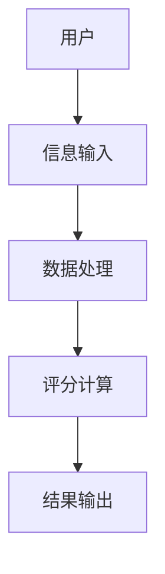
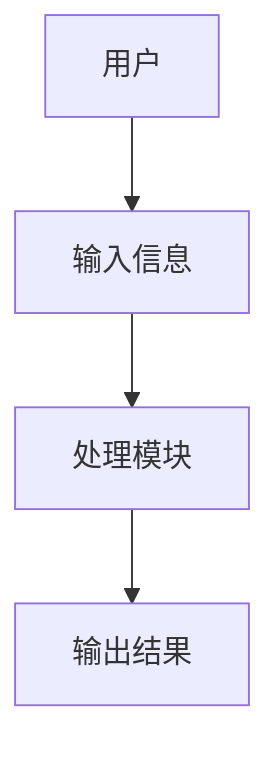

                 

# 费雪的管理层质量评估方法

## 关键词：费雪、管理层质量评估、投资方法、评分系统、战略思维

## 摘要：本文深入探讨了投资大师费雪提出的管理层质量评估方法，详细解析了其核心概念、评估框架、数学模型及系统设计，并通过实际案例分析展示了该方法的应用，最后总结了其在现代投资策略中的价值与未来发展方向。

---

# 第一部分: 费雪的管理层质量评估方法背景介绍

## 第1章: 费雪的背景与投资理念

### 1.1 费雪的生平与成就
#### 1.1.1 费雪的生平简介
菲利普·费雪（Philip Fisher）是20世纪的投资大师，被誉为“成长投资之父”。他出生于1907年，去世于2000年，一生致力于研究投资策略，尤其关注企业成长潜力和管理层质量。费雪的职业生涯跨越了70年，他的投资理念对现代投资理论产生了深远影响。

#### 1.1.2 费雪的投资哲学与理念
费雪的核心理念是“投资于成长”，而非短期市场波动。他认为，成功的投资取决于选择那些具有强大成长潜力的企业，而这种潜力的实现离不开卓越的管理层。他强调，企业的管理层是企业价值的“方向盘”，决定着企业的命运。

#### 1.1.3 费雪对投资界的主要贡献
费雪的主要贡献包括：
- 提出“成长股”概念，强调投资于那些能够持续增长的企业。
- 强调管理层的质量，认为优秀的管理层是企业长期成功的关键。
- 开创了基本面分析的先河，为现代投资分析奠定了基础。

## 第2章: 管理层质量评估的重要性

### 2.1 管理层在企业中的核心作用
管理层是企业的决策者和执行者，他们的能力和决策直接影响企业的绩效和未来发展方向。一个优秀的管理层能够制定出有效的战略，带领企业在竞争中脱颖而出。

### 2.2 管理层质量对企业绩效的影响
管理层的质量直接影响企业的盈利能力、市场地位和创新能力。优秀的管理层能够优化资源配置，提高效率，降低风险，从而为企业创造更大的价值。

### 2.3 投资者如何通过评估管理层质量获得超额收益
对于投资者而言，评估管理层的质量可以帮助识别具有长期增长潜力的企业。通过分析管理层的战略思维、决策能力和道德标准，投资者可以更准确地预测企业的未来表现，从而做出更明智的投资决策。

---

# 第二部分: 费雪管理层质量评估的核心概念

## 第3章: 费雪管理层质量评估的定义与内涵

### 3.1 费雪方法的核心概念
费雪的管理层质量评估方法是一种通过分析企业管理层的能力、决策和道德标准，来评估企业长期成长潜力的方法。这种方法强调，只有具备优秀管理层的企业才能实现持续增长。

### 3.2 评估方法的关键要素
费雪的评估方法包括以下几个关键要素：
- 战略思维能力：管理层是否具有清晰的长期战略，并能够有效执行。
- 决策能力与执行力：管理层在面对复杂问题时的决策质量和执行效率。
- 领导力与团队建设：管理层是否能够激励员工并构建高效的团队。
- 企业治理与道德标准：管理层是否遵循道德规范，确保企业合规经营。

## 第4章: 费雪方法的核心维度

### 4.1 战略思维能力
战略思维能力是管理层能否为企业制定清晰的长期发展战略。费雪认为，一个优秀的管理层应该能够识别市场机会，制定切实可行的战略，并能够灵活应对市场变化。

### 4.2 决策能力与执行力
决策能力是指管理层在面对复杂情况时的判断力和决策效率。执行力则是指管理层将决策转化为实际成果的能力。费雪强调，管理层不仅需要做出正确的决策，还需要有能力高效执行这些决策。

### 4.3 领导力与团队建设
领导力是管理层激励员工、凝聚团队的能力。优秀的领导力能够激发员工的潜力，提高团队的整体效率。团队建设则是指管理层如何构建和管理团队，确保团队成员能够协同合作，共同实现企业目标。

### 4.4 企业治理与道德标准
企业治理是指管理层如何管理企业，确保企业合规经营，股东利益最大化。道德标准则是指管理层在经营过程中是否遵循道德规范，避免 unethical 的行为。

---

# 第三部分: 费雪管理层质量评估的框架与方法

## 第5章: 费雪方法的具体实施步骤

### 5.1 确定评估目标与范围
评估目标是明确评估的目的，例如，评估目标可能是为了选择具有长期增长潜力的企业。评估范围则是确定需要评估的企业数量和行业。

### 5.2 收集与分析管理层信息
收集管理层信息是评估的第一步，包括管理层的背景、历史表现、决策记录等。分析这些信息是评估管理层质量的关键。

### 5.3 运用费雪评分系统进行评估
费雪评分系统是一种通过给各个评估维度打分，综合得出管理层质量评分的方法。评分系统通常包括战略思维、决策能力、领导力和道德标准等多个维度。

### 5.4 结果分析与投资决策
根据评分结果，投资者可以判断企业的管理层质量，并据此做出投资决策。

---

# 第四部分: 费雪方法的数学模型与算法原理

## 第6章: 费雪评分系统的数学模型

### 6.1 评分系统的公式表示
费雪评分系统可以通过以下公式表示：
$$
\text{总评分} = \sum_{i=1}^{n} w_i \times s_i
$$
其中，\( w_i \) 是第 \( i \) 个维度的权重，\( s_i \) 是该维度的评分。

### 6.2 权重分配
权重分配是根据各个维度的重要性来确定的。例如，战略思维能力可能占40%，决策能力占30%，领导力占20%，道德标准占10%。

---

# 第五部分: 费雪管理层质量评估方法的系统分析与设计

## 第7章: 系统功能设计

### 7.1 系统功能概述
费雪管理层质量评估系统是一个用于评估企业管理层质量的工具，主要包括信息收集、评分计算、结果分析等功能。

### 7.2 系统架构设计

## 第8章: 系统接口设计

### 8.1 系统接口概述
系统接口包括用户输入界面、数据处理模块和结果输出模块。

### 8.2 系统接口设计

---

# 第六部分: 费雪管理层质量评估方法的项目实战

## 第9章: 实际案例分析

### 9.1 案例背景
以某科技公司为例，分析其管理层质量。

### 9.2 数据收集与处理
收集该公司的管理层信息，包括战略思维、决策能力等。

### 9.3 评分计算
根据评分系统，计算管理层的总评分。

### 9.4 结果分析
根据评分结果，判断该公司的管理层质量，并给出投资建议。

---

# 第七部分: 费雪管理层质量评估方法的总结与展望

## 第10章: 总结

### 10.1 费雪方法的核心价值
费雪的管理层质量评估方法为投资者提供了一种系统化的评估工具，帮助识别具有长期增长潜力的企业。

### 10.2 方法的局限性
费雪方法的局限性在于，评估结果可能受到主观因素的影响，且难以量化。

## 第11章: 未来展望

### 11.1 方法的改进方向
未来可以通过引入更多的数据和分析方法，提高评估的准确性和客观性。

### 11.2 方法的应用前景
随着大数据和人工智能技术的发展，费雪方法可以在更多领域得到应用，为投资者提供更精准的决策支持。

---

# 作者：AI天才研究院/AI Genius Institute & 禅与计算机程序设计艺术 /Zen And The Art of Computer Programming

