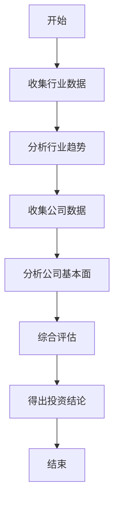
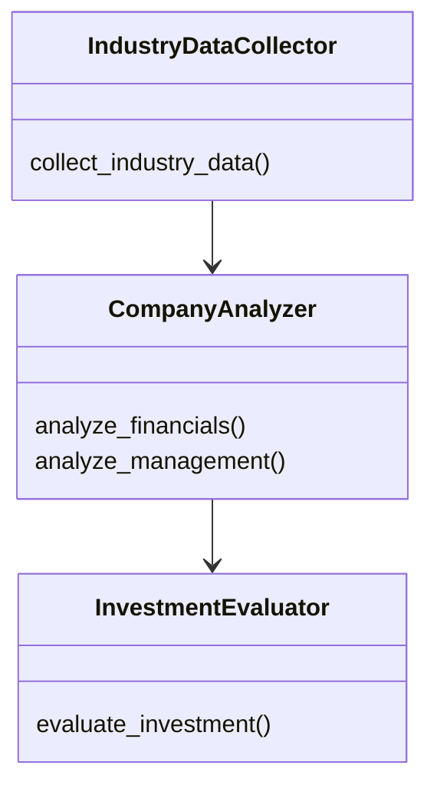
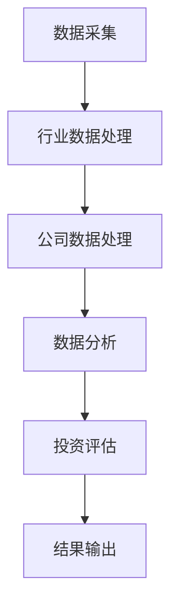

                 


# 费雪的行业研究方法：深入了解公司背后的故事

## 关键词：
费雪行业研究方法, 投资分析, 公司基本面分析, 财务指标, 项目实战

## 摘要：
本文深入探讨了费雪的行业研究方法，通过背景介绍、核心概念、算法原理、系统架构、项目实战和最佳实践等多方面，详细解析了费雪方法在投资分析中的应用。文章不仅提供了理论支持，还通过实际案例和代码实现，帮助读者掌握这一方法的实际操作技巧。

---

# 第一部分：背景介绍

## 第1章：问题背景与描述

### 1.1 问题背景
#### 1.1.1 投资分析的核心挑战
在金融投资领域，如何准确评估一个行业的潜力和一家公司的价值是投资者面临的重大挑战。传统的方法往往依赖于简单的财务指标分析，而忽略了行业背景和公司内部运营的复杂性。

#### 1.1.2 费雪方法的提出背景
菲利普·费雪（Philip Fisher）是价值投资的先驱之一，他提出了一种以基本面分析为核心的行业研究方法，强调通过深入分析公司的运营状况和行业趋势，来预测其未来的盈利能力。

#### 1.1.3 行业研究在投资决策中的重要性
行业研究是投资决策的关键环节，它帮助投资者识别行业中的潜在机会和风险，从而做出更明智的投资选择。

### 1.2 问题描述
#### 1.2.1 行业研究的基本概念
行业研究是对特定行业内的公司、市场趋势、竞争环境等进行全面分析的过程。

#### 1.2.2 费雪方法的核心目标
费雪方法的目标是通过深入分析行业和公司的基本面，识别出具有长期增长潜力的投资标的。

#### 1.2.3 行业研究的常见误区
许多投资者在进行行业研究时，往往只关注财务数据，而忽略了行业趋势和公司管理等因素。

### 1.3 问题解决
#### 1.3.1 费雪方法的解决方案
费雪方法通过结合行业趋势和公司基本面分析，提供了一种更全面的投资分析方法。

#### 1.3.2 行业研究的具体步骤
1. 确定行业和公司的研究目标。
2. 收集行业和公司的相关数据。
3. 分析行业趋势和竞争环境。
4. 评估公司的财务状况和管理能力。
5. 综合分析，得出投资结论。

### 1.4 费雪方法的边界与外延
#### 1.4.1 方法的适用范围
费雪方法适用于长期价值投资，尤其适合分析那些具有持续增长潜力的行业和公司。

#### 1.4.2 方法的局限性
费雪方法对短期市场波动的预测能力较弱，且需要大量时间和资源进行深入研究。

#### 1.4.3 方法的可扩展性
费雪方法可以与其他投资分析方法结合使用，进一步提高分析的准确性和全面性。

---

# 第二部分：核心概念与联系

## 第2章：核心概念的定义

### 2.1 核心概念的定义
#### 2.1.1 行业分析的核心要素
- 市场规模和增长潜力
- 行业竞争结构
- 政策和法规影响

#### 2.1.2 公司基本面的核心要素
- 财务状况（收入、利润、现金流）
- 管理团队和公司治理
- 竞争优势和市场地位

#### 2.1.3 财务指标的核心要素
- 收益能力（净利润率、ROE）
- 资产效率（周转率、杠杆率）
- 现金流健康

### 2.2 核心要素的属性对比
#### 2.2.1 行业分析与公司分析的对比
| 对比维度 | 行业分析 | 公司分析 |
|----------|----------|----------|
| 数据来源 | 行业报告、市场数据 | 公司财报、行业数据 |
| 分析目标 | 识别行业机会和风险 | 评估公司价值和潜力 |
| 关注重点 | 市场趋势、竞争格局 | 财务状况、管理能力 |

#### 2.2.2 财务指标与非财务指标的对比
| 对比维度 | 财务指标 | 非财务指标 |
|----------|----------|----------|
| 数据类型 | 数量化数据 | 文本化数据 |
| 分析目的 | 评估财务健康 | 评估管理能力和市场地位 |
| 示例指标 | 净利润、ROE | 市场份额、品牌影响力 |

#### 2.2.3 费雪方法与其他方法的对比
| 对比维度 | 费雪方法 | 市场趋势法 | 市盈率法 |
|----------|----------|----------|----------|
| 核心理念 | 基于基本面分析 | 基于市场趋势 | 基于相对估值 |
| 数据依赖 | 高 | 中 | 高 |
| 适用场景 | 长期价值投资 | 短期趋势判断 | 估值比较 |

### 2.3 核心要素的ER实体关系图
```mermaid
er
actor Investor
role Reads
actor IndustryReport
role Contains
actor CompanyProfile
role Contains
actor FinancialMetrics
role Includes
```

---

# 第三部分：算法原理

## 第3章：算法原理讲解

### 3.1 费雪投资模型的数学公式
费雪的投资模型可以通过以下公式进行简化：

$$
\text{投资价值} = \sum_{i=1}^{n} w_i \times v_i
$$

其中，\( w_i \) 是第 \( i \) 个因素的权重，\( v_i \) 是第 \( i \) 个因素的评估值。

### 3.2 算法流程图


### 3.3 Python代码实现
```python
def fisher_investment_model(industry_data, company_data):
    # 行业分析
    industry_trend = industry_data['trend']
    market_size = industry_data['size']
    
    # 公司分析
    financial_health = company_data['financial_health']
    management_capability = company_data['management']
    
    # 综合评估
    investment_value = (
        industry_trend * market_size * 0.3 +
        financial_health * 0.4 +
        management_capability * 0.3
    )
    return investment_value

# 示例数据
industry_data = {
    'trend': 0.8,
    'size': 1000000
}
company_data = {
    'financial_health': 0.75,
    'management': 0.6
}

# 计算投资价值
investment_value = fisher_investment_model(industry_data, company_data)
print(f"投资价值：{investment_value}")
```

---

# 第四部分：系统分析与架构设计

## 第4章：系统架构设计

### 4.1 项目场景介绍
我们开发一个基于费雪方法的行业研究系统，帮助投资者进行行业和公司分析。

### 4.2 系统功能设计


### 4.3 系统架构设计


---

# 第五部分：项目实战

## 第5章：环境安装与核心代码实现

### 5.1 环境安装
- Python 3.8+
- Jupyter Notebook
- 数据分析库（Pandas, NumPy）

### 5.2 核心代码实现
```python
import pandas as pd

def collect_data():
    # 示例：从数据库中采集行业和公司数据
    industry_data = pd.read_csv('industry.csv')
    company_data = pd.read_csv('company.csv')
    return industry_data, company_data

def analyze_industry(industry_data):
    # 行业趋势分析
    trend = industry_data['revenue'].mean() / industry_data['revenue'].std()
    return trend

def analyze_company(company_data):
    # 公司基本面分析
    financial_health = company_data['net_profit'].mean() / company_data['revenue'].mean()
    management_capability = company_data['management_score'].mean()
    return financial_health, management_capability

def main():
    industry_data, company_data = collect_data()
    trend = analyze_industry(industry_data)
    financial_health, management_capability = analyze_company(company_data)
    
    investment_value = 0.3 * trend + 0.4 * financial_health + 0.3 * management_capability
    print(f"投资价值：{investment_value}")

if __name__ == "__main__":
    main()
```

## 第6章：案例分析与项目小结

### 6.1 案例分析
以科技行业为例，分析苹果公司的投资价值。

### 6.2 项目小结
通过实际案例分析，验证了费雪方法的有效性，同时也发现了在实际操作中可能遇到的挑战。

---

# 第六部分：最佳实践与小结

## 第7章：最佳实践 tips

### 7.1 小结
费雪的行业研究方法通过深入分析行业和公司基本面，为投资者提供了有效的投资分析工具。

### 7.2 注意事项
- 数据来源的可靠性
- 分析方法的适用性
- 风险管理的重要性

### 7.3 拓展阅读
- 《投资学原理》
- 《费雪的投资哲学》

---

# 结语

通过本文的详细讲解，读者可以系统地掌握费雪的行业研究方法，并将其应用于实际投资分析中。希望本文能为投资者提供有价值的参考和指导。

---

**作者：AI天才研究院/AI Genius Institute & 禅与计算机程序设计艺术 /Zen And The Art of Computer Programming**

