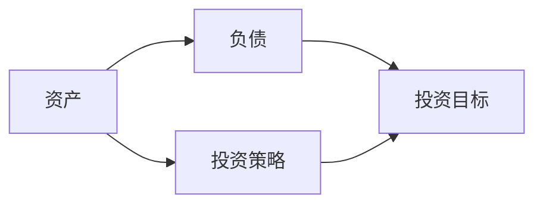
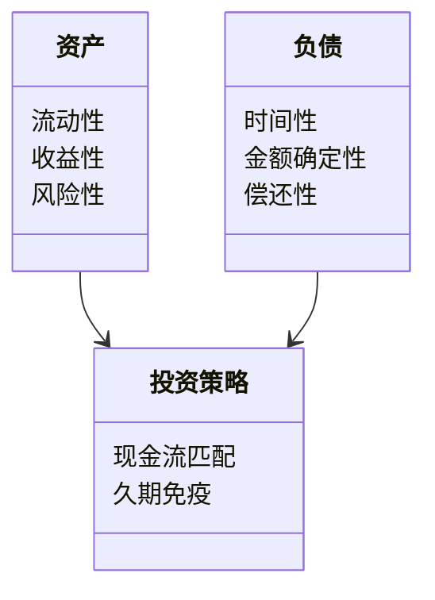
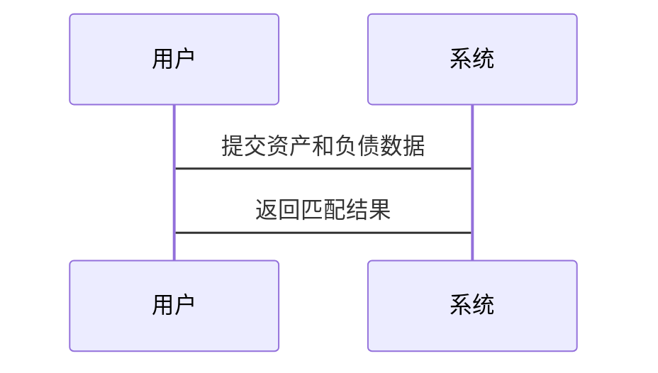

                 


# 资产负债匹配：机构投资者的长期投资策略

**关键词**：资产负债匹配、机构投资者、长期投资策略、现金流匹配、久期免疫、投资组合优化

**摘要**：  
资产负债匹配是机构投资者实现长期稳健投资的重要策略，通过对资产与负债的精准匹配，机构投资者可以在复杂多变的市场环境中实现风险控制和收益最大化。本文从资产负债匹配的基本概念出发，结合数学模型、算法原理和实际案例，详细阐述了资产负债匹配的核心原理、系统架构、算法实现及最佳实践。文章旨在为机构投资者提供一套科学的长期投资策略，帮助其在金融市场中实现资产与负债的动态平衡。

---

## 第1章: 资产负债匹配的概述

### 1.1 资产负债匹配的基本概念  
资产负债匹配是指将资产的现金流与负债的现金流在时间和金额上进行精确匹配，以确保在不同时间点上资产能够覆盖负债的偿还需求。这种匹配策略的核心在于平衡风险与收益，同时确保资金的流动性。

#### 1.1.1 资产与负债的定义  
- **资产**：机构投资者持有的金融资产，包括债券、股票、基金等，能够产生现金流的经济资源。  
- **负债**：机构投资者需要偿还的债务，包括债券、贷款等，通常具有固定的时间和金额要求。  

#### 1.1.2 资产负债匹配的定义  
资产负债匹配是指通过合理配置资产和负债，使得资产的现金流能够覆盖负债的现金流，同时实现投资收益最大化。  

#### 1.1.3 资产负债匹配的重要性  
- **风险控制**：通过匹配资产与负债的期限和现金流，机构投资者可以有效降低流动性风险和利率风险。  
- **收益优化**：匹配策略能够最大化资产的收益，同时满足负债的偿还需求。  

### 1.2 机构投资者的长期投资策略  
#### 1.2.1 机构投资者的定义  
机构投资者是指以机构形式参与金融市场的投资者，包括养老基金、保险公司、银行等，通常管理着大量资金。  

#### 1.2.2 长期投资策略的核心目标  
- **保值与增值**：在满足负债偿还需求的基础上，实现资产的长期增值。  
- **风险可控**：通过资产与负债的匹配，降低市场波动对机构投资的影响。  

#### 1.2.3 资产负债匹配在机构投资中的作用  
- **现金流管理**：通过匹配资产与负债的现金流，确保机构在不同时间点上能够满足资金需求。  
- **资产配置优化**：资产负债匹配策略能够帮助机构投资者合理配置资产，提高投资效率。  

### 1.3 资产负债匹配的背景与发展趋势  
#### 1.3.1 当前金融市场环境对资产负债匹配的影响  
- **低利率环境**：低利率环境下，负债成本下降，但资产收益也可能受到压缩。  
- **市场波动加剧**：全球经济不确定性增加，要求机构投资者更加注重风险控制。  

#### 1.3.2 机构投资者面临的挑战与机遇  
- **挑战**：利率波动、市场流动性风险、资产收益率下降等问题。  
- **机遇**：通过创新的资产配置策略，机构投资者可以在复杂环境中实现收益最大化。  

#### 1.3.3 资产负债匹配的未来发展趋势  
- **智能化匹配**：利用人工智能技术，实现资产与负债的智能匹配。  
- **全球化配置**：通过全球资产配置，降低地域性风险。  

---

## 第2章: 资产负债匹配的核心概念与联系

### 2.1 资产负债匹配的核心原理  
#### 2.1.1 资产负债匹配的数学模型  
资产负债匹配可以通过数学模型来描述。假设资产和负债的现金流分别为 \( A_t \) 和 \( L_t \)，则资产负债匹配的条件为：  
$$ \sum_{t=1}^{n} (A_t - L_t) = 0 $$  
其中，\( n \) 是时间跨度，\( t \) 是时间点。  

#### 2.1.2 现金流匹配原理  
现金流匹配是通过调整资产的现金流，使其与负债的现金流在时间和金额上保持一致。例如，如果负债的现金流在第5年为1000万元，机构投资者可以通过配置期限为5年的资产来匹配这一现金流。  

#### 2.1.3 久期免疫策略  
久期免疫策略是通过匹配资产和负债的久期（Duration）来实现免疫。久期是指债券价格对利率变动的敏感程度，公式为：  
$$ D = \frac{P \times (YTM - y)}{(1 + y)^t} $$  
其中，\( P \) 是债券价格，\( YTM \) 是到期收益率，\( y \) 是票面利率，\( t \) 是期限。  

### 2.2 资产负债匹配的ER实体关系图  
以下是一个简化的ER实体关系图，展示了资产与负债之间的关系：  


### 2.3 资产负债匹配的概念属性特征对比  
以下表格对比了资产与负债的概念属性特征：  

| 概念 | 特征 |  
|------|------|  
| 资产 | 流动性、收益性、风险性 |  
| 负债 | 时间性、金额确定性、偿还性 |  

---

## 第3章: 资产负债匹配的算法原理

### 3.1 现金流匹配模型  
#### 3.1.1 现金流匹配的基本原理  
现金流匹配模型通过将资产的现金流与负债的现金流进行逐一对比，确保在每个时间点上资产的现金流能够覆盖负债的现金流。  

#### 3.1.2 现金流匹配的数学模型  
现金流匹配的数学公式如下：  
$$ \sum_{t=1}^{n} (A_t - L_t) = 0 $$  

#### 3.1.3 现金流匹配的实现步骤  
1. **确定负债的现金流**：根据负债的期限和金额，确定每期的现金流。  
2. **选择匹配的资产**：根据负债的现金流，选择期限和金额相匹配的资产。  
3. **调整资产配置**：根据市场变化，动态调整资产配置，确保现金流匹配。  

### 3.2 久期免疫策略  
#### 3.2.1 久期免疫的基本原理  
久期免疫策略通过匹配资产和负债的久期，确保在利率变动时，资产和负债的收益变化相互抵消。  

#### 3.2.2 久期免疫的数学模型  
久期免疫的公式如下：  
$$ D = \frac{P \times (YTM - y)}{(1 + y)^t} $$  

#### 3.2.3 久期免疫的实现步骤  
1. **计算负债的久期**：根据负债的期限和利率，计算其久期。  
2. **选择匹配的资产**：选择久期与负债相同的资产。  
3. **动态调整久期**：根据市场变化，动态调整资产和负债的久期匹配。  

### 3.3 资产负债匹配的Python实现  
以下是一个简单的Python代码示例，用于实现现金流匹配模型：  

```python
import numpy as np

def cash_flow_matching(liabilities, assets):
    # 计算现金流匹配的误差
    error = np.sum(assets - liabilities)
    return error == 0

# 示例数据
liabilities = [100, 200, 300]
assets = [100, 200, 300]

# 调用函数
result = cash_flow_matching(liabilities, assets)
print("现金流匹配结果：", result)
```

---

## 第4章: 资产负债匹配的系统分析与架构设计

### 4.1 问题场景介绍  
机构投资者需要在复杂的金融市场环境中实现资产与负债的匹配，面临的主要问题包括：  
- 资产和负债的现金流不匹配，导致流动性风险和利率风险。  
- 市场波动较大，需要动态调整资产配置。  

### 4.2 系统功能设计  
#### 4.2.1 领域模型  


#### 4.2.2 系统架构设计  
```mermaid
container 系统架构 {
    接口层
    业务逻辑层
    数据层
}
```

### 4.3 系统接口设计  
- **输入接口**：资产和负债的现金流数据。  
- **输出接口**：匹配结果和投资建议。  

### 4.4 系统交互流程图  


---

## 第5章: 资产负债匹配的项目实战

### 5.1 环境安装  
- **Python版本**：Python 3.8 或更高版本。  
- **依赖库**：numpy、pandas、scipy。  

### 5.2 核心代码实现  
```python
import numpy as np

def optimize_portfolio(asset_returns, liability_returns):
    # 计算投资组合的最优配置
    covariance_matrix = asset_returns.cov()
    inv_covariance = np.linalg.inv(covariance_matrix)
    weights = inv_covariance @ liability_returns
    weights = weights / np.sum(weights)
    return weights
```

### 5.3 案例分析  
假设某机构投资者的负债现金流为：  
$$ L = [100, 200, 300] $$  
资产现金流为：  
$$ A = [100, 200, 300] $$  

通过现金流匹配模型，我们发现资产和负债的现金流完全匹配，因此匹配结果为：  
$$ \sum_{t=1}^{n} (A_t - L_t) = 0 $$  

---

## 第6章: 总结与展望

### 6.1 总结  
资产负债匹配是机构投资者实现长期稳健投资的重要策略，通过匹配资产与负债的现金流，机构投资者可以有效降低风险，实现收益最大化。  

### 6.2 未来展望  
随着人工智能和大数据技术的发展，资产负债匹配策略将更加智能化和精准化。未来，机构投资者可以通过智能算法和实时数据分析，实现资产与负债的动态匹配，进一步提升投资效率。

---

## 第7章: 最佳实践与注意事项

### 7.1 最佳实践  
- **定期审查**：机构投资者应定期审查资产与负债的匹配情况，确保匹配策略的有效性。  
- **动态调整**：根据市场变化，动态调整资产配置，确保匹配策略的灵活性。  

### 7.2 注意事项  
- **市场风险**：资产负债匹配策略无法完全消除市场风险，机构投资者仍需关注市场波动。  
- **数据质量**：匹配模型的准确性依赖于高质量的数据输入，数据误差可能影响匹配结果。  

---

## 作者：AI天才研究院/AI Genius Institute & 禅与计算机程序设计艺术/Zen And The Art of Computer Programming

