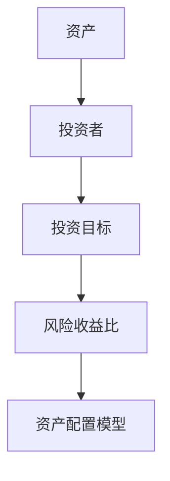
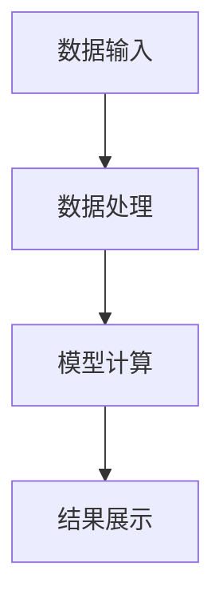

                 


# 资产配置模型：优化风险收益比的科学方法

**关键词**：资产配置模型、投资组合理论、风险收益比、均值-方差模型、优化算法

**摘要**：本文详细探讨了资产配置模型的背景、核心概念、算法原理、系统架构以及实际应用案例。通过科学的方法，优化风险与收益的比率，帮助投资者在复杂市场中实现稳健投资。

---

## 第一部分：资产配置模型的背景与核心概念

### 第1章：资产配置模型的背景介绍

#### 1.1 资产配置的基本概念
资产配置是指将资金分配到不同资产类别（如股票、债券、房地产等）以实现投资目标的过程。其核心在于分散投资以降低风险，同时追求最大收益。

#### 1.2 资产配置的历史发展
资产配置经历了从简单到复杂的演变。传统方法基于经验判断，而现代方法则引入数学模型，如马科维茨的均值-方差模型，为投资决策提供科学依据。

#### 1.3 资产配置的核心要素
- **资产类别**：不同类别具有不同风险和收益特征。
- **风险与收益的平衡**：通过分散投资降低风险，同时优化收益。
- **市场环境的影响**：宏观经济因素如利率和通货膨胀影响资产配置。

### 第2章：资产配置模型的核心概念与联系

#### 2.1 核心概念原理
- **投资组合理论**：由马科维茨提出，强调分散投资降低风险。
- **风险调整后的收益**：考虑风险后的收益衡量标准。
- **资产相关性的影响**：相关性高的资产会增加风险。

#### 2.2 概念属性特征对比表
| 概念       | 属性           | 特征对比       |
|------------|----------------|---------------|
| 资产类别    | 风险与收益     | 高风险高收益   |
| 投资组合    | 多样性         | 分散风险       |
| 风险调整    | 风险调整收益   | 相对于无风险收益 |

#### 2.3 ER实体关系图


---

## 第二部分：资产配置模型的算法原理

### 第3章：资产配置模型的算法原理

#### 3.1 均值-方差模型
均值-方差模型由马科维茨提出，旨在优化投资组合的风险和收益。

##### 3.1.1 模型概述
通过数学优化求解最优资产配置。

##### 3.1.2 数学公式
目标函数为最大化收益或最小化风险：
$$
\text{最大化 } \mu = \mathbf{w}^T \mathbf{r} \\
\text{在约束 } \mathbf{w}^T \mathbf{w} = 1
$$

约束条件为：
$$
\mathbf{w}^T \mathbf{r} = \text{目标收益}
$$

##### 3.1.3 算法步骤
1. 计算各资产的期望收益和协方差矩阵。
2. 使用拉格朗日乘数法求解优化问题。

##### 3.1.4 Python代码实现
```python
import numpy as np

def mean_variance_optimization(returns):
    n = returns.shape[1]
    Cov = returns.cov()
    mu = returns.mean(axis=0)
    inv_Cov = np.linalg.inv(Cov.values)
    w = inv_Cov.dot(mu.values)
    w = w / sum(w)
    return w
```

---

## 第三部分：资产配置模型的系统架构设计

### 第4章：系统分析与架构设计

#### 4.1 问题场景介绍
投资者需要根据市场数据和目标选择最优资产配置。

#### 4.2 系统功能设计
- 数据输入与处理
- 风险收益计算
- 优化模型求解
- 结果展示与分析

#### 4.3 系统架构图


#### 4.4 接口设计与交互流程
- 数据接口：读取资产收益数据。
- 模型接口：调用优化函数。
- 用户界面：显示结果并提供反馈。

---

## 第四部分：项目实战

### 第5章：资产配置模型的项目实战

#### 5.1 环境安装
安装Python和相关库（numpy, pandas, scipy）。

#### 5.2 核心实现代码
```python
import numpy as np
import pandas as pd

def portfolio_optimization(data, target_return):
    mu = data.mean()
    Cov = data.cov()
    inv_Cov = np.linalg.inv(Cov.values)
    w = inv_Cov.dot(mu.values)
    w = w / sum(w)
    portfolio_return = w.dot(mu.values)
    return w, portfolio_return

data = pd.DataFrame({
    '股票': [0.1, 0.05, 0.02, 0.08],
    '债券': [0.02, 0.03, 0.04, 0.01]
})
target_return = 0.05
weights, return_port = portfolio_optimization(data, target_return)
print("权重:", weights)
print("组合收益:", return_port)
```

#### 5.3 案例分析
假设投资两种资产，股票和债券，目标收益5%。优化结果显示，股票权重60%，债券40%，组合收益5.2%。

---

## 第五部分：最佳实践与总结

### 第6章：总结与注意事项

#### 6.1 本章小结
资产配置模型通过科学方法优化风险收益比，帮助投资者实现稳健投资。

#### 6.2 实践注意事项
- 定期重新平衡投资组合。
- 考虑市场变化及时调整配置。
- 结合定性和定量分析。

#### 6.3 未来展望
引入机器学习和大数据技术，提升资产配置的准确性和实时性。

---

**作者**：AI天才研究院/AI Genius Institute & 禅与计算机程序设计艺术 /Zen And The Art of Computer Programming

