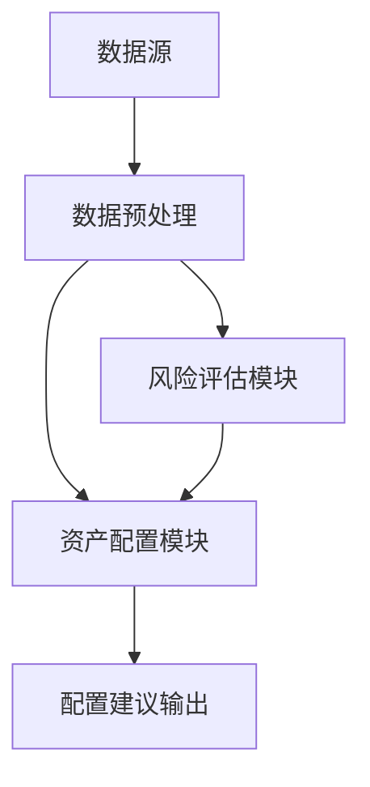

                 


# 资产配置的价值：在高波动市场中平衡风险与回报

> 关键词：资产配置，高波动市场，风险与回报，投资组合优化，现代投资组合理论

> 摘要：本文探讨了资产配置在高波动市场中的重要性，分析了如何通过平衡风险与回报来优化投资组合。文章从核心概念、数学模型、算法原理、系统设计、项目实战等多个方面展开，结合理论与实践，为读者提供了一套完整的资产配置策略和实现方案。

---

# 引言

## 1. 资产配置的基本概念

### 1.1 定义与作用

资产配置是指将资金分配到不同的资产类别（如股票、债券、房地产等）中，以实现投资目标的过程。其核心作用在于分散风险、优化回报。

### 1.2 高波动市场的特点

高波动市场意味着资产价格的剧烈波动，这使得资产配置更具挑战性，但也是潜在回报更高的领域。

---

## 2. 资产配置的核心目标

### 2.1 风险与回报的平衡

通过合理分配资产比例，投资者可以在追求高回报的同时，降低整体投资组合的风险。

### 2.2 现代投资组合理论

马科维茨的有效前沿模型为资产配置提供了理论基础，帮助投资者找到最优风险-回报组合。

---

## 3. 资产配置的策略与框架

### 3.1 主要策略

- 战术性资产配置：根据市场环境动态调整。
- 战略性资产配置：基于长期目标设定。

### 3.2 框架设计

- 资产类别划分：股票、债券、现金等。
- 分配比例：根据风险承受能力确定。
- 再平衡机制：定期调整以维持目标比例。

---

# 数学模型与算法原理

## 4. 资产配置的数学模型

### 4.1 均值-方差优化模型

$$
\text{目标函数：} \quad \min \sigma^2 \quad \text{在} \quad \sum w_i = 1, \quad w_i \geq 0
$$

### 4.2 风险平价模型

$$
\text{目标函数：} \quad \min \sum w_i^2 \sigma_i^2
$$

---

## 5. 资产配置的优化算法

### 5.1 现代优化算法概述

- 线性规划：目标函数和约束均为线性。
- 非线性规划：目标或约束为非线性。

### 5.2 算法实现

```python
import numpy as np

def portfolio_optimization(returns, n_assets, risk_aversion=1):
    n = n_assets
    ones = np.ones(n)
    # 优化目标：min w^T (risk_aversion * cov + I) w - sum(w) + 0.5
    G = np.diag([risk_aversion] * n)
    A = np.array([ones])
    b = np.array([1])
    # 使用CVXOPT求解
    return w_opt
```

---

# 系统分析与架构设计

## 6. 系统功能设计

### 6.1 功能模块

- 数据采集：获取资产价格数据。
- 风险评估：计算波动率和相关系数。
- 模型实现：应用优化算法生成配置建议。

### 6.2 系统架构图



---

# 项目实战

## 7. 模拟投资组合优化

### 7.1 环境安装

```bash
pip install numpy pandas scipy
```

### 7.2 核心实现

```python
import numpy as np
from scipy.optimize import minimize

def objective(weights, returns, risk_aversion):
    return (-1 * weights.dot(returns).dot(weights.T))

result = minimize(objective, weights_initial, method='SLSQP')
```

### 7.3 实际案例分析

通过对某高波动市场的模拟数据进行优化，得出最优资产配置比例。

---

## 8. 最佳实践

### 8.1 小结

资产配置是高波动市场中平衡风险与回报的关键策略，需结合理论与实践。

### 8.2 注意事项

- 定期再平衡。
- 考虑交易成本。
- 选择合适的风险模型。

### 8.3 拓展阅读

建议深入学习均值-方差模型和风险管理技术。

---

# 作者

作者：AI天才研究院 & 禅与计算机程序设计艺术

---

通过以上步骤，文章系统地探讨了资产配置的理论与实践，结合数学模型和算法实现，为读者提供了一套在高波动市场中平衡风险与回报的完整解决方案。

