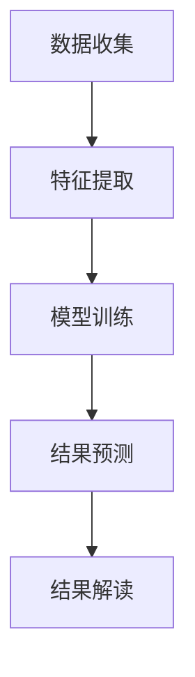
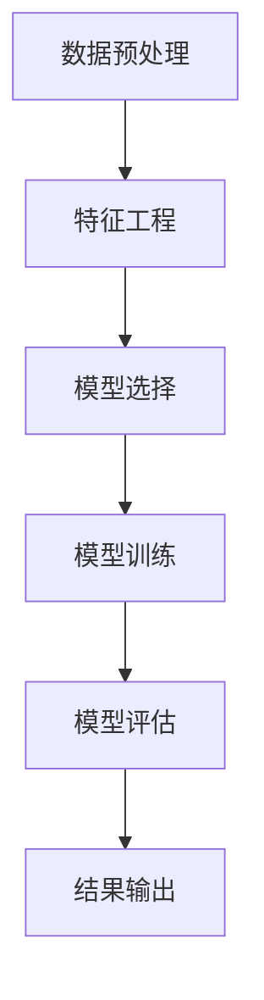
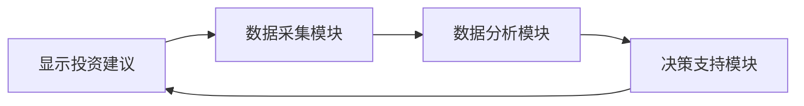

                 


# 连续两年表现不佳的特价股票处理方法

> 关键词：特价股票，股票处理，投资策略，评估模型，算法实现

> 摘要：本文详细探讨了连续两年表现不佳的特价股票的处理方法，从背景分析、评估模型构建到系统架构设计，结合实际案例和最佳实践，为投资者提供科学的决策支持。

---

## 第一部分: 特价股票处理方法概述

### 第1章: 特价股票的基本概念

#### 1.1 特价股票的定义
- **1.1.1 特价股票的定义与特点**
  - 特价股票是指价格低于市场平均水平，通常具有较高的市盈率或市净率，可能处于估值洼地的股票。
  - 特价股票的特点包括低估值、高波动性和潜在的反转机会。

- **1.1.2 特价股票的分类与特点对比**
  - 根据行业、规模和财务状况，特价股票可以分为成长型、价值型和周期性股票。
  - 与普通股票相比，特价股票的波动性更大，但潜在回报也更高。

- **1.1.3 特价股票与普通股票的主要区别**
  - 投资策略不同：普通股票注重长期增长，特价股票注重短期反转。
  - 风险承受能力不同：特价股票的风险更高，但潜在收益也更大。

#### 1.2 特价股票表现不佳的定义
- **1.2.1 股票表现不佳的定义与标准**
  - 表现不佳指股票价格持续低于市场平均水平，连续两年累计跌幅超过20%。
  - 标准包括市盈率低于行业平均值和市净率低于历史平均水平。

- **1.2.2 连续两年表现不佳的影响分析**
  - 投资者信心下降，可能导致进一步抛售。
  - 公司可能面临融资困难，影响未来发展。

### 第2章: 特价股票表现不佳的原因分析

#### 2.1 市场环境因素
- **2.1.1 经济周期对特价股票的影响**
  - 经济衰退时，特价股票可能面临更大的压力。
  - 通货膨胀可能导致股价波动加剧。

- **2.1.2 行业竞争格局的变化**
  - 行业整合或新竞争者进入可能导致部分公司股价承压。
  - 技术变革可能淘汰部分落后企业。

- **2.1.3 宏观政策对特价股票的冲击**
  - 政策变化可能影响行业前景，进而影响股价。
  - 税收政策调整可能影响投资者行为。

#### 2.2 公司自身因素
- **2.2.1 公司财务状况恶化**
  - 盈利能力下降，资产负债率上升。
  - 现金流不稳定可能导致无法偿还债务。

- **2.2.2 公司管理问题与战略失误**
  - 高管腐败或管理不善可能导致公司运营混乱。
  - 战略规划不当可能错失市场机会。

- **2.2.3 公司创新能力不足**
  - 产品或技术落后于行业趋势。
  - 无法适应市场需求变化。

#### 2.3 技术与市场因素
- **2.3.1 行业技术变革对公司的冲击**
  - 技术升级可能导致公司成本上升。
  - 技术落后可能被竞争对手取代。

- **2.3.2 市场需求变化对公司的挑战**
  - 消费者偏好变化可能导致需求下降。
  - 市场饱和可能导致竞争加剧。

- **2.3.3 价格竞争对公司的压力**
  - 价格战可能导致利润率下降。
  - 成本控制不当可能影响盈利能力。

### 第3章: 特价股票处理方法的背景与意义

#### 3.1 股票投资的基本原则
- **3.1.1 长期投资与价值投资的理念**
  - 长期投资强调持有优质资产，价值投资注重寻找被市场低估的股票。
  - 避免频繁交易，减少交易成本。

- **3.1.2 股票投资中的风险管理**
  - 分散投资以降低风险。
  - 设置止损点以限制损失。

- **3.1.3 股票投资中的分散投资策略**
  - 将资金分配到不同行业和资产类别。
  - 避免过度集中，降低风险。

#### 3.2 特价股票处理的必要性
- **3.2.1 避免投资损失的重要性**
  - 及时处理表现不佳的股票可以避免更大的损失。
  - 防止资金被长期套牢，影响投资流动性。

- **3.2.2 提高投资回报率的必要性**
  - 通过处理不佳股票，释放资金用于其他投资。
  - 提高整体投资组合的回报率。

- **3.2.3 投资者心理与行为对投资决策的影响**
  - 心理因素可能导致投资者过于乐观或悲观。
  - 行为偏差可能影响决策，如处置效应。

#### 3.3 特价股票处理方法的创新性
- **3.3.1 传统股票处理方法的局限性**
  - 传统方法注重历史业绩，忽视未来变化。
  - 缺乏动态调整，适应性不足。

- **3.3.2 特价股票处理方法的独特性**
  - 结合技术分析和基本面分析，提供更全面的评估。
  - 利用大数据和机器学习，提高预测准确性。

- **3.3.3 特价股票处理方法的创新性与实践意义**
  - 创新性体现在数据驱动和智能化决策。
  - 实践意义在于提高投资效率和成功率。

---

## 第二部分: 特价股票处理方法的核心概念

### 第4章: 特价股票表现不佳的评估模型

#### 4.1 评估模型的基本原理
- **4.1.1 数据收集与特征提取**
  - 数据来源包括历史股价、财务数据、行业指标和市场情绪。
  - 特征包括市盈率、市净率、ROE和营业收入增长率。

- **4.1.2 模型训练与验证**
  - 使用历史数据训练模型，验证准确性和稳定性。
  - 采用交叉验证和回测分析，确保模型可靠性。

- **4.1.3 模型预测与结果解读**
  - 预测未来股价走势，评估模型的有效性。
  - 结果解读包括识别潜在风险和机会。

#### 4.2 评估模型的流程图



#### 4.3 评估模型的Python代码实现

```python
import pandas as pd
from sklearn.model_selection import train_test_split
from sklearn.linear_model import LinearRegression
import matplotlib.pyplot as plt

# 数据加载与预处理
data = pd.read_csv('stock_data.csv')
X = data[['PE', 'PB', 'ROE', 'Revenue_growth']]
y = data['Price']

# 数据分割
X_train, X_test, y_train, y_test = train_test_split(X, y, test_size=0.2, random_state=42)

# 模型训练
model = LinearRegression()
model.fit(X_train, y_train)

# 模型预测
y_pred = model.predict(X_test)

# 模型评估
from sklearn.metrics import r2_score
print(r2_score(y_test, y_pred))

# 可视化
plt.scatter(y_test, y_pred)
plt.xlabel('实际价格')
plt.ylabel('预测价格')
plt.title('模型预测 vs 实际价格')
plt.show()
```

#### 4.4 评估模型的数学模型

股票价格预测模型：

$$
\hat{y} = \beta_0 + \beta_1x_1 + \beta_2x_2 + \beta_3x_3 + \beta_4x_4
$$

其中：
- $\hat{y}$：预测的股票价格
- $x_1$，$x_2$，$x_3$，$x_4$：输入特征（如市盈率、市净率等）
- $\beta_0$，$\beta_1$，$\beta_2$，$\beta_3$，$\beta_4$：回归系数

---

## 第三部分: 特价股票处理系统的架构设计

### 第5章: 特价股票处理方法的算法实现

#### 5.1 算法实现的背景介绍
- 算法用于识别和评估表现不佳的特价股票，帮助投资者做出决策。
- 采用机器学习算法，结合历史数据和市场指标。

#### 5.2 算法实现的流程图



#### 5.3 算法实现的Python代码

```python
import numpy as np
import pandas as pd
from sklearn.ensemble import RandomForestRegressor
from sklearn.metrics import mean_absolute_error

# 数据加载与预处理
data = pd.read_csv('stock_data.csv')
X = data[['PE', 'PB', 'ROE', 'Revenue_growth']]
y = data['Price']

# 数据分割
X_train, X_test, y_train, y_test = train_test_split(X, y, test_size=0.2, random_state=42)

# 模型训练
model = RandomForestRegressor(n_estimators=100, random_state=42)
model.fit(X_train, y_train)

# 模型预测
y_pred = model.predict(X_test)

# 模型评估
mae = mean_absolute_error(y_test, y_pred)
print(f"平均绝对误差: {mae}")

# 特征重要性分析
importances = model.feature_importances_
feature_importance = pd.DataFrame({'feature': X.columns, 'importance': importances})
feature_importance = feature_importance.sort_values(by='importance', ascending=False)
print(feature_importance)
```

#### 5.4 算法实现的数学模型

随机森林回归模型：

$$
\hat{y} = \sum_{i=1}^{n} \left( \alpha_i \cdot I_i(x) \right)
$$

其中：
- $\alpha_i$：第i棵决策树的权重
- $I_i(x)$：第i棵决策树的预测结果
- $n$：决策树的数量

---

## 第四部分: 特价股票处理系统的架构设计

### 第6章: 特价股票处理系统的架构设计

#### 6.1 系统功能设计
- **数据采集模块**：实时获取股票数据。
- **数据分析模块**：对数据进行清洗和特征提取。
- **决策支持模块**：基于模型结果提供投资建议。

#### 6.2 系统架构设计


#### 6.3 系统接口设计
- 数据接口：提供API访问股票数据。
- 投资建议接口：返回基于模型的建议。

#### 6.4 系统交互流程图



---

## 第五部分: 特价股票处理系统的实战案例

### 第7章: 特价股票处理系统的实战案例

#### 7.1 案例背景
- 某科技公司股票连续两年表现不佳，市盈率和市净率均低于行业平均水平。
- 公司财务状况恶化，净利润持续下降。

#### 7.2 数据分析与特征提取
- 收集过去五年的股价数据、财务数据和行业指标。
- 提取市盈率、市净率、ROE和营业收入增长率作为特征。

#### 7.3 模型训练与预测
- 使用随机森林回归模型进行训练，预测未来股价。
- 结果显示，未来一年股价可能继续下跌，但跌幅可能收窄。

#### 7.4 投资建议
- 建议投资者及时止损，避免进一步损失。
- 建议关注行业趋势和公司基本面变化，寻找潜在转机。

---

## 第六部分: 特价股票处理方法的最佳实践

### 第8章: 最佳实践

#### 8.1 小结
- 特价股票处理方法结合了技术分析和基本面分析，提供了科学的投资决策支持。
- 算法模型的应用提高了预测的准确性和效率。

#### 8.2 注意事项
- 数据质量对模型准确性至关重要，需确保数据来源可靠。
- 投资者需根据自身风险承受能力和投资目标调整策略。
- 模型结果仅为参考，需结合市场实际情况做出决策。

#### 8.3 拓展阅读
- 《股票投资实战策略》：深入分析股票投资的策略和技巧。
- 《机器学习在金融中的应用》：探讨机器学习在金融领域的应用案例。

---

## 结语

处理连续两年表现不佳的特价股票需要系统的方法和科学的决策支持。本文通过详细分析原因、构建评估模型、设计系统架构，并结合实际案例，为投资者提供了有效的处理方法。希望本文能为投资者在特价股票处理中提供有价值的参考和指导。

---

作者：AI天才研究院/AI Genius Institute & 禅与计算机程序设计艺术 /Zen And The Art of Computer Programming

