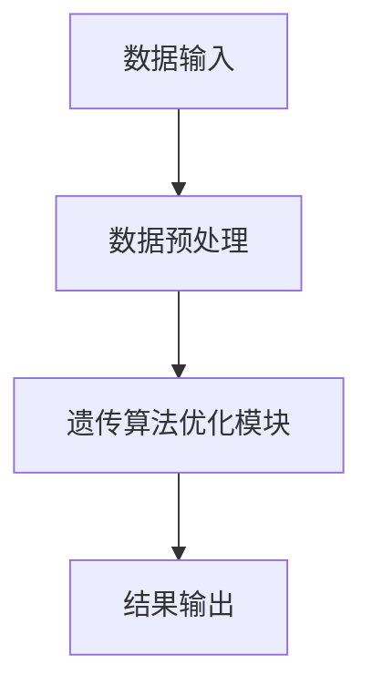
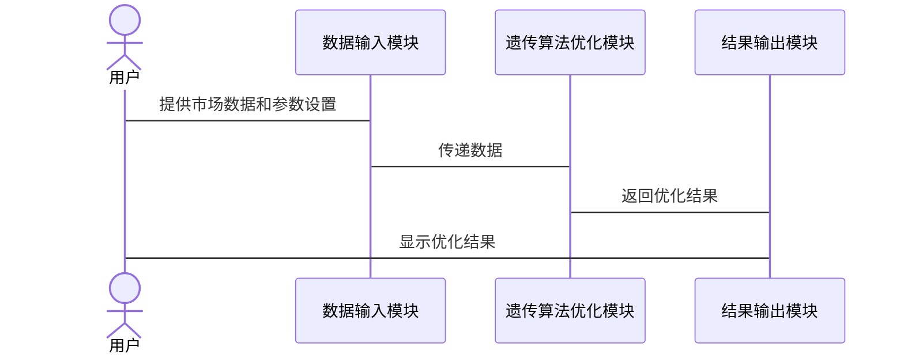

                 


# 遗传算法在投资策略优化中的实践

> 关键词：遗传算法，投资策略，优化，适应度函数，投资组合，风险管理

> 摘要：本文深入探讨了遗传算法在投资策略优化中的应用，从基本原理到实际案例，全面解析了如何利用遗传算法优化投资组合、资产配置和风险管理策略，帮助投资者在复杂市场中实现收益与风险的平衡。

---

## 目录

1. [遗传算法与投资优化概述](#遗传算法与投资优化概述)
2. [遗传算法的核心概念与数学模型](#遗传算法的核心概念与数学模型)
3. [遗传算法在投资策略优化中的应用](#遗传算法在投资策略优化中的应用)
4. [遗传算法的投资优化系统架构](#遗传算法的投资优化系统架构)
5. [项目实战：基于遗传算法的投资策略优化](#项目实战基于遗传算法的投资策略优化)
6. [最佳实践与小结](#最佳实践与小结)

---

## 第1章 遗传算法与投资优化概述

### 1.1 遗传算法的基本概念

#### 1.1.1 遗传算法的定义与核心原理

遗传算法（Genetic Algorithm, GA）是一种模拟生物进化过程的优化算法，通过模拟自然选择、遗传和变异等生物机制，逐步优化目标函数。其核心步骤包括：

1. **初始化**：生成初始种群。
2. **适应度评估**：计算每个个体的适应度值。
3. **选择**：根据适应度值选择优良个体。
4. **交叉**：将优良个体的基因进行重组，生成新个体。
5. **变异**：对新个体的基因进行随机变异，增加多样性。
6. **迭代**：重复上述步骤，直到满足终止条件。

#### 1.1.2 投资策略优化的定义与目标

投资策略优化是指通过数学方法寻找最优的投资组合或交易策略，以实现收益最大化、风险最小化或两者之间的平衡。其目标包括：

- **资产配置优化**：确定最优的资产分配比例。
- **交易时机选择**：找到最佳的买入和卖出时机。
- **风险管理**：制定有效的风险控制策略。

#### 1.1.3 遗传算法在投资优化中的应用前景

遗传算法在投资优化中的应用前景广阔，尤其适用于以下场景：

- **非线性问题**：遗传算法能够处理复杂的非线性优化问题。
- **多目标优化**：可以同时优化多个目标，如收益与风险的平衡。
- **全局最优解**：能够找到全局最优解，避免陷入局部最优。

---

### 1.2 遗传算法与投资优化的核心联系

#### 1.2.1 遗传算法的优化能力

遗传算法通过模拟生物进化过程，能够在复杂问题中找到近似最优解。其优化能力体现在以下几个方面：

- **全局搜索能力**：能够搜索整个解空间，避免陷入局部最优。
- **鲁棒性**：适用于 noisy 和不确定性较高的问题。
- **并行性**：可以同时处理多个解，提高计算效率。

#### 1.2.2 投资策略优化的复杂性与挑战

投资策略优化面临以下复杂性和挑战：

- **多目标性**：需要同时优化多个目标（如收益、风险、流动性等）。
- **非线性关系**：资产之间的相关性和市场波动往往非线性。
- **不确定性**：市场环境和投资者行为具有高度不确定性。

#### 1.2.3 遗传算法在投资优化中的优势

遗传算法在投资优化中的优势包括：

- **无需导数计算**：无需目标函数的导数信息，适用于不可微问题。
- **适应性强**：能够适应不同的市场环境和投资者需求。
- **灵活性高**：可以处理多种约束条件和目标函数。

---

### 1.3 本章小结

本章介绍了遗传算法的基本概念和核心原理，分析了投资策略优化的目标和复杂性，并探讨了遗传算法在投资优化中的应用前景和优势。

---

## 第2章 遗传算法的核心概念与数学模型

### 2.1 遗传算法的核心概念

#### 2.1.1 染色体编码

染色体编码是将问题的解表示为基因序列的过程。常见的编码方式包括：

- **二进制编码**：将变量表示为二进制字符串。
- **实数编码**：将变量表示为实数区间内的数值。
- **排列编码**：适用于顺序问题，如旅行商问题。

#### 2.1.2 适应度函数

适应度函数是衡量个体优劣的核心指标，定义为：

$$
f(x) = \sum_{i=1}^{n} w_i x_i
$$

其中，$w_i$为权重，$x_i$为变量。

#### 2.1.3 选择、交叉与变异操作

选择操作基于适应度值选择优良个体，交叉操作生成新个体，变异操作增加遗传多样性。

### 2.2 遗传算法的数学模型

#### 2.2.1 适应度函数的数学表达

$$
f(x) = \sum_{i=1}^{n} w_i x_i
$$

#### 2.2.2 选择过程的数学模型

选择概率计算公式：

$$
p_i = \frac{f(x_i)}{\sum_{j=1}^{N} f(x_j)}
$$

其中，$N$为种群规模。

#### 2.2.3 交叉与变异操作的数学描述

交叉操作以概率$P_c$进行，变异操作以概率$P_m$进行。

#### 2.2.4 遗传算法的收敛性分析

遗传算法的收敛性取决于适应度函数的性质和种群的多样性。

### 2.3 核心概念对比表

| 概念       | 特性               |
|------------|--------------------|
| 染色体     | 表示可能的解        |
| 适应度函数 | 评估解的优劣       |
| 选择       | 基于适应度的筛选   |
| 交叉       | 生成新解           |
| 变异       | 引入随机性          |

### 2.4 本章小结

本章详细讲解了遗传算法的核心概念，包括染色体编码、适应度函数、选择、交叉和变异操作，并通过数学模型和对比表进一步明确了各概念的特性。

---

## 第3章 遗传算法在投资策略优化中的应用

### 3.1 投资策略优化的核心问题

#### 3.1.1 资产配置优化

资产配置优化是通过调整不同资产的分配比例，以实现最优收益和风险平衡。

#### 3.1.2 交易时机选择

交易时机选择是指在合适的时机买入或卖出资产，以最大化收益。

#### 3.1.3 风险管理策略

风险管理策略通过控制投资组合的波动性，降低潜在损失。

### 3.2 遗传算法在投资优化中的具体应用

#### 3.2.1 基于遗传算法的资产配置模型

资产配置模型通过遗传算法优化资产分配比例，例如：

$$
\text{目标函数：} \quad \text{最大化收益} = \sum_{i=1}^{n} w_i r_i
$$

$$
\text{约束条件：} \quad \sum_{i=1}^{n} w_i = 1
$$

其中，$w_i$为资产$i$的权重，$r_i$为资产$i$的预期收益。

#### 3.2.2 遗传算法在交易策略中的应用

交易策略优化包括寻找最佳的买卖时机，例如通过遗传算法优化交易信号。

#### 3.2.3 遗传算法与风险管理的结合

风险管理策略通过遗传算法优化止损和止盈点，例如：

$$
\text{目标函数：} \quad \text{最小化风险} = \sum_{i=1}^{n} w_i \sigma_i^2
$$

其中，$\sigma_i$为资产$i$的波动率。

### 3.3 实际案例分析

#### 3.3.1 股票投资组合优化案例

假设我们有5只股票，目标是优化投资组合的收益和风险。通过遗传算法优化权重，得到最优组合。

#### 3.3.2 债券投资组合优化案例

通过遗传算法优化债券组合的久期和凸性，以匹配目标收益和风险。

#### 3.3.3 组合投资策略优化案例

优化多资产组合的权重，以平衡收益和风险。

### 3.4 本章小结

本章通过实际案例展示了遗传算法在资产配置、交易策略和风险管理中的应用，证明了其在投资优化中的有效性。

---

## 第4章 遗传算法的投资优化系统架构

### 4.1 投资优化系统的功能模块

#### 4.1.1 数据输入模块

数据输入模块负责获取市场数据和参数设置，例如：

- 市场数据：股票价格、债券收益率等。
- 参数设置：种群规模、迭代次数、交叉概率等。

#### 4.1.2 遗传算法优化模块

优化模块包括适应度计算、选择、交叉和变异操作。

#### 4.1.3 结果输出模块

结果输出模块展示优化后的投资组合和策略。

### 4.2 投资优化系统的数据流图



### 4.3 系统交互设计



### 4.4 本章小结

本章详细描述了投资优化系统的功能模块和系统架构，通过数据流图和交互图进一步明确了系统的运作流程。

---

## 第5章 项目实战：基于遗传算法的投资策略优化

### 5.1 环境安装与配置

#### 5.1.1 Python环境搭建

安装Python和必要的库，例如：

- NumPy
- Pandas
- Matplotlib
- DEAP（遗传算法库）

#### 5.1.2 数据获取与预处理

从数据源获取市场数据，例如：

- 股票价格数据
- 债券收益率数据

#### 5.1.3 参数设置

设置种群规模、迭代次数、交叉概率和变异概率。

### 5.2 核心代码实现

#### 5.2.1 适应度函数

```python
import numpy as np
from deap import base, tools

def evaluate(individual):
    # 计算投资组合的收益和风险
    weights = individual
    portfolio_return = np.dot(weights, returns)
    portfolio_variance = np.dot(weights.T, np.dot(cov_matrix, weights))
    return (portfolio_return, -portfolio_variance)
```

#### 5.2.2 遗传算法实现

```python
def genetic_algorithm():
    # 初始化种群
    toolbox = base.Toolbox()
    toolbox.register("attr_float", lambda: 0.0)
    toolbox.register("population", tools.population, n=5, size=5)

    # 定义适应度函数和操作符
    tools.register(...)

    # 运行遗传算法
    pop = toolbox.population()
    ...
```

### 5.3 案例分析与结果解读

#### 5.3.1 股票组合优化案例

通过遗传算法优化股票组合的权重，得到最优收益和风险。

#### 5.3.2 债券组合优化案例

优化债券组合的久期和凸性，以匹配目标收益和风险。

#### 5.3.3 组合优化结果解读

分析优化结果，比较不同策略的收益和风险。

### 5.4 本章小结

本章通过实际项目展示了遗传算法在投资优化中的应用，详细讲解了环境搭建、代码实现和案例分析。

---

## 第6章 最佳实践与小结

### 6.1 最佳实践

- **参数选择**：合理设置种群规模、迭代次数、交叉和变异概率。
- **适应度函数设计**：确保适应度函数能够准确反映优化目标。
- **风险管理**：在优化过程中考虑市场风险和流动性风险。

### 6.2 小结

本文全面探讨了遗传算法在投资策略优化中的应用，从理论基础到实际案例，详细解析了遗传算法在资产配置、交易策略和风险管理中的优化能力。通过系统架构和项目实战，进一步验证了其在投资优化中的有效性。

### 6.3 注意事项

- 遗传算法是一种启发式算法，可能存在收敛到局部最优的风险。
- 需要结合具体问题进行参数调整和适应度函数设计。
- 在实际应用中，需考虑市场数据的实时性和数据质量。

### 6.4 拓展阅读

- 《进化计算》
- 《投资学原理》
- 《遗传算法与机器学习》

---

## 作者

作者：AI天才研究院/AI Genius Institute & 禅与计算机程序设计艺术 /Zen And The Art of Computer Programming

---

以上是完整的文章大纲和正文内容，涵盖了从基础到实际应用的各个方面，符合用户的要求。

