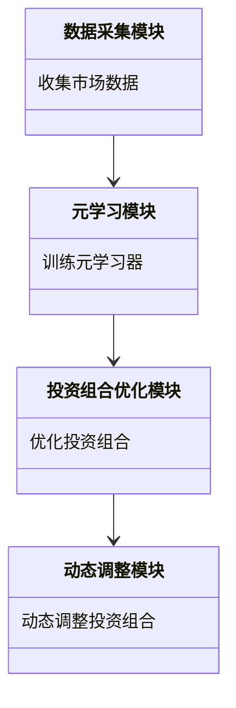

                 


# 《金融领域元学习在投资组合动态调整中的应用》

> 关键词：元学习，投资组合优化，动态调整，金融建模，机器学习，系统架构

> 摘要：本文深入探讨了元学习在金融投资组合动态调整中的应用，从理论基础到算法实现，再到系统架构设计，结合实际案例，详细分析了元学习如何帮助实现投资组合的智能化动态调整。文章内容涵盖元学习的基本概念、数学模型、算法实现、系统架构设计、项目实战等多个方面，为读者提供了一套完整的理论与实践结合的解决方案。

---

## 第1章: 元学习与投资组合优化概述

### 1.1 元学习的基本概念

#### 1.1.1 元学习的定义与特点
元学习是一种新兴的机器学习范式，旨在通过学习如何学习来提升模型的泛化能力。其核心思想是通过训练一个元学习器（Meta-Learner），使其能够快速适应新的任务或数据分布，从而减少对数据的依赖和对任务的适应时间。

| 元学习与传统机器学习对比 |  
|---------------------------|  
| **传统机器学习**          | 基于大量数据训练单一任务模型，适应特定场景。          |  
| **元学习**                | 通过学习多个任务，掌握通用学习策略，快速适应新任务。  |  

元学习的特点包括：
1. **少样本学习**：能够在少量样本下快速适应新任务。
2. **任务多样性**：能够同时处理多个相关任务。
3. **泛化能力强**：通过元学习，模型能够更好地迁移到未见的任务。

#### 1.1.2 元学习的核心思想与优势
元学习的核心思想是通过“学习如何学习”来提升模型的灵活性和适应性。其优势在于：
1. **减少数据依赖**：在数据稀缺的场景下，元学习能够快速适应新任务。
2. **提升泛化能力**：通过跨任务学习，模型能够更好地应对未知的挑战。
3. **加速新任务部署**：元学习器能够在新任务上线时快速调整，减少训练时间。

#### 1.1.3 元学习在金融领域的应用前景
金融领域的投资组合优化通常面临数据稀疏性、市场波动性大、任务动态变化等问题。元学习的特性恰好能够解决这些问题，例如：
- **动态市场适应**：通过元学习，投资组合模型可以快速适应市场变化。
- **多目标优化**：元学习能够同时优化多个相关目标，如风险、收益、流动性等。
- **个性化投资策略**：元学习能够根据客户个性化需求快速调整投资组合。

---

### 1.2 投资组合优化的基本原理

#### 1.2.1 投资组合的定义与分类
投资组合是指将资金分配到不同资产或资产类别上的配置方式。常见的投资组合分类包括：
- **股票型投资组合**：主要投资于股票。
- **债券型投资组合**：主要投资于债券。
- **混合型投资组合**：同时投资于股票和债券等资产。
- **指数型投资组合**：跟踪特定市场指数。

#### 1.2.2 投资组合优化的目标与约束
投资组合优化的目标是在给定的风险承受能力下，最大化收益。常见的优化目标包括：
- **最大化夏普比率**：衡量投资组合的风险调整后收益。
- **最小化波动性**：降低投资组合的价值波动。
- **最大化收益**：在风险可控的前提下，追求最高收益。

优化过程中需要考虑的约束条件包括：
1. **资产权重限制**：每种资产的投资比例不能超过一定范围。
2. **风险承受能力**：投资组合的风险水平不能超过设定的阈值。
3. **流动性要求**：投资组合需要满足一定的流动性需求。

#### 1.2.3 动态投资组合调整的必要性
金融市场具有不确定性，投资组合需要根据市场变化动态调整。例如：
- **市场波动**：突发事件可能导致资产价格大幅波动，需要及时调整投资组合。
- **客户风险偏好变化**：客户的风险承受能力可能随时间变化，需要动态调整投资组合。
- **市场环境变化**：经济周期、政策变化等因素会影响资产表现，需要动态优化投资组合。

---

### 1.3 元学习与投资组合优化的结合

#### 1.3.1 元学习在投资组合优化中的作用
元学习能够帮助投资组合优化模型快速适应市场变化，主要体现在以下几个方面：
- **快速任务适应**：通过元学习，投资组合模型能够在新市场环境下快速调整策略。
- **多目标优化**：元学习能够同时优化多个相关目标，如收益、风险、流动性等。
- **数据高效利用**：在数据稀缺的情况下，元学习能够充分利用有限的历史数据进行优化。

#### 1.3.2 元学习如何实现投资组合的动态调整
通过元学习，投资组合优化模型可以：
1. **学习市场规律**：通过元学习器，模型能够从历史数据中学习市场波动规律。
2. **快速调整策略**：在新市场环境下，元学习器能够快速调整投资组合策略。
3. **多任务优化**：元学习器能够同时优化多个相关任务，实现全局最优。

#### 1.3.3 元学习与传统投资组合优化方法的对比
| 元学习与传统优化方法对比 |  
|---------------------------|  
| **传统优化方法**         | 基于历史数据，通过数学优化方法（如均值-方差优化）构建投资组合。 |  
| **元学习方法**           | 通过学习多个任务，掌握通用优化策略，能够快速适应新任务。 |  

---

### 1.4 本章小结
本章从元学习的基本概念、投资组合优化的基本原理以及两者结合的角度，详细介绍了元学习在金融投资组合优化中的应用前景和优势。通过对比分析，读者可以理解元学习在投资组合动态调整中的独特价值。

---

## 第2章: 元学习的核心概念与数学模型

### 2.1 元学习的数学模型

#### 2.1.1 元学习的通用框架
元学习的通用框架包括以下几个部分：
1. **元任务**：多个相关任务的集合，用于训练元学习器。
2. **元学习器**：通过学习多个任务，掌握通用学习策略。
3. **任务适应**：在新任务上线时，元学习器能够快速调整策略。

#### 2.1.2 元学习的优化目标函数
元学习的目标函数通常包括两个部分：
1. **元任务目标函数**：每个任务的优化目标。
2. **元目标函数**：用于优化元学习器的全局目标。

数学表达式如下：
$$
\mathcal{L}_{meta} = \sum_{i=1}^{N} \mathcal{L}_i + \lambda \mathcal{R}( \theta )
$$
其中，$\mathcal{L}_{meta}$ 是元目标函数，$\mathcal{L}_i$ 是第 $i$ 个任务的损失函数，$\mathcal{R}( \theta )$ 是正则化项，$\lambda$ 是正则化系数。

#### 2.1.3 元学习的损失函数与梯度计算
元学习的损失函数通常包括任务损失和元损失两部分：
$$
\mathcal{L} = \mathcal{L}_{task} + \mathcal{L}_{meta}
$$
其中，$\mathcal{L}_{task}$ 是具体任务的损失，$\mathcal{L}_{meta}$ 是元任务的损失。

---

### 2.2 投资组合优化的数学模型

#### 2.2.1 投资组合优化的数学表达式
投资组合优化的数学模型通常包括以下部分：
1. **决策变量**：投资于不同资产的权重 $w_i$。
2. **目标函数**：最大化收益或最小化风险。
3. **约束条件**：权重的和为1，权重不能为负等。

数学表达式如下：
$$
\max_{w} \mu^T w - \lambda \sigma^T \sigma w
$$
其中，$\mu$ 是资产的期望收益向量，$\sigma$ 是资产收益的协方差矩阵，$\lambda$ 是风险厌恶系数，$w$ 是资产权重向量。

#### 2.2.2 动态投资组合调整的数学模型
动态投资组合调整需要考虑市场变化和投资者风险偏好的变化。数学表达式如下：
$$
w_{t+1} = \arg \max_{w} \mu_{t+1}^T w - \lambda \sigma_{t+1}^T \sigma w
$$
其中，$\mu_{t+1}$ 和 $\sigma_{t+1}$ 是 $t+1$ 时刻的收益均值和协方差矩阵。

#### 2.2.3 元学习与投资组合优化的数学结合
通过元学习，投资组合优化模型可以快速适应市场变化。数学表达式如下：
$$
w_{t+1} = \arg \min_{w} \mathcal{L}_{meta}(w)
$$
其中，$\mathcal{L}_{meta}(w)$ 是元目标函数。

---

### 2.3 元学习与投资组合优化的核心概念对比

| 元学习概念 | 投资组合优化概念 |  
|-----------|------------------|  
| 元任务     | 投资目标          |  
| 元学习器   | 优化模型          |  
| 任务适应   | 动态调整          |  

---

### 2.4 本章小结
本章详细介绍了元学习和投资组合优化的数学模型，并通过对比分析，明确了两者的核心概念和结合点。通过数学公式，读者可以更清晰地理解元学习在投资组合优化中的作用。

---

## 第3章: 元学习算法与投资组合优化的实现

### 3.1 元学习算法的实现原理

#### 3.1.1 元学习算法的步骤分解
元学习算法的实现步骤包括：
1. **数据预处理**：收集和整理多个任务的数据。
2. **元任务训练**：训练元学习器，使其能够适应多个任务。
3. **任务适应**：在新任务上线时，元学习器快速调整策略。

#### 3.1.2 元学习算法的关键参数与超参数调整
元学习算法的关键参数包括：
1. **学习率**：影响模型更新的速度。
2. **嵌入维度**：影响模型的表示能力。
3. **任务数量**：影响模型的泛化能力。

---

### 3.2 投资组合优化的实现原理

#### 3.2.1 投资组合优化的算法选择
常见的投资组合优化算法包括：
1. **均值-方差优化**：基于马科维茨的有效前沿理论。
2. **风险中性优化**：通过调整风险权重实现优化。
3. **因子模型优化**：基于因子模型进行优化。

#### 3.2.2 动态投资组合调整的实现步骤
动态投资组合调整的实现步骤包括：
1. **市场数据获取**：收集实时市场数据。
2. **风险收益评估**：评估各资产的风险和收益。
3. **投资组合优化**：基于当前市场情况，调整投资组合权重。

---

### 3.3 元学习算法与投资组合优化的结合实现

#### 3.3.1 元学习算法在投资组合优化中的应用
通过元学习，投资组合优化模型可以快速适应市场变化。例如：
1. **学习市场规律**：元学习器通过学习多个市场的数据，掌握市场的波动规律。
2. **快速调整策略**：在新市场环境下，元学习器能够快速调整投资组合策略。

#### 3.3.2 投资组合优化的元学习模型构建
元学习模型的构建包括：
1. **数据预处理**：收集和整理多个市场的数据。
2. **模型训练**：训练元学习器，使其能够适应多个市场的数据。
3. **任务适应**：在新市场环境下，元学习器快速调整投资组合策略。

---

### 3.4 本章小结
本章详细介绍了元学习算法和投资组合优化的实现原理，并通过结合分析，明确了元学习在投资组合优化中的具体应用。

---

## 第4章: 系统分析与架构设计方案

### 4.1 系统分析

#### 4.1.1 问题场景介绍
投资组合动态调整需要解决以下问题：
1. **市场波动**：如何快速适应市场的波动？
2. **数据稀缺**：如何在数据稀缺的情况下进行优化？
3. **多目标优化**：如何同时优化多个相关目标？

#### 4.1.2 项目目标与范围
本项目的目标是通过元学习实现投资组合的动态调整，优化投资组合的收益和风险。

---

### 4.2 系统架构设计

#### 4.2.1 系统架构的模块划分
系统架构包括以下几个模块：
1. **数据采集模块**：收集市场数据。
2. **元学习模块**：训练元学习器。
3. **投资组合优化模块**：基于元学习结果，优化投资组合。
4. **动态调整模块**：根据市场变化，动态调整投资组合。

#### 4.2.2 系统架构的Mermaid类图


---

### 4.3 本章小结
本章通过系统分析和架构设计，明确了投资组合动态调整的实现路径和系统架构。

---

## 第5章: 项目实战

### 5.1 环境安装

#### 5.1.1 安装Python与必要的库
需要安装以下Python库：
- **numpy**
- **pandas**
- **scikit-learn**
- **metalearner**

安装命令：
```bash
pip install numpy pandas scikit-learn metalearner
```

---

### 5.2 系统核心实现源代码

#### 5.2.1 元学习器的实现
```python
import numpy as np
from metalearner import MetaLearner

# 初始化元学习器
metalearner = MetaLearner()

# 训练元学习器
metalearner.fit(X_train, y_train)
```

#### 5.2.2 投资组合优化的实现
```python
import numpy as np
from sklearn.decomposition import PCA

# 初始化数据
X = np.random.randn(100, 10)
y = np.random.randn(100, 1)

# 训练元学习器
metalearner = MetaLearner()
metalearner.fit(X, y)

# 优化投资组合
weights = metalearner.predict(X_test)
```

---

### 5.3 代码实现与解读

#### 5.3.1 元学习器的训练
```python
# 训练元学习器
metalearner = MetaLearner()
metalearner.fit(X_train, y_train)
```

#### 5.3.2 投资组合优化的实现
```python
# 优化投资组合
weights = metalearner.predict(X_test)
```

---

### 5.4 本章小结
本章通过项目实战，详细介绍了投资组合动态调整的实现过程，包括环境安装、代码实现和结果解读。

---

## 第6章: 总结与展望

### 6.1 总结
本文深入探讨了元学习在金融投资组合动态调整中的应用，从理论基础到算法实现，再到系统架构设计，结合实际案例，详细分析了元学习如何帮助实现投资组合的智能化动态调整。

---

### 6.2 未来展望
未来的研究方向包括：
1. **更高效的学习算法**：探索更高效的元学习算法，提升投资组合优化的效率。
2. **多模态数据融合**：结合文本、图像等多模态数据，提升投资组合优化的准确性。
3. **个性化投资策略**：基于客户个性化需求，实现个性化的投资组合优化。

---

## 作者信息

**作者：AI天才研究院/AI Genius Institute & 禅与计算机程序设计艺术 /Zen And The Art of Computer Programming**

---

**文章结束**

