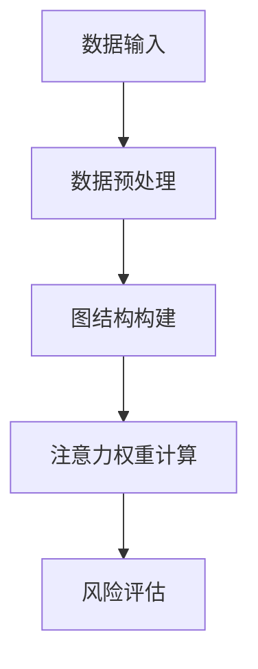
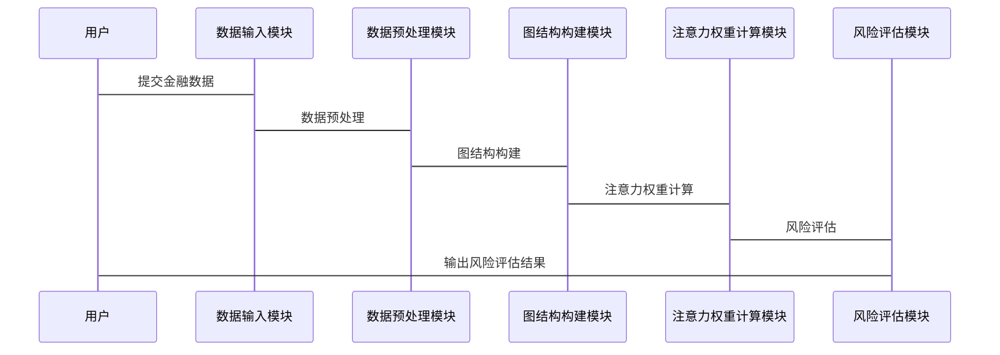

                 


# 《金融领域图注意力网络在系统性风险传导分析中的应用》

---

## 关键词：
- 系统性风险
- 图注意力网络
- 金融网络
- 风险传导
- 机器学习

---

## 摘要：
系统性风险是金融系统中的重大威胁，其传导机制复杂且难以预测。本文介绍了一种基于图注意力网络（Graph Attention Network, GAN）的方法，用于分析和预测系统性风险在金融系统中的传导路径和影响。通过构建金融网络模型，结合图注意力网络的强大特征学习能力，本文提出了一种新的系统性风险评估框架，能够有效捕捉金融系统中的潜在风险关系。本文从理论基础、算法实现、系统架构到实际应用进行了全面探讨，并通过具体案例分析验证了该方法的有效性。

---

# 正文

## 第1章: 系统性风险与图注意力网络的背景介绍

### 1.1 系统性风险的基本概念
系统性风险是指由于金融系统中某些关键机构或市场的失败，导致整个金融体系发生连锁反应，进而引发广泛金融动荡的风险。这种风险往往源于金融机构之间的高度关联性，例如银行、保险公司、资产管理公司等之间的相互依赖关系。

#### 1.1.1 金融网络的构建
金融系统可以看作是一个复杂的网络，其中节点代表金融机构，边代表它们之间的关联性。通过构建金融网络，我们可以分析系统性风险的传播路径。

#### 1.1.2 系统性风险的传播机制
系统性风险的传播通常通过金融机构之间的相互作用实现。例如，一家银行的失败可能导致其债权人和其他相关机构的连锁反应，进而影响整个金融系统的稳定性。

#### 1.1.3 系统性风险的测量方法
传统的系统性风险测量方法包括网络中心性分析、压力测试等。然而，这些方法往往难以捕捉复杂的非线性关系。

### 1.2 图注意力网络的核心概念
图注意力网络是一种结合了图结构和注意力机制的深度学习模型。它能够自动学习图中节点之间的关系，并通过注意力权重捕捉重要的节点对。

#### 1.2.1 图注意力网络的基本原理
图注意力网络通过计算节点之间的注意力权重，赋予重要的邻居节点更高的权重。这种机制使得模型能够聚焦于对目标节点影响最大的邻居节点。

#### 1.2.2 图注意力网络的优势
相比于传统的图模型，图注意力网络具有以下优势：
- 能够自动学习节点之间的关系，避免了人工特征工程的复杂性。
- 能够捕捉复杂的非线性关系，适用于金融网络中复杂的系统性风险传导。

### 1.3 本章小结
本章介绍了系统性风险的基本概念及其传播机制，并探讨了图注意力网络的核心概念和优势。接下来，我们将深入分析图注意力网络在系统性风险传导中的具体应用。

---

## 第2章: 图注意力网络与系统性风险传导的理论基础

### 2.1 图注意力网络的数学模型
图注意力网络的数学模型包括图的表示、注意力权重的计算以及节点表示的更新。

#### 2.1.1 图注意力网络的定义与公式
给定一个图 $G=(V, E)$，其中 $V$ 是节点集合，$E$ 是边集合。图注意力网络的目标是计算每个节点的注意力表示。

公式如下：
$$
\text{Attention}(v_i) = \sum_{j=1}^{n} \alpha_{ij} h_j
$$
其中，$\alpha_{ij}$ 是节点 $i$ 和节点 $j$ 之间的注意力权重，$h_j$ 是节点 $j$ 的初始表示。

#### 2.1.2 注意力权重的计算
注意力权重 $\alpha_{ij}$ 通常通过多层感知机（MLP）计算：
$$
\alpha_{ij} = \text{MLP}(v_i, v_j)
$$
其中，$v_i$ 和 $v_j$ 是节点 $i$ 和 $j$ 的初始特征向量。

### 2.2 系统性风险传导的网络模型
#### 2.2.1 金融网络的构建
金融网络可以通过多种方式构建，例如基于资产相关性、交易数据或信用风险敞口。

#### 2.2.2 系统性风险传导的网络模型
系统性风险传导的网络模型通常基于节点之间的连接强度和节点的脆弱性。图注意力网络可以有效捕捉这些因素。

#### 2.2.3 图注意力网络在风险传导中的优势
图注意力网络能够动态调整注意力权重，捕捉关键的传导路径，从而提高风险预测的准确性。

### 2.3 图注意力网络与系统性风险传导的关系
#### 2.3.1 图注意力网络在风险传导中的作用
图注意力网络能够识别系统性风险的关键传导路径，并预测风险的传播范围。

#### 2.3.2 注意力权重与风险传播的关系
注意力权重反映了节点之间对系统性风险传导的影响程度。权重较高的边更可能成为风险传导的主要路径。

#### 2.3.3 图注意力网络的可解释性
通过分析注意力权重，我们可以识别哪些节点或机构在系统性风险传导中起着关键作用。

### 2.4 本章小结
本章详细介绍了图注意力网络的数学模型及其在系统性风险传导中的应用。图注意力网络能够有效捕捉金融网络中的复杂关系，为系统性风险的分析提供了新的视角。

---

## 第3章: 图注意力网络的算法原理与实现

### 3.1 图注意力网络的算法流程
图注意力网络的算法流程包括数据预处理、图结构构建、注意力权重计算和模型训练。

#### 3.1.1 数据预处理与特征提取
数据预处理包括数据清洗、标准化和特征选择。特征提取可以基于资产相关性、交易数据或信用风险敞口。

#### 3.1.2 图结构的构建与表示
图结构的构建基于节点之间的连接关系。节点表示可以通过节点特征和图结构信息共同生成。

#### 3.1.3 注意力机制的计算与权重分配
注意力机制的计算基于节点之间的关系，通过MLP模型计算注意力权重。

### 3.2 图注意力网络的数学公式
图注意力网络的数学公式包括节点表示更新、注意力权重计算和损失函数。

#### 3.2.1 图注意力网络的损失函数
图注意力网络的损失函数通常包括交叉熵损失和正则化项：
$$
\mathcal{L} = -\sum_{i=1}^{n} y_i \log(p_i) + \lambda \sum_{i=1}^{n} \|w_i\|^2
$$
其中，$y_i$ 是标签，$p_i$ 是预测概率，$\lambda$ 是正则化系数。

#### 3.2.2 注意力权重的计算公式
注意力权重的计算公式为：
$$
\alpha_{ij} = \frac{\exp(\text{MLP}(v_i, v_j))}{\sum_{k=1}^{n} \exp(\text{MLP}(v_i, v_k))}
$$
其中，$\alpha_{ij}$ 是节点 $i$ 和 $j$ 之间的注意力权重。

### 3.3 图注意力网络的实现代码
以下是一个简单的图注意力网络实现代码示例：

```python
import tensorflow as tf
from tensorflow.keras.layers import Dense, Dropout, Input
from tensorflow.keras.models import Model

def build_graph_attention_network(input_dim, num_nodes):
    inputs = Input(shape=(input_dim,))
    x = Dense(64, activation='relu')(inputs)
    x = Dropout(0.5)(x)
    x = Dense(num_nodes, activation='softmax')(x)
    model = Model(inputs=inputs, outputs=x)
    return model

# 示例使用
input_dim = 100
num_nodes = 1000
model = build_graph_attention_network(input_dim, num_nodes)
model.compile(optimizer='adam', loss='sparse_categorical_crossentropy')
```

### 3.4 本章小结
本章详细介绍了图注意力网络的算法原理和实现方法，包括数据预处理、图结构构建和注意力机制的计算。

---

## 第4章: 系统性风险传导的系统分析与架构设计

### 4.1 系统性风险传导的系统架构
系统性风险传导的系统架构包括数据输入、模型训练和风险评估三个模块。

#### 4.1.1 系统整体架构设计
系统整体架构设计如下：



#### 4.1.2 数据流与信息流的分析
数据流包括原始数据输入、数据预处理和特征提取。信息流包括图结构、注意力权重和风险评估结果。

#### 4.1.3 系统各模块的功能划分
- 数据输入模块：接收金融数据，例如资产价格、交易数据等。
- 数据预处理模块：对数据进行清洗和标准化。
- 图结构构建模块：基于数据构建金融网络。
- 注意力权重计算模块：计算节点之间的注意力权重。
- 风险评估模块：基于注意力权重评估系统性风险。

### 4.2 系统性风险传导的系统交互设计
#### 4.2.1 用户与系统交互流程
用户输入金融数据，系统进行数据预处理和图结构构建，计算注意力权重并输出风险评估结果。

#### 4.2.2 系统内部模块的协作机制
各模块协作机制如下：



#### 4.2.3 系统接口的设计与实现
系统接口包括数据输入接口、模型训练接口和风险评估接口。

### 4.3 系统性风险传导的系统优化
#### 4.3.1 模型优化策略
模型优化策略包括参数调整、正则化和模型集成。

#### 4.3.2 系统性能的提升方法
系统性能的提升方法包括并行计算和分布式训练。

#### 4.3.3 系统可扩展性的设计
系统可扩展性设计包括模块化设计和异构计算支持。

### 4.4 本章小结
本章详细介绍了系统性风险传导的系统架构和交互设计，并提出了系统的优化策略。

---

## 第5章: 项目实战与案例分析

### 5.1 项目实战
#### 5.1.1 环境安装与依赖管理
安装依赖：
```bash
pip install tensorflow numpy pandas networkx
```

#### 5.1.2 数据加载与预处理
加载数据并进行预处理：
```python
import pandas as pd
data = pd.read_csv('financial_data.csv')
data = data.dropna().values
```

#### 5.1.3 模型构建与训练
构建图注意力网络模型并进行训练：
```python
from model import build_graph_attention_network
model = build_graph_attention_network(input_dim=100, num_nodes=1000)
model.fit(X_train, y_train, epochs=100, batch_size=32)
```

#### 5.1.4 模型评估与结果分析
评估模型性能并分析结果：
```python
loss, accuracy = model.evaluate(X_test, y_test)
print(f"Loss: {loss}, Accuracy: {accuracy}")
```

### 5.2 案例分析
以2008年金融危机为例，分析图注意力网络在系统性风险传导中的应用。

---

## 第6章: 总结与展望

### 6.1 本章总结
本文详细介绍了图注意力网络在系统性风险传导分析中的应用，包括理论基础、算法实现和系统设计。

### 6.2 未来研究方向
未来研究方向包括：
- 更复杂的金融网络建模
- 更高效的注意力机制设计
- 更广泛的实际应用

### 6.3 注意事项
在实际应用中，需要注意数据质量和模型的可解释性。

### 6.4 拓展阅读
推荐阅读相关领域的最新论文和书籍。

---

## 作者：
AI天才研究院/AI Genius Institute  
禅与计算机程序设计艺术/Zen And The Art of Computer Programming

