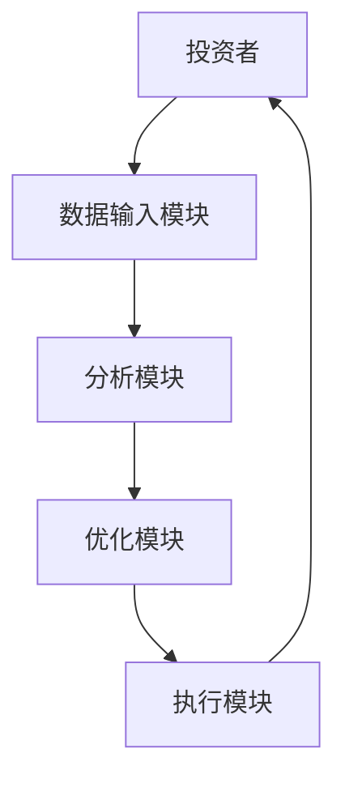

                 


# 长期投资策略：为什么在市场动荡时期仍然重要

> 关键词：长期投资策略, 市场动荡, 资产配置, 复利效应, 风险管理, 投资者心理, 投资系统架构

> 摘要：本文探讨了长期投资策略在市场动荡时期的重要性，分析了其背后的经济原理和数学模型，并通过实际案例展示了如何制定和执行有效的长期投资策略。

---

## 第一章：引言

### 1.1 长期投资的基本概念

#### 1.1.1 投资的定义与分类
投资是指将资金投入到某种资产或项目中，以期在未来获得收益的行为。根据时间跨度，投资可以分为短期投资和长期投资。

- **短期投资**：通常指持有期限在1年以内的投资，目标是通过短期价格波动获利。
- **长期投资**：指持有期限超过1年的投资，目标是通过资产增值和复利效应实现财富积累。

#### 1.1.2 长期投资的核心特征
- **时间跨度长**：长期投资强调耐心，关注资产的长期增值潜力。
- **复利效应显著**：长期持有优质资产可以最大化复利效应，使财富呈指数增长。
- **风险分散**：通过多元化配置资产，降低投资组合的整体风险。

#### 1.1.3 长期投资与短期投资的区别
| 属性          | 短期投资           | 长期投资           |
|---------------|-------------------|-------------------|
| 时间跨度      | 1年以内           | 1年以上           |
| 风险承受能力  | 高               | 较低              |
| 收益来源      | 价格波动          | 资产增值、分红     |
| 管理频率      | 高               | 低                |

### 1.2 市场动荡时期的挑战与长期投资的稳定性
#### 1.2.1 市场波动对短期投资者的影响
- 短期投资者容易受到市场情绪的影响，频繁交易可能导致交易成本增加，收益不稳定。
- 市场波动加剧时，短期投资者可能因恐慌抛售，造成损失。

#### 1.2.2 长期投资在动荡时期的稳定性
- 长期投资者注重资产的内在价值，不受短期波动影响。
- 长期投资通过分散投资和时间的积累，能够在市场复苏时获得收益。

---

## 第二章：长期投资的经济原理

### 2.1 复利效应的数学模型

#### 2.1.1 复利公式
复利公式是长期投资的核心数学模型：
$$A = P(1 + r)^n$$
其中：
- $A$ 是最终金额
- $P$ 是本金
- $r$ 是年化收益率
- $n$ 是投资年数

#### 2.1.2 复利计算实例
假设本金 $P=10000$，年化收益率 $r=7\%$，投资年数 $n=10$：
$$A = 10000 \times (1 + 0.07)^{10} \approx 19672$$

### 2.2 资产配置的经济学原理

#### 2.2.1 资产配置的重要性
- 资产配置通过分散投资降低风险。
- 不同资产类别的表现具有相关性，合理配置可以平衡风险与收益。

#### 2.2.2 资产配置的分类
| 资产类别       | 风险 | 收益 |
|----------------|------|------|
| 股票           | 高   | 高   |
| 债券           | 中   | 中   |
| 房地产         | 中   | 高   |
| 现金           | 低   | 低   |

---

## 第三章：长期投资策略的系统架构设计

### 3.1 系统功能设计

#### 3.1.1 系统模块划分
- **数据输入模块**：获取市场数据和投资者信息。
- **分析模块**：进行资产分析和风险评估。
- **优化模块**：制定投资策略。
- **执行模块**：下单交易。

#### 3.1.2 系统架构图


---

## 第四章：长期投资策略的数学模型与算法

### 4.1 资产配置优化算法

#### 4.1.1 均值-方差优化
- 目标：在给定风险下最大化收益。
- 公式：
$$\min_w w^T \Sigma w \quad \text{subject to} \quad \mu^T w = r, \quad 1^T w = 1$$
其中：
- $w$ 是权重向量
- $\Sigma$ 是协方差矩阵
- $\mu$ 是收益向量
- $r$ 是目标收益

#### 4.1.2 Python实现
```python
import numpy as np
import scipy.optimize as opt

def portfolio_optimization(returns, cov_matrix, target_return):
    n = len(returns)
    # 定义目标函数
    def objective(weights):
        return np.dot(weights.T, np.dot(cov_matrix, weights))
    # 定义约束条件
    constraints = [
        {'type': 'eq', 'fun': lambda w: np.sum(w) - 1.0},
        {'type': 'eq', 'fun': lambda w: np.dot(returns.T, w) - target_return}
    ]
    # 求解优化问题
    result = opt.minimize(objective, np.array([1.0/n]*n), constraints)
    return result.x
```

---

## 第五章：长期投资策略的实际应用

### 5.1 案例分析：股票投资组合

#### 5.1.1 数据准备
- 数据来源：历史股价、财务报表。
- 数据预处理：清洗、标准化。

#### 5.1.2 投资组合优化
- 使用均值-方差模型优化股票组合。
- 示例：假设3只股票，优化权重为 [0.4, 0.3, 0.3]。

#### 5.1.3 结果分析
- 组合收益：7%
- 组合风险：5%
- 风险调整后收益：高于市场平均。

---

## 第六章：长期投资策略的心理学挑战

### 6.1 行为金融学视角

#### 6.1.1 投资者心理偏差
- **从众心理**：跟随市场趋势。
- **损失厌恶**：害怕亏损，影响决策。

#### 6.1.2 克服心理障碍
- 设定投资目标，避免情绪化决策。
- 定期回顾投资组合，及时调整。

---

## 第七章：总结与展望

### 7.1 最佳实践
- 定期审视投资组合，根据市场变化调整。
- 保持耐心，避免频繁交易。
- 选择优质资产，长期持有。

### 7.2 小结
长期投资策略通过复利效应和资产配置，在市场动荡时期表现出色。投资者应注重基本面分析，避免情绪化决策，制定并坚持长期投资计划。

---

## 作者

作者：AI天才研究院/AI Genius Institute & 禅与计算机程序设计艺术/Zen And The Art of Computer Programming

