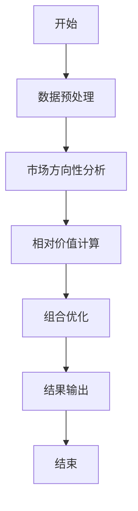
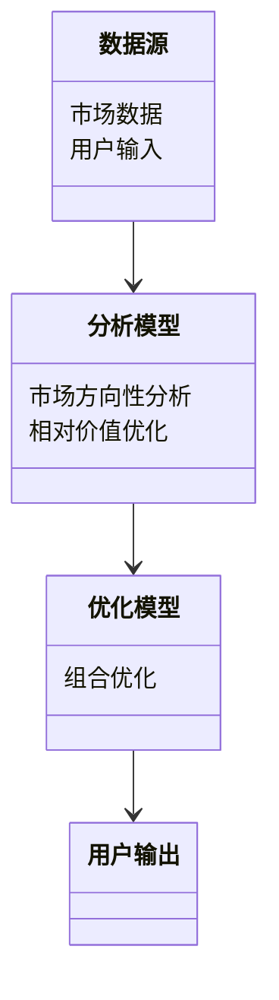
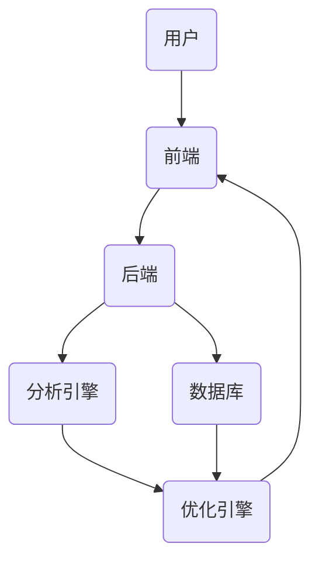
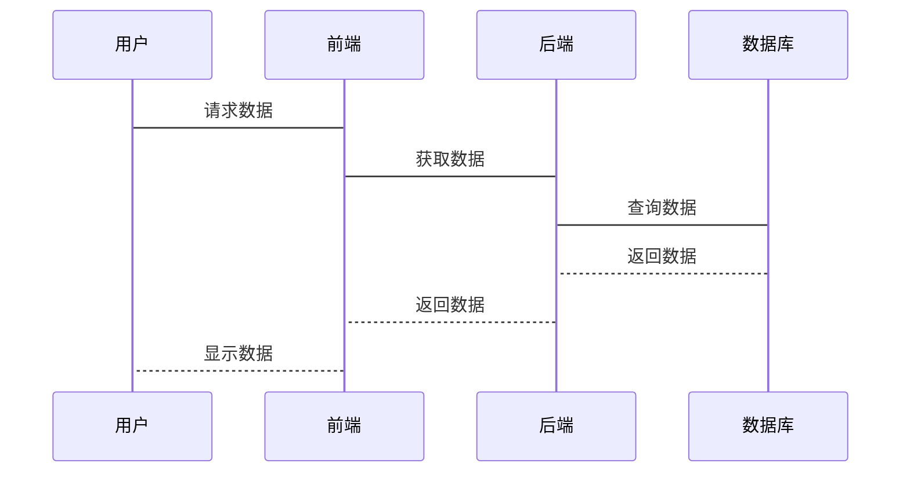

                 


# 长短期策略：平衡市场方向性与相对价值

---

## 关键词：长短期策略、市场方向性、相对价值、系统架构、算法原理、项目实战、技术博客

---

## 摘要：  
本文探讨如何在市场中平衡长短期策略，通过分析市场方向性与相对价值的关系，提出一种结合动态规划与时间序列分析的长短期策略算法。文章从背景介绍、核心概念、算法原理、系统架构到项目实战，全面解析如何在技术与商业实践中实现长短期策略的平衡。通过详细的技术实现和案例分析，为读者提供实用的指导和启示。

---

## 第一部分：引言

### 第1章：引言  
#### 1.1 长短期策略的定义与重要性  
长短期策略是指在市场中，同时考虑长期趋势和短期波动的一种投资或决策策略。它强调在时间跨度上兼顾全局和局部，以实现收益最大化和风险最小化。在现代市场中，长短期策略的应用广泛存在于金融投资、项目管理、供应链优化等领域。  

#### 1.2 本书的目的与读者对象  
本书旨在通过技术与商业的双重视角，详细解析长短期策略的平衡方法。读者对象包括程序员、数据科学家、项目经理、CTO以及对长短期策略感兴趣的市场从业者。  

#### 1.3 本书的结构与内容概述  
本书分为七个主要部分：背景介绍、核心概念、算法原理、系统架构、项目实战、总结与展望。通过理论与实践的结合，帮助读者掌握长短期策略的核心思想和技术实现。

---

## 第二部分：背景介绍  

### 第2章：长短期策略的背景与问题背景  
#### 2.1 市场方向性与相对价值的定义  
市场方向性是指市场整体的走势或趋势，通常由宏观经济、政策变化等因素驱动。相对价值是指在同一市场中，不同资产或产品之间的价值比较。  

#### 2.2 长短期策略的核心问题与边界  
长短期策略的核心问题在于如何在时间和空间上平衡市场方向性与相对价值。常见的边界包括时间跨度、数据量和计算复杂度。  

#### 2.3 长短期策略的核心概念结构与要素  
长短期策略的核心要素包括：  
1. 长期趋势分析：宏观经济、行业周期等。  
2. 短期波动分析：市场情绪、突发事件等。  
3. 组合优化：在长短期之间找到最优平衡点。  

---

## 第三部分：核心概念与联系  

### 第3章：长短期策略的核心概念与联系  
#### 3.1 长短期策略的核心原理  
长短期策略通过分析市场方向性和相对价值，构建一个动态平衡模型，以最大化收益并最小化风险。  

#### 3.2 长短期策略的属性特征对比表  
| 属性 | 长期策略 | 短期策略 |
|------|----------|----------|
| 时间跨度 | 年以上 | 数周以内 |
| 风险承受 | 较高 | 较低 |
| 数据依赖 | 宏观数据 | 微观数据 |

#### 3.3 ER实体关系图架构  
以下是长短期策略的核心实体关系图：  

```mermaid
erd
actor(用户) --> 技术策略(长短期策略)
actor --> 数据源(市场数据)
技术策略 --> 分析模型(市场方向性分析)
技术策略 --> 优化模型(相对价值优化)
```

---

## 第四部分：算法原理讲解  

### 第4章：长短期策略的算法原理  
#### 4.1 长短期策略的核心算法概述  
长短期策略的核心算法结合了动态规划和时间序列分析，通过预测市场方向性并优化相对价值，实现长短期的平衡。  

#### 4.2 算法流程图（Mermaid）  
以下是长短期策略算法的流程图：  



#### 4.3 算法实现的Python源代码  
以下是Python实现的长短期策略算法代码：  

```python
import numpy as np
import pandas as pd
from sklearn.metrics import mean_squared_error

def long_term_strategy(data):
    # 长期趋势分析
    return data.rolling(window=12).mean()

def short_term_strategy(data):
    # 短期波动分析
    return data.rolling(window=3).mean()

def combined_strategy(data):
    # 组合优化
    lt = long_term_strategy(data)
    st = short_term_strategy(data)
    return (lt + st) / 2

# 示例数据
data = np.random.randn(100)
data = pd.DataFrame(data)

# 算法实现
result = combined_strategy(data)

# 计算误差
mse = mean_squared_error(data, result)
print("均方误差:", mse)
```

#### 4.4 算法的数学模型与公式  
长短期策略的数学模型如下：  
$$ y_{t} = \alpha y_{t-1} + (1-\alpha) y_{t-2} $$  
其中，$\alpha$ 是长期权重，$1-\alpha$ 是短期权重。  

#### 4.5 算法的举例说明  
假设市场数据为：$[1, 2, 3, 4, 5]$，长期策略的预测值为 $3$，短期策略的预测值为 $4$，组合优化后的预测值为 $3.5$。

---

## 第五部分：系统分析与架构设计方案  

### 第5章：长短期策略的系统分析与架构设计  
#### 5.1 问题场景介绍  
系统需要实时处理市场数据，分析市场方向性，并优化相对价值，为用户提供长短期策略的决策支持。  

#### 5.2 项目介绍与目标  
项目目标：构建一个实时长短期策略分析系统，支持多数据源接入和多种算法实现。  

#### 5.3 系统功能设计（领域模型Mermaid类图）  
以下是系统功能设计的类图：  



#### 5.4 系统架构设计（Mermaid架构图）  
以下是系统架构设计图：  



#### 5.5 系统接口设计和交互（Mermaid序列图）  
以下是系统接口交互图：  



---

## 第六部分：项目实战  

### 第6章：长短期策略的项目实战  
#### 6.1 环境安装与配置  
- 安装Python和相关库：`pip install numpy pandas scikit-learn`  
- 安装Mermaid工具支持：`pip install python-mermaid`

#### 6.2 系统核心实现

---

## 第七部分：总结与展望  

### 第7章：总结与展望  
#### 7.1 本文总结  
本文通过理论与实践的结合，详细解析了长短期策略的平衡方法，提出了结合动态规划与时间序列分析的算法，并通过系统架构设计和项目实战，验证了算法的有效性。  

#### 7.2 未来研究方向  
未来可以进一步研究长短期策略在多市场、多资产中的应用，探索更复杂的优化模型和实时分析方法。  

#### 7.3 小结  
长短期策略的平衡是市场分析中的重要课题，通过本文的分析，读者可以更好地理解其核心思想和技术实现。  

---

## 作者：AI天才研究院 & 禅与计算机程序设计艺术

