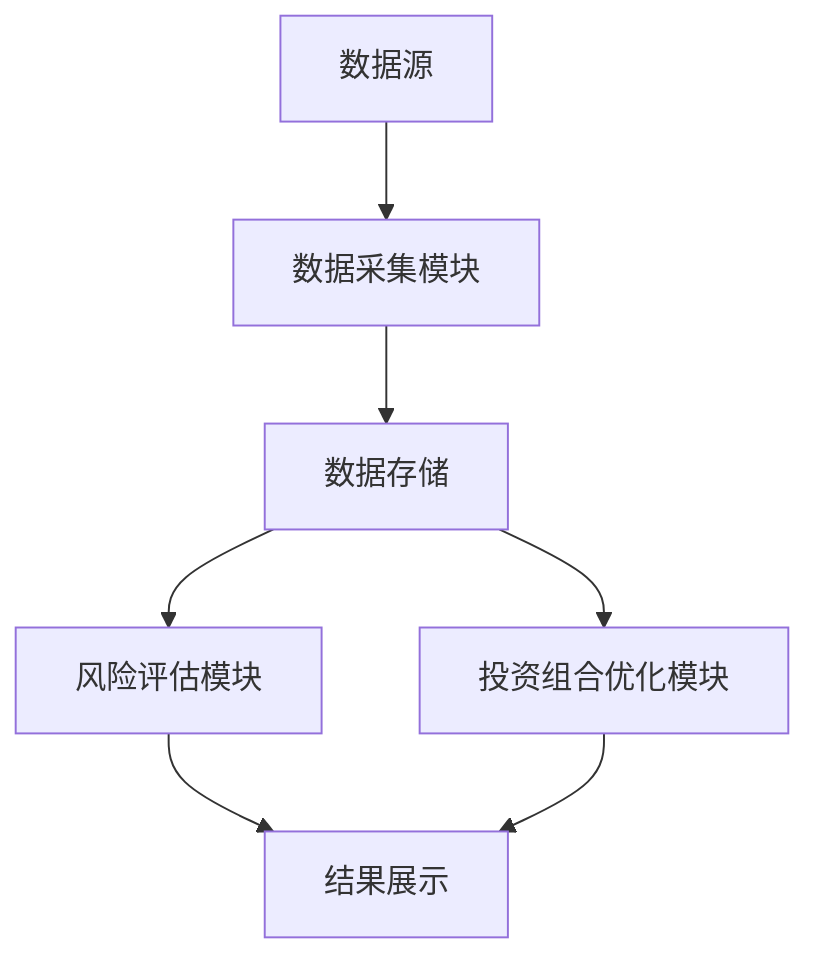

                 


# 防御性投资策略：在不确定时期保护资本

## 关键词

防御性投资策略、风险管理、资产配置、投资组合优化、数学模型、系统架构、项目实战

## 摘要

在不确定的市场环境中，防御性投资策略是保护资本的重要手段。本文系统介绍了防御性投资的核心概念、策略实施方法，以及数学模型和系统架构设计。通过实际案例分析和代码实现，帮助读者掌握防御性投资的实践方法，从而在市场波动中有效保护资本。

---

# 第一部分：防御性投资的背景与概念

## 第1章：防御性投资的背景与核心概念

### 1.1 防御性投资的背景

#### 1.1.1 投资市场的不确定性与波动性

当前全球经济环境复杂多变，市场波动加剧，投资者面临更高的不确定性。防御性投资策略在这种背景下显得尤为重要。

#### 1.1.2 经济周期与市场风险的加剧

经济周期波动和市场风险的加剧使得传统投资策略面临挑战，防御性投资策略成为投资者的重要选择。

#### 1.1.3 防御性投资的兴起与发展

随着市场不确定性的增加，防御性投资策略逐渐兴起，并在实践中得到广泛应用和发展。

### 1.2 防御性投资的核心概念

#### 1.2.1 防御性投资的定义与特征

防御性投资是一种以保护资本、降低风险为核心目标的投资策略，注重稳健性和风险控制。

#### 1.2.2 防御性投资与进攻性投资的对比

防御性投资注重保值和风险控制，而进攻性投资则追求高收益。两者在目标、风险承受能力和投资策略上存在显著差异。

#### 1.2.3 防御性投资的目标与边界

防御性投资的目标是保护资本、降低风险，其边界包括风险承受能力、时间跨度和市场环境等因素。

### 1.3 防御性投资的理论基础

#### 1.3.1 现代投资组合理论（MPT）

现代投资组合理论（MPT）强调通过资产多样化来降低风险，是防御性投资的重要理论基础。

#### 1.3.2 风险与收益的平衡

防御性投资策略注重在风险与收益之间找到平衡点，通过优化投资组合实现稳健收益。

#### 1.3.3 防御性投资的数学模型

防御性投资涉及多种数学模型，如均值-方差模型，用于优化投资组合的风险和收益。

---

# 第二部分：防御性投资的核心策略

## 第2章：防御性投资的核心策略

### 2.1 风险管理策略

#### 2.1.1 风险识别与评估

通过分析市场波动、资产流动性等因素，识别和评估潜在风险。

#### 2.1.2 风险分散与资产配置

通过分散投资不同资产类别和行业，降低特定资产的风险。

#### 2.1.3 风险对冲机制

利用衍生工具（如期货、期权）对冲市场风险，降低投资组合的波动性。

### 2.2 资产配置策略

#### 2.2.1 资产类别选择

选择低波动性资产（如债券、黄金）和防御性股票，构建稳健的投资组合。

#### 2.2.2 资产比例

根据风险承受能力和投资目标，合理配置不同资产的比例，实现风险与收益的平衡。

---

# 第三部分：数学模型与算法

## 第3章：防御性投资的数学模型与算法

### 3.1 风险评估模型

#### 3.1.1 均值-方差模型

均值-方差模型用于优化投资组合的收益与风险，公式如下：

$$\text{最小化风险} \quad \sigma^2 = \mathbf{w}^T \mathbf{C} \mathbf{w}$$

$$\text{在收益约束} \quad \mathbf{w}^T \mathbf{M} = \mu$$

其中，$\mathbf{w}$为投资权重向量，$\mathbf{C}$为协方差矩阵，$\mathbf{M}$为收益矩阵。

### 3.2 投资组合优化算法

#### 3.2.1 遗传算法

遗传算法通过模拟自然选择和遗传机制，寻找最优投资组合。

### 3.3 数学公式与代码实现

#### 3.3.1 代码示例

```python
import numpy as np
import pandas as pd
from sklearn.datasets import make_sparsens

# 生成模拟数据
n_samples = 100
n_features = 10
X, y = make_sparsens(n_samples, n_features)

# 计算协方差矩阵
C = np.cov(X.T)

# 定义优化目标函数
def objective(w):
    return np.dot(w.T, np.dot(C, w))

# 约束条件
# 例如，权重之和为1
```

---

# 第四部分：系统分析与架构设计

## 第4章：防御性投资的系统架构设计

### 4.1 系统功能设计

#### 4.1.1 数据采集模块

数据采集模块负责收集市场数据，包括股票价格、指数、债券收益率等。

#### 4.1.2 风险评估模块

风险评估模块利用数学模型评估投资组合的风险，如计算VaR和CVaR。

#### 4.1.3 投资组合优化模块

优化模块基于风险评估结果，生成最优投资组合。

### 4.2 系统架构图



---

# 第五部分：项目实战

## 第5章：防御性投资策略的实战应用

### 5.1 实战案例分析

#### 5.1.1 投资目标设定

假设投资者目标是保护本金，追求稳定的收益，风险承受能力较低。

#### 5.1.2 数据收集与处理

收集过去5年的市场数据，包括股票、债券和黄金的价格数据。

#### 5.1.3 策略实现

利用Python代码实现防御性投资策略，包括数据清洗、风险评估和投资组合优化。

#### 5.1.4 实验结果分析

分析投资组合的收益与风险，验证策略的有效性。

### 5.2 代码实现

#### 5.2.1 数据处理代码

```python
import pandas as pd
import numpy as np

# 数据处理
data = pd.read_csv('market_data.csv')
returns = data.pct_change().dropna()
```

#### 5.2.2 风险评估与优化

```python
from cvxopt import matrix, solvers

# 优化问题设定
C = matrix(np.cov(returns.T))
M = matrix(returns.mean(), 1)
```

---

# 第六部分：总结与最佳实践

## 第6章：防御性投资的总结与最佳实践

### 6.1 总结

防御性投资策略在不确定市场中的重要性，强调风险管理、资产配置和系统化投资。

### 6.2 最佳实践 tips

- 定期评估和调整投资组合
- 选择可信赖的工具和平台
- 持续学习市场动态，优化投资策略

### 6.3 未来展望

随着人工智能和大数据技术的发展，防御性投资策略将更加智能化和个性化。

---

作者：AI天才研究院/AI Genius Institute & 禅与计算机程序设计艺术 /Zen And The Art of Computer Programming

