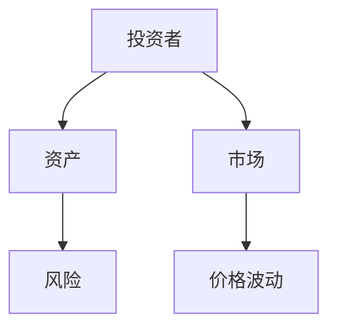

                 


# 防御性投资：在市场动荡中保护资本的策略

---

## 关键词：
防御性投资、资本保护、风险管理、资产配置、投资策略、市场波动

---

## 摘要：
在市场波动加剧的背景下，防御性投资作为一种以资本保值为核心目标的投资策略，逐渐受到投资者的广泛关注。本文从防御性投资的核心概念出发，结合数学模型、算法原理和实际案例，系统性地阐述了防御性投资的策略体系，包括风险评估、资产配置、投资组合优化等关键环节。同时，本文还探讨了防御性投资在实际操作中的系统架构设计、心理因素影响以及未来发展趋势，为投资者提供了一套全面的防御性投资解决方案。

---

## 第一部分：防御性投资的背景与核心概念

---

### 第1章：防御性投资的背景与目标

#### 1.1 市场波动与投资风险
- **1.1.1 市场波动的定义与特征**  
  市场波动是指资产价格在短时间内剧烈波动的现象，通常由市场情绪、经济基本面变化或外部事件引发。波动性越高，投资风险越大。

- **1.1.2 投资风险的分类**  
  - 系统性风险：影响整个市场的风险，如经济衰退、通货膨胀等。  
  - 非系统性风险：特定资产或行业的风险，如公司违约、行业政策变化等。  

- **1.1.3 防御性投资的必要性**  
  在市场波动加剧的情况下，防御性投资能够通过分散投资、降低风险敞口等方式，帮助投资者在市场下跌时减少损失，实现资本保值。

#### 1.2 防御性投资的核心目标
- **1.2.1 资本保值的重要性**  
  防御性投资的核心目标是确保资本不受损失或尽量减少损失，而不是追求超额收益。

- **1.2.2 风险控制与收益平衡**  
  防御性投资强调在控制风险的前提下，通过稳定的投资收益实现资本增值。

- **1.2.3 长期投资策略的制定**  
  防御性投资注重长期视角，通过持续优化投资组合，在市场周期中保持稳健收益。

#### 1.3 防御性投资的边界与外延
- **1.3.1 投资范围的界定**  
  防御性投资主要集中在低风险资产，如债券、黄金、房地产等，同时也包括优质股票和ETF。

- **1.3.2 防御性与进攻性投资的区分**  
  - 防御性投资：以资本保值为核心，注重风险控制。  
  - 进攻性投资：以追求超额收益为目标，风险承受能力较高。  

- **1.3.3 防御性投资的适用场景**  
  在市场下行周期或经济不确定性增加时，防御性投资策略尤为重要。

#### 1.4 防御性投资的核心要素
- **1.4.1 资产配置的多样性**  
  通过分散投资不同资产类别，降低投资组合的整体风险。

- **1.4.2 风险管理的系统性**  
  建立完善的风险评估和监控体系，及时调整投资策略。

- **1.4.3 投资纪律的严格性**  
  遵循既定的投资策略和纪律，避免情绪化决策。

#### 1.5 本章小结
本章通过分析市场波动与投资风险的关系，明确了防御性投资的核心目标和实施边界，为后续章节的策略分析奠定了基础。

---

### 第2章：防御性投资的核心概念与联系

#### 2.1 防御性投资的原理
- **2.1.1 风险厌恶理论**  
  投资者普遍厌恶风险，愿意在承担较低风险的情况下追求稳定收益。

- **2.1.2 现代投资组合理论（MPT）**  
  MPT强调通过分散投资降低非系统性风险，构建最优投资组合。

- **2.1.3 马科维茨的有效前沿**  
  有效前沿是指在给定风险水平下，能够提供最高预期收益的投资组合曲线。

#### 2.2 核心概念对比表格
| 概念         | 防御性投资       | 进攻性投资       |
|--------------|------------------|------------------|
| 目标         | 资本保值         | 追求超额收益     |
| 风险偏好     | 低风险           | 高风险           |
| 资产配置     | 侧重防御性资产   | 侧重进攻性资产   |

#### 2.3 ER实体关系图


#### 2.4 本章小结
本章通过对比分析，明确了防御性投资与其他投资策略的区别与联系，为后续章节的策略实施提供了理论支持。

---

## 第二部分：防御性投资的数学模型与算法原理

---

### 第3章：防御性投资的数学模型与算法原理

#### 3.1 风险评估模型
- **3.1.1 夏普比率**  
  夏普比率衡量投资组合相对于其风险的超额收益能力。  
  $$ \text{夏普比率} = \frac{E[r_i] - r_f}{\sigma_i} $$  
  其中，$E[r_i]$ 是投资组合的预期收益，$r_f$ 是无风险利率，$\sigma_i$ 是投资组合的收益波动率。

- **3.1.2 风险调整后收益**  
  通过夏普比率，投资者可以在不同风险水平下比较不同投资组合的收益表现。

#### 3.2 投资组合优化算法
- **3.2.1 现代投资组合理论（MPT）**  
  MPT通过优化投资组合的收益与风险比，找到最优资产配置。  
  ```mermaid
  graph TD
      I[投资者] --> M[市场]
      M --> P[价格波动]
      P --> R[风险]
      R --> O[优化]
      O --> S[最优组合]
  ```

- **3.2.2 数学公式**  
  投资组合优化的目标是最大化夏普比率：  
  $$ \max \frac{E[r_p] - r_f}{\sigma_p} $$  
  其中，$r_p$ 是投资组合的收益，$\sigma_p$ 是投资组合的波动率。

#### 3.3 数学公式
- **夏普比率计算示例**  
  假设投资组合的预期收益为8%，无风险利率为2%，投资组合的波动率为5%。  
  $$ \text{夏普比率} = \frac{8\% - 2\%}{5\%} = 1.2 $$

---

## 第三部分：防御性投资的系统架构与风险管理

---

### 第4章：防御性投资的系统架构设计

#### 4.1 系统功能设计
- **领域模型**  
  ```mermaid
  graph TD
      U[用户] --> P[投资组合]
      P --> A[资产]
      A --> R[风险]
      R --> M[市场]
  ```

- **系统架构**  
  ```mermaid
  graph TD
      U[用户] --> C[控制层]
      C --> D[数据层]
      D --> A[资产层]
      C --> R[风险层]
      R --> M[市场层]
  ```

#### 4.2 系统接口设计
- **输入接口**  
  - 用户输入：目标收益、风险承受能力、投资期限。  
- **输出接口**  
  - 投资组合建议：资产配置比例、预期收益、波动率。

#### 4.3 系统交互设计
- **交互流程**  
  ```mermaid
  graph TD
      U[用户] --> I[输入目标]
      I --> P[计算投资组合]
      P --> O[输出结果]
  ```

#### 4.4 本章小结
本章通过系统架构设计，展示了防御性投资策略的实现方式，为后续章节的项目实战提供了技术基础。

---

## 第四部分：防御性投资的项目实战与心理因素

---

### 第5章：防御性投资的项目实战

#### 5.1 环境配置
- **安装Python环境**  
  使用Anaconda或PyCharm等工具搭建Python开发环境。

- **安装依赖库**  
  安装Pandas、NumPy、Matplotlib等数据分析库。

#### 5.2 核心实现
```python
import numpy as np
import pandas as pd

# 示例：计算投资组合的夏普比率
def calculate_sharpe_ratio(returns, risk_free_rate):
    excess_returns = returns - risk_free_rate
    sharpe_ratio = excess_returns.mean() / excess_returns.std()
    return sharpe_ratio

# 数据加载与处理
data = pd.read_csv('assets.csv')
returns = data.pct_change().dropna()

# 计算夏普比率
sharpe_ratio = calculate_sharpe_ratio(returns, 0.02)
print(f"夏普比率：{sharpe_ratio}")
```

#### 5.3 案例分析
- **案例背景**  
  假设我们有三只股票和一只债券，目标是构建一个防御性投资组合。

- **资产配置比例**  
  根据夏普比率计算结果，股票配置比例为40%，债券配置比例为60%。

#### 5.4 本章小结
本章通过具体案例展示了防御性投资策略的实施过程，帮助读者理解理论与实践的结合。

---

### 第6章：防御性投资的心理因素

#### 6.1 投资者心理与防御性投资
- **恐惧与贪婪**  
  在市场波动中，投资者常常因恐惧而出局，因贪婪而追高。

- **心理锚定效应**  
  投资者往往过度依赖过去的经验，导致决策失误。

#### 6.2 心理因素对防御性投资的影响
- **决策纪律性**  
  防御性投资需要严格的纪律性，避免情绪化决策。

- **风险管理的心理障碍**  
  投资者往往不愿意接受损失，导致仓位过度集中。

#### 6.3 应对策略
- **心理调节技巧**  
  - 设定止损线，避免情绪化决策。  
  - 定期复盘，分析投资决策的合理性。  

#### 6.4 本章小结
本章通过分析投资者心理因素，强调了心理调节在防御性投资中的重要性。

---

## 第五部分：防御性投资的未来趋势与总结

---

### 第7章：防御性投资的未来趋势

#### 7.1 ESG投资的崛起
- **ESG投资的核心理念**  
  环境（Environmental）、社会（Social）、治理（Governance）因素越来越受到投资者的重视。

#### 7.2 科技对防御性投资的影响
- **大数据与人工智能**  
  利用大数据和AI技术，投资者可以更精准地预测市场波动，优化投资组合。

#### 7.3 数字化与智能化投资
- **智能投顾服务**  
  通过算法推荐投资组合，帮助投资者实现自动化、智能化的防御性投资。

#### 7.4 本章小结
本章展望了防御性投资的未来发展趋势，强调了科技创新在投资策略中的重要性。

---

## 第8章：总结与展望

### 8.1 总结
防御性投资是一种以资本保值为核心目标的投资策略，通过分散投资、风险管理和资产配置，帮助投资者在市场波动中实现稳健收益。

### 8.2 展望
随着科技的不断进步和市场环境的变化，防御性投资将更加依赖于数据驱动和智能化技术，投资者需要不断学习和适应新的投资策略。

---

## 作者：AI天才研究院/AI Genius Institute & 禅与计算机程序设计艺术 /Zen And The Art of Computer Programming

