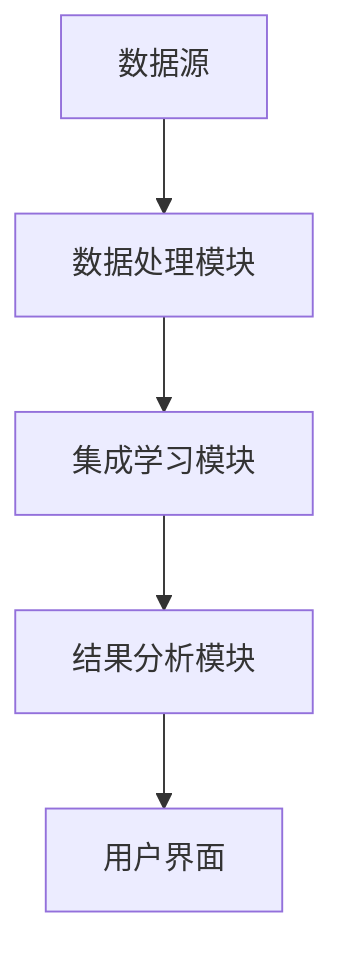

                 


# 集成学习方法在股票选择中的应用

> 关键词：集成学习，股票选择，特征选择，模型组合，数学模型

> 摘要：本文详细探讨了集成学习方法在股票选择中的应用，从基本概念到算法原理，再到系统设计和实战项目，全面分析了集成学习在股票选择中的优势和具体实现方法。通过丰富的实例和详细的数学推导，展示了如何利用集成学习提高股票选择的准确性和稳定性。

---

# 第1章: 集成学习与股票选择的背景介绍

## 1.1 集成学习的基本概念

### 1.1.1 什么是集成学习
集成学习是一种机器学习技术，通过将多个个体学习器（如决策树、线性回归等）组合起来，形成一个整体的预测模型。集成学习的核心思想是“群体智慧”，即通过多个个体模型的协同工作，提升整体的预测性能。

$$
\text{集成学习} = \{M_1, M_2, ..., M_k\} \rightarrow \text{集成模型}
$$

### 1.1.2 集成学习的核心思想
集成学习的核心思想是通过多样化个体模型的组合，降低单一模型的预测误差。多样化的实现可以通过数据扰动、特征选择、模型结构变化等方式实现。

### 1.1.3 集成学习的优势与应用场景
集成学习具有高准确性和高稳定性，广泛应用于分类、回归、特征选择等领域。在股票选择中，集成学习可以帮助提高预测的准确性和鲁棒性。

---

## 1.2 股票选择的基本问题

### 1.2.1 股票选择的基本概念
股票选择是指通过分析市场数据，选择具有较高投资价值的股票。股票选择的核心在于预测股票的未来表现，通常基于历史数据、财务指标、市场情绪等信息。

### 1.2.2 股票选择中的主要挑战
股票市场的复杂性和不确定性使得股票选择具有较高的难度。具体挑战包括数据噪声多、市场波动大、模型过拟合等问题。

### 1.2.3 股票选择的常见方法
股票选择的常见方法包括基本面分析、技术分析、量化分析等。量化分析通过数学模型和算法，对市场数据进行分析和预测。

---

## 1.3 集成学习在股票选择中的应用

### 1.3.1 集成学习如何解决股票选择问题
集成学习通过组合多个个体模型，可以有效降低预测误差，提高预测的准确性和稳定性。在股票选择中，集成学习可以用于特征选择、样本选择、模型选择和组合优化等方面。

### 1.3.2 集成学习在股票选择中的优势
集成学习在股票选择中的优势包括：
1. 提高预测的准确性。
2. 增强模型的鲁棒性。
3. 降低模型的过拟合风险。

### 1.3.3 集成学习在股票选择中的实际案例
实际案例包括利用集成学习对股票的涨跌进行预测，通过组合多个分类器（如决策树、支持向量机等）来提高预测的准确性。

---

# 第2章: 集成学习的核心概念与原理

## 2.1 集成学习的核心概念

### 2.1.1 分类与回归
分类和回归是机器学习中的两大主要任务。分类适用于股票的涨跌预测，而回归适用于股票价格的预测。

### 2.1.2 Bagging与Boosting
Bagging是一种基于数据扰动的集成方法，通过生成多个训练样本集来构建多个个体模型。Boosting是一种基于误差关注的集成方法，通过逐层优化模型的预测误差。

### 2.1.3 投票与加权
投票和加权是集成学习中常用的组合策略。投票适用于分类问题，加权适用于回归问题。

---

## 2.2 集成学习的分类方法

### 2.2.1 并行集成
并行集成是同时构建多个个体模型，并通过投票或加权的方式进行组合。并行集成适用于计算资源丰富的场景。

### 2.2.2 串行集成
串行集成是逐步构建个体模型，并通过前一个模型的预测结果来调整后续模型的训练数据。串行集成适用于计算资源有限的场景。

### 2.2.3 混合集成
混合集成是结合并行集成和串行集成的方法，通过混合两种策略来优化预测性能。

---

## 2.3 集成学习的数学模型

### 2.3.1 基础模型的构建
个体模型的构建是集成学习的基础。例如，决策树、支持向量机等都可以作为基础模型。

$$
M_i = f(x) \rightarrow y
$$

### 2.3.2 集成模型的构建
集成模型通过组合多个个体模型的预测结果，形成最终的预测模型。

$$
F(x) = \sum_{i=1}^k \alpha_i M_i(x)
$$

其中，$\alpha_i$ 是个体模型的权重。

### 2.3.3 模型组合的优化
模型组合的优化是集成学习的关键。通过优化个体模型的权重和组合策略，可以进一步提升预测性能。

---

# 第3章: 集成学习在股票选择中的应用分析

## 3.1 集成学习在股票特征选择中的应用

### 3.1.1 特征选择的基本概念
特征选择是通过筛选重要特征，提高模型的预测性能。在股票选择中，特征选择可以帮助识别影响股票价格的关键因素。

### 3.1.2 集成学习在特征选择中的优势
集成学习可以通过个体模型的预测误差，识别对预测结果贡献较大的特征。

### 3.1.3 基于集成学习的特征选择方法
一种常见的方法是通过个体模型的特征重要性评分，进行加权平均，得到最终的特征重要性排序。

---

## 3.2 集成学习在股票样本选择中的应用

### 3.2.1 样本选择的基本概念
样本选择是指从数据集中选择具有代表性的样本，用于模型的训练和验证。

### 3.2.2 集成学习在样本选择中的优势
集成学习可以通过多次扰动数据集，提高样本的代表性和多样性。

### 3.2.3 基于集成学习的样本选择方法
一种常见的方法是通过Bagging生成多个训练样本集，分别进行模型训练，最终组合模型的预测结果。

---

## 3.3 集成学习在股票模型选择中的应用

### 3.3.1 模型选择的基本概念
模型选择是指在多个候选模型中选择最优模型。在股票选择中，模型选择可以帮助提高预测的准确性。

### 3.3.2 集成学习在模型选择中的优势
集成学习可以通过组合多个模型的预测结果，降低单个模型的过拟合风险。

### 3.3.3 基于集成学习的模型选择方法
一种常见的方法是通过Boosting逐步优化模型的预测误差，最终得到最优模型组合。

---

## 3.4 集成学习在股票组合优化中的应用

### 3.4.1 组合优化的基本概念
组合优化是指在多个股票中选择最优的组合，以实现投资收益的最大化。

### 3.4.2 集成学习在组合优化中的优势
集成学习可以通过组合多个股票的预测结果，优化投资组合的风险和收益。

### 3.4.3 基于集成学习的组合优化方法
一种常见的方法是通过Stacking构建元模型，对多个股票的预测结果进行加权组合，得到最终的投资组合。

---

# 第4章: 集成学习算法的数学模型

## 4.1 Bagging算法的数学模型

### 4.1.1 Bagging算法的流程
1. 生成多个训练样本集，每个样本集通过有放回抽样生成。
2. 对每个样本集训练一个个体模型。
3. 对所有个体模型的预测结果进行投票或加权组合，得到最终的预测结果。

### 4.1.2 Bagging算法的数学公式
$$
F(x) = \text{sign}\left(\sum_{i=1}^k \frac{1}{k} M_i(x)\right)
$$

其中，$M_i(x)$ 是个体模型的预测结果，$\frac{1}{k}$ 是个体模型的权重。

---

## 4.2 Boosting算法的数学模型

### 4.2.1 Boosting算法的流程
1. 初始化训练数据的权重，通常设置为均匀分布。
2. 对每个训练样本，根据当前权重训练一个个体模型，并计算预测误差。
3. 根据预测误差调整训练数据的权重，增加难分类样本的权重。
4. 重复步骤2和3，直到达到预设的训练次数。
5. 对所有个体模型的预测结果进行加权组合，得到最终的预测结果。

### 4.2.2 Boosting算法的数学公式
$$
F(x) = \sum_{i=1}^k \alpha_i M_i(x)
$$

其中，$\alpha_i$ 是个体模型的权重，通常通过优化算法确定。

---

## 4.3 Stacking算法的数学模型

### 4.3.1 Stacking算法的流程
1. 生成多个训练样本集，每个样本集通过有放回抽样生成。
2. 对每个样本集训练一个个体模型。
3. 将所有个体模型的预测结果作为新的特征，训练一个元模型。
4. 使用元模型对所有个体模型的预测结果进行组合，得到最终的预测结果。

### 4.3.2 Stacking算法的数学公式
$$
F(x) = M_{\text{meta}}\left(\{M_1(x), M_2(x), ..., M_k(x)\}\right)
$$

其中，$M_{\text{meta}}$ 是元模型，$\{M_1(x), M_2(x), ..., M_k(x)\}$ 是个体模型的预测结果。

---

# 第5章: 集成学习在股票选择中的系统设计

## 5.1 系统功能设计

### 5.1.1 集成学习模块
- 特征选择模块：用于筛选影响股票价格的关键特征。
- 样本选择模块：用于生成多样化的训练样本集。
- 模型选择模块：用于选择最优的个体模型。
- 组合优化模块：用于优化股票组合的风险和收益。

### 5.1.2 数据处理模块
- 数据清洗：处理缺失值、异常值等。
- 数据转换：对数据进行标准化、归一化等处理。
- 数据分块：将数据划分为训练集、验证集和测试集。

### 5.1.3 结果分析模块
- 性能评估：计算模型的准确率、召回率、F1值等。
- 风险分析：评估股票组合的风险和收益。
- 可视化展示：通过图表展示模型的预测结果和实际结果。

---

## 5.2 系统架构设计

### 5.2.1 系统架构图


### 5.2.2 模块交互流程
1. 数据处理模块从数据源获取原始数据，进行清洗和转换。
2. 集成学习模块对处理后的数据进行特征选择、样本选择、模型选择和组合优化。
3. 结果分析模块对集成学习模块的输出结果进行性能评估和风险分析。
4. 用户界面展示结果分析模块的分析结果。

---

## 5.3 接口设计

### 5.3.1 数据接口
- 输入接口：接收原始数据，格式为CSV或Excel。
- 输出接口：输出处理后的数据，格式为标准化或归一化的数据集。

### 5.3.2 模型接口
- 输入接口：接收训练数据和测试数据。
- 输出接口：输出模型的预测结果和性能指标。

---

## 5.4 交互设计

### 5.4.1 用户界面
- 数据可视化界面：展示数据的分布和趋势。
- 模型选择界面：允许用户选择不同的集成学习方法。
- 结果展示界面：展示模型的预测结果和实际结果。

### 5.4.2 界面交互流程
1. 用户在数据可视化界面中选择数据源。
2. 用户在模型选择界面中选择集成学习方法。
3. 系统对选择的数据和方法进行处理和计算。
4. 系统在结果展示界面中显示预测结果和性能指标。

---

# 第6章: 集成学习在股票选择中的项目实战

## 6.1 环境搭建

### 6.1.1 环境要求
- 操作系统：Windows、Linux、MacOS。
- 开发工具：Python、Jupyter Notebook、VS Code。
- 依赖库：scikit-learn、xgboost、lightgbm、matplotlib。

### 6.1.2 环境安装
```bash
pip install scikit-learn xgboost lightgbm matplotlib
```

---

## 6.2 系统核心实现

### 6.2.1 特征选择实现
```python
from sklearn.ensemble import RandomForestClassifier
from sklearn.feature_selection import SelectFromModel

# 初始化特征选择模型
selector = SelectFromModel(RandomForestClassifier(n_estimators=100, random_state=42))
selector.fit(X_train, y_train)

# 获取重要特征
important_features = selector.get_support(indices=True)
X_train_selected = X_train[:, important_features]
X_test_selected = X_test[:, important_features]
```

### 6.2.2 样本选择实现
```python
from sklearn.utils import resample

# 生成多个训练样本集
samples = []
for _ in range(10):
    sample = resample(X_train, y_train, replace=True, random_state=_)
    samples.append(sample)
```

### 6.2.3 模型选择实现
```python
from sklearn.ensemble import BaggingClassifier

# 初始化Bagging分类器
bagging = BaggingClassifier(n_estimators=10, random_state=42)
bagging.fit(X_train_selected, y_train)

# 预测测试集
y_pred = bagging.predict(X_test_selected)
```

### 6.2.4 组合优化实现
```python
from sklearn.ensemble import StackingClassifier

# 初始化Stacking分类器
stacking = StackingClassifier(estimators=[('rf', RandomForestClassifier(n_estimators=100, random_state=42)),
                                         ('gb', GradientBoostingClassifier(n_estimators=100, random_state=42))],
                              final_estimator=LogisticRegression())
stacking.fit(X_train_selected, y_train)

# 预测测试集
y_pred = stacking.predict(X_test_selected)
```

---

## 6.3 代码应用解读与分析

### 6.3.1 特征选择
特征选择通过随机森林模型筛选出对股票价格影响较大的特征，从而提高模型的预测性能。

### 6.3.2 样本选择
样本选择通过有放回抽样生成多个训练样本集，提高数据的多样性和代表性。

### 6.3.3 模型选择
模型选择通过Bagging分类器组合多个随机森林模型，降低模型的过拟合风险，提高预测的稳定性。

### 6.3.4 组合优化
组合优化通过Stacking分类器组合随机森林和梯度提升模型，进一步优化预测性能。

---

## 6.4 实际案例分析

### 6.4.1 数据准备
假设我们有一个包含股票价格、财务指标、市场情绪等特征的数据集。

### 6.4.2 数据处理
对数据进行清洗和转换，处理缺失值和异常值。

### 6.4.3 模型训练
利用集成学习方法对数据进行训练，得到最优的预测模型。

### 6.4.4 模型评估
通过准确率、召回率、F1值等指标评估模型的性能。

### 6.4.5 结果展示
通过图表展示模型的预测结果和实际结果，分析模型的预测性能。

---

## 6.5 项目小结

### 6.5.1 项目总结
通过集成学习方法，我们可以有效提高股票选择的准确性和稳定性。特征选择、样本选择、模型选择和组合优化是集成学习在股票选择中的关键步骤。

### 6.5.2 项目收获
通过本次项目，我们掌握了集成学习在股票选择中的具体实现方法，了解了如何利用集成学习解决实际问题。

### 6.5.3 项目展望
未来可以进一步研究集成学习在股票选择中的优化方法，如深度集成学习、自适应集成学习等。

---

# 第7章: 集成学习在股票选择中的最佳实践

## 7.1 最佳实践 tips

### 7.1.1 数据处理
- 数据清洗：处理缺失值、异常值等。
- 数据转换：对数据进行标准化、归一化等处理。
- 数据分块：将数据划分为训练集、验证集和测试集。

### 7.1.2 模型选择
- 特征选择：通过随机森林、LASSO等方法筛选重要特征。
- 模型组合：通过Bagging、Boosting、Stacking等方法组合多个个体模型。

### 7.1.3 参数调优
- 调整集成学习模型的参数，如学习率、树深等。
- 使用网格搜索等方法进行参数优化。

### 7.1.4 结果分析
- 评估模型的性能，计算准确率、召回率、F1值等指标。
- 分析模型的预测误差，找出改进的方向。

---

## 7.2 小结

通过本文的详细讲解，我们了解了集成学习在股票选择中的应用，掌握了集成学习的核心概念和算法原理，熟悉了系统设计和项目实战的具体步骤。集成学习作为一种强大的机器学习技术，可以在股票选择中发挥重要作用，帮助投资者提高预测的准确性和稳定性。

---

## 7.3 注意事项

### 7.3.1 数据风险
股票市场的数据具有高度的不确定性和波动性，模型的预测结果仅供参考，实际投资需谨慎。

### 7.3.2 模型风险
集成学习虽然可以提高预测的准确性，但也存在过拟合和欠拟合的风险，需通过参数调优和模型评估进行优化。

### 7.3.3 市场风险
股票市场的变化受多种因素影响，模型的预测结果可能受到市场环境变化的影响。

---

## 7.4 拓展阅读

### 7.4.1 深度集成学习
深度集成学习是集成学习的一种高级形式，通过深度学习模型构建个体模型，进一步优化预测性能。

### 7.4.2 自适应集成学习
自适应集成学习是根据数据分布的变化，动态调整个体模型的组合策略，提高模型的适应性。

### 7.4.3 多目标集成学习
多目标集成学习是针对多目标优化问题设计的集成学习方法，可以在多个目标之间进行权衡，优化预测性能。

---

# 作者：AI天才研究院/AI Genius Institute & 禅与计算机程序设计艺术 /Zen And The Art of Computer Programming

