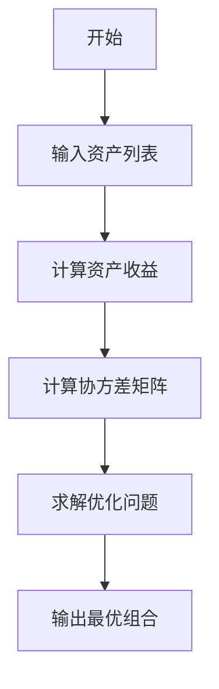
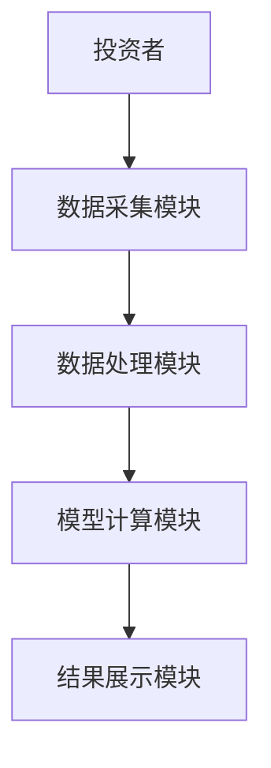

                 


# 《马丁惠特曼的价值投资实践》

---

## 关键词：价值投资、安全边际、内在价值、投资组合、风险控制、投资策略、资产配置

---

## 摘要：  
本文系统地介绍了马丁·惠特曼的价值投资实践方法，从理论基础到实际操作，详细阐述了价值投资的核心理念、安全边际、内在价值计算、投资组合优化等关键点。通过数学模型、算法原理和实际案例分析，帮助读者理解如何在复杂多变的市场环境中，运用价值投资策略实现稳健收益。文章还结合了技术分析和编程实现，展示了如何通过量化方法优化投资决策，为投资者提供了实用的指导和建议。

---

# 第1章: 价值投资的背景与发展

## 1.1 价值投资的起源与演变
### 1.1.1 价值投资的起源
- 价值投资的概念与历史背景。
- 马丁·惠特曼在价值投资领域的重要贡献。

### 1.1.2 价值投资的核心理念
- 安全边际的定义与重要性。
- 内在价值的计算方法与市场定价的关系。

### 1.1.3 价值投资与成长投资的对比
- 价值投资与成长投资的主要区别。
- 不同投资策略在不同市场环境下的表现。

## 1.2 价值投资的市场分析基础
### 1.2.1 市场分析的核心要素
- 宏观经济指标对投资决策的影响。
- 行业分析与个股选择的关系。

### 1.2.2 市场周期与投资策略
- 市场周期的定义与特征。
- 不同周期下的价值投资策略调整。

## 1.3 投资者心理与行为分析
### 1.3.1 投资者心理偏差对投资决策的影响
- 过度自信、从众心理等偏差的具体表现。
- 这些偏差如何影响价值投资的实践。

### 1.3.2 理性决策与非理性决策的对比
- 理性决策在价值投资中的重要性。
- 如何克服非理性决策的干扰。

## 1.4 本章小结
- 总结价值投资的背景与发展，强调安全边际和内在价值的核心地位。

---

# 第2章: 价值投资的核心概念

## 2.1 安全边际的数学模型
### 2.1.1 安全边际的定义与公式
- 安全边际的计算公式：$ \text{安全边际} = \text{内在价值} - \text{市场价格} $
- 安全边际的意义与作用。

### 2.1.2 安全边际的量化指标
- 相对安全边际与绝对安全边际的对比。
- 如何通过安全边际筛选优质投资标的。

## 2.2 内在价值的计算方法
### 2.2.1 内在价值的计算公式
- 股票内在价值的计算公式：$ \text{内在价值} = \frac{\text{未来现金流}}{\text{折现率}} $
- 如何确定合理的折现率。

### 2.2.2 内在价值与市场价值的对比
- 内在价值与市场价值的关系。
- 市场价值波动对投资决策的影响。

## 2.3 投资组合的构建原则
### 2.3.1 投资组合的分散化策略
- 分散化投资的意义与实现方法。
- 如何通过分散化降低投资风险。

### 2.3.2 投资组合的再平衡策略
- 定期再平衡的必要性与具体操作。
- 再平衡策略对投资收益的影响。

## 2.4 本章小结
- 强调安全边际和内在价值在价值投资中的核心地位。

---

# 第3章: 价值投资的算法原理

## 3.1 投资组合优化的数学模型
### 3.1.1 均值-方差优化模型
- 均值-方差优化的目标函数与约束条件。
- 优化模型的数学推导。

### 3.1.2 常见优化算法的选择
- 如何选择适合的优化算法。
- 算法的优缺点对比。

## 3.2 投资组合优化的mermaid流程图


## 3.3 Python源代码实现
```python
import numpy as np
from scipy.optimize import minimize

def portfolio_optimization(returns):
    # 定义目标函数
    def objective(weights):
        return -weights.T.dot(returns.mean()).dot(weights)
    
    # 约束条件
    constraints = [{'type': 'eq', 'fun': lambda w: sum(w) - 1}]
    
    # 求解优化问题
    result = minimize(objective, np.ones(len(returns.columns)) / len(returns.columns), 
                     constraints=constraints)
    
    return result.x

# 示例数据
returns = np.array([[0.1, 0.2, 0.15], 
                    [0.05, 0.1, 0.08], 
                    [0.2, 0.15, 0.25]])
weights = portfolio_optimization(returns)
print(weights)
```

## 3.4 本章小结
- 通过数学模型和代码实现，展示了投资组合优化的具体过程。

---

# 第4章: 价值投资的系统分析

## 4.1 投资系统设计
### 4.1.1 系统功能设计
- 系统需求分析。
- 系统功能模块划分。

### 4.1.2 系统架构设计


### 4.1.3 系统接口设计
- 如何设计系统接口。
- 接口的交互流程。

## 4.2 系统实现与测试
### 4.2.1 数据获取与处理
- 如何获取市场数据。
- 数据清洗与预处理。

### 4.2.2 模型实现与测试
- 如何实现价值投资模型。
- 模型的测试与验证。

## 4.3 本章小结
- 总结系统设计与实现的全过程。

---

# 第5章: 价值投资的项目实战

## 5.1 实战案例分析
### 5.1.1 案例背景介绍
- 选择一个具体的投资案例。
- 分析案例的背景与特点。

### 5.1.2 数据分析与建模
- 如何进行数据清洗与建模。
- 建模过程中遇到的问题与解决方案。

## 5.2 代码实现与解读
```python
import pandas as pd
import numpy as np

# 示例数据
data = pd.DataFrame({
    '股票': ['A', 'B', 'C'],
    '价格': [100, 80, 90],
    '收益': [0.1, 0.2, 0.15]
})

# 计算内在价值
def calculate_intrinsic_value(price, return_on_equity):
    return price * return_on_equity

data['内在价值'] = calculate_intrinsic_value(data['价格'], 0.15)
print(data)
```

## 5.3 案例分析与小结
### 5.3.1 案例分析
- 如何通过价值投资策略选择优质股票。
- 案例分析中的关键点。

### 5.3.2 小结
- 总结项目实战的经验与教训。

---

# 第6章: 价值投资的最佳实践与注意事项

## 6.1 投资策略的调整与优化
### 6.1.1 如何动态调整投资策略
- 市场变化对投资策略的影响。
- 如何根据市场变化调整投资组合。

### 6.1.2 风险控制的技巧
- 如何通过分散化降低投资风险。
- 风险控制的具体实现方法。

## 6.2 价值投资的注意事项
### 6.2.1 如何避免常见错误
- 常见错误及应对策略。
- 如何克服心理偏差的影响。

### 6.2.2 如何保持长期投资心态
- 长期投资的重要性。
- 如何应对短期市场的波动。

## 6.3 本章小结
- 总结价值投资的最佳实践与注意事项。

---

# 作者：AI天才研究院/AI Genius Institute & 禅与计算机程序设计艺术 /Zen And The Art of Computer Programming

