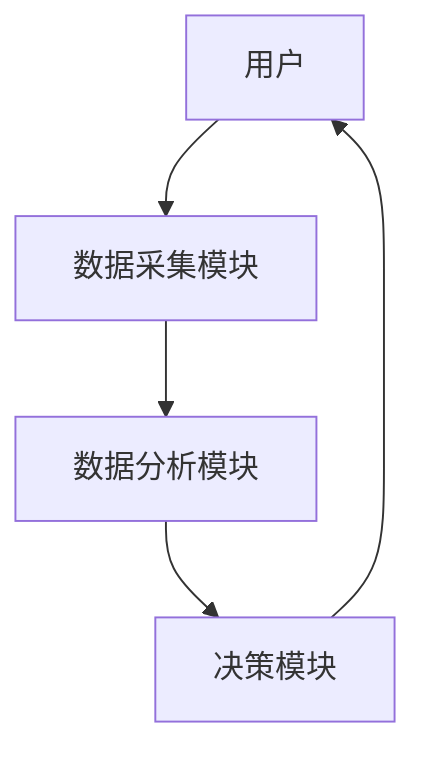
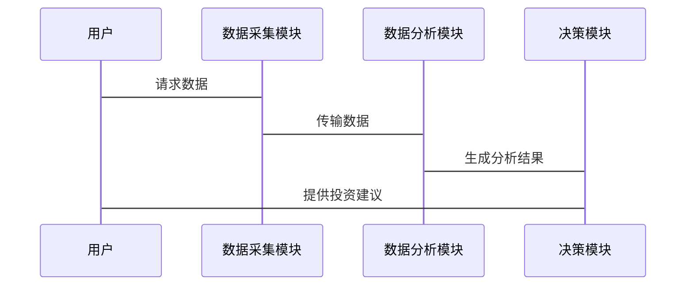

                 


# 马丁惠特曼的特殊情况投资

> 关键词：特殊情况投资，风险管理，资产定价，时间序列分析，投资组合优化，系统架构设计

> 摘要：本文深入探讨了马丁惠特曼的特殊情况投资策略，分析了其背后的数学模型、算法原理和系统架构设计。通过实际案例分析，展示了如何在特殊市场条件下制定有效的投资策略，并提供了最佳实践和未来研究方向的展望。

---

# 第1章 特殊情况投资的定义与背景

## 1.1 特殊情况投资的定义

### 1.1.1 什么是特殊情况投资
特殊情况投资是指在特定市场条件下，针对出现财务困境、资产重组、管理变革或其他特殊事件的企业进行投资的策略。这种投资通常涉及对企业的基本面进行深入分析，以识别潜在的价值。

### 1.1.2 特殊情况投资的特点
- **低估值**：企业在特殊情况下可能被市场低估，提供了较高的安全边际。
- **复杂性**：需要对企业的财务状况、管理团队和行业环境有深入理解。
- **高风险**：由于市场波动和企业特定问题，投资风险较高。

### 1.1.3 特殊情况投资与传统投资的区别
- **投资目标**：传统投资注重长期增长，而特殊情况投资关注短期价值恢复。
- **分析方法**：传统投资依赖宏观经济分析，而特殊情况投资更注重企业基本面分析。

## 1.2 特殊情况投资的背景

### 1.2.1 经济周期与投资机会
在经济衰退或复苏期，许多企业可能面临财务压力，为特殊情况投资者提供了机会。

### 1.2.2 市场波动与投资策略
市场波动为投资者提供了低价买入的机会，但同时也带来了较高的风险。

### 1.2.3 特殊情况投资的历史案例
历史上许多成功案例表明，特殊情况投资可以在市场底部实现超额收益。

---

# 第2章 特殊情况投资的核心概念

## 2.1 市场周期分析

### 2.1.1 经济周期对投资的影响
经济周期分为扩张期、衰退期、萧条期和复苏期，不同阶段适合不同的投资策略。

### 2.1.2 不同周期下的投资策略
- **扩张期**：注重成长型企业。
- **衰退期**：关注低估值企业。
- **萧条期**：寻找破产重组机会。
- **复苏期**：投资于经济恢复的行业。

## 2.2 资产定价模型

### 2.2.1 基本的资产定价理论
资产的公允价值应基于其未来现金流的现值。

### 2.2.2 市场异效与定价偏差
市场价格可能偏离公允价值，为投资者提供套利机会。

### 2.2.3 特殊情况下的资产定价调整
在企业财务困境时，需调整传统的资产定价模型，考虑企业重组的可能性。

## 2.3 风险评估与管理

### 2.3.1 风险的定义与分类
- **系统性风险**：市场波动带来的风险。
- **非系统性风险**：企业特定因素带来的风险。

### 2.3.2 特殊情况下的风险评估方法
- **VaR模型**：衡量潜在损失。
- **CVaR模型**：衡量极端情况下的潜在损失。

### 2.3.3 风险管理策略
- **分散投资**：降低非系统性风险。
- **对冲交易**：利用衍生工具对冲系统性风险。

---

# 第3章 特殊情况投资的数学模型与算法

## 3.1 时间序列分析

### 3.1.1 时间序列的基本概念
时间序列是指按时间顺序排列的数据，常用于预测未来趋势。

### 3.1.2 ARIMA模型的原理
ARIMA（自回归积分滑动平均模型）用于预测时间序列数据。

#### ARIMA模型的公式
$$ ARIMA(p, d, q) $$
其中，$p$ 是自回归阶数，$d$ 是差分阶数，$q$ 是滑动平均阶数。

### 3.1.3 GARCH模型的应用
GARCH（广义自回归条件异方差模型）用于预测金融时间序列的波动性。

#### GARCH模型的公式
$$ GARCH(p, q) $$
其中，$p$ 是自回归阶数，$q$ 是滑动平均阶数。

## 3.2 风险评估模型

### 3.2.1 VaR模型的介绍
VaR（在险值）衡量投资组合在给定置信水平下的潜在损失。

### 3.2.2 CVaR模型的原理
CVaR（条件在险值）衡量在极端情况下的潜在损失。

## 3.3 投资组合优化

### 3.3.1 Markowitz现代投资组合理论
通过优化投资组合的收益和风险，实现收益最大化或风险最小化。

### 3.3.2 基于特殊情况的投资组合优化
在特殊情况下，投资组合应更加注重低估值和高安全边际。

---

# 第4章 投资决策支持系统的系统架构设计

## 4.1 问题场景介绍
设计一个支持特殊情况投资决策的系统，帮助投资者快速分析和决策。

## 4.2 系统功能设计

### 4.2.1 数据采集模块
- 采集企业财务数据、市场数据和新闻数据。

### 4.2.2 数据分析模块
- 应用时间序列分析和资产定价模型进行数据分析。

### 4.2.3 决策模块
- 基于分析结果生成投资建议。

## 4.3 系统架构设计

### 4.3.1 系统架构图


### 4.3.2 系统交互图


---

# 第5章 项目实战：特殊市场条件下的投资策略

## 5.1 环境安装
安装Python和相关库（如Pandas、NumPy、Scikit-learn）。

## 5.2 核心实现代码

### 5.2.1 时间序列预测代码
```python
from statsmodels.tsa.arima_model import ARIMA
import pandas as pd

# 加载数据
data = pd.read_csv('market_data.csv')

# 建立ARIMA模型
model = ARIMA(data['price'], order=(5, 1, 0))
model_fit = model.fit()

# 预测未来价格
forecast = model_fit.forecast(steps=10)
print(forecast)
```

### 5.2.2 风险评估代码
```python
import numpy as np
from scipy.stats import norm

def VaR(data, confidence_level):
    return np.quantile(data, confidence_level)

confidence_level = 0.95
data_series = pd.Series([1, 2, 3, 4, 5])
var = VaR(data_series, confidence_level)
print(var)
```

---

# 第6章 最佳实践与注意事项

## 6.1 投资策略建议
- **分散投资**：避免过度集中。
- **深入研究**：了解企业的基本面。

## 6.2 小结
特殊情况投资需要深入分析和风险管理，才能在市场波动中抓住机会。

## 6.3 注意事项
- 避免盲目跟风。
- 定期审视和调整投资组合。

---

# 第7章 总结与展望

## 7.1 总结
本文全面介绍了马丁惠特曼的特殊情况投资策略，分析了其背后的数学模型和系统架构设计。

## 7.2 未来展望
随着人工智能和大数据技术的发展，特殊情况投资将更加依赖于先进的技术工具和算法。

---

# 作者：AI天才研究院 & 禅与计算机程序设计艺术

---

希望这篇文章能为您提供有价值的见解和灵感！如果需要进一步探讨或有其他问题，请随时联系我。

