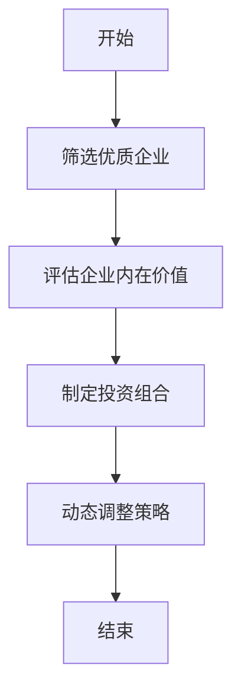

                 


# 专注型价值投资：集中持股策略

> 关键词：专注型投资、集中持股、马里奥·加贝利、价值投资、风险管理

> 摘要：本文深入探讨了马里奥·加贝利的专注型价值投资策略，分析了其核心概念、算法原理、系统架构以及实际应用。通过详细阐述集中持股的优缺点、内在价值评估方法、风险管理策略等，本文为投资者提供了实用的指导和深刻见解。

---

## 第一部分: 专注型价值投资的背景与核心概念

### 第1章: 专注型价值投资的起源与意义

#### 1.1 专注型价值投资的起源

##### 1.1.1 价值投资的定义与发展
价值投资是一种以低于其内在价值的价格购买优质股票的投资策略，其核心在于寻找市场低估的企业。该策略由本杰明·格雷厄姆和戴维·多德提出，强调安全边际和长期持有。

##### 1.1.2 马里奥·加贝利的专注投资理念
加贝利继承并发展了格雷厄姆的价值投资理论，提出“专注型投资”概念，主张将投资组合集中在少数优质企业上，通过深入研究和长期持有实现超额收益。

##### 1.1.3 专注型投资在现代金融中的地位
在现代金融市场中，专注型投资作为一种反主流的投资策略，强调深度研究和长期持有，与短期交易和分散投资形成鲜明对比。

#### 1.2 专注型投资的核心要素

##### 1.2.1 集中持股的定义
集中持股是指将大部分资金投资于少数优质企业，通过长期持有实现收益最大化。

##### 1.2.2 集中持股的优缺点对比
| 优点 | 缺点 |
|------|------|
| 高收益潜力 | 高风险集中 |
| 便于深入研究 | 市场波动影响大 |
| 成本效率高 | 需要较强的心理承受能力 |

##### 1.2.3 专注型投资与分散投资的异同
- **相同点**：都追求长期收益。
- **不同点**：专注型投资强调集中，分散型投资强调风险分散。

#### 1.3 马里奥·加贝利的投资策略

##### 1.3.1 加贝利的投资哲学
加贝利认为，市场短期波动不可预测，但长期趋势可以通过研究企业基本面确定。

##### 1.3.2 集中持股的核心原则
- 选择具有持续竞争优势的企业。
- 买入价格低于内在价值。
- 长期持有优质企业。

##### 1.3.3 长期价值投资的实践
加贝利通过长期持有优质企业，如苹果、可口可乐等，取得了显著的投资收益。

#### 1.4 专注型投资的适用场景

##### 1.4.1 集中投资的适用市场环境
- 稳定的市场环境。
- 投资者具备较强的研究能力。

##### 1.4.2 不同资产类别中的应用
专注型投资不仅适用于股票，还可应用于房地产、私募股权等领域。

##### 1.4.3 专注型投资的边界与限制
- 适用于长期投资者。
- 不适合风险厌恶型投资者。

#### 1.5 本章小结
专注型投资是一种基于长期价值的企业投资策略，通过集中持股实现超额收益，但需要投资者具备深入研究和长期持有的心理素质。

---

## 第2章: 专注型投资的核心概念与联系

### 2.1 核心概念的原理

#### 2.1.1 集中持股的内在逻辑
集中持股通过减少交易成本和管理成本，提高投资收益。

#### 2.1.2 长期价值的评估方法
内在价值是企业未来现金流的现值，是投资决策的基础。

#### 2.1.3 风险管理的核心作用
通过选择优质企业，分散市场风险，降低投资组合波动性。

### 2.2 核心概念的属性对比

#### 2.2.1 集中与分散的对比分析
- **集中投资**：高风险，高收益。
- **分散投资**：低风险，低收益。

### 2.3 实体关系图

#### 2.3.1 投资者与企业的关系
投资者通过持有企业股权，分享企业成长收益。

#### 2.3.2 集中持股与风险控制的关系
集中持股通过选择优质企业，降低投资风险。

#### 2.3.3 长期价值与市场波动的关系
长期价值是市场波动的锚点，指导投资决策。

### 2.4 本章小结
专注型投资通过集中持股和长期价值评估，实现收益最大化，同时通过风险管理降低投资风险。

---

## 第3章: 专注型投资的算法原理

### 3.1 算法原理概述

#### 3.1.1 集中持股的筛选标准
- 企业具备持续竞争优势。
- 企业财务健康，盈利稳定。

#### 3.1.2 价值评估的数学模型
内在价值计算公式：
$$ V = \frac{CF}{r - g} $$
其中，CF为现金流，r为折现率，g为增长率。

#### 3.1.3 风险管理的算法流程
1. 选择优质企业。
2. 评估企业内在价值。
3. 制定投资组合。
4. 动态调整策略。

### 3.2 算法流程图



### 3.3 数学模型与公式

#### 3.3.1 内在价值计算公式
$$ V = \frac{CF}{r - g} $$

#### 3.3.2 风险调整后的价值公式
$$ V_{\text{调整}} = V \times (1 - \text{风险系数}) $$

### 3.4 本章小结
通过算法流程和数学模型，专注型投资能够系统化地筛选优质企业，评估内在价值，制定投资策略。

---

## 第4章: 系统分析与架构设计

### 4.1 系统分析

#### 4.1.1 问题场景介绍
投资者需要通过系统化的方法选择优质企业，制定投资策略。

#### 4.1.2 项目介绍
构建一个专注型价值投资系统，帮助投资者实现集中持股。

### 4.2 系统架构设计

#### 4.2.1 系统功能设计
- 企业筛选模块。
- 价值评估模块。
- 投资组合管理模块。

#### 4.2.2 系统架构图


### 4.3 本章小结
系统架构设计为专注型投资提供了框架支持，确保投资过程的系统化和规范化。

---

## 第5章: 项目实战

### 5.1 环境安装
- 安装Python和相关库（Pandas、NumPy、Matplotlib）。

### 5.2 核心实现源代码

#### 5.2.1 企业筛选模块
```python
import pandas as pd

def select_high_quality Enterprises(df):
    enterprises = df[df['ROE'] > 15]
    enterprises = enterprises[enterprises['Debt_to_Equity'] < 0.5]
    return enterprises
```

#### 5.2.2 价值评估模块
```python
def calculate_intrinsic_value(revenue, cost_of_capital, growth_rate):
    return revenue / (cost_of_capital - growth_rate)
```

#### 5.2.3 投资组合管理模块
```python
def manage_portfolio(enterprises, portfolio_size=5):
    portfolio = enterprises.head(portfolio_size)
    return portfolio
```

### 5.3 代码应用解读与分析
- **企业筛选模块**：筛选ROE高、债务比例低的企业。
- **价值评估模块**：计算企业内在价值。
- **投资组合管理模块**：选择优质企业，构建投资组合。

### 5.4 案例分析
以苹果公司为例，分析其内在价值和投资策略。

### 5.5 本章小结
通过项目实战，验证了专注型投资策略的有效性。

---

## 第6章: 最佳实践与小结

### 6.1 最佳实践 tips

#### 6.1.1 长期思维
专注型投资需要长期持有的耐心。

#### 6.1.2 风险管理
通过选择优质企业，分散投资风险。

#### 6.1.3 持续学习
不断更新知识，提升投资能力。

#### 6.1.4 纪律性
严格按照投资策略执行，避免情绪化决策。

### 6.2 小结
专注型投资是一种有效的投资策略，但需要投资者具备深入研究和长期持有的能力。

### 6.3 注意事项
- 避免盲目集中投资。
- 定期评估投资组合。
- 保持对市场的敏感性。

### 6.4 拓展阅读
推荐阅读《投资最重要的事》、《证券分析》等书籍。

---

## 作者：AI天才研究院/AI Genius Institute & 禅与计算机程序设计艺术/Zen And The Art of Computer Programming

---

**附录**：
- 专注型投资相关术语表
- 马里奥·加贝利的经典语录
- 专注型投资的案例分析

---

**本文由AI天才研究院/AI Genius Institute编写，转载请注明出处。**

