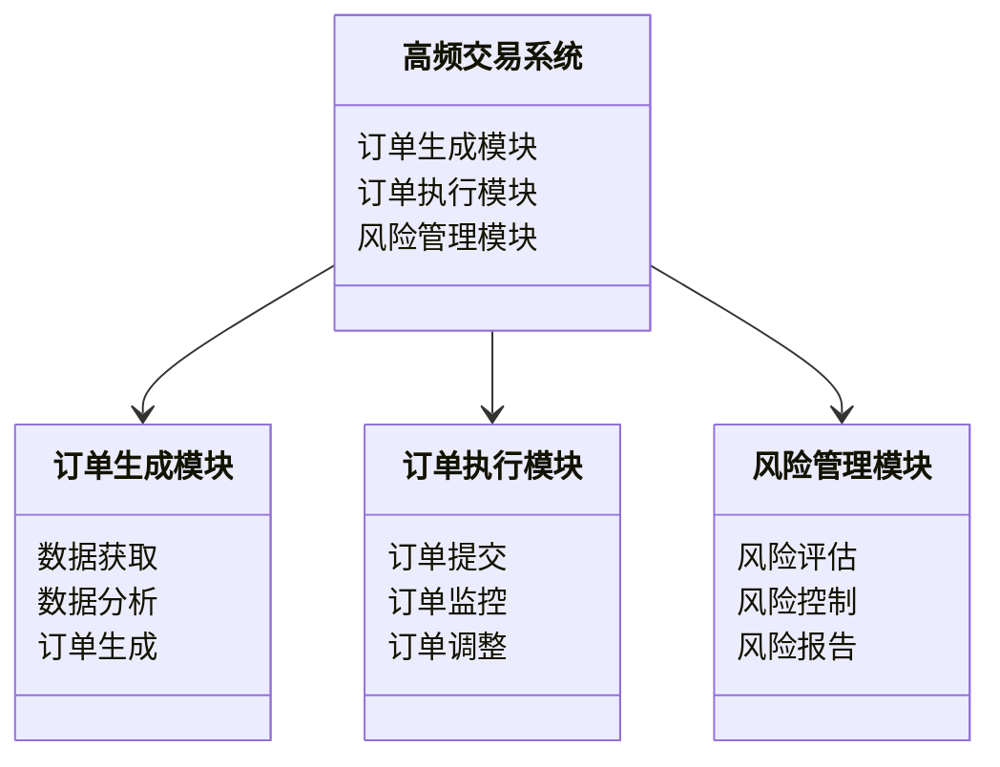
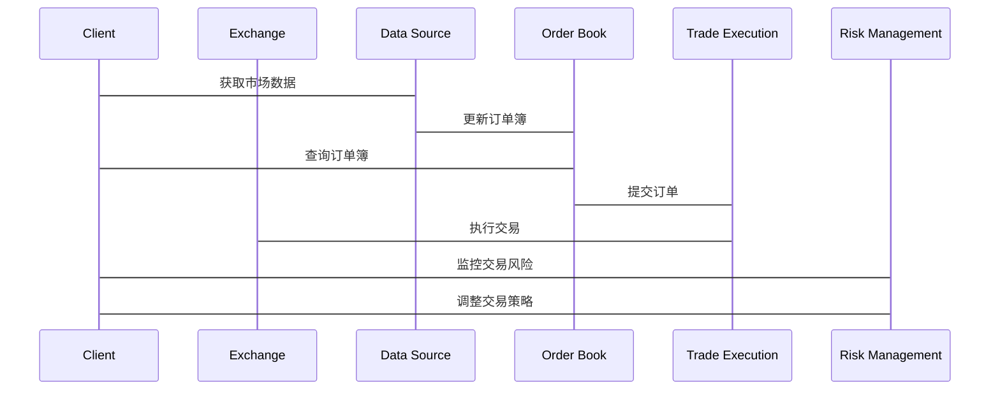

                 


# 高频交易策略：技术创新如何改变市场微观结构

> 关键词：高频交易、算法交易、市场微观结构、低延迟技术、统计套利

> 摘要：高频交易作为一种新兴的交易方式，通过技术创新极大地改变了金融市场微观结构。本文从高频交易的定义、核心概念、算法原理、系统架构以及实际案例等方面进行深入分析，探讨技术创新对市场微观结构的影响，并总结高频交易的未来发展和注意事项。

---

# 第一部分: 高频交易策略概述

## 第1章: 高频交易策略的背景与意义

### 1.1 高频交易的定义与特点

#### 1.1.1 高频交易的定义
高频交易（High-Frequency Trading, HFT）是指通过复杂的算法和高速计算机系统，在极短的时间内进行大量的交易操作。其核心目标是利用市场中的微小价格波动获利。

#### 1.1.2 高频交易的核心特点
高频交易具有以下特点：
- **高速性**：交易系统能够在毫秒甚至微秒级别完成交易决策。
- **自动化**：交易策略完全由算法驱动，无需人工干预。
- **高频性**：在短时间内执行大量交易。
- **低延迟**：对交易系统的延迟要求极低，通常在 microseconds 级别。

#### 1.1.3 高频交易与传统交易的区别
| 特性       | 高频交易          | 传统交易          |
|------------|-------------------|-------------------|
| 交易频率   | 极高              | 较低              |
| 执行速度   | 微秒级别          | 毫秒级别          |
| 交易策略   | 算法驱动          | 人工决策或简单策略|
| 市场影响   | 可能引发短期波动  | 较为稳定          |

### 1.2 高频交易的背景与演变

#### 1.2.1 金融市场的电子化转型
随着互联网和电子交易平台的普及，金融市场逐渐从传统的电话交易和柜台交易转向电子化交易。电子化交易为高频交易提供了基础。

#### 1.2.2 技术进步推动高频交易发展
- **硬件技术**：高速计算机和网络技术的发展使得高频交易成为可能。
- **软件技术**：算法交易和大数据分析技术的进步推动了高频交易的广泛应用。
- **市场结构**：交易所的订单簿（Order Book）公开化和实时化为高频交易提供了数据支持。

#### 1.2.3 高频交易对市场微观结构的影响
高频交易通过快速买卖操作影响市场的微观结构，主要体现在：
- **市场深度**：高频交易增加了市场的流动性。
- **价格发现**：高频交易能够快速响应市场信息，提高价格发现效率。
- **市场波动**：高频交易可能导致市场的短期剧烈波动。

### 1.3 高频交易的市场影响

#### 1.3.1 市场流动性与价格发现
高频交易通过高频买卖操作，增加了市场的流动性。同时，高频交易能够快速响应市场信息，提高了价格发现的效率。

#### 1.3.2 市场波动性与稳定性
高频交易可能导致市场的短期剧烈波动，尤其是在算法出现错误或市场出现突发事件时。然而，高频交易也能够通过快速调整头寸来稳定市场。

#### 1.3.3 高频交易的争议与挑战
- **争议**：高频交易被指责可能导致市场的不公和加剧波动。
- **挑战**：高频交易的技术门槛较高，需要强大的硬件和软件支持。

### 1.4 本章小结
高频交易作为一种新兴的交易方式，通过技术创新极大地改变了金融市场的微观结构。其高速性和自动化的特点使其在提高市场流动性的同时，也带来了市场的短期波动和争议。

---

## 第2章: 高频交易的核心概念与技术

### 2.1 高频交易的关键技术

#### 2.1.1 低延迟技术
低延迟技术是高频交易的核心，主要体现在：
- **硬件优化**：使用高性能的计算机和网络设备，减少交易的延迟。
- **软件优化**：通过优化算法和减少不必要的操作，降低交易时间。

#### 2.1.2 高性能算法
高性能算法是高频交易的灵魂，主要体现在：
- **统计套利算法**：通过分析市场数据，寻找短期的价格波动机会。
- **算法交易算法**：通过预设的策略，在特定条件下自动执行交易。

#### 2.1.3 数据处理与分析
高频交易需要实时处理大量的市场数据，包括订单簿、成交数据和市场新闻。高效的数据处理和分析能力是高频交易成功的关键。

### 2.2 高频交易的策略类型

#### 2.2.1 统计套利策略
统计套利策略通过分析市场数据，寻找价格的短期波动机会。常见的统计套利策略包括：
- **均值回归策略**：通过寻找价格偏离均值的机会进行交易。
- **配对交易策略**：通过分析相关资产的价格差异进行交易。

#### 2.2.2 算法交易策略
算法交易策略是通过预设的算法，在特定条件下自动执行交易。常见的算法交易策略包括：
- **TWAP（Time-Weighted Average Price）**：在指定时间内平均分配订单。
- **VWAP（Volume-Weighted Average Price）**：根据市场成交量加权分配订单。

#### 2.2.3 跨市场套利策略
跨市场套利策略通过同时在多个市场进行交易，利用不同市场的价格差异获利。这种策略需要高频交易系统能够实时监控多个市场的数据。

### 2.3 高频交易的数学模型

#### 2.3.1 时间序列分析
时间序列分析是高频交易中常用的技术，用于分析市场的历史数据，预测未来的价格走势。常见的时间序列分析模型包括：
- **ARIMA模型**：自回归积分滑动模型。
- **GARCH模型**：广义自回归条件异方差模型。

#### 2.3.2 统计套利模型
统计套利模型通过分析资产价格的协方差矩阵，寻找价格的短期波动机会。常见的统计套利模型包括：
- **均值回归模型**：通过寻找价格偏离均值的机会进行交易。
- **市场中性策略**：通过构造市场中性组合，降低市场的系统性风险。

#### 2.3.3 市场微观结构模型
市场微观结构模型用于分析市场的订单簿数据，预测市场的未来走势。常见的市场微观结构模型包括：
- **订单簿模型**：通过分析订单簿的深度和分布，预测市场的买卖力量。
- **市场冲击模型**：通过分析大额交易对市场价格的影响，预测市场的短期波动。

### 2.4 本章小结
高频交易的核心技术包括低延迟技术、高性能算法和数据处理与分析。高频交易的策略类型包括统计套利策略、算法交易策略和跨市场套利策略。高频交易的数学模型包括时间序列分析、统计套利模型和市场微观结构模型。

---

## 第3章: 高频交易的算法原理

### 3.1 高频交易算法概述

#### 3.1.1 算法交易的基本原理
算法交易的基本原理是通过预设的策略，根据市场数据的变化，自动执行交易。高频交易算法的核心在于快速响应市场变化，抓住短期价格波动机会。

#### 3.1.2 高频交易算法的特点
高频交易算法具有以下特点：
- **快速性**：能够在毫秒级别完成交易决策。
- **自动化**：无需人工干预，完全由算法驱动。
- **复杂性**：算法需要考虑多个因素，包括市场数据、交易成本和市场风险。

### 3.2 常见的高频交易算法

#### 3.2.1 时间加权平均价格（TWAP）
TWAP算法是一种常见的高频交易算法，通过在指定时间内均匀分配订单，降低市场冲击。TWAP算法的实现步骤如下：
1. 确定订单总量和时间段。
2. 在时间段内，均匀分配订单，逐步提交订单。
3. 根据订单簿数据，动态调整订单的提交速度。

#### 3.2.2 体积加权平均价格（VWAP）
VWAP算法是一种基于成交量加权的交易算法，通过在指定时间内加权分配订单，降低市场冲击。VWAP算法的实现步骤如下：
1. 确定订单总量和时间段。
2. 在时间段内，根据市场成交量加权分配订单。
3. 根据订单簿数据，动态调整订单的提交速度。

#### 3.2.3 算法套利策略
算法套利策略是一种通过预设算法，在特定条件下自动执行套利交易的策略。常见的算法套利策略包括：
- **统计套利策略**：通过分析市场数据，寻找价格的短期波动机会。
- **跨市场套利策略**：通过同时在多个市场进行交易，利用价格差异获利。

### 3.3 算法实现与优化

#### 3.3.1 算法实现的关键步骤
高频交易算法的实现需要考虑以下关键步骤：
- **数据获取**：实时获取市场数据，包括订单簿、成交数据和市场新闻。
- **数据处理**：对市场数据进行清洗、转换和分析，提取有用的信息。
- **策略执行**：根据预设的策略，自动执行交易。
- **风险管理**：实时监控交易风险，确保交易的合规性和安全性。

#### 3.3.2 算法优化的技术要点
高频交易算法的优化需要考虑以下技术要点：
- **算法速度**：优化算法的执行速度，减少交易延迟。
- **数据处理**：优化数据处理流程，提高数据处理效率。
- **风险管理**：优化风险管理模型，确保交易的合规性和安全性。

#### 3.3.3 算法的性能测试与评估
高频交易算法的性能测试与评估需要考虑以下方面：
- **交易速度**：算法的执行速度是否满足高频交易的要求。
- **交易成本**：算法的交易成本是否合理。
- **交易效果**：算法的交易效果是否达到预期。

### 3.4 本章小结
高频交易算法的核心在于快速响应市场变化，抓住短期价格波动机会。常见的高频交易算法包括TWAP、VWAP和算法套利策略。算法实现与优化需要考虑交易速度、数据处理和风险管理等因素。

---

## 第4章: 高频交易的数学模型与公式

### 4.1 时间序列分析模型

#### 4.1.1 ARIMA模型
ARIMA模型是一种常用的时间序列分析模型，用于预测未来的市场价格走势。ARIMA模型的公式如下：
$$ ARIMA(p, d, q) $$
其中，p表示自回归阶数，d表示差分阶数，q表示滑动平均阶数。

#### 4.1.2 GARCH模型
GARCH模型是一种用于预测市场波动性的模型，常用于高频交易中的风险管理。GARCH模型的公式如下：
$$ GARCH(p, q) $$
其中，p表示自回归阶数，q表示滑动平均阶数。

#### 4.1.3 深度学习模型在时间序列中的应用
深度学习模型，如LSTM（长短期记忆网络），在时间序列分析中具有广泛的应用。LSTM的公式如下：
$$ LSTM(t) = \sigma(g_x(x_t, h_{t-1})) $$
其中，x_t表示输入数据，h_{t-1}表示前一时刻的状态，g_x表示门控函数。

### 4.2 统计套利模型

#### 4.2.1 均值回归模型
均值回归模型通过寻找价格偏离均值的机会进行交易。均值回归模型的公式如下：
$$ \mu \pm k\sigma $$
其中，μ表示均值，σ表示标准差，k表示偏离系数。

#### 4.2.2 股票市场中性策略
股票市场中性策略通过构造市场中性组合，降低系统的风险。股票市场中性策略的公式如下：
$$ \sum \beta_i = 0 $$
其中，β_i表示股票的β系数，表示股票对市场的敏感程度。

#### 4.2.3 统计套利的数学公式
统计套利的数学公式可以通过协方差矩阵进行描述：
$$ \text{协方差}(x, y) = E[(x - \mu_x)(y - \mu_y)] $$
其中，x和y表示两只股票的价格，μ_x和μ_y表示它们的均值。

### 4.3 市场微观结构模型

#### 4.3.1 市场深度与订单簿模型
市场深度模型通过分析订单簿的深度，预测市场的买卖力量。订单簿模型的公式如下：
$$ \text{市场深度} = \sum \text{订单量} \times \text{价格} $$
其中，订单量和价格表示订单簿中的订单信息。

#### 4.3.2 市场冲击模型
市场冲击模型通过分析大额交易对市场价格的影响，预测市场的短期波动。市场冲击模型的公式如下：
$$ P_{\text{new}} = P_{\text{old}} + \text{冲击影响} $$
其中，P_{\text{new}}表示冲击后的价格，P_{\text{old}}表示冲击前的价格，冲击影响表示冲击对价格的影响。

#### 4.3.3 市场微观结构的数学建模
市场微观结构的数学建模可以通过马尔可夫链模型进行描述：
$$ P_{\text{next}} = P_{\text{current}} \times T $$
其中，P_{\text{next}}表示下一步的概率分布，P_{\text{current}}表示当前的概率分布，T表示转移矩阵。

### 4.4 本章小结
高频交易的数学模型与公式主要包括时间序列分析模型、统计套利模型和市场微观结构模型。这些模型通过数学公式描述了市场的价格走势、交易机会和市场风险。

---

## 第5章: 高频交易的系统分析与架构设计

### 5.1 高频交易系统的组成

#### 5.1.1 订单生成模块
订单生成模块负责根据市场数据和交易策略生成交易订单。订单生成模块的核心功能包括：
- 数据获取：实时获取市场数据。
- 数据分析：分析市场数据，生成交易信号。
- 订单生成：根据交易信号生成订单。

#### 5.1.2 订单执行模块
订单执行模块负责根据生成的订单，执行交易操作。订单执行模块的核心功能包括：
- 订单提交：将生成的订单提交到交易所。
- 订单监控：实时监控订单的执行情况。
- 订单调整：根据市场变化，动态调整订单的执行策略。

#### 5.1.3 风险管理模块
风险管理模块负责监控和管理交易风险。风险管理模块的核心功能包括：
- 风险评估：评估交易风险。
- 风险控制：根据风险评估结果，采取相应的风险控制措施。
- 风险报告：生成风险报告，供交易决策参考。

### 5.2 高频交易系统的领域模型



### 5.3 高频交易系统的架构设计


### 5.4 系统接口设计

#### 5.4.1 API接口
高频交易系统需要与交易所和数据源进行交互，通常通过API接口实现。常见的API接口包括：
- **数据接口**：用于获取市场数据。
- **订单接口**：用于提交和管理订单。
- **风险管理接口**：用于监控和管理交易风险。

#### 5.4.2 接口协议
高频交易系统通常使用以下接口协议：
- **WebSocket**：实时获取市场数据。
- **API Gateway**：用于访问系统的API接口。
- **RESTful API**：用于系统的远程调用。

### 5.5 系统交互流程



### 5.6 本章小结
高频交易系统的组成包括订单生成模块、订单执行模块和风险管理模块。系统的领域模型和架构设计通过mermaid图展示了系统的结构和交互关系。系统接口设计和交互流程通过mermaid图展示了系统的接口和交互流程。

---

## 第6章: 高频交易的项目实战

### 6.1 环境安装

#### 6.1.1 系统环境
- 操作系统：Linux/Windows/MacOS
- 开发工具：Python/Java/C++
- 网络环境：高速网络连接

#### 6.1.2 数据源
- 数据源：交易所API、数据供应商（如 Bloomberg、Reuters）
- 数据格式：JSON/CSV/XML
- 数据频率：实时数据/历史数据

### 6.2 系统核心实现源代码

#### 6.2.1 数据获取模块
```python
import requests

def get_market_data(symbol):
    url = f"https://api.example.com/{symbol}"
    response = requests.get(url)
    data = response.json()
    return data
```

#### 6.2.2 数据分析模块
```python
import pandas as pd

def analyze_data(data):
    df = pd.DataFrame(data)
    df['price'] = df['bid'] + df['ask']
    return df
```

#### 6.2.3 交易策略模块
```python
def trading_strategy(data):
    if data['price'] > data['moving_average']:
        return 'buy'
    elif data['price'] < data['moving_average']:
        return 'sell'
    else:
        return 'hold'
```

#### 6.2.4 交易执行模块
```python
def execute_trade(symbol, quantity, direction):
    if direction == 'buy':
        submit_order(symbol, 'buy', quantity)
    elif direction == 'sell':
        submit_order(symbol, 'sell', quantity)
```

### 6.3 代码应用解读与分析

#### 6.3.1 数据获取模块
数据获取模块负责从数据源获取市场数据，通常通过API接口实现。获取的数据包括订单簿、成交数据和市场新闻等。

#### 6.3.2 数据分析模块
数据分析模块负责对获取的市场数据进行清洗、转换和分析，提取有用的信息。数据分析模块通常使用Pandas等工具进行数据处理。

#### 6.3.3 交易策略模块
交易策略模块负责根据分析后的数据，生成交易信号。交易策略模块通常基于预设的策略，如均值回归策略和统计套利策略。

#### 6.3.4 交易执行模块
交易执行模块负责根据生成的交易信号，执行具体的交易操作。交易执行模块通常通过API接口与交易所进行交互。

### 6.4 实际案例分析

#### 6.4.1 案例背景
假设我们开发了一个高频交易系统，用于在股票市场中进行统计套利交易。

#### 6.4.2 数据获取与分析
通过API接口获取两只股票的订单簿数据，分析它们的价格走势和相关性。

#### 6.4.3 交易策略与执行
根据分析结果，生成交易信号，自动执行交易操作。交易策略基于均值回归模型，寻找价格偏离均值的机会。

#### 6.4.4 交易结果与分析
交易结果表明，统计套利策略在短期内具有较高的盈利能力，但需要持续优化交易策略和风险管理模块。

### 6.5 本章小结
本章通过一个实际案例，展示了高频交易系统的开发和应用。从数据获取、数据分析、交易策略到交易执行，详细介绍了高频交易系统的实现过程。

---

## 第7章: 总结与展望

### 7.1 高频交易的总结

#### 7.1.1 高频交易的核心作用
高频交易通过技术创新，极大地改变了金融市场的微观结构，提高了市场的流动性和价格发现效率。

#### 7.1.2 高频交易的市场影响
高频交易对市场的影响是双刃剑，既提高了市场的流动性，也加剧了市场的波动性。

### 7.2 高频交易的未来展望

#### 7.2.1 人工智能在高频交易中的应用
人工智能技术，如机器学习和深度学习，将在高频交易中发挥越来越重要的作用。

#### 7.2.2 高频交易技术的未来发展
高频交易技术将朝着更低延迟、更高效率和更智能化的方向发展。

#### 7.2.3 高频交易的监管与合规
高频交易的监管和合规将更加严格，以确保市场的公平性和稳定性。

### 7.3 本章小结
高频交易作为一种新兴的交易方式，通过技术创新极大地改变了金融市场的微观结构。未来，高频交易技术将朝着更低延迟、更高效率和更智能化的方向发展。

---

## 第8章: 注意事项与最佳实践

### 8.1 高频交易的注意事项

#### 8.1.1 风险管理
高频交易的风险较高，需要严格的风险管理措施。

#### 8.1.2 技术可靠性
高频交易对技术的要求较高，需要确保系统的可靠性和稳定性。

#### 8.1.3 合规性
高频交易需要遵守相关的法律法规，确保交易的合规性。

### 8.2 高频交易的最佳实践

#### 8.2.1 系统优化
高频交易系统需要不断优化，提高交易速度和效率。

#### 8.2.2 数据质量管理
高频交易需要高质量的数据，确保数据的准确性和实时性。

#### 8.2.3 团队协作
高频交易需要多学科的团队协作，包括数据科学家、算法交易员和系统工程师。

### 8.3 本章小结
高频交易需要注意风险管理、技术可靠性和合规性。高频交易的最佳实践包括系统优化、数据质量管理

