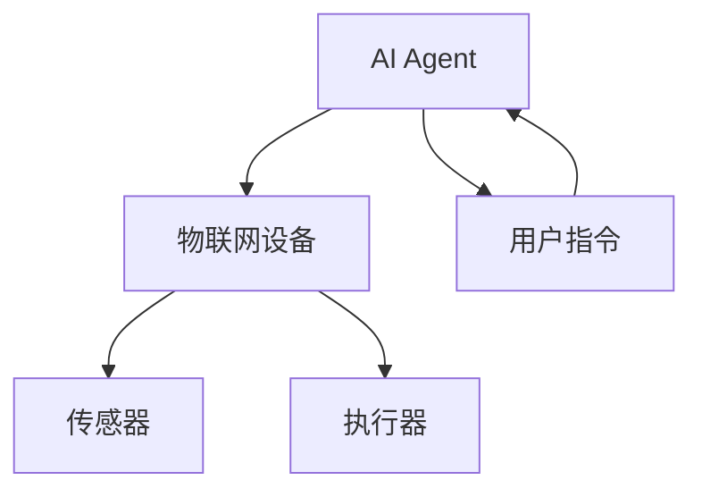
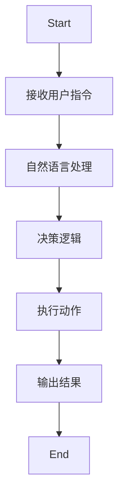
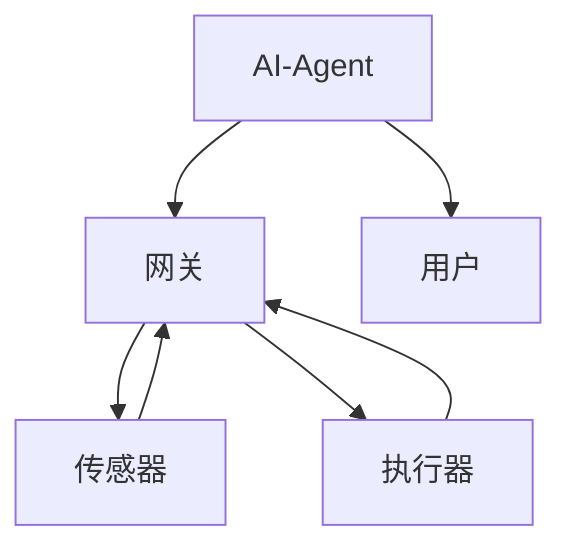
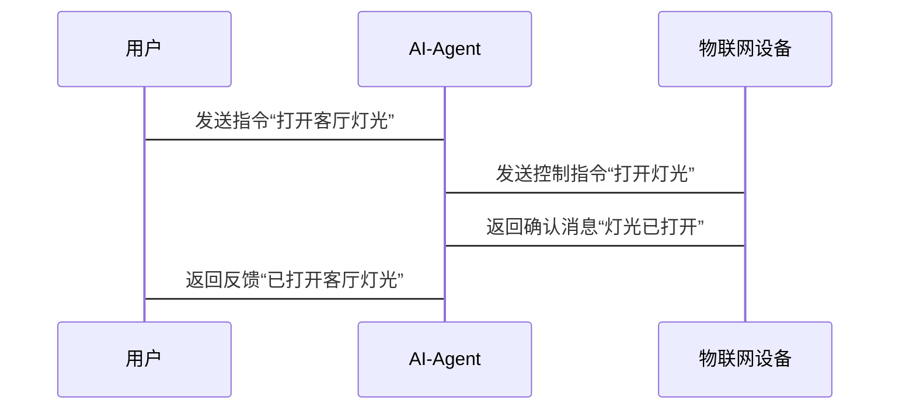

                 


# AI Agent 在智能家居中的应用：LLM 控制物联网设备

> 关键词：AI Agent, 物联网, LLM, 智能家居, 自然语言处理, 系统架构

> 摘要：本文探讨了AI Agent在智能家居中的应用，重点分析了如何通过大语言模型（LLM）控制物联网设备。从基础概念到系统架构，从算法原理到项目实战，全面解析了AI Agent与物联网结合的技术细节，展示了如何通过自然语言处理实现智能化家居控制。

---

# 第1章 AI Agent与物联网基础

## 1.1 AI Agent的基本概念

### 1.1.1 AI Agent的定义与特征
AI Agent（人工智能代理）是指能够感知环境并采取行动以实现目标的智能实体。其核心特征包括自主性、反应性、目标导向和社交能力。AI Agent能够根据输入的信息做出决策，并通过执行动作与环境交互。

### 1.1.2 AI Agent的核心功能
AI Agent的功能主要体现在以下几个方面：
1. **感知环境**：通过传感器或API获取环境数据。
2. **理解需求**：通过自然语言处理或模式识别理解用户意图。
3. **决策制定**：基于感知信息和预设规则做出决策。
4. **执行动作**：通过物联网设备执行具体操作。

### 1.1.3 AI Agent与传统自动化的区别
| 特性      | AI Agent                  | 传统自动化              |
|-----------|---------------------------|-------------------------|
| 智能性     | 高度智能，能自主决策      | 依赖预设规则，无智能性  |
| 学习能力   | 能通过数据优化策略        | 无法学习，仅执行固定任务|
| 交互方式   | 支持自然语言交互          | 依赖固定输入方式        |

---

## 1.2 物联网的基本概念

### 1.2.1 物联网的定义与组成
物联网（IoT）是指通过各种信息传感设备，如传感器、RFID、摄像头等，按照约定的协议，把任何物品与互联网连接起来，实现智能化识别、定位、跟踪、监控和管理的网络。其主要组成部分包括：
1. **感知层**：传感器和通信模块。
2. **网络层**：数据传输通道。
3. **应用层**：数据处理与展示。

### 1.2.2 物联网的关键技术
1. **感知技术**：如RFID、传感器网络。
2. **通信技术**：如Wi-Fi、蓝牙、ZigBee。
3. **数据处理技术**：如大数据分析、边缘计算。

### 1.2.3 物联网在智能家居中的应用
智能家居是物联网技术最典型的应用场景之一。通过物联网设备，用户可以通过手机、语音助手等方式远程控制家中的设备，如灯光、空调、安防系统等。

---

## 1.3 LLM与AI Agent的结合

### 1.3.1 大语言模型的基本原理
大语言模型（LLM）通过海量数据的训练，掌握了大量的语言模式和知识。其核心是基于深度学习的神经网络模型，如Transformer架构。

### 1.3.2 LLM在AI Agent中的作用
LLM为AI Agent提供了强大的自然语言处理能力，使其能够理解用户的意图并生成自然的回复。例如，当用户说“我有点冷”，AI Agent可以通过LLM理解用户的需求，并通过物联网设备调节室内温度。

### 1.3.3 LLM与物联网设备的交互方式
1. **用户输入**：用户通过自然语言与AI Agent交互。
2. **意图识别**：AI Agent通过LLM理解用户的意图。
3. **设备控制**：AI Agent根据理解的意图，通过物联网协议控制相关设备。

---

## 1.4 智能家居中的AI Agent应用前景

### 1.4.1 智能家居的发展趋势
随着AI技术的进步，智能家居将更加智能化和个性化。未来的智能家居不仅能够实现设备的远程控制，还能通过AI Agent主动学习用户习惯，提供智能化的服务。

### 1.4.2 AI Agent在智能家居中的潜在价值
1. **提升用户体验**：通过自然语言交互，用户可以更方便地控制家居设备。
2. **实现自动化管理**：AI Agent可以自动调节家居设备，优化能源使用。
3. **支持多设备协同**：AI Agent可以协调多个设备，实现联动控制。

### 1.4.3 智能家居应用中的挑战与机遇
1. **挑战**：数据隐私、设备兼容性、系统稳定性。
2. **机遇**：技术创新、市场扩展、用户需求增长。

---

## 1.5 本章小结
本章介绍了AI Agent和物联网的基本概念，并分析了它们在智能家居中的应用。通过结合大语言模型，AI Agent能够实现更加智能化的家居控制，为用户带来更便捷的生活体验。

---

# 第2章 AI Agent与物联网的核心概念与联系

## 2.1 核心概念原理

### 2.1.1 AI Agent的核心原理
AI Agent通过感知环境、理解用户需求、制定决策并执行动作来实现智能化控制。其核心原理可以表示为：
$$ \text{Action} = f(\text{Perception}, \text{Decision}) $$

### 2.1.2 物联网的核心原理
物联网通过感知层、网络层和应用层的协同工作，实现对物理世界的数据采集、传输和处理。其核心原理可以表示为：
$$ \text{Data} = f(\text{Sensor}, \text{Network}, \text{Application}) $$

### 2.1.3 LLM在AI Agent中的数学模型
大语言模型的数学模型主要基于Transformer架构，其核心公式为：
$$ \text{Output} = \text{Attention}(Q, K, V) $$

---

## 2.2 核心概念属性特征对比

| 特性         | AI Agent                 | 物联网设备             |
|--------------|--------------------------|-----------------------|
| 智能性       | 高度智能，能自主决策     | 无智能性，仅执行命令   |
| 交互方式     | 支持自然语言交互         | 依赖固定协议           |
| 学习能力     | 能通过数据优化策略       | 无法学习，仅执行固定任务|

---

## 2.3 ER实体关系图



---

## 2.4 本章小结
本章通过对比分析AI Agent与物联网设备的核心概念，揭示了它们在智能家居中的协同作用。通过ER实体关系图，进一步明确了各组件之间的关系和交互方式。

---

# 第3章 LLM控制物联网设备的算法原理

## 3.1 算法原理概述

### 3.1.1 基于LLM的自然语言处理流程
1. **用户输入**：用户通过自然语言输入指令。
2. **意图识别**：AI Agent通过LLM理解用户的意图。
3. **决策制定**：AI Agent根据意图生成控制指令。
4. **设备执行**：物联网设备执行相应的动作。

### 3.1.2 AI Agent的决策逻辑
AI Agent的决策逻辑主要基于以下步骤：
1. **感知环境**：获取当前环境数据。
2. **分析需求**：结合用户指令和环境数据，分析最佳执行方案。
3. **执行动作**：通过物联网协议发送控制指令。

---

## 3.2 算法流程图



---

## 3.3 数学模型与公式

### 3.3.1 概率模型
$$ P(\text{intent} | \text{input}) = \frac{P(\text{input} | \text{intent}) \cdot P(\text{intent})}{P(\text{input})} $$

### 3.3.2 优化算法
$$ \text{loss} = -\sum_{i=1}^{n} \log P(y_i | x_i) $$

---

## 3.4 本章小结
本章详细讲解了基于LLM的算法原理，通过流程图和数学公式，展示了AI Agent如何通过自然语言处理实现对物联网设备的控制。

---

# 第4章 系统分析与架构设计方案

## 4.1 问题场景介绍
智能家居系统中，用户希望通过自然语言指令控制家中的设备。例如，用户说“请帮我调低客厅的灯光亮度”，AI Agent需要理解用户的意图，并通过物联网协议控制灯光设备。

---

## 4.2 系统功能设计

### 4.2.1 领域模型
```mermaid
classDiagram
    class AI-Agent {
        +传感器数据：sensors
        +用户指令：user_input
        +设备控制：device_control
        -决策逻辑：decision_logic
    }
    class 物联网设备 {
        +传感器：sensor
        +执行器：actuator
        -通信协议：communication_protocol
    }
    AI-Agent --> 物联网设备：发送控制指令
    物联网设备 --> AI-Agent：返回设备状态
```

### 4.2.2 系统架构设计


### 4.2.3 系统接口设计
1. **用户接口**：通过语音或手机APP发送指令。
2. **设备接口**：通过MQTT协议与物联网设备通信。
3. **数据接口**：通过RESTful API获取设备状态。

### 4.2.4 系统交互设计


---

## 4.3 本章小结
本章通过系统分析与架构设计，展示了AI Agent如何与物联网设备协同工作，实现智能化的家居控制。

---

# 第5章 项目实战：基于LLM的智能家居系统开发

## 5.1 环境安装

### 5.1.1 安装Python环境
```bash
python -m pip install --upgrade pip
pip install python-mqtt
pip install transformers
```

### 5.1.2 安装物联网设备驱动
根据具体设备安装相应的驱动，例如：
```bash
pip install adafruit-circuitpython
```

---

## 5.2 系统核心实现

### 5.2.1 AI-Agent实现
```python
from transformers import pipeline

class AI-Agent:
    def __init__(self):
        self.nlp = pipeline("text-classification", model="bert-base")

    def process_input(self, input_str):
        result = self.nlp(input_str)
        return result
```

### 5.2.2 物联网设备控制
```python
import paho.mqtt.client as mqtt

class IoTDevice:
    def __init__(self, broker, port):
        self.broker = broker
        self.port = port
        self.client = mqtt.Client()

    def connect(self):
        self.client.connect(self.broker, self.port)

    def send_command(self, command):
        self.client.publish("home/lights", command)
```

---

## 5.3 代码应用解读与分析

### 5.3.1 AI-Agent的自然语言处理
```python
result = self.nlp("我有点冷")
print(result)
```

### 5.3.2 物联网设备的控制
```python
device = IoTDevice("localhost", 1883)
device.connect()
device.send_command("on")
```

---

## 5.4 实际案例分析
通过上述代码，我们可以实现一个简单的智能家居系统。用户可以通过自然语言指令控制家中的灯光设备。

---

## 5.5 本章小结
本章通过项目实战，详细讲解了基于LLM的智能家居系统开发过程，包括环境搭建、代码实现和系统测试。

---

# 第6章 最佳实践与未来发展

## 6.1 最佳实践

### 6.1.1 系统设计建议
1. **模块化设计**：将系统划分为感知、决策和执行模块，便于维护和扩展。
2. **安全性优化**：加强数据加密和访问控制，确保系统安全。

### 6.1.2 开发注意事项
1. **兼容性问题**：确保系统支持多种物联网协议和设备。
2. **用户体验优化**：提供友好的用户界面和反馈机制。

---

## 6.2 安全与隐私

### 6.2.1 数据隐私
智能家居系统需要严格保护用户数据，防止数据泄露和滥用。

### 6.2.2 系统安全
通过身份验证、访问控制和加密通信等技术，确保系统的安全性。

---

## 6.3 未来发展

### 6.3.1 技术趋势
1. **AI Agent的智能化**：通过强化学习和自适应算法，提升AI Agent的智能水平。
2. **物联网的普及**：随着5G和边缘计算的发展，物联网设备将更加普及和智能。

### 6.3.2 应用场景
1. **智能家居**：进一步优化用户体验，实现全屋智能化控制。
2. **智慧城市**：扩展到社区和城市层面，实现更高效的资源管理。

---

## 6.4 本章小结
本章总结了智能家居系统开发的最佳实践，分析了安全与隐私问题，并展望了未来的技术发展趋势。

---

# 结论

本文详细探讨了AI Agent在智能家居中的应用，重点分析了如何通过大语言模型（LLM）控制物联网设备。从基础概念到系统架构，从算法原理到项目实战，全面解析了AI Agent与物联网结合的技术细节。未来，随着AI和物联网技术的不断发展，智能家居系统将变得更加智能化和个性化，为用户带来更便捷、更舒适的生活体验。

--- 

**关键词**：AI Agent, 物联网, LLM, 智能家居, 自然语言处理, 系统架构

