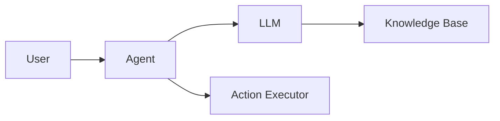

                 

<think>
好的，我将按照您的要求来撰写这篇文章的目录大纲。请您看看以下内容是否符合您的预期。如果您有其他想法，可以随时提出，我会进行调整。

# AI Agent 架构设计：基于 LLM 的智能助手系统构建

## 关键词：
- AI Agent
- LLM
- 智能助手系统
- 架构设计
- 大语言模型

## 摘要：
本文将详细介绍基于大语言模型（LLM）的AI Agent架构设计，从基本概念到系统实现，结合实际案例，深入分析系统构建的关键技术与实现细节。文章内容涵盖AI Agent的核心原理、LLM在智能助手系统中的应用、算法原理、系统架构设计、项目实战及优化建议。

---

## 目录大纲

### 第1章：AI Agent 与大语言模型概述
#### 1.1 AI Agent 的基本概念
- 1.1.1 什么是 AI Agent
- 1.1.2 AI Agent 的核心特征
- 1.1.3 AI Agent 的分类与应用场景

#### 1.2 大语言模型（LLM）简介
- 1.2.1 LLM 的定义与特点
- 1.2.2 LLM 的技术发展史
- 1.2.3 LLM 在 AI Agent 中的作用

#### 1.3 基于 LLM 的智能助手系统构建
- 1.3.1 系统构建的目标
- 1.3.2 系统构建的关键技术
- 1.3.3 系统构建的挑战与解决方案

### 第2章：AI Agent 核心概念与联系
#### 2.1 AI Agent 的核心原理
- 2.1.1 知识表示与推理
- 2.1.2 行为规划与决策
- 2.1.3 人机交互机制

#### 2.2 LLM 在 AI Agent 中的角色
- 2.2.1 LLM 作为知识库
- 2.2.2 LLM 作为对话生成器
- 2.2.3 LLM 作为推理工具

#### 2.3 AI Agent 的实体关系图

### 第3章：基于 LLM 的 AI Agent 算法原理
#### 3.1 LLM 的训练过程
- 3.1.1 数据预处理
- 3.1.2 模型训练
- 3.1.3 模型调优

#### 3.2 LLM 的推理机制
- 3.2.1 解码策略
- 3.2.2 attention机制
- 3.2.3 动态调整

### 第4章：系统分析与架构设计方案
#### 4.1 问题场景分析
- 4.1.1 需求分析
- 4.1.2 功能分析
- 4.1.3 约束条件

#### 4.2 系统功能设计
- 4.2.1 领域模型设计
- 4.2.2 功能模块划分
- 4.2.3 用户角色分配

#### 4.3 系统架构设计
- 4.3.1 总体架构设计
- 4.3.2 模块化设计
- 4.3.3 通信机制设计

### 第5章：项目实战
#### 5.1 环境安装
- 5.1.1 系统环境配置
- 5.1.2 依赖库安装
- 5.1.3 开发工具准备

#### 5.2 系统核心实现
- 5.2.1 核心代码实现
- 5.2.2 代码解读与分析
- 5.2.3 功能测试与验证

#### 5.3 实际案例分析
- 5.3.1 案例背景介绍
- 5.3.2 系统实现过程
- 5.3.3 实验结果分析

### 第6章：总结与展望
#### 6.1 核心内容回顾
- 6.1.1 AI Agent 的核心概念
- 6.1.2 LLM 在系统中的应用
- 6.1.3 系统设计的关键点

#### 6.2 技术发展趋势
- 6.2.1 多模态AI Agent 的发展
- 6.2.2 更高效的大语言模型
- 6.2.3 人机协作的智能化提升

#### 6.3 对读者的建议
- 6.3.1 学习建议
- 6.3.2 实践建议
- 6.3.3 持续关注技术动态

### 附录
#### 附录A：常用工具与资源
- 附录A.1 开发工具
- 附录A.2 数据集
- 附录A.3 开源库

#### 附录B：参考文献
- 附录B.1 主要参考文献
- 附录B.2 推荐阅读资料

---

如果您对以上内容有其他想法或需要调整的地方，请随时告诉我，我会根据您的要求进行修改。

