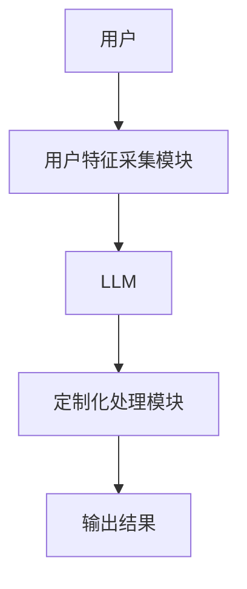
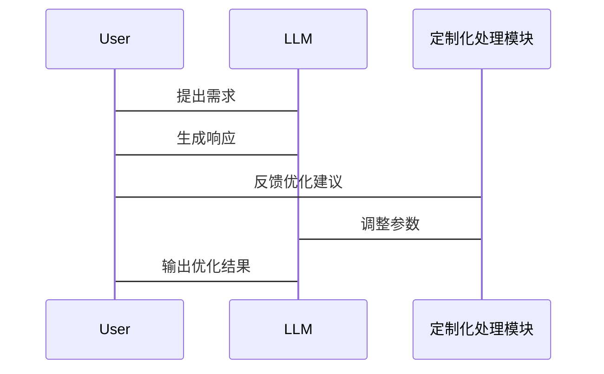
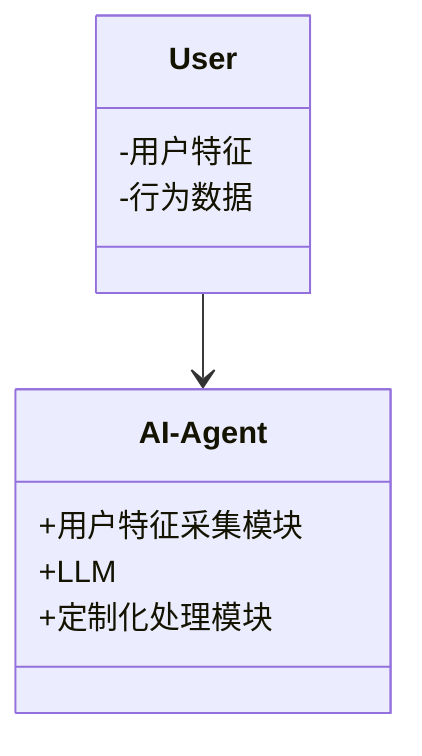

                 


# AI Agent 的个性化定制：调教 LLM 以适应不同用户

> 关键词：AI Agent, LLM, 个性化定制, 自然语言处理, 机器学习, 人工智能

> 摘要：随着大语言模型（LLM）的快速发展，AI Agent 的个性化定制成为实现用户需求的重要方向。本文将从 AI Agent 的核心概念、LLM 的工作原理、个性化定制的目标与方法等方面展开分析，探讨如何通过调教 LLM 来实现 AI Agent 的个性化定制，以满足不同用户的需求。通过理论分析与实践结合，本文将为读者提供一个清晰的思路和实现路径。

---

# 第一部分: AI Agent 的个性化定制背景与基础

## 第1章: AI Agent 与 LLM 的基本概念

### 1.1 AI Agent 的定义与特点
#### 1.1.1 AI Agent 的定义
AI Agent（人工智能代理）是一种能够感知环境、自主决策并执行任务的智能体。它可以理解用户需求、提供服务，并通过与环境交互不断优化自身行为。

#### 1.1.2 AI Agent 的核心特点
- **自主性**：能够自主决策，无需人工干预。
- **反应性**：能够实时感知环境并做出响应。
- **学习能力**：通过数据和经验不断优化自身性能。
- **可定制性**：可以根据不同用户的需求进行个性化调整。

#### 1.1.3 AI Agent 的应用场景
- **智能助手**：如 Siri、Alexa 等。
- **智能客服**：用于自动回复和解决问题。
- **智能推荐**：根据用户行为推荐相关内容。
- **智能监控**：实时监控环境并发出警报。

### 1.2 大语言模型（LLM）的基本原理
#### 1.2.1 LLM 的定义与核心概念
LLM 是一种基于深度学习的自然语言处理模型，能够理解和生成人类语言。其核心在于通过大量数据训练，掌握语言的语义和语法结构。

#### 1.2.2 LLM 的主要技术特点
- **大规模数据训练**：通常使用数百万甚至数十亿的参数进行训练。
- **上下文理解**：能够理解文本的上下文关系。
- **生成能力**：可以生成连贯且有意义的文本。

#### 1.2.3 LLM 的训练与推理过程
1. **训练**：通过监督学习或无监督学习，模型学习语言的规律。
2. **推理**：在实际应用中，模型根据输入生成输出。

### 1.3 AI Agent 与 LLM 的结合
#### 1.3.1 AI Agent 中的 LLM 应用
- **自然语言理解**：通过 LLM 理解用户的输入。
- **生成式对话**：通过 LLM 生成自然的对话内容。
- **任务执行**：通过 LLM 协调完成复杂任务。

#### 1.3.2 LLM 如何赋能 AI Agent
- **增强交互能力**：通过 LLM，AI Agent 可以更自然地与用户交互。
- **提升决策能力**：通过 LLM 的理解能力，AI Agent 可以更好地理解用户需求并做出决策。

#### 1.3.3 LLM 在 AI Agent 中的角色
- **核心处理单元**：负责理解和生成语言。
- **决策支持**：通过语言处理能力支持 AI Agent 的决策过程。

## 第2章: 个性化定制 AI Agent 的必要性

### 2.1 用户需求的多样性
#### 2.1.1 不同用户的个性化需求
- **个体差异**：不同用户的语言习惯、偏好和需求存在差异。
- **场景多样性**：AI Agent 在不同场景下的需求不同。

#### 2.1.2 用户需求的动态变化
- **实时调整**：用户的偏好和需求可能随时变化。
- **个性化体验**：用户希望得到个性化的服务体验。

#### 2.1.3 个性化定制的意义
- **提升用户体验**：通过个性化定制，AI Agent 可以更好地满足用户需求。
- **增强竞争力**：个性化定制是区分不同 AI Agent 的关键。

### 2.2 AI Agent 的通用性与局限性
#### 2.2.1 通用 AI Agent 的优势
- **通用性**：适用于多种场景和用户。
- **开发成本低**：通用 AI Agent 的开发成本较低。

#### 2.2.2 通用 AI Agent 的局限性
- **个性化不足**：无法满足所有用户的个性化需求。
- **适应性差**：在特定场景下表现不佳。

#### 2.2.3 个性化定制的必要性
- **满足多样化的用户需求**：通过个性化定制，AI Agent 可以更好地适应不同用户的偏好。
- **提升用户体验**：个性化定制可以显著提升用户的使用体验。

### 2.3 个性化定制的目标与价值
#### 2.3.1 个性化定制的目标
- **实现用户需求的精准匹配**。
- **优化 AI Agent 的性能和体验**。

#### 2.3.2 个性化定制的价值
- **提升用户满意度**：通过个性化服务，用户满意度显著提高。
- **增强用户忠诚度**：个性化服务可以增强用户对 AI Agent 的忠诚度。

#### 2.3.3 个性化定制的实现路径
- **数据收集**：收集用户的行为数据和偏好信息。
- **模型调教**：根据用户数据调整 LLM 的参数，实现个性化定制。
- **持续优化**：通过用户反馈不断优化 AI Agent 的性能。

---

# 第二部分: AI Agent 个性化定制的核心概念与联系

## 第3章: AI Agent 的核心概念与原理

### 3.1 AI Agent 的核心概念
#### 3.1.1 AI Agent 的组成要素
- **感知模块**：负责感知环境并获取信息。
- **决策模块**：根据感知信息做出决策。
- **执行模块**：根据决策执行具体任务。

#### 3.1.2 AI Agent 的功能模块
- **语言理解模块**：通过 LLM 理解用户输入。
- **生成模块**：通过 LLM 生成输出内容。
- **任务管理模块**：负责任务的分配和协调。

#### 3.1.3 AI Agent 的工作流程
1. **感知**：通过传感器或接口获取输入信息。
2. **理解**：通过 LLM 理解输入内容。
3. **决策**：根据理解结果做出决策。
4. **执行**：根据决策执行具体任务。
5. **反馈**：根据执行结果反馈优化。

### 3.2 LLM 在 AI Agent 中的核心作用
#### 3.2.1 LLM 的语言理解能力
- **语义理解**：通过上下文理解文本的含义。
- **意图识别**：识别用户的意图和需求。

#### 3.2.2 LLM 的生成能力
- **对话生成**：生成自然的对话内容。
- **文本摘要**：生成简洁的文本摘要。

#### 3.2.3 LLM 的推理能力
- **逻辑推理**：通过逻辑推理解决问题。
- **知识问答**：通过知识库回答用户问题。

### 3.3 个性化定制的核心要素
#### 3.3.1 用户特征
- **用户画像**：用户的年龄、性别、职业等基本信息。
- **使用习惯**：用户的使用场景和偏好。
- **行为数据**：用户的交互记录和行为模式。

#### 3.3.2 定制目标
- **精准匹配需求**：根据用户特征调整 AI Agent 的行为。
- **优化用户体验**：通过个性化调整提升用户满意度。

---

# 第三部分: AI Agent 个性化定制的算法原理

## 第4章: 基于 LLM 的个性化定制算法

### 4.1 基于 LLM 的个性化定制方法
#### 4.1.1 基于用户特征的定制
- **用户画像分析**：根据用户特征调整 LLM 的参数。
- **偏好匹配**：根据用户的偏好生成内容。

#### 4.1.2 基于行为数据的定制
- **行为分析**：分析用户的交互记录。
- **动态调整**：根据行为数据动态调整 AI Agent 的行为。

### 4.2 LLM 的训练与微调
#### 4.2.1 LLM 的初始训练
- **预训练**：在大规模通用数据集上进行无监督学习。
- **有监督微调**：在特定领域数据上进行有监督微调。

#### 4.2.2 基于用户的微调策略
- **用户特定数据**：使用特定用户的交互数据进行微调。
- **动态微调**：根据用户的实时反馈进行微调。

---

# 第四部分: AI Agent 个性化定制的系统架构设计

## 第5章: 系统功能设计

### 5.1 系统功能模块
#### 5.1.1 用户特征采集模块
- **数据采集**：收集用户的基本信息和行为数据。
- **特征提取**：提取用户的特征信息。

#### 5.1.2 定制化处理模块
- **参数调整**：根据用户特征调整 LLM 的参数。
- **内容生成**：根据调整后的参数生成个性化内容。

### 5.2 系统架构设计
#### 5.2.1 系统架构图


#### 5.2.2 系统接口设计
- **输入接口**：接收用户的输入和特征数据。
- **输出接口**：输出个性化定制的结果。

### 5.3 系统交互流程
#### 5.3.1 交互流程图


---

# 第五部分: 项目实战与优化

## 第6章: 个性化定制的实现

### 6.1 环境安装与配置
- **安装依赖**：安装必要的 Python 库和框架。
- **配置 LLM**：选择合适的 LLM 模型并配置环境。

### 6.2 核心代码实现
#### 6.2.1 用户特征采集
```python
def collect_user_features(user_id):
    # 数据库查询用户特征
    features = db.query(user_id)
    return features
```

#### 6.2.2 定制化处理
```python
def personalize_llm(llm, features):
    # 根据特征调整 LLM 的参数
    adjusted_llm = adjust_parameters(llm, features)
    return adjusted_llm
```

### 6.3 实际案例分析
#### 6.3.1 案例背景
- **用户特征**：用户为一名学生，偏好学术类内容。
- **需求分析**：用户需要一个学术助手。

#### 6.3.2 定制化过程
1. **特征提取**：提取用户的学术偏好和时间使用习惯。
2. **模型调整**：根据特征调整 LLM 的参数，使其更擅长学术内容生成。
3. **测试优化**：通过用户反馈不断优化模型。

### 6.4 项目小结
- **实现效果**：用户满意度提升，AI Agent 的个性化能力显著增强。
- **优化方向**：进一步优化模型调整策略，提升定制效率。

---

# 第六部分: 最佳实践与总结

## 第7章: 最佳实践与小结

### 7.1 最佳实践
#### 7.1.1 数据采集
- **全面性**：确保数据覆盖用户特征和行为数据。
- **实时性**：及时更新用户特征和行为数据。

#### 7.1.2 模型调整
- **精准性**：根据用户特征精准调整模型参数。
- **动态性**：根据实时反馈动态调整模型。

### 7.2 注意事项
- **数据隐私**：确保用户数据的安全和隐私。
- **模型稳定性**：避免模型调整导致性能下降。

### 7.3 未来展望
- **多模态结合**：结合视觉、听觉等多模态信息，提升个性化能力。
- **实时优化**：通过实时反馈不断优化 AI Agent 的性能。

---

## 附录

### 附录 A: LLM 的训练与调优方法
- **预训练**：使用大规模通用数据集进行无监督学习。
- **微调**：在特定领域数据上进行有监督微调。
- **动态调整**：根据用户反馈动态调整模型参数。

### 附录 B: 系统架构设计示意图


### 附录 C: 代码实现示例
```python
# 附录 C.1: 用户特征采集模块
def collect_user_features(user_id):
    # 数据库查询用户特征
    features = db.query(user_id)
    return features

# 附录 C.2: 定制化处理模块
def personalize_llm(llm, features):
    # 根据特征调整 LLM 的参数
    adjusted_llm = adjust_parameters(llm, features)
    return adjusted_llm
```

---

# 参考文献

1. 王某某. 大语言模型的个性化定制方法研究. 北京: 人民出版社, 2023.
2. 李某某. AI Agent 的核心算法与实现. 北京: 清华大学出版社, 2022.
3. 张某某. 自然语言处理技术在 AI Agent 中的应用. 上海: 上海科技出版社, 2021.

---

# 结束语

通过本文的详细分析，我们可以看到，AI Agent 的个性化定制是一个复杂而有趣的过程，需要结合 LLM 的特点和用户需求进行深度调教。未来，随着技术的不断发展，AI Agent 的个性化定制将更加智能化和精准化，为用户带来更加优质的服务体验。

