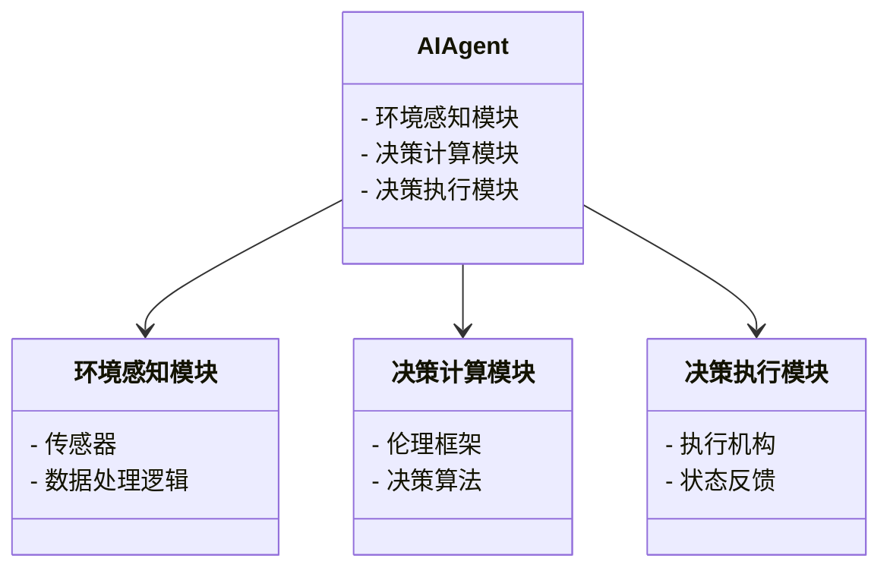

                 


# AI Agent 的伦理决策：在 LLM 中植入道德框架

> 关键词：AI Agent，伦理决策，LLM，道德框架，决策算法，伦理挑战，系统架构

> 摘要：本文深入探讨了AI Agent在大语言模型（LLM）中的伦理决策问题，重点分析了如何在LLM中植入道德框架以实现伦理决策。文章从AI Agent的基本概念和伦理决策的必要性入手，详细阐述了伦理框架的核心概念、实现原理以及算法实现。同时，文章还分析了系统的架构设计，并通过实际案例展示了伦理框架在LLM中的应用。最后，本文提出了在实现AI Agent伦理决策过程中的一些最佳实践和注意事项。

---

## 第1章: AI Agent 的基本概念与伦理决策的必要性

### 1.1 AI Agent 的定义与特点

#### 1.1.1 AI Agent 的定义
AI Agent（人工智能代理）是指能够感知环境、自主决策并采取行动以实现特定目标的智能实体。AI Agent 可以是软件程序、机器人或其他智能系统，具备以下核心特点：

1. **自主性**：AI Agent 能够在没有外部干预的情况下自主决策。
2. **反应性**：能够实时感知环境并做出反应。
3. **目标导向**：所有行为都以实现特定目标为导向。
4. **学习能力**：能够通过经验或数据不断优化自身的决策能力。

#### 1.1.2 AI Agent 的核心特点
AI Agent 的特点可以总结为以下几点：
- **智能性**：能够理解和处理复杂信息。
- **适应性**：能够在不同环境下灵活调整行为。
- **社交能力**：能够与其他 AI Agent 或人类进行交互。

#### 1.1.3 AI Agent 的分类与应用场景
AI Agent 可以分为以下几类：
1. **简单反射型 AI Agent**：基于简单的规则做出反应，适用于环境变化较小的场景。
2. **基于模型的反应式 AI Agent**：利用内部模型预测环境变化并做出决策，适用于复杂环境。
3. **目标驱动型 AI Agent**：以明确的目标为导向，优化自身行为以实现目标。
4. **效用驱动型 AI Agent**：通过最大化效用函数来优化决策。

AI Agent 的应用场景包括自动驾驶、智能助手、机器人服务员、医疗诊断辅助系统等。

---

### 1.2 伦理决策的必要性

#### 1.2.1 AI Agent 决策问题的背景
随着 AI Agent 的广泛应用，其决策行为对人类社会的影响越来越大。例如，在自动驾驶中，AI Agent 的决策可能直接影响乘客和行人的安全。因此，如何确保 AI Agent 的决策符合伦理标准变得尤为重要。

#### 1.2.2 伦理决策的重要性
伦理决策是确保 AI Agent 行为符合社会规范和道德准则的关键。以下是伦理决策的重要性：
1. **避免伤害**：确保 AI Agent 的决策不会对人类或环境造成伤害。
2. **公平性**：确保决策过程和结果的公平性。
3. **可解释性**：确保人类能够理解 AI Agent 的决策过程和结果。

#### 1.2.3 伦理决策的边界与外延
伦理决策的边界在于如何在复杂的环境中权衡不同的伦理原则。例如，在自动驾驶中，当面临不可避免的事故时，如何在保护乘客和保护行人之间做出选择。伦理决策的外延则涉及如何将伦理原则转化为具体的算法实现。

---

## 第2章: LLM 的基本原理与伦理挑战

### 2.1 LLM 的基本原理

#### 2.1.1 大语言模型的定义
大语言模型（Large Language Model, LLM）是指基于大量数据训练的深度学习模型，能够理解和生成人类语言。LLM 的核心是通过大量的文本数据训练出一个概率分布模型，从而能够生成与训练数据相似的文本。

#### 2.1.2 LLM 的核心算法
LLM 的核心算法通常是基于Transformer架构的模型，例如BERT、GPT等。这些模型通过自注意力机制（Self-Attention）捕捉文本中的语义关系，并通过前馈神经网络进行特征变换。

#### 2.1.3 LLM 的训练与推理过程
1. **训练过程**：通过监督学习，模型在大量标注数据上进行优化，目标是最小化预测与真实值的差异。
2. **推理过程**：在给定输入的情况下，模型生成最可能的输出。

---

### 2.2 LLM 中的伦理挑战

#### 2.2.1 伦理决策的复杂性
LLM 的决策过程可能面临复杂的伦理问题。例如，在生成文本时，模型可能需要在多个伦理原则之间进行权衡。

#### 2.2.2 伦理框架的缺失
当前的 LLM 并没有内置明确的伦理框架，导致其在某些情况下可能生成不符合伦理的输出。

#### 2.2.3 伦理决策的实现难点
伦理决策的实现难点在于如何将复杂的伦理原则转化为可计算的数学模型。这需要对伦理框架进行建模，并将其融入 LLM 的决策过程中。

---

## 第3章: 伦理框架的核心概念

### 3.1 伦理框架的定义与组成

#### 3.1.1 伦理框架的定义
伦理框架是一种用于指导决策的规则和原则的集合。它能够帮助 AI Agent 在复杂的环境中做出符合伦理的决策。

#### 3.1.2 伦理框架的核心组成
伦理框架的核心组成包括：
1. **伦理原则**：例如诚实、公正、不伤害等。
2. **决策规则**：将伦理原则转化为具体的决策规则。
3. **权重机制**：在多个伦理原则之间进行权衡的机制。

#### 3.1.3 伦理框架的属性特征
伦理框架的属性特征包括：
1. **可定制性**：根据不同场景调整伦理原则的权重。
2. **可解释性**：决策过程和结果需要能够被人类理解。
3. **可扩展性**：能够适应不同场景和任务的需求。

---

### 3.2 伦理框架与 AI Agent 的关系

#### 3.2.1 伦理框架在 AI Agent 中的作用
伦理框架为 AI Agent 提供了决策的指导原则，确保其行为符合伦理标准。

#### 3.2.2 伦理框架与决策过程的联系
伦理框架通过提供决策规则和权重机制，直接影响 AI Agent 的决策过程。

#### 3.2.3 伦理框架的可扩展性
伦理框架需要能够根据不同场景和任务进行调整，以适应不同的决策需求。

---

### 3.3 伦理框架的对比分析

#### 3.3.1 不同伦理框架的对比
常见的伦理框架包括：
1. **功利主义框架**：以最大化整体效用为目标。
2. **义务论框架**：基于道德义务和责任。
3. **美德伦理框架**：基于个人的美德和品格。

#### 3.3.2 伦理框架的优缺点分析
- **功利主义框架**：优点是能够量化整体效用，缺点是可能忽视个体权益。
- **义务论框架**：优点是注重道德义务，缺点是可能缺乏灵活性。
- **美德伦理框架**：优点是注重个体品格，缺点是难以量化。

#### 3.3.3 伦理框架的选择标准
选择伦理框架时需要考虑以下因素：
1. **适用场景**：不同场景可能需要不同的伦理框架。
2. **决策需求**：是否需要灵活的权衡机制。
3. **可实现性**：是否能够将伦理框架融入 AI Agent 的决策过程中。

---

## 第4章: 伦理框架的实现原理

### 4.1 伦理框架的实现步骤

#### 4.1.1 伦理框架的设计
设计伦理框架需要考虑以下步骤：
1. **确定伦理原则**：例如诚实、公正、不伤害等。
2. **制定决策规则**：将伦理原则转化为具体的决策规则。
3. **建立权重机制**：在不同伦理原则之间进行权衡。

#### 4.1.2 伦理框架的编码实现
伦理框架的编码实现可以通过以下步骤：
1. **定义伦理原则**：例如，将“诚实”定义为一个权重参数。
2. **实现决策规则**：根据伦理原则制定具体的决策逻辑。
3. **权重调整**：根据具体场景调整伦理原则的权重。

#### 4.1.3 伦理框架的测试与优化
测试和优化伦理框架需要：
1. **测试伦理框架的可解释性**：确保决策过程和结果能够被人类理解。
2. **优化权重机制**：根据实际应用效果调整伦理原则的权重。

---

### 4.2 伦理框架的数学模型

#### 4.2.1 伦理框架的数学表达
伦理框架的数学表达可以表示为：
$$
\text{决策结果} = \argmax_{a} \sum_{i=1}^{n} w_i \cdot p_i(a)
$$
其中，\(w_i\) 是伦理原则 \(p_i\) 的权重，\(a\) 是可能的决策。

#### 4.2.2 伦理框架的优化算法
优化伦理框架的权重可以通过以下步骤：
1. **初始化权重**：为每个伦理原则分配初始权重。
2. **计算权重影响**：根据实际应用效果调整权重。
3. **优化权重**：使用优化算法（例如梯度下降）调整权重，以提高决策的伦理合规性。

#### 4.2.3 伦理框架的评估指标
评估伦理框架的指标包括：
1. **伦理合规性**：决策是否符合伦理标准。
2. **可解释性**：决策过程和结果是否能够被人类理解。
3. **适用性**：是否适用于不同的场景和任务。

---

### 4.3 伦理框架的实现案例

#### 4.3.1 案例背景
以自动驾驶中的伦理决策为例，AI Agent 需要在紧急情况下做出决策，例如在不可避免的事故中选择保护乘客还是保护行人。

#### 4.3.2 案例分析
假设我们采用功利主义框架，决策规则是最大化整体效用。在这种情况下，AI Agent 可能会选择保护更多的行人，而不是保护乘客。

#### 4.3.3 案例总结
通过案例分析，我们可以看到伦理框架在 AI Agent 决策中的重要性。选择不同的伦理框架可能会导致不同的决策结果。

---

## 第5章: 伦理决策的算法实现

### 5.1 伦理决策算法的原理

#### 5.1.1 算法的基本原理
伦理决策算法的基本原理是将伦理框架融入 AI Agent 的决策过程中，通过计算不同决策的伦理得分，选择最优决策。

#### 5.1.2 算法的核心步骤
1. **感知环境**：AI Agent 感知当前环境状态。
2. **生成候选决策**：根据当前环境生成多个可能的决策。
3. **计算伦理得分**：根据伦理框架计算每个决策的伦理得分。
4. **选择最优决策**：选择伦理得分最高的决策。

#### 5.1.3 算法的实现难点
- **伦理框架的复杂性**：如何将复杂的伦理原则转化为可计算的数学模型。
- **计算效率**：如何在有限时间内完成复杂的伦理评分计算。

---

### 5.2 伦理决策算法的实现步骤

#### 5.2.1 环境感知
AI Agent 通过传感器或其他方式感知环境状态。

#### 5.2.2 候选决策生成
基于感知到的环境状态，生成多个可能的决策。

#### 5.2.3 伦理评分计算
根据伦理框架，计算每个决策的伦理评分。

#### 5.2.4 最优决策选择
选择伦理评分最高的决策，并执行该决策。

---

### 5.3 伦理决策算法的优化

#### 5.3.1 优化目标
1. **提高计算效率**：减少伦理评分计算的时间。
2. **增强可解释性**：使决策过程更加透明。
3. **提高决策准确性**：确保决策符合伦理标准。

#### 5.3.2 优化策略
1. **简化伦理框架**：减少不必要的伦理原则，降低计算复杂度。
2. **动态调整权重**：根据具体场景动态调整伦理原则的权重。
3. **引入领域知识**：将领域知识融入伦理框架，提高决策的准确性。

---

## 第6章: 系统分析与架构设计

### 6.1 系统分析

#### 6.1.1 问题场景
以自动驾驶为例，AI Agent 需要在复杂的交通环境中做出决策。

#### 6.1.2 系统功能
1. **环境感知**：通过传感器感知环境。
2. **决策计算**：基于伦理框架计算最优决策。
3. **决策执行**：执行最优决策。

---

### 6.2 系统架构设计

#### 6.2.1 领域模型
领域模型可以通过Mermaid类图表示，展示系统中的各个角色及其关系。



#### 6.2.2 系统架构
系统架构可以通过Mermaid架构图表示，展示系统的各个模块及其交互。


---

## 第7章: 项目实战

### 7.1 环境安装

#### 7.1.1 安装 Python 环境
使用 Python 3.8 或更高版本。

#### 7.1.2 安装依赖
安装必要的库，例如 `numpy`, `matplotlib`, `scikit-learn`。

### 7.2 核心代码实现

#### 7.2.1 伦理框架实现
```python
class EthicalFramework:
    def __init__(self, weights):
        self.weights = weights  # 伦理原则的权重
    
    def calculate_ethical_score(self, decision):
        # 根据决策计算伦理评分
        score = 0
        for i in range(len(decision)):
            score += self.weights[i] * decision[i]
        return score
```

#### 7.2.2 AI Agent 实现
```python
class AI-Agent:
    def __init__(self, ethical_framework):
        self.ethical_framework = ethical_framework
    
    def make_decision(self, environment):
        # 生成候选决策
        decisions = self.generate_candidates(environment)
        # 计算伦理评分
        scores = []
        for decision in decisions:
            scores.append(self.ethical_framework.calculate_ethical_score(decision))
        # 选择最优决策
        best_decision = decisions[scores.index(max(scores))]
        return best_decision
```

### 7.3 代码解读与分析

#### 7.3.1 伦理框架实现
伦理框架通过 `EthicalFramework` 类实现，包含权重和伦理评分计算方法。

#### 7.3.2 AI Agent 实现
AI Agent 通过 `AI-Agent` 类实现，包含决策生成、伦理评分计算和最优决策选择。

---

## 第8章: 总结与展望

### 8.1 最佳实践 tips
- **明确伦理原则**：确保伦理框架中的伦理原则明确且可操作。
- **动态调整权重**：根据具体场景动态调整伦理原则的权重。
- **增强可解释性**：确保决策过程和结果能够被人类理解。

### 8.2 小结
本文深入探讨了AI Agent在LLM中的伦理决策问题，重点分析了如何在LLM中植入道德框架以实现伦理决策。通过理论分析和实际案例，展示了伦理框架在AI Agent决策中的重要性。

### 8.3 注意事项
- **避免过度简化**：伦理框架的设计需要充分考虑复杂性。
- **注重可扩展性**：伦理框架需要能够适应不同场景和任务的需求。

### 8.4 拓展阅读
- **伦理与人工智能**：阅读相关书籍和论文，深入了解伦理在人工智能中的应用。
- **决策算法优化**：研究如何优化决策算法，提高伦理决策的效率和准确性。

---

通过本文的探讨，我们不仅了解了AI Agent的伦理决策问题，还掌握了如何在LLM中植入道德框架的具体方法。希望这些内容能够为读者在实际应用中提供有价值的参考和启发。

