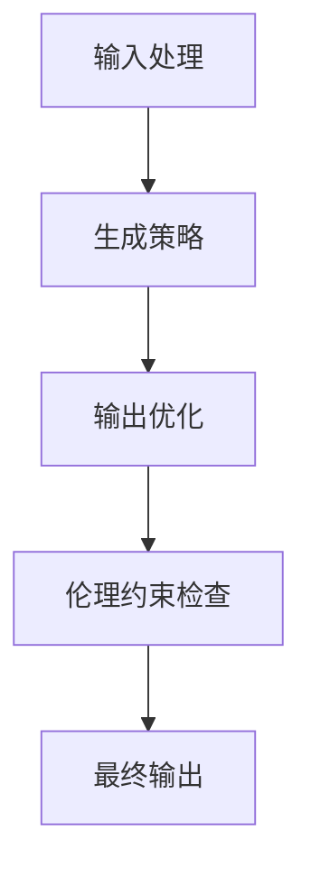
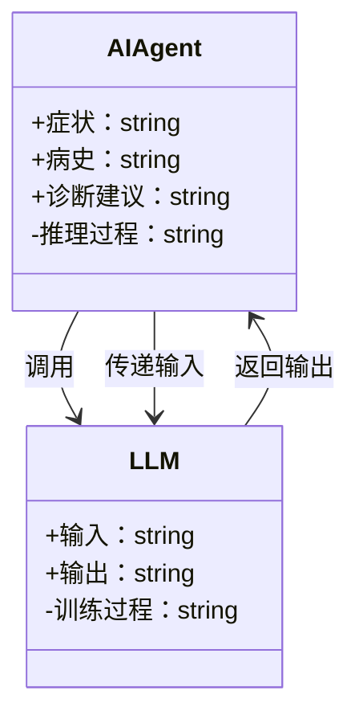
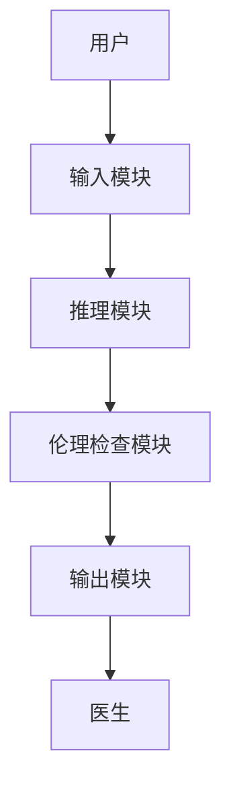
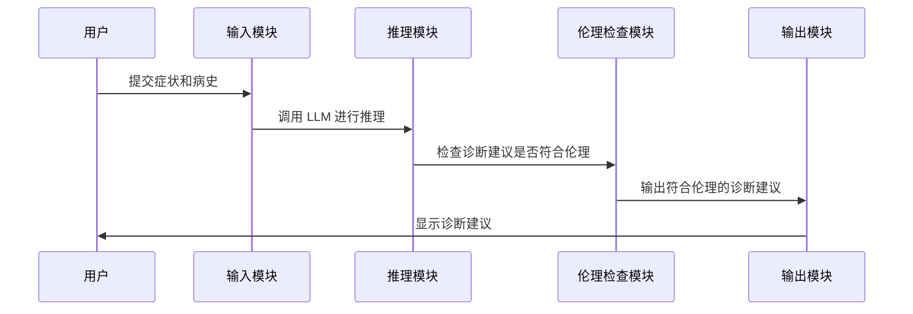

                 


好的，我明白您的要求。让我一步一步地思考如何撰写这篇技术博客文章。

# AI Agent 的伦理约束：LLM 的安全性与道德性设计

## 关键词：AI Agent, LLM, 安全性, 道德性, 伦理约束, 大语言模型, 技术博客

## 摘要： 
随着人工智能技术的快速发展，AI Agent 和大语言模型（LLM）在各个领域的应用越来越广泛。然而，随之而来的是安全性和道德性问题。本文将从 AI Agent 的核心概念出发，分析 LLM 的安全性与道德性设计，探讨如何在技术实现中融入伦理约束，确保 AI 系统的安全性和道德性。

---

## 第一章: AI Agent 的问题背景与概念

### 1.1 问题背景介绍
#### 1.1.1 AI Agent 的定义与核心概念
AI Agent（智能体）是指能够感知环境并采取行动以实现目标的实体。AI Agent 可以是软件程序、机器人或其他智能系统。其核心在于通过算法和数据驱动的决策过程，实现特定任务的目标。

#### 1.1.2 LLM 的安全性与道德性问题的提出
大语言模型（LLM）是当前 AI 技术的核心之一，广泛应用于自然语言处理、文本生成等领域。然而，LLM 的输出可能包含偏见、虚假信息或违反伦理的语句。这些问题不仅影响用户体验，还可能引发法律和道德争议。

#### 1.1.3 问题的边界与外延
AI Agent 的伦理约束不仅涉及 LLM 的输出内容，还包括其决策过程和行为结果。从算法设计到实际应用，每一个环节都需要考虑伦理因素，确保 AI 系统的行为符合社会规范和道德标准。

### 1.2 核心概念结构与组成
#### 1.2.1 AI Agent 的基本组成要素
AI Agent 的核心要素包括：
- **感知模块**：负责从环境中获取信息。
- **决策模块**：基于感知信息做出决策。
- **行动模块**：执行具体的动作。
- **学习模块**：通过反馈优化自身的决策和行为。

#### 1.2.2 LLM 的安全与道德性设计的关键要素
- **数据来源**：训练数据的质量和多样性直接影响模型的输出。
- **算法设计**：算法中是否融入伦理约束，决定了模型是否会生成不适当的内容。
- **用户交互**：用户与 AI Agent 的交互方式影响伦理问题的触发场景。

#### 1.2.3 伦理约束与技术实现的关联性分析
伦理约束需要通过技术手段实现，例如在模型训练中加入伦理准则的过滤机制，或者在推理过程中引入伦理判断模块。技术实现的每一个环节都需要考虑伦理因素。

---

## 第二章: AI Agent 和 LLM 的核心概念与联系

### 2.1 AI Agent 的核心概念
#### 2.1.1 AI Agent 的类型与特点
- **简单反射型 Agent**：基于固定的规则做出反应，适用于简单场景。
- **基于模型的反应式 Agent**：通过环境模型做出决策，适用于复杂场景。
- **目标驱动型 Agent**：以明确的目标为导向，优化自身行为。

#### 2.1.2 LLM 在 AI Agent 中的角色与作用
LLM 作为 AI Agent 的核心模块，负责处理自然语言输入，生成自然语言输出，并为决策提供支持。

#### 2.1.3 AI Agent 的决策机制与伦理约束
AI Agent 的决策机制需要考虑伦理因素，例如在医疗场景中，AI Agent 的决策必须符合医学伦理。

### 2.2 LLM 的安全与道德性设计
#### 2.2.1 LLM 的安全风险与伦理挑战
- **偏见问题**：模型可能因为训练数据中的偏见而产生不公平的输出。
- **虚假信息**：模型可能生成错误或误导性的信息。
- **隐私问题**：模型可能泄露用户的隐私信息。

#### 2.2.2 伦理约束在 LLM 设计中的重要性
- **确保输出内容的正确性**：通过伦理约束，避免生成有害信息。
- **保护用户隐私**：在设计模型时，确保用户数据的安全性。
- **符合社会规范**：模型的输出需要符合社会道德和法律法规。

#### 2.2.3 LLM 的安全与道德性设计的原则与方法
- **数据筛选与清洗**：在训练数据中剔除有害信息。
- **伦理准则的嵌入**：在模型训练中加入伦理准则的过滤机制。
- **用户反馈机制**：通过用户反馈不断优化模型的输出。

### 2.3 AI Agent 和 LLM 的概念属性对比
#### 2.3.1 概念属性对比表
| 属性         | AI Agent                  | LLM                       |
|--------------|---------------------------|---------------------------|
| 核心功能     | 感知环境，做出决策        | 处理语言，生成内容        |
| 伦理约束     | 决策过程需要伦理约束     | 输出内容需要伦理约束     |
| 技术实现     | 多模块协同               | 依赖大规模语言模型       |

#### 2.3.2 伦理约束在两者中的异同点分析
- **相同点**：两者都需要在设计和实现中考虑伦理约束。
- **不同点**：AI Agent 的伦理约束主要体现在决策过程中，而 LLM 的伦理约束主要体现在输出内容上。

### 2.4 ER 实体关系图
通过 ER 实体关系图，我们可以更清晰地理解 AI Agent 和 LLM 之间的关系。以下是 ER 实体关系图的 Mermaid 表示：

```mermaid
er
actor(AI Agent) -[1..*]->伦理约束
actor(LLM) -[1..*]->伦理约束
伦理约束 --> 决策过程
伦理约束 --> 输出内容
```

---

## 第三章: LLM 的算法原理与伦理约束

### 3.1 LLM 的算法原理
#### 3.1.1 大语言模型的训练机制
- **监督学习**：模型通过大量标注数据进行训练，学习语言的规律。
- **强化学习**：通过与环境的交互，不断优化模型的输出。
- **对比学习**：通过对比不同数据，提升模型的区分能力。

#### 3.1.2 模型的推理过程
- **输入处理**：将用户的输入转换为模型可以理解的格式。
- **生成策略**：基于模型参数，生成多个可能的输出。
- **输出优化**：通过优化算法，选择最合适的输出。

#### 3.1.3 模型的优化策略
- **参数调整**：通过优化算法调整模型参数，提升生成效果。
- **注意力机制**：通过注意力机制，关注输入中的关键信息。
- **温度参数**：通过调整温度参数，控制生成内容的多样性。

### 3.2 伦理约束在算法中的实现
#### 3.2.1 伦理约束的数学模型
在模型训练中，可以通过引入伦理约束的损失函数来实现伦理约束。例如：

$$ L_{\text{ethics}} = \lambda \cdot (1 - \text{similarity}(x, y)) $$

其中，$\lambda$ 是调节参数，similarity 是相似度计算函数。

#### 3.2.2 伦理约束在训练过程中的应用
- **数据筛选**：在训练数据中剔除包含偏见或有害信息的内容。
- **模型过滤**：通过模型过滤，确保生成的内容符合伦理准则。
- **用户反馈**：通过用户反馈不断优化模型的输出。

#### 3.2.3 伦理约束在推理过程中的应用
- **内容审查**：在生成内容后，通过审查机制剔除不符合伦理准则的内容。
- **动态调整**：根据用户反馈动态调整模型的输出策略。
- **多模态约束**：结合其他模态的信息（如图像、音频）进行综合判断。

### 3.3 算法原理的 mermaid 流程图
以下是 LLM 的算法原理的 mermaid 流程图：



---

## 第四章: AI Agent 的系统分析与架构设计

### 4.1 系统分析
#### 4.1.1 问题场景介绍
在医疗领域，AI Agent 需要根据患者的症状和病史，提供诊断建议。此时，AI Agent 的决策必须符合医学伦理，避免误诊或误导。

#### 4.1.2 系统功能设计
- **输入模块**：接收患者的症状和病史。
- **推理模块**：基于 LLM 进行推理，生成诊断建议。
- **伦理检查模块**：检查诊断建议是否符合医学伦理。
- **输出模块**：将符合伦理的诊断建议呈现给医生。

#### 4.1.3 系统功能的领域模型类图
以下是领域模型类图的 mermaid 表示：



### 4.2 系统架构设计
#### 4.2.1 系统架构图
以下是系统架构图的 mermaid 表示：



#### 4.2.2 系统接口设计
- **输入接口**：接收用户的输入。
- **输出接口**：输出符合伦理准则的诊断建议。
- **反馈接口**：接收医生的反馈，优化 AI Agent 的决策过程。

#### 4.2.3 系统交互序列图
以下是系统交互序列图的 mermaid 表示：



---

## 第五章: 项目实战

### 5.1 环境安装
#### 5.1.1 安装 Python
```bash
python --version
```

#### 5.1.2 安装依赖库
```bash
pip install transformers
pip install torch
pip install mermaid
```

### 5.2 系统核心实现源代码
#### 5.2.1 输入模块
```python
class InputModule:
    def __init__(self):
        self.input = ""
    
    def receive_input(self, text):
        self.input = text
```

#### 5.2.2 推理模块
```python
from transformers import AutoModelForCausalLM, AutoTokenizer

class InferenceModule:
    def __init__(self, model_name):
        self.model = AutoModelForCausalLM.from_pretrained(model_name)
        self.tokenizer = AutoTokenizer.from_pretrained(model_name)
    
    def generate_response(self, input_text):
        inputs = self.tokenizer(input_text, return_tensors="np")
        outputs = self.model.generate(inputs.input_ids, max_length=100)
        return self.tokenizer.decode(outputs[0], skip_special_tokens=True)
```

#### 5.2.3 伦理检查模块
```python
class EthicsCheckModule:
    def __init__(self):
        pass
    
    def check_ethics(self, text):
        # 简单的伦理检查，可以根据具体需求扩展
        if "危害" in text or "歧视" in text:
            return False
        return True
```

#### 5.2.4 输出模块
```python
class OutputModule:
    def __init__(self):
        pass
    
    def display_output(self, text):
        print(text)
```

### 5.3 案例分析
假设用户输入是“我最近总是感到疲惫”，AI Agent 需要生成诊断建议并检查是否符合伦理准则。

#### 5.3.1 输入模块
```python
input_module = InputModule()
input_module.receive_input("我最近总是感到疲惫")
```

#### 5.3.2 推理模块
```python
inference_module = InferenceModule("gpt2")
response = inference_module.generate_response(input_module.input)
```

#### 5.3.3 伦理检查模块
```python
ethics_module = EthicsCheckModule()
is_ethical = ethics_module.check_ethics(response)
```

#### 5.3.4 输出模块
```python
output_module = OutputModule()
output_module.display_output(response)
```

### 5.4 项目小结
通过以上代码，我们可以看到，AI Agent 的实现需要多个模块的协同工作。伦理约束需要在每个模块中得到体现，确保生成的内容符合伦理准则。

---

## 第六章: 最佳实践与总结

### 6.1 最佳实践 tips
- **数据多样性**：确保训练数据的多样性和代表性，避免偏见。
- **模型透明度**：提供模型的透明度，让用户了解 AI 的决策过程。
- **用户反馈**：通过用户反馈不断优化模型的输出。

### 6.2 小结
本文从 AI Agent 的核心概念出发，分析了 LLM 的安全性与道德性设计，并探讨了如何在技术实现中融入伦理约束。通过具体的案例分析和代码实现，我们展示了如何确保 AI 系统的安全性和道德性。

### 6.3 注意事项
- **数据隐私**：在处理用户数据时，必须遵守相关法律法规，保护用户隐私。
- **模型优化**：在优化模型性能的同时，不能忽视伦理约束。

### 6.4 拓展阅读
- **相关书籍**：《AI 基础与应用》、《伦理与人工智能》
- **相关论文**：《大语言模型的伦理设计研究》、《AI Agent 的安全与道德性设计》

---

通过以上思考过程，我们可以系统地完成这篇技术博客文章。如果您有其他要求或需要进一步的修改，请随时告知。

