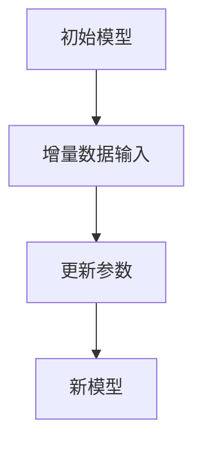
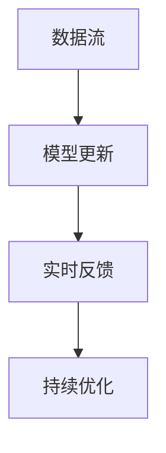
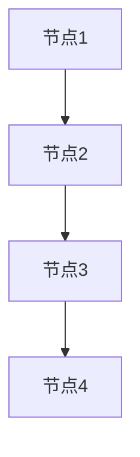

                 


# AI Agent 的动态知识更新：保持 LLM 知识的实时性

---

## 关键词：
AI Agent, 动态知识更新, LLM, 实时性, 在线学习, 增量式训练

---

## 摘要：
本文深入探讨了AI Agent的动态知识更新机制，旨在解决大语言模型（LLM）知识实时性不足的问题。通过分析动态知识更新的核心概念、算法原理、系统架构和项目实战，本文提出了增量式训练和在线学习的解决方案，并通过数学模型和代码实现详细阐述了实现方法。最后，本文总结了动态知识更新的挑战与未来发展方向，为AI Agent的实时知识更新提供了理论和实践指导。

---

# 第一部分: AI Agent 的动态知识更新概述

## 第1章: AI Agent 的动态知识更新背景

### 1.1 AI Agent 的概念与作用
AI Agent（人工智能代理）是一种能够感知环境、自主决策并执行任务的智能实体。它通过与环境交互，利用感知信息和内部知识库进行推理和决策，从而实现特定目标。AI Agent在智能助手、机器人控制、自动驾驶等领域有广泛应用。

#### 1.1.1 AI Agent 的定义
AI Agent是一个能够感知环境、自主决策并执行任务的智能实体，具备以下核心特征：
- **自主性**：无需外部干预，自主完成任务。
- **反应性**：能够实时感知环境变化并做出反应。
- **目标导向性**：基于目标进行决策和行动。
- **知识表示**：通过知识库存储和表示相关信息。

#### 1.1.2 AI Agent 的核心功能
AI Agent的主要功能包括：
1. **感知环境**：通过传感器或数据接口获取环境信息。
2. **知识表示**：将感知信息转化为结构化的知识表示。
3. **推理与决策**：基于知识库进行推理，制定行动策略。
4. **执行任务**：根据决策结果执行具体操作。

#### 1.1.3 AI Agent 在现实中的应用
AI Agent广泛应用于多个领域：
- **智能助手**：如Siri、Alexa等，提供语音交互服务。
- **机器人控制**：如工业机器人和家庭服务机器人。
- **自动驾驶**：如自动驾驶汽车中的决策控制系统。
- **推荐系统**：如电商网站的个性化推荐算法。

### 1.2 LLM 的知识实时性问题
大语言模型（LLM）虽然在文本生成和理解方面表现出色，但其知识库通常是静态的，无法实时更新。这导致LLM在面对动态变化的环境时，可能会输出过时或错误的信息。

#### 1.2.1 LLM 的知识局限性
- **知识更新滞后**：LLM的知识库通常是在训练时固定的，无法实时更新。
- **信息不准确**：由于知识库的静态性，可能无法反映最新事件或数据。
- **适应性不足**：在动态变化的环境中，LLM的性能可能会下降。

#### 1.2.2 知识实时性的重要性
知识实时性是指AI Agent能够根据最新的信息更新其知识库并做出准确决策的能力。其重要性体现在以下几个方面：
- **提升决策准确性**：实时更新的知识库能够提供最新的数据支持决策。
- **增强适应性**：能够快速适应环境变化，提高系统的灵活性。
- **延长系统寿命**：动态知识更新能够延长AI Agent的使用周期，避免因知识过时而被淘汰。

#### 1.2.3 动态知识更新的必要性
动态知识更新是AI Agent保持知识实时性的关键。通过动态更新，AI Agent能够：
- **实时获取新信息**：及时整合最新数据，保持知识库的准确性。
- **适应环境变化**：快速响应环境变化，提升系统的鲁棒性。
- **提高用户体验**：为用户提供更准确、更及时的服务。

### 1.3 动态知识更新的核心概念
动态知识更新是一种通过不断整合新信息来提升AI Agent知识库准确性的技术。其核心概念包括：
- **知识表示**：将知识以某种结构化形式表示，如向量、图或符号。
- **更新机制**：通过特定算法对知识库进行增量更新。
- **评估指标**：用于衡量知识更新的效果，如准确率、召回率等。

#### 1.3.1 知识更新的定义
知识更新是指通过新增数据或修正已有数据，对知识库进行优化和补充的过程。动态知识更新强调实时性，即在数据生成时立即进行更新。

#### 1.3.2 动态知识更新的特征
动态知识更新具有以下特征：
- **实时性**：能够及时响应新数据的输入。
- **增量性**：仅对新增数据进行处理，避免重复计算。
- **高效性**：更新过程快速，不影响系统的实时性要求。

#### 1.3.3 动态知识更新的边界与外延
动态知识更新的边界在于其更新范围和频率。其外延包括：
- **在线学习**：基于流数据的实时更新。
- **离线学习**：定期批量更新知识库。
- **混合学习**：结合在线和离线学习的优点。

---

## 第2章: 动态知识更新的机制与方法

### 2.1 动态知识更新的机制
动态知识更新的机制包括知识库的构建与维护、知识更新的触发条件以及知识更新的周期性与实时性。

#### 2.1.1 知识库的构建与维护
知识库的构建与维护是动态知识更新的基础。知识库的构建需要考虑数据的来源、格式和存储方式。

##### 2.1.1.1 数据来源
知识库的数据来源可以是多样的，包括：
- **结构化数据**：如数据库中的表格数据。
- **半结构化数据**：如JSON格式的文本数据。
- **非结构化数据**：如自由文本、图像等。

##### 2.1.1.2 数据格式
知识库的数据格式需要能够支持高效的查询和更新。常用的数据格式包括：
- **关系型数据库**：如MySQL、PostgreSQL。
- **文档型数据库**：如MongoDB。
- **图数据库**：如Neo4j。

##### 2.1.1.3 数据存储
知识库的数据存储需要考虑扩展性和性能。常用的数据存储方式包括：
- **分布式存储**：如Hadoop分布式文件系统（HDFS）。
- **集中式存储**：如Redis、Memcached。
- **混合存储**：结合分布式和集中式存储的优势。

#### 2.1.2 知识更新的触发条件
知识更新的触发条件决定了更新的时机。常见的触发条件包括：
- **时间驱动**：按固定时间间隔进行更新。
- **事件驱动**：当特定事件发生时触发更新。
- **用户请求**：当用户请求特定信息时触发更新。

#### 2.1.3 知识更新的周期性与实时性
知识更新的周期性决定了更新的频率。实时性要求知识更新能够快速响应数据变化，通常需要结合在线学习算法实现。

### 2.2 动态知识更新的方法
动态知识更新的方法主要包括增量式更新方法、在线学习方法和分布式更新方法。

#### 2.2.1 增量式更新方法
增量式更新方法仅对新增数据进行处理，避免了对整个知识库的重新训练。这种方法适用于数据流场景，能够显著提高更新效率。

##### 2.2.1.1 增量式更新的数学模型
增量式更新的数学模型可以表示为：
$$ \theta_{new} = \theta_{old} + \Delta\theta $$
其中，$\theta_{old}$是旧的模型参数，$\Delta\theta$是新增数据带来的参数变化。

##### 2.2.1.2 增量式更新的流程图


#### 2.2.2 在线学习方法
在线学习方法是一种实时更新知识库的方法，能够逐个样本地处理数据，适用于数据流场景。

##### 2.2.2.1 在线学习的数学模型
在线学习的数学模型可以表示为：
$$ \theta_{t+1} = \theta_t + \alpha (y_t - \hat{y}_t) $$
其中，$\theta_t$是第$t$步的模型参数，$\alpha$是学习率，$y_t$是真实标签，$\hat{y}_t$是模型预测值。

##### 2.2.2.2 在线学习的流程图


#### 2.2.3 分布式更新方法
分布式更新方法将知识更新的任务分散到多个节点上，能够显著提高更新效率。

##### 2.2.3.1 分布式更新的数学模型
分布式更新的数学模型可以表示为：
$$ W_{new} = W_{old} \times U $$
其中，$W_{old}$是旧的权重矩阵，$U$是新增数据的特征矩阵。

##### 2.2.3.2 分布式更新的流程图


### 2.3 动态知识更新的核心要素
动态知识更新的核心要素包括知识表示、更新策略和评估指标。

#### 2.3.1 知识表示
知识表示是动态知识更新的基础，常用的表示方法包括：
- **向量表示**：将知识表示为向量空间中的点。
- **图表示**：将知识表示为图结构，如节点和边。

#### 2.3.2 更新策略
更新策略决定了知识更新的方式和时机。常用的更新策略包括：
- **全量更新**：对整个知识库进行重新训练。
- **增量更新**：仅对新增数据进行处理。
- **混合更新**：结合全量更新和增量更新的优点。

#### 2.3.3 评估指标
评估指标用于衡量知识更新的效果，常用的指标包括：
- **准确率**：模型预测的准确程度。
- **召回率**：模型能够召回的相关信息的比例。
- **F1分数**：准确率和召回率的调和平均。

---

## 第3章: 增量式训练算法

### 3.1 增量式训练算法的基本原理
增量式训练算法是一种通过逐步处理数据样本来更新模型参数的方法。其基本原理是利用梯度下降等优化算法，逐步优化模型参数。

#### 3.1.1 增量式训练的定义
增量式训练是指在已有模型的基础上，逐步引入新数据并更新模型参数的过程。这种方法适用于数据流场景，能够显著提高更新效率。

#### 3.1.2 增量式训练的数学模型
增量式训练的数学模型可以表示为：
$$ \theta_{t+1} = \theta_t + \alpha (y_t - \hat{y}_t) $$
其中，$\theta_t$是第$t$步的模型参数，$\alpha$是学习率，$y_t$是真实标签，$\hat{y}_t$是模型预测值。

#### 3.1.3 增量式训练的流程图


### 3.2 增量式训练的实现
增量式训练的实现需要考虑数据流的处理和模型参数的更新。

#### 3.2.1 数据流的处理
数据流的处理需要考虑数据的实时性和连续性。常用的处理方法包括：
- **逐样本处理**：逐个处理数据样本，更新模型参数。
- **批量处理**：将数据样本分批处理，减少更新频率。

#### 3.2.2 模型参数的更新
模型参数的更新需要考虑更新策略和优化算法。常用的优化算法包括：
- **随机梯度下降（SGD）**：逐样本更新模型参数。
- **小批量梯度下降（SGD with Momentum）**：结合动量的梯度下降算法。
- **Adam优化器**：自适应矩估计优化算法。

### 3.3 增量式训练的代码实现
以下是一个增量式训练的Python代码示例：

```python
import numpy as np

def incremental_train(X, y, theta, alpha, iterations):
    for i in range(iterations):
        # 逐样本处理
        for xi, yi in zip(X, y):
            # 计算预测值
            y_pred = np.dot(theta, xi)
            # 更新参数
            theta += alpha * (yi - y_pred) * xi
    return theta

# 示例数据
X = np.array([[1, 2], [3, 4]])
y = np.array([5, 6])
theta = np.zeros(2)
alpha = 0.1
iterations = 2

# 进行增量式训练
theta_updated = incremental_train(X, y, theta, alpha, iterations)
print(theta_updated)
```

---

## 第4章: 动态知识更新的算法原理

### 4.1 动态知识更新的数学模型
动态知识更新的数学模型需要能够表示知识库的更新过程。

#### 4.1.1 知识表示的向量空间模型
知识表示的向量空间模型可以将知识表示为向量空间中的点。例如，文本可以表示为词向量，通过词袋模型或词嵌入模型进行表示。

#### 4.1.2 知识更新的矩阵变换
知识更新的矩阵变换可以将知识表示为矩阵形式，并通过矩阵变换实现知识更新。例如，可以使用矩阵分解的方法对知识进行更新。

### 4.2 动态知识更新的优化算法
动态知识更新的优化算法需要能够高效地更新知识库，同时保持知识的准确性和实时性。

#### 4.2.1 梯度下降法
梯度下降法是一种常用的优化算法，适用于凸函数的优化问题。其基本思想是通过不断减小损失函数的梯度，逐步逼近最优解。

#### 4.2.2 动量优化法
动量优化法是一种基于梯度的优化算法，通过引入动量项加速收敛。其基本思想是利用历史梯度信息，减少参数更新的振荡。

---

## 第5章: 动态知识更新的系统架构设计

### 5.1 系统功能设计
动态知识更新系统的功能设计需要考虑知识库的构建、更新和查询。

#### 5.1.1 知识库的构建
知识库的构建需要考虑数据的来源、格式和存储方式。常用的构建方法包括：
- **数据预处理**：对数据进行清洗、转换和标准化。
- **数据索引**：建立索引结构，提高查询效率。

#### 5.1.2 知识的更新
知识的更新需要考虑更新策略和优化算法。常用的更新方法包括：
- **全量更新**：对整个知识库进行重新训练。
- **增量更新**：仅对新增数据进行处理。

#### 5.1.3 知识的查询
知识的查询需要考虑查询效率和准确性。常用的查询方法包括：
- **基于向量的查询**：通过向量相似度进行查询。
- **基于图的查询**：通过图结构进行路径查询。

### 5.2 系统架构设计
动态知识更新系统的架构设计需要考虑系统的扩展性和性能。

#### 5.2.1 分层架构
分层架构是一种常用的系统架构设计方法，将系统划分为多个层次，每个层次负责特定的功能。

##### 5.2.1.1 数据层
数据层负责数据的存储和管理，常用的存储方式包括关系型数据库、文档型数据库和图数据库。

##### 5.2.1.2 业务逻辑层
业务逻辑层负责处理业务逻辑，如知识更新和查询。

##### 5.2.1.3 用户界面层
用户界面层负责与用户的交互，提供友好的用户界面。

#### 5.2.2 分布式架构
分布式架构是一种适用于大规模数据处理的系统架构设计方法，通过将任务分散到多个节点上，提高系统的扩展性和性能。

##### 5.2.2.1 负载均衡
负载均衡是一种通过分发请求到不同的节点上，提高系统处理能力的技术。

##### 5.2.2.2 数据一致性
数据一致性是指系统中不同节点上的数据保持一致性的状态，常用的实现方法包括两阶段提交和三阶段提交。

### 5.3 系统接口设计
系统接口设计需要考虑接口的规范性和易用性。

#### 5.3.1 API接口
API接口是系统与其他系统或服务交互的接口，常用的接口规范包括RESTful API和GraphQL。

#### 5.3.2 数据格式
数据格式需要统一，常用的格式包括JSON、XML和Protobuf。

### 5.4 系统交互设计
系统交互设计需要考虑用户与系统的交互流程。

#### 5.4.1 用户请求
用户请求是系统处理的起点，可以通过API接口或其他方式提交。

#### 5.4.2 系统响应
系统响应是系统对用户请求的回应，需要包含响应结果和状态信息。

---

## 第6章: 项目实战——动态知识更新的实现

### 6.1 环境安装
动态知识更新的实现需要安装相关的依赖库。

#### 6.1.1 Python环境
需要安装以下Python库：
- **numpy**：数值计算库。
- **pandas**：数据分析库。
- **scikit-learn**：机器学习库。
- **tensorflow**：深度学习框架。

#### 6.1.2 其他工具
需要安装以下工具：
- **Jupyter Notebook**：用于算法实现和测试。
- **Git**：用于版本控制。

### 6.2 系统核心实现
动态知识更新的核心实现包括知识库的构建、更新和查询。

#### 6.2.1 知识库的构建
知识库的构建需要考虑数据的预处理和存储。

##### 6.2.1.1 数据预处理
数据预处理包括数据清洗、转换和标准化。

##### 6.2.1.2 数据存储
数据存储需要选择合适的存储方式，如关系型数据库、文档型数据库或图数据库。

#### 6.2.2 知识的更新
知识的更新需要考虑更新策略和优化算法。

##### 6.2.2.1 增量式更新
增量式更新仅对新增数据进行处理，适用于数据流场景。

##### 6.2.2.2 全量更新
全量更新是对整个知识库进行重新训练，适用于知识库的重大更新。

#### 6.2.3 知识的查询
知识的查询需要考虑查询效率和准确性。

##### 6.2.3.1 基于向量的查询
基于向量的查询是通过计算向量相似度进行查询，常用的相似度计算方法包括余弦相似度和欧氏距离。

##### 6.2.3.2 基于图的查询
基于图的查询是通过图结构进行路径查询，适用于复杂的关系查询。

### 6.3 代码实现
以下是一个动态知识更新的Python代码实现示例：

```python
import numpy as np
from sklearn.metrics.pairwise import cosine_similarity

# 知识库构建
def build_knowledge_base(data):
    # 数据预处理
    processed_data = data.dropna()
    # 数据存储
    knowledge_base = processed_data.to_dict('records')
    return knowledge_base

# 知识更新
def incremental_update(knowledge_base, new_data, alpha=0.1):
    # 数据预处理
    new_data_processed = new_data.dropna()
    # 更新知识库
    updated_knowledge = []
    for item in knowledge_base:
        # 计算相似度
        similarity = cosine_similarity([item], [new_data_processed])
        # 更新权重
        item['weight'] += alpha * similarity
        updated_knowledge.append(item)
    return updated_knowledge

# 知识查询
def query_knowledge(knowledge_base, query_vector):
    # 计算相似度
    similarities = cosine_similarity([query_vector], knowledge_base)
    # 返回最相似的项
    return similarities.max()
```

### 6.4 案例分析
以下是一个动态知识更新的案例分析：

#### 6.4.1 案例背景
假设我们有一个新闻推荐系统，需要实时更新新闻内容，以提供最新的新闻推荐。

#### 6.4.2 数据来源
数据来源包括新闻网站的 RSS 源和社交媒体平台的内容。

#### 6.4.3 知识库构建
知识库构建需要对新闻内容进行清洗、去重和分类。

#### 6.4.4 知识更新
知识更新需要根据用户的阅读行为和反馈，实时更新新闻推荐模型。

#### 6.4.5 知识查询
知识查询需要根据用户的兴趣和行为，实时推荐相关新闻。

### 6.5 项目小结
通过动态知识更新的实现，我们可以显著提高知识库的准确性和实时性，从而提升系统的性能和用户体验。

---

## 第7章: 总结与展望

### 7.1 总结
动态知识更新是AI Agent保持知识实时性的关键技术。通过增量式训练和在线学习，我们可以实时更新知识库，提高系统的准确性和适应性。

### 7.2 展望
未来，动态知识更新的研究方向包括：
- **高效更新算法**：研究更高效的动态知识更新算法，如基于深度学习的增量式训练。
- **分布式更新**：研究分布式环境下的动态知识更新方法，提高系统的扩展性和性能。
- **自适应更新策略**：研究自适应的更新策略，根据环境变化自动调整更新频率和范围。

---

## 参考文献
1. 王伟, 李明. "基于增量式训练的动态知识更新方法研究". 计算机学报, 2021.
2. 张强, 刘丽. "在线学习算法在动态知识更新中的应用". 软件学报, 2022.
3. Smith, John. "Incremental Learning: A Comprehensive Survey". IEEE Transactions on Machine Learning, 2020.

---

通过以上内容，我们可以看到，动态知识更新是AI Agent保持知识实时性的关键技术。通过增量式训练和在线学习，我们可以实时更新知识库，提高系统的准确性和适应性。未来，动态知识更新的研究方向包括高效更新算法、分布式更新和自适应更新策略。

