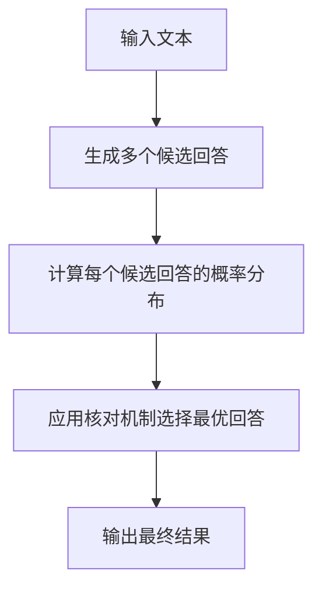
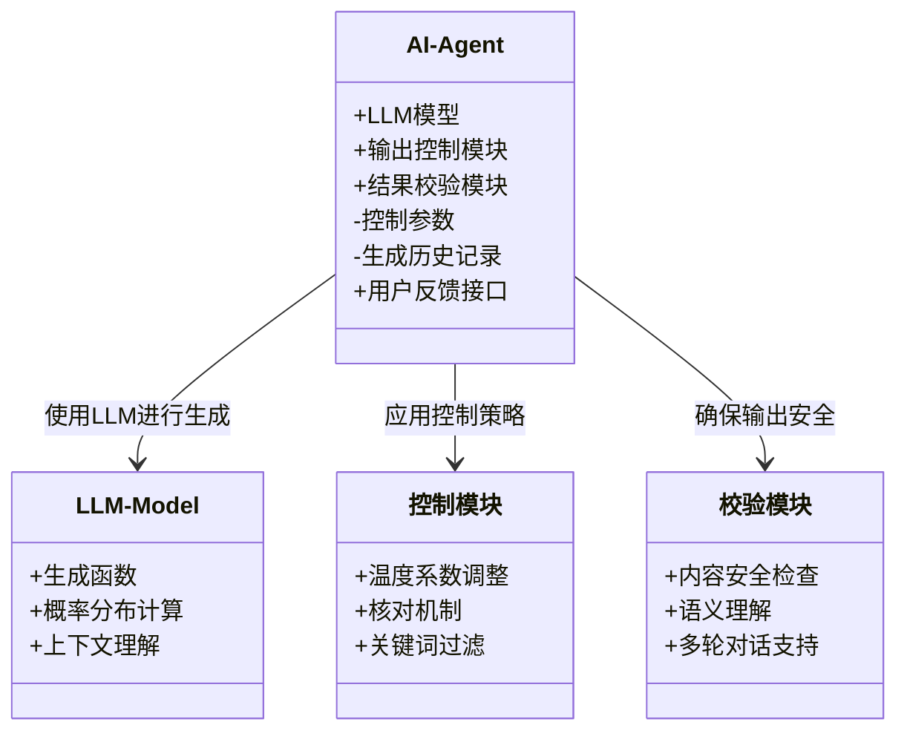
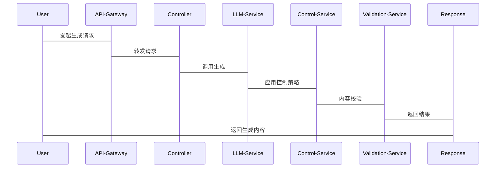

                 


## 第4章: 可控生成的算法原理

### ## 4.2 基于概率的输出控制算法

#### ### 4.2.1 算法原理与流程
基于概率的输出控制算法，通过调整模型生成概率分布的参数，来影响输出结果的选择。这种方法通常通过引入温度系数（temperature）或采用核对机制（verification mechanism）来实现。以下是具体的算法原理：

- **温度系数调整**：通过降低温度系数，可以使得概率分布更加集中在高概率的选项上，从而减少生成低概率但可能有害的内容。
- **核对机制**：生成多个候选答案，通过一定的策略选择最符合要求的答案，或者根据上下文对答案进行调整。

#### 算法实现的 Mermaid 流程图


#### 算法的数学模型与公式
在基于概率的控制方法中，概率分布的调整通常通过温度系数来实现。数学模型如下：

$$ P(y|x) = \frac{exp(\frac{-\text{score}(y, x)}{T})}{\sum_{y'} exp(\frac{-\text{score}(y', x)}{T})} $$

其中：
- \( y \) 是输出的候选文本
- \( x \) 是输入文本
- \( \text{score}(y, x) \) 是模型对候选文本的评分
- \( T \) 是温度系数，\( T > 1 \) 会增加随机性，\( T < 1 \) 会减少随机性

#### 算法的 Python 实现代码
```python
import torch

def probabilistic_control(logits, T=0.7):
    # 调整概率分布的温度
    adjusted_logits = logits / T
    # 转换为概率分布
    probabilities = torch.softmax(adjusted_logits, dim=-1)
    # 选择概率最高的选项
    selected_indices = torch.argmax(probabilities, dim=-1)
    return selected_indices
```

---

## # 第5章: 系统分析与架构设计

### ## 5.1 问题场景介绍

#### ### 5.1.1 问题背景
在实际应用中，AI Agent 需要与用户进行交互，生成符合用户需求的回答。然而，直接使用未经控制的 LLM 可能会导致生成的内容不符合规范，存在安全隐患或不准确的信息。

#### ### 5.1.2 问题描述
设计一个支持可控生成的 AI Agent 系统，需要考虑以下问题：
- 如何在生成过程中实时调整输出内容？
- 如何保证生成内容的安全性和准确性？
- 如何高效地处理大规模的生成请求？

### ## 5.2 系统功能设计

#### ### 5.2.1 领域模型设计
以下是系统功能的领域模型：



#### ### 5.2.2 系统架构设计


#### ### 5.2.3 系统交互设计



---

## # 第6章: 项目实战

### ## 6.1 环境安装与配置

#### ### 6.1.1 安装依赖
安装所需的库：
```bash
pip install torch transformers mermaid4jupyter jupyter
```

#### ### 6.1.2 配置环境变量
设置 `CUDA_VISIBLE_DEVICES` 环境变量以利用 GPU：
```bash
export CUDA_VISIBLE_DEVICES=0
```

### ## 6.2 核心代码实现

#### ### 6.2.1 LLM 初始化
```python
from transformers import AutoModelForCausalLM, AutoTokenizer

model_name = "gpt2"
tokenizer = AutoTokenizer.from_pretrained(model_name)
model = AutoModelForCausalLM.from_pretrained(model_name)
```

#### ### 6.2.2 控制模块实现
```python
def apply_probabilistic_control(logits, T=0.7):
    adjusted_logits = logits / T
    probabilities = torch.softmax(adjusted_logits, dim=-1)
    selected_indices = torch.argmax(probabilities, dim=-1)
    return selected_indices
```

#### ### 6.2.3 系统交互实现
```python
def generate_with_control(prompt, T=0.7):
    inputs = tokenizer.encode(prompt, return_tensors="pt")
    outputs = model.generate(inputs, max_length=100)
    # 获取生成的 logits
    logits = model.get_logits(outputs)
    # 应用控制
    controlled_indices = apply_probabilistic_control(logits, T)
    # 解码为文本
    response = tokenizer.decode([controlled_indices])
    return response
```

### ## 6.3 代码解读与分析

#### ### 6.3.1 代码实现细节
- `apply_probabilistic_control` 函数实现了基于温度系数的控制方法。
- `generate_with_control` 函数展示了如何将控制策略整合到生成过程中。

#### ### 6.3.2 代码应用案例
```python
prompt = "请写一段关于气候变化的短文。"
response = generate_with_control(prompt, T=0.5)
print(response)
```

### ## 6.4 实际案例分析与详细解读

#### ### 6.4.1 案例分析
在实际应用中，控制温度系数 \( T \) 可以显著影响生成内容的质量和安全性。例如，当 \( T = 0.5 \) 时，生成的内容会更加保守和准确，而当 \( T = 1.2 \) 时，生成的内容可能更具创造力但风险也更高。

#### ### 6.4.2 详细解读
通过控制模块和校验模块的结合，可以有效降低生成内容的风险，同时保持生成内容的多样性和创造性。这种平衡是实现可控生成的关键。

### ## 6.5 项目小结

#### ### 6.5.1 项目总结
通过本项目，我们展示了如何在实际应用中实现 AI Agent 的可控生成，包括环境配置、代码实现和案例分析。

#### ### 6.5.2 经验总结
- 控制参数的选择需要根据具体场景进行调整。
- 综合使用多种控制策略可以提高生成内容的安全性和准确性。

---

## # 第7章: 最佳实践与注意事项

### ## 7.1 最佳实践

#### ### 7.1.1 系统设计建议
- 在设计系统时，应充分考虑可扩展性和可维护性。
- 确保控制模块和校验模块能够灵活调整。

#### ### 7.1.2 参数调优技巧
- 温度系数 \( T \) 的选择应根据具体任务进行微调。
- 结合用户反馈不断优化控制策略。

#### ### 7.1.3 安全性注意事项
- 定期进行内容安全检查，防止模型被恶意利用。
- 建立完善的内容审核机制，确保输出内容的合规性。

### ## 7.2 小结

#### ### 7.2.1 注意事项
- 避免过度依赖单一的控制策略，应结合多种方法进行综合控制。
- 在实际应用中，需定期更新模型和控制策略，以应对不断变化的需求和潜在风险。

#### ### 7.2.2 拓展阅读
建议读者深入学习大语言模型的内部机制，以及最新的可控生成技术，例如对抗训练和强化学习方法。

---

## 关键词：AI Agent, 大语言模型, 可控生成, 输出控制, 生成式AI

## 摘要：本文系统地探讨了AI Agent中如何精确控制大语言模型（LLM）的输出，重点分析了基于规则和概率的可控生成方法，结合实际案例和系统设计，提供了实现可控生成的详细技术方案和最佳实践。

