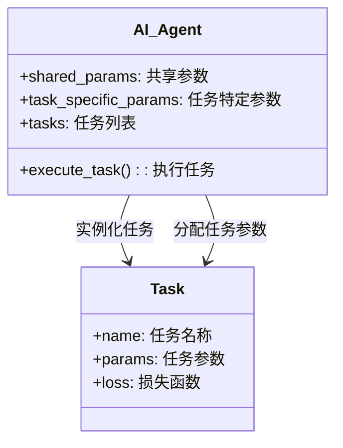

                 


# AI Agent 的多任务学习：增强 LLM 的泛化能力

> 关键词：AI Agent，多任务学习，LLM，泛化能力，增强学习

> 摘要：本文探讨如何通过多任务学习增强大语言模型（LLM）的泛化能力，重点分析AI Agent在多任务学习中的角色和实现方法，结合算法原理和系统架构设计，提供实际案例和优化建议。

---

# 第1章: AI Agent 与多任务学习概述

## 1.1 AI Agent 的基本概念

### 1.1.1 AI Agent 的定义
AI Agent（人工智能代理）是一种能够感知环境并采取行动以实现目标的智能系统。它可以是一个软件程序、机器人或其他智能实体，通过与环境交互来完成特定任务。

### 1.1.2 AI Agent 的核心特征
- **自主性**：能够在没有外部干预的情况下自主决策。
- **反应性**：能够实时感知环境并做出反应。
- **目标导向**：所有行动都以实现特定目标为导向。
- **社会性**：能够与其他 Agent 或人类进行交互和协作。

### 1.1.3 AI Agent 的应用场景
AI Agent 广泛应用于自动驾驶、智能助手、机器人、推荐系统等领域。例如，智能音箱能够通过语音指令完成播放音乐、设置提醒等任务，就是一个典型的 AI Agent 应用。

---

## 1.2 多任务学习的核心概念

### 1.2.1 多任务学习的定义
多任务学习（Multi-Task Learning, MTL）是一种机器学习范式，旨在通过同时学习多个相关任务来提升模型的泛化能力。与单一任务学习不同，MTL 允许模型共享不同任务之间的特征和参数，从而减少数据需求并提高学习效率。

### 1.2.2 多任务学习的优势
- **数据效率**：通过共享任务特征，MTL 可以在数据量较少的情况下进行有效学习。
- **知识迁移**：模型可以在不同任务之间迁移知识，提升整体性能。
- **任务互补性**：多个相关任务的结合可以提供更全面的数据视角，增强模型的泛化能力。

### 1.2.3 多任务学习的挑战
- **任务冲突**：不同任务之间可能存在目标冲突，导致模型难以同时优化所有任务。
- **计算复杂度**：同时处理多个任务会增加计算和存储的复杂度。
- **任务权重**：如何平衡不同任务的重要性是一个关键问题。

---

## 1.3 AI Agent 与多任务学习的结合

### 1.3.1 AI Agent 的任务模型
AI Agent 的任务模型通常包括感知、推理和行动三个阶段。通过多任务学习，AI Agent 可以同时优化感知、推理和行动能力，从而提升整体性能。

### 1.3.2 多任务学习在 AI Agent 中的作用
多任务学习可以增强 AI Agent 的泛化能力，使其能够更好地应对多样化的任务场景。例如，一个智能助手可以通过多任务学习同时优化自然语言理解、上下文推理和任务规划能力。

### 1.3.3 增强 LLM 泛化能力的目标
通过多任务学习，我们可以使大语言模型（LLM）具备更强的跨任务适应能力，能够更好地处理复杂和多样化的任务。

---

## 1.4 本章小结
本章介绍了 AI Agent 和多任务学习的基本概念，分析了它们的结合方式，并探讨了多任务学习在增强 LLM 泛化能力中的作用。通过理解这些内容，读者可以为后续的算法和系统设计打下基础。

---

# 第2章: 多任务学习的算法原理

## 2.1 多任务学习的算法框架

### 2.1.1 基于共享参数的多任务学习
在基于共享参数的多任务学习中，所有任务共享一组参数，每个任务还可以有特定的非共享参数。这种方法可以有效利用任务之间的共享特征，但需要谨慎处理任务之间的冲突。

### 2.1.2 基于任务分解的多任务学习
任务分解方法将一个多任务学习问题分解为多个子任务，并为每个子任务分配特定的参数。这种方法适用于任务之间差异较大的场景。

### 2.1.3 基于任务权重的多任务学习
基于任务权重的多任务学习通过为每个任务分配不同的权重，动态调整任务的优先级。这种方法可以有效平衡不同任务的重要性。

---

## 2.2 基于 transformer 的多任务学习模型

### 2.2.1 transformer 模型的多任务学习扩展
transformer 模型通过自注意力机制可以天然地支持多任务学习。通过共享某些层的参数，可以实现多任务特征的高效提取。

### 2.2.2 多任务学习的注意力机制
在多任务学习中，注意力机制可以动态地调整不同任务的特征权重，从而优化模型的性能。

### 2.2.3 多任务学习的解码器设计
解码器部分可以根据不同任务的需求进行定制化设计，以适应多种输出格式。

---

## 2.3 多任务学习的数学模型

### 2.3.1 多任务学习的损失函数
多任务学习的损失函数通常是一个加权损失的组合。例如：
$$ L = \sum_{i=1}^{n} w_i L_i $$
其中，\( w_i \) 是任务 \( i \) 的权重，\( L_i \) 是任务 \( i \) 的损失函数。

### 2.3.2 多任务学习的优化算法
多任务学习可以使用现有的优化算法，如随机梯度下降（SGD）或 Adam，通过优化共享参数和任务特定参数来实现。

### 2.3.3 多任务学习的权重共享机制
权重共享机制可以通过共享某些层的参数来实现任务之间的知识共享。例如，在 transformer 模型中，可以共享嵌入层和自注意力层的参数。

---

## 2.4 本章小结
本章详细介绍了多任务学习的算法框架，包括基于共享参数、任务分解和任务权重的多任务学习方法。同时，还探讨了 transformer 模型在多任务学习中的应用，为后续的系统设计奠定了基础。

---

# 第3章: 增强 LLM 泛化能力的核心算法

## 3.1 基于多任务学习的 LLM 增强方法

### 3.1.1 多任务学习对 LLM 泛化能力的提升
通过多任务学习，LLM 可以同时优化多种任务，如文本分类、问答系统和机器翻译，从而提升其在不同任务上的表现。

### 3.1.2 多任务学习在 LLM 中的实现
在 LLM 中实现多任务学习可以通过共享某些层的参数，并为每个任务设计特定的输出层。例如：
$$ y_i = f_{shared}(x) + f_{task_i}(x) $$
其中，\( f_{shared}(x) \) 是共享特征提取函数，\( f_{task_i}(x) \) 是任务特定的特征变换函数。

---

## 3.2 多任务学习的训练策略

### 3.2.1 任务权重的动态调整
在训练过程中，可以根据任务的难度和重要性动态调整任务权重。例如，使用反向传播过程中的梯度信息来更新任务权重。

### 3.2.2 任务交替训练
任务交替训练是一种有效的训练策略，通过交替优化不同任务的参数，可以减少任务之间的冲突。

### 3.2.3 知识蒸馏
知识蒸馏可以通过将多任务学习模型的知识迁移到单任务模型中，进一步提升模型的泛化能力。

---

## 3.3 本章小结
本章探讨了基于多任务学习的 LLM 增强方法，包括多任务学习的实现策略和训练技巧。这些方法可以有效提升 LLM 的泛化能力，使其能够更好地应对多样化的任务场景。

---

# 第4章: 系统分析与架构设计

## 4.1 问题场景介绍

### 4.1.1 任务场景
我们考虑一个智能客服系统，其中 AI Agent 需要同时完成自然语言理解、意图识别和任务规划等多个任务。

### 4.1.2 系统目标
系统目标是通过多任务学习增强 AI Agent 的泛化能力，使其能够高效地处理多样化的用户请求。

---

## 4.2 系统功能设计

### 4.2.1 领域模型设计
领域模型可以通过 Mermaid 类图表示，展示系统中的主要组件及其关系。



### 4.2.2 系统架构设计
系统架构可以通过 Mermaid 架构图表示，展示系统的模块组成及其交互关系。


---

## 4.3 本章小结
本章通过 Mermaid 图展示了 AI Agent 的系统架构和功能设计，为后续的实现提供了清晰的指导。

---

# 第5章: 项目实战

## 5.1 环境安装

### 5.1.1 安装 Python 和相关库
安装 Python 3.8 或更高版本，并安装以下库：
```
pip install numpy
pip install torch
pip install transformers
```

---

## 5.2 核心代码实现

### 5.2.1 多任务学习模型实现
以下是基于 PyTorch 的多任务学习模型实现代码：

```python
import torch
import torch.nn as nn
from torch.utils.data import DataLoader

class MultiTaskModel(nn.Module):
    def __init__(self, input_dim, shared_dim, task_dims):
        super(MultiTaskModel, self).__init__()
        self.shared_layer = nn.Linear(input_dim, shared_dim)
        self.task_layers = nn.ModuleList()
        for task_dim in task_dims:
            self.task_layers.append(nn.Linear(shared_dim, task_dim))
    
    def forward(self, x, task_idx):
        x = self.shared_layer(x)
        task_layer = self.task_layers[task_idx]
        x = task_layer(x)
        return x

# 示例用法
input_dim = 100
shared_dim = 50
task_dims = [20, 30]
model = MultiTaskModel(input_dim, shared_dim, task_dims)
```

---

## 5.3 代码解读与分析

### 5.3.1 模型结构解读
模型包含一个共享层和多个任务特定层。共享层将输入特征映射到共享特征空间，任务特定层将共享特征映射到各自任务的输出空间。

### 5.3.2 损失函数与优化
可以使用不同的损失函数针对每个任务进行优化，例如：
```python
loss_fn1 = nn.CrossEntropyLoss()
loss_fn2 = nn.MSELoss()
```

---

## 5.4 案例分析与实现
以下是一个简单的训练示例：

```python
def train(model, optimizer, dataloaders, task_dims):
    model.train()
    for task_idx, (inputs, labels) in enumerate(dataloader):
        outputs = model(inputs, task_idx)
        task_loss = loss_fns[task_idx](outputs, labels)
        task_loss.backward()
        optimizer.step()
        optimizer.zero_grad()

loss_fns = [nn.CrossEntropyLoss(), nn.MSELoss()]
optimizer = torch.optim.Adam(model.parameters(), lr=0.001)
```

---

## 5.5 项目小结
本章通过实际案例展示了如何在 PyTorch 中实现多任务学习模型，并分析了模型的训练过程。

---

# 第6章: 优化与挑战

## 6.1 多任务学习的优化策略

### 6.1.1 任务权重的动态调整
可以通过反向传播过程中梯度的信息动态调整任务权重。

### 6.1.2 参数空间的压缩
通过剪枝或知识蒸馏等技术，可以进一步优化模型的参数空间。

---

## 6.2 多任务学习的注意事项

### 6.2.1 任务之间的冲突
需要谨慎处理任务之间的冲突，避免某些任务过于主导模型的优化过程。

### 6.2.2 计算资源的需求
多任务学习需要更多的计算资源，特别是在训练大规模模型时。

---

## 6.3 拓展阅读
建议读者阅读以下论文和书籍，以深入了解多任务学习的最新进展：
- "A survey on multi-task learning"（综述）
- "Multi-task neural networks: A survey and benchmark”（综述）

---

# 第7章: 总结与展望

## 7.1 本章总结
本文详细探讨了 AI Agent 的多任务学习方法，分析了其在增强 LLM 泛化能力中的作用，并通过实际案例展示了多任务学习的实现过程。

## 7.2 未来展望
未来的研究可以进一步探索多任务学习与其他技术的结合，如强化学习和自适应计算，以进一步提升 AI Agent 的泛化能力。

---

# 结语
通过本文的探讨，我们深入理解了 AI Agent 的多任务学习方法及其在增强 LLM 泛化能力中的应用。希望本文的内容能够为相关领域的研究和实践提供有价值的参考。

