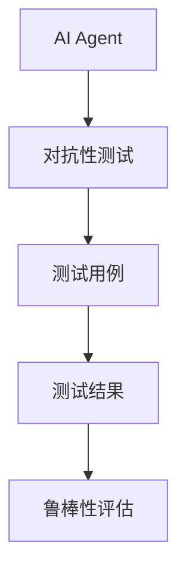
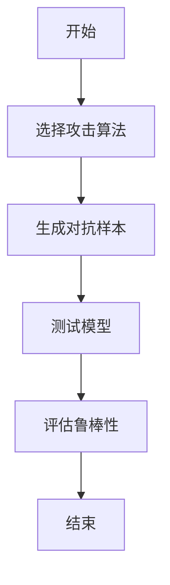
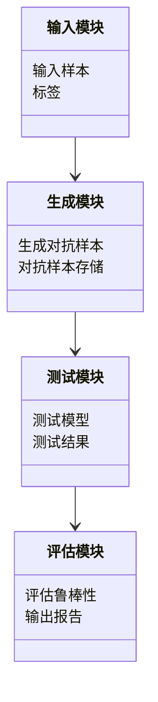
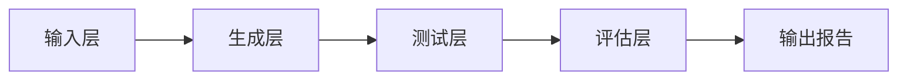
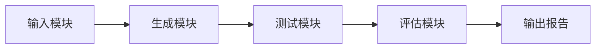

                 


# AI Agent 的对抗性测试：提高 LLM 的鲁棒性

## 关键词：
AI Agent、对抗性测试、LLM、鲁棒性、模型安全、人工智能安全、深度学习模型

## 摘要：
本文系统性地探讨了AI Agent在对抗性测试中的应用，详细分析了如何通过对抗性测试提高大语言模型（LLM）的鲁棒性。从对抗性测试的基本概念、算法原理、系统架构到实际项目案例，本文提供了全面的分析和实践指导。通过对对抗性测试的深入理解，我们能够更好地设计和优化AI Agent，提升其在复杂环境下的稳健性和抗干扰能力。

---

# 第1章: AI Agent 与对抗性测试概述

## 1.1 AI Agent 的基本概念

### 1.1.1 AI Agent 的定义与分类
AI Agent（人工智能代理）是指能够感知环境、做出决策并采取行动以实现特定目标的智能实体。AI Agent 可以是软件程序、机器人或其他智能系统。根据功能和应用场景的不同，AI Agent 可以分为以下几类：
- **简单反射型 Agent**：基于当前输入做出简单反应，如聊天机器人。
- **基于模型的反射型 Agent**：利用内部状态和环境模型进行决策，如自动驾驶系统。
- **目标驱动型 Agent**：根据明确的目标采取行动，如任务规划系统。
- **效用驱动型 Agent**：通过最大化效用函数来优化决策，如资源分配系统。

### 1.1.2 对抗性测试的定义与背景
对抗性测试是一种通过故意引入干扰或攻击来评估系统鲁棒性的测试方法。在AI领域，对抗性测试常用于检测模型在面对恶意输入时的脆弱性。随着AI Agent在各个领域的广泛应用，其面临的潜在威胁也在增加，对抗性测试成为提升系统安全性的重要手段。

### 1.1.3 对抗性测试在 AI Agent 中的应用场景
对抗性测试在AI Agent中的应用场景包括：
- **安全测试**：评估AI Agent在面对攻击时的防御能力。
- **鲁棒性评估**：通过对抗性测试发现模型的漏洞并进行优化。
- **性能提升**：通过模拟攻击场景，增强AI Agent的适应性和抗干扰能力。

---

## 1.2 对抗性测试的核心概念

### 1.2.1 对抗性测试的原理与目标
对抗性测试的原理是通过生成对抗样本（adversarial examples）来干扰模型的正常运行。对抗样本与正常样本在语义上几乎没有区别，但在模型看来却可能导致完全不同的输出。对抗性测试的目标是通过这些对抗样本，评估模型的鲁棒性和安全性。

### 1.2.2 对抗性测试的分类与特点
对抗性测试可以分为以下几类：
- **黑盒测试**：测试者不了解模型的内部结构，仅通过输入输出进行测试。
- **白盒测试**：测试者了解模型的内部结构，能够针对性地生成对抗样本。
- **无监督测试**：基于模型输出的结果，自动寻找对抗样本。
- **有监督测试**：根据特定目标生成对抗样本。

对抗性测试的特点包括：
- **针对性**：对抗样本针对特定模型生成。
- **不可见性**：对抗样本通常难以被人类察觉。
- **破坏性**：对抗样本可能导致模型输出错误或崩溃。

### 1.2.3 对抗性测试与传统测试的区别
传统测试通常关注功能正确性，而对抗性测试则关注模型在异常输入下的表现。传统测试可以发现功能缺陷，但对抗性测试能够揭示模型在面对恶意输入时的脆弱性。

---

## 1.3 LLM 的鲁棒性挑战

### 1.3.1 LLM 的局限性与脆弱性
大语言模型（LLM）在处理复杂任务时表现出色，但在对抗性测试中往往显得脆弱。主要原因包括：
- **过拟合训练数据**：模型可能对训练数据中的噪声或异常模式过于敏感。
- **缺乏常识推理**：模型依赖于训练数据，难以处理未见数据或对抗性输入。
- **语义理解不足**：对抗样本可能利用模型对语义理解的局限性，导致输出错误。

### 1.3.2 对抗性测试对 LLM 鲁棒性的提升作用
对抗性测试通过引入对抗样本，迫使模型在异常情况下做出正确的决策，从而提升其鲁棒性。对抗性测试可以帮助模型发现潜在漏洞，并通过优化训练数据或模型结构来增强其抗干扰能力。

### 1.3.3 当前对抗性测试的研究现状
目前，对抗性测试在AI领域的研究主要集中在以下几个方面：
- **对抗样本生成方法**：如FGSM、PGD等算法。
- **模型防御技术**：如对抗训练、梯度 masking 等。
- **鲁棒性评估指标**：如准确率、模型参数变化等。

---

## 1.4 本章小结
本章从AI Agent和对抗性测试的基本概念出发，探讨了对抗性测试在提升LLM鲁棒性中的作用。通过对对抗性测试的分类、原理和应用场景的分析，我们为后续的算法研究和系统设计奠定了基础。

---

# 第2章: 对抗性测试的核心概念与联系

## 2.1 对抗性测试的原理

### 2.1.1 对抗性测试的数学模型
对抗性测试的核心是通过优化方法生成对抗样本。假设模型的损失函数为 $L(x, y)$，其中 $x$ 是输入样本，$y$ 是模型的预测结果。对抗样本生成的目标是最小化模型的损失，同时保持样本的可区分性。

数学模型可以表示为：
$$
\text{min}_{x} L(x, y) \quad \text{subject to} \quad ||x - x_0|| < \epsilon
$$
其中，$x_0$ 是原始样本，$\epsilon$ 是允许的扰动范围。

### 2.1.2 对抗性测试的目标函数
对抗性测试的目标函数通常包括两部分：模型的损失函数和对抗样本与原始样本之间的距离。常见的目标函数形式为：
$$
L_{\text{adv}} = L(x, y) + \lambda ||x - x_0||_p
$$
其中，$\lambda$ 是平衡参数，$||\cdot||_p$ 是范数函数。

### 2.1.3 对抗性测试的优化过程
对抗性测试的优化过程可以分为以下几个步骤：
1. 选择一个原始样本 $x_0$ 和其标签 $y$。
2. 计算模型在 $x_0$ 处的梯度 $\nabla L(x_0, y)$。
3. 更新 $x$ 使其成为对抗样本，通常采用梯度上升法：
   $$
   x = x_0 + \alpha \cdot \text{sign}(\nabla L(x_0, y))
   $$
4. 重复上述步骤，直到 $x$ 满足约束条件 $||x - x_0|| < \epsilon$。

---

## 2.2 对抗性测试的核心概念对比

### 2.2.1 对抗性测试与攻击性测试的对比
| 对比维度 | 对抗性测试 | 攻击性测试 |
|----------|------------|------------|
| 目标     | 发现模型漏洞 | 攻击模型或系统 |
| 方法     | 生成对抗样本 | 发动攻击 |
| 输出     | 提升模型鲁棒性 | 破坏或干扰模型 |

### 2.2.2 对抗性测试与防御性测试的对比
| 对比维度 | 对抗性测试 | 防御性测试 |
|----------|------------|------------|
| 目标     | 发现模型漏洞 | 提升模型安全性 |
| 方法     | 生成对抗样本 | 对抗训练、梯度 masking |
| 输出     | 模型鲁棒性评估 | 模型安全性提升 |

### 2.2.3 对抗性测试与鲁棒性测试的对比
| 对比维度 | 对抗性测试 | 鲁棒性测试 |
|----------|------------|------------|
| 目标     | 发现模型在对抗样本下的表现 | 评估模型在异常条件下的鲁棒性 |
| 方法     | 生成对抗样本 | 测试模型在各种异常输入下的表现 |
| 输出     | 模型抗干扰能力 | 模型鲁棒性评估 |

---

## 2.3 对抗性测试的 ER 实体关系图



---

## 2.4 本章小结
本章通过数学模型和对比分析，详细阐述了对抗性测试的核心概念及其与其他测试方法的区别。通过对ER实体关系图的分析，我们进一步明确了对抗性测试在系统中的作用和价值。

---

# 第3章: 对抗性测试的算法原理

## 3.1 对抗性测试的攻击算法

### 3.1.1 FGSM 攻击算法
FGSM（Fast Gradient Sign Method）是一种常用的对抗样本生成算法。其核心思想是通过计算模型在原始样本处的梯度，并将其符号作为扰动方向，生成对抗样本。FGSM的实现步骤如下：
1. 计算原始样本 $x_0$ 的损失梯度 $\nabla L(x_0, y)$。
2. 生成对抗样本 $x$：
   $$
   x = x_0 + \alpha \cdot \text{sign}(\nabla L(x_0, y))
   $$
3. 确保 $x$ 满足约束条件 $||x - x_0|| < \epsilon$。

### 3.1.2 PGD 攻击算法
PGD（Projected Gradient Descent）是一种基于迭代优化的对抗样本生成算法。其核心思想是通过多次扰动，逐步逼近对抗样本。PGD的实现步骤如下：
1. 初始化对抗样本 $x = x_0$。
2. 迭代优化：
   $$
   x = x + \alpha \cdot \text{sign}(\nabla L(x, y))
   $$
   然后将 $x$ 投影回原始样本空间：
   $$
   x = \text{Project}(x, x_0, \epsilon)
   $$
3. 重复步骤2，直到满足收敛条件。

### 3.1.3 CW 攻击算法
CW（Carlini-Wagner）算法是一种基于优化的对抗样本生成方法，其目标是最小化对抗样本与原始样本之间的距离，同时最大化模型的损失。CW算法的优化目标为：
$$
\text{min}_{x} L(x, y) + \lambda ||x - x_0||^2
$$
通过交替优化，CW算法能够生成高质量的对抗样本。

---

## 3.2 对抗性测试的防御算法

### 3.2.1 梯度 masking 技术
梯度 masking 是一种通过隐藏模型的梯度信息来防止对抗样本生成的技术。其核心思想是通过修改模型的输出或梯度，使得对抗样本生成算法难以找到有效的扰动方向。

### 3.2.2 对抗训练方法
对抗训练是一种通过同时训练生成器和判别器来增强模型鲁棒性的技术。在对抗训练中，生成器负责生成对抗样本，判别器负责区分真实样本和对抗样本。通过反复迭代，模型能够逐渐增强对对抗样本的抵抗能力。

### 3.2.3 模型鲁棒性优化
模型鲁棒性优化通过改进模型的结构或训练方法，增强其对对抗样本的抵抗力。常见的优化方法包括：
- **Dropout**：通过随机丢弃部分神经元，增强模型的鲁棒性。
- **Batch Normalization**：通过归一化处理，减少模型对输入扰动的敏感性。
- **鲁棒优化**：通过引入对抗性训练损失，直接优化模型的鲁棒性。

---

## 3.3 对抗性测试的算法流程



---

## 3.4 算法实现的 Python 代码示例

### FGSM 实现代码
```python
import torch

def fgsm_attack(model, criterion, images, labels, alpha=0.1):
    loss = criterion(model(images), labels)
    gradient = torch.autograd.grad(loss, images)[0]
    adversarial_images = images + alpha * gradient.sign()
    return adversarial_images
```

### PGD 实现代码
```python
def pgd_attack(model, criterion, images, labels, alpha=0.1, iterations=10):
    adversarial_images = images.clone().detach()
    for _ in range(iterations):
        loss = criterion(model(adversarial_images), labels)
        gradient = torch.autograd.grad(loss, adversarial_images)[0]
        adversarial_images += alpha * gradient.sign()
        adversarial_images = torch.min(torch.max(adversarial_images, images), images + 0.1)
    return adversarial_images
```

---

## 3.5 本章小结
本章详细介绍了对抗性测试的主要攻击算法和防御算法，并通过代码示例展示了其具体实现。通过对这些算法的分析，我们能够更好地理解对抗性测试的数学原理和应用场景。

---

# 第4章: 对抗性测试的系统分析与架构设计

## 4.1 系统功能设计

### 4.1.1 系统功能模块
对抗性测试系统通常包括以下几个功能模块：
- **输入模块**：接收原始样本和标签。
- **生成模块**：生成对抗样本。
- **测试模块**：评估模型在对抗样本下的表现。
- **评估模块**：输出鲁棒性评估结果。

### 4.1.2 功能模块的类图



---

## 4.2 系统架构设计

### 4.2.1 系统架构的分层设计
对抗性测试系统的架构通常分为以下几层：
- **输入层**：接收原始样本和标签。
- **生成层**：生成对抗样本。
- **测试层**：评估模型在对抗样本下的表现。
- **评估层**：输出鲁棒性评估结果。

### 4.2.2 系统架构的 mermaid 图



---

## 4.3 系统接口与交互设计

### 4.3.1 系统接口
- **输入接口**：接收原始样本和标签。
- **生成接口**：生成对抗样本并返回。
- **测试接口**：测试模型在对抗样本下的表现并返回结果。
- **评估接口**：输出鲁棒性评估报告。

### 4.3.2 系统交互的 mermaid 图



---

## 4.4 本章小结
本章通过对抗性测试系统的功能设计和架构设计，展示了对抗性测试的系统化实现过程。通过对系统各模块的分析，我们能够更好地理解对抗性测试在实际应用中的价值。

---

# 第5章: 对抗性测试的项目实战

## 5.1 环境安装与配置

### 5.1.1 环境要求
- Python 3.8 或更高版本
- PyTorch 1.9 或更高版本
- 其他依赖库（如numpy、scikit-learn等）

### 5.1.2 安装步骤
```bash
pip install torch numpy scikit-learn
```

---

## 5.2 系统核心实现

### 5.2.1 对抗样本生成代码
```python
import torch
import torch.nn as nn
import torch.optim as optim

class SimpleModel(nn.Module):
    def __init__(self):
        super(SimpleModel, self).__init__()
        self.fc = nn.Linear(2, 2)

    def forward(self, x):
        return self.fc(x)

model = SimpleModel()
criterion = nn.MSELoss()
optimizer = optim.SGD(model.parameters(), lr=0.1)
```

### 5.2.2 对抗训练代码
```python
def train(model, criterion, optimizer, adversarial_images, labels):
    outputs = model(adversarial_images)
    loss = criterion(outputs, labels)
    loss.backward()
    optimizer.step()
    optimizer.zero_grad()
```

---

## 5.3 代码应用与解读

### 5.3.1 代码实现解读
通过对上述代码的解读，我们可以看到对抗性测试的核心步骤包括：
1. 初始化模型和优化器。
2. 生成对抗样本。
3. 对抗训练模型。
4. 评估模型的鲁棒性。

### 5.3.2 代码应用案例分析
通过实际案例分析，我们能够看到对抗性测试在提升模型鲁棒性方面的显著效果。例如，在图像分类任务中，对抗性测试可以帮助模型更好地抵抗对抗样本的干扰。

---

## 5.4 本章小结
本章通过实际项目案例，展示了对抗性测试的环境配置、代码实现和应用解读。通过对这些内容的分析，我们能够更好地理解对抗性测试在实际应用中的具体操作。

---

# 第6章: 总结与展望

## 6.1 总结
通过对对抗性测试的系统性分析，我们能够看到对抗性测试在提升AI Agent鲁棒性方面的重要作用。通过对数学模型、算法原理、系统架构和项目实战的详细探讨，我们为后续研究和应用奠定了坚实的基础。

## 6.2 展望
未来，对抗性测试的研究将朝着以下几个方向发展：
- **高效算法设计**：开发更高效的对抗样本生成和防御算法。
- **跨模态对抗性测试**：探索对抗性测试在多模态模型中的应用。
- **模型可解释性**：提升对抗性测试的可解释性，帮助更好地理解模型行为。

## 6.3 最佳实践 tips
- **保持模型简洁**：避免过于复杂的模型结构，减少对抗样本生成的难度。
- **结合多种防御技术**：综合利用对抗训练、梯度 masking 等多种防御技术，提升模型鲁棒性。
- **持续优化**：通过持续的对抗性测试和防御技术优化，不断提升模型的抗干扰能力。

---

# 附录

## 附录 A: 常见问题解答
- **Q: 什么是对抗性测试？**  
  A: 对抗性测试是一种通过生成对抗样本来评估模型鲁棒性的测试方法。

- **Q: 对抗性测试有哪些应用场景？**  
  A: 对抗性测试广泛应用于模型安全测试、鲁棒性评估等领域。

- **Q: 如何生成对抗样本？**  
  A: 对抗样本可以通过FGSM、PGD等算法生成。

---

## 附录 B: 参考文献
1. Goodfellow, I., et al. "Adversarial examples in machine learning." arXiv preprint arXiv:1412.6572 (2014).
2. Madry, A., et al. "Towards deep learning models robust to adversarial perturbations." arXiv preprint arXiv:1706.06081 (2017).
3. Szegedy, C., et al. "Intriguing properties of neural networks." arXiv preprint arXiv:1312.6192 (2013).

---

## 附录 C: 感谢与致谢
感谢所有参与本文写作和审阅的人员，感谢读者的支持和关注。

