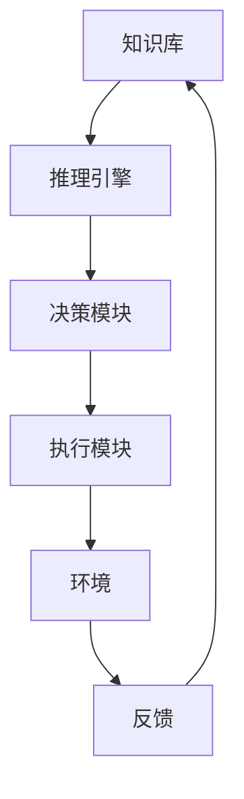
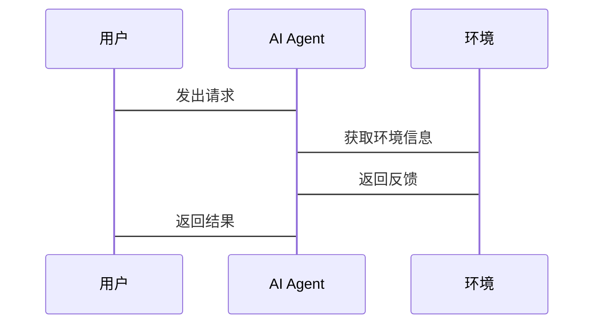

                 


# AI Agent 的情境学习：增强 LLM 的场景适应性

> 关键词：AI Agent, 情境学习, 增强学习, 大语言模型, 人工智能, 场景适应性

> 摘要：本文深入探讨了AI Agent在情境学习中的应用，分析了如何通过情境学习增强大语言模型（LLM）的场景适应性。文章从AI Agent的基本概念出发，逐步讲解了情境学习的原理与算法，结合系统架构和项目实战，详细展示了如何在实际场景中应用这些技术。通过本文，读者可以全面理解AI Agent与情境学习的结合方式，以及如何通过技术手段提升LLM的适应性。

---

## 第一部分：AI Agent 的背景与概念

### 第1章：AI Agent 的基本概念

#### 1.1 AI Agent 的定义与特点
AI Agent（人工智能代理）是指能够感知环境并采取行动以实现特定目标的智能实体。AI Agent可以是软件程序、机器人或其他智能系统，其核心目标是通过与环境交互来优化任务完成效果。

- **定义**：AI Agent是一种能够感知环境、自主决策并采取行动的智能系统，旨在实现特定目标。
- **特点**：
  1. **自主性**：能够在没有外部干预的情况下自主运作。
  2. **反应性**：能够根据环境反馈实时调整行为。
  3. **目标导向**：所有行动都以实现特定目标为导向。
  4. **学习能力**：能够通过经验或数据优化自身性能。

#### 1.2 情境学习的基本原理
情境学习是一种基于实际场景的学习方法，强调在真实或模拟环境中通过互动和经验来提升学习效果。

- **定义**：情境学习是指在特定场景或环境中，通过与环境的互动和经验积累来提升学习效果的过程。
- **核心要素**：
  1. **环境**：学习发生的场景或背景。
  2. **任务**：需要完成的具体目标。
  3. **反馈**：行动后的结果或评价。
  4. **知识库**：存储经验和知识的资源。

#### 1.3 AI Agent 与情境学习的结合
AI Agent在情境学习中的应用，可以通过以下方式增强其场景适应性：

- **AI Agent 在情境学习中的角色**：
  - **感知环境**：AI Agent通过传感器或数据输入感知当前环境状态。
  - **知识表示与推理**：将环境信息转化为知识，并通过推理做出决策。
  - **学习与优化**：通过情境学习不断优化自身的知识库和决策策略。

- **情境学习如何增强 AI Agent 的适应性**：
  - **动态适应**：通过情境学习，AI Agent能够快速适应不同场景的变化。
  - **知识扩展**：情境学习使AI Agent能够积累更多场景下的经验，提升其通用性。
  - **任务优化**：通过情境学习，AI Agent能够找到更优的解决方案，提升任务完成效率。

---

## 第2章：AI Agent 的核心概念与联系

### 2.1 AI Agent 的核心原理
AI Agent的核心原理包括知识表示与推理、感知与决策、学习与优化三个主要部分。

- **知识表示与推理**：
  - 知识表示：将知识以结构化的方式表示，如图、树或规则。
  - 推理：基于知识库进行逻辑推理，得出新的结论。
- **感知与决策**：
  - 感知：通过传感器或数据输入获取环境信息。
  - 决策：基于感知信息和知识库做出决策。
- **学习与优化**：
  - 学习：通过经验或数据优化知识库和决策策略。
  - 优化：使用优化算法（如强化学习）提升决策的效率和准确性。

### 2.2 情境学习的核心要素与系统架构
情境学习的核心要素包括环境、任务、反馈和知识库。以下是情境学习的系统架构：

- **系统架构图**（使用 Mermaid 表示）：
  ```mermaid
  graph TD
    A[环境] --> B[任务]
    B --> C[反馈]
    C --> D[知识库]
    D --> E[推理引擎]
    E --> F[决策]
    F --> G[行动]
    G --> A
  ```

---

## 第3章：算法原理与数学模型

### 3.1 增强学习算法
增强学习是一种通过试错机制来优化决策策略的学习方法。

- **算法流程图**（使用 Mermaid 表示）：
  ```mermaid
  graph TD
    S[状态] --> A[动作]
    A --> R[奖励]
    R --> S[新状态]
  ```

- **数学模型**：
  - 状态转移：$P(s', r | s, a)$，表示在状态$s$下采取动作$a$后，转移到状态$s'$并获得奖励$r$的概率。
  - 策略函数：$\pi(a | s)$，表示在状态$s$下采取动作$a$的概率。
  - 价值函数：$V(s)$，表示在状态$s$下采取最优策略时的期望奖励。

### 3.2 对比学习算法
对比学习是一种通过对比不同样本的相似性来提升模型性能的方法。

- **代码示例**：
  ```python
  def contrastive_loss(x1, x2, y):
      # 计算相似性
      similarity = torch.cosine_similarity(x1, x2)
      # 计算损失
      loss = (1 - y) * torch.log(1 - similarity) + y * torch.log(similarity)
      return loss
  ```

- **数学模型**：
  - 对比损失：$\mathcal{L}(\mathcal{B}) = \sum_{(x_i, x_j, y_i)} (1 - y_i) \log(1 - \text{sim}(x_i, x_j)) + y_i \log(\text{sim}(x_i, x_j))$

---

## 第4章：系统分析与架构设计方案

### 4.1 项目背景与目标
本项目旨在通过AI Agent的情境学习技术，提升大语言模型在复杂场景下的适应性。目标包括：
1. 实现AI Agent在不同场景下的自主决策。
2. 通过情境学习优化AI Agent的知识库和决策策略。
3. 提供一个可扩展的系统架构，支持多种场景的应用。

### 4.2 系统功能设计
系统功能包括：
1. 知识库管理：存储和管理AI Agent的知识库。
2. 感知与推理：通过传感器或数据输入感知环境，并进行逻辑推理。
3. 学习与优化：通过增强学习和对比学习优化AI Agent的性能。
4. 人机交互：提供友好的人机交互界面，支持用户与AI Agent的互动。

### 4.3 系统架构图


### 4.4 接口设计与交互流程图


---

## 第5章：项目实战

### 5.1 环境安装
安装必要的环境和依赖：
1. Python 3.8+
2. PyTorch
3. transformers库
4. Mermaid工具（可选）

### 5.2 核心代码实现
以下是AI Agent的核心代码示例：

```python
from transformers import AutoTokenizer, AutoModelForCausalLM
import torch

# 初始化模型和tokenizer
model_name = "gpt2-large"
tokenizer = AutoTokenizer.from_pretrained(model_name)
model = AutoModelForCausalLM.from_pretrained(model_name)

# 定义生成函数
def generate_response(prompt, max_length=100):
    inputs = tokenizer.encode(prompt, return_tensors="pt")
    outputs = model.generate(inputs, max_length=max_length, do_sample=True)
    response = tokenizer.decode(outputs[0], skip_special_tokens=True)
    return response

# 使用生成函数
prompt = "How can I improve my coding skills?"
response = generate_response(prompt)
print(response)
```

### 5.3 代码解读与分析
- **代码功能**：上述代码展示了如何使用GPT-2模型生成自然语言回复。
- **模型选择**：选择GPT-2-large模型，确保生成回复的质量和长度。
- **生成策略**：使用do_sample=True进行采样生成，提升回复的多样性。

### 5.4 案例分析与详细讲解
以一个实际案例为例，展示AI Agent在情境学习中的应用：

- **案例背景**：假设AI Agent需要在一个在线购物平台上为用户提供商品推荐。
- **任务目标**：根据用户的浏览历史和购买记录，推荐相关商品。
- **系统流程**：
  1. AI Agent感知用户的行为数据。
  2. 通过知识库分析用户的偏好。
  3. 使用增强学习优化推荐策略。
  4. 根据用户反馈调整推荐结果。

---

## 第6章：最佳实践与总结

### 6.1 小结
通过本文的讲解，我们可以看到AI Agent在情境学习中的巨大潜力。通过结合增强学习和对比学习，AI Agent能够显著提升其在复杂场景下的适应性。

### 6.2 注意事项
- **数据质量**：情境学习的效果依赖于高质量的数据，确保数据的多样性和代表性。
- **模型选择**：根据具体任务需求选择合适的模型和算法。
- **性能优化**：通过合理的系统架构设计，提升AI Agent的运行效率和处理能力。

### 6.3 拓展阅读
- 推荐阅读相关领域的最新论文和书籍，深入了解AI Agent和情境学习的前沿技术。

---

通过本文的系统讲解，读者可以全面理解AI Agent在情境学习中的应用，以及如何通过技术手段提升大语言模型的场景适应性。希望本文能够为AI Agent的研究和应用提供有价值的参考。

