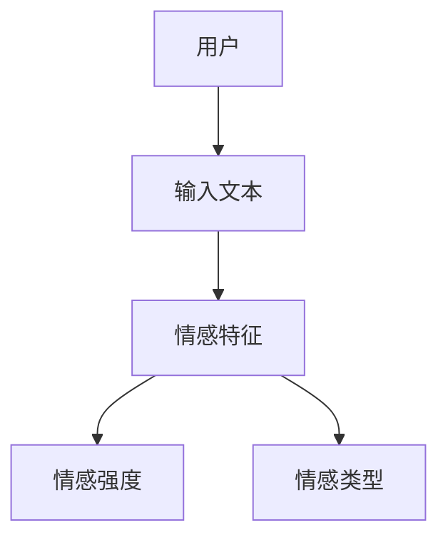
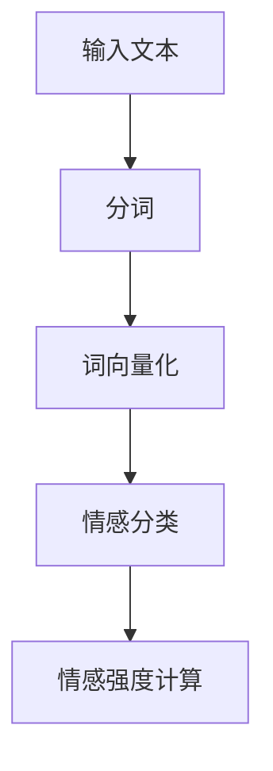
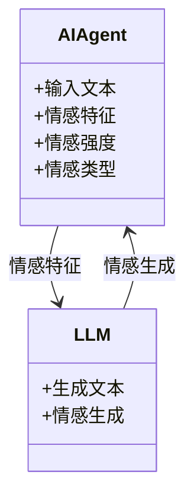
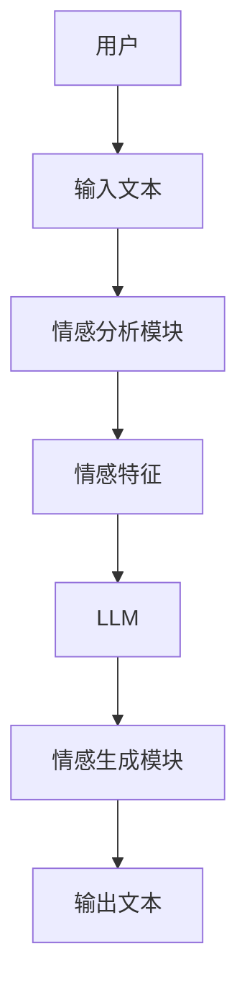
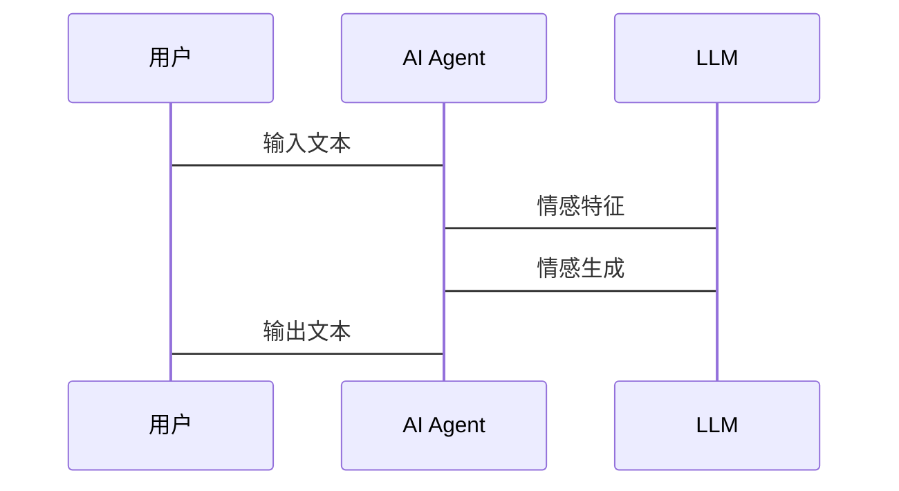

                 


# AI Agent 的情感计算：增强 LLM 的情感交互能力

**关键词：** AI Agent，情感计算，LLM，情感交互，自然语言处理

**摘要：**  
本文探讨了AI Agent中情感计算的核心概念、算法原理及其与大语言模型（LLM）的结合，通过系统架构设计、项目实战和案例分析，详细阐述了如何利用情感计算增强LLM的情感交互能力，从而提升用户体验。

---

## 第1章: AI Agent与情感计算的背景介绍

### 1.1 AI Agent的基本概念

#### 1.1.1 AI Agent的定义
AI Agent（人工智能代理）是指能够感知环境并采取行动以实现目标的智能实体。它可以是一个软件程序，也可以是一个物理设备，通过传感器和执行器与环境交互。

#### 1.1.2 AI Agent的核心特征
- **自主性：** 能够自主决策，无需外部干预。
- **反应性：** 能够实时感知环境并做出反应。
- **目标导向：** 以明确的目标为导向，采取行动。
- **社交能力：** 能够与人类或其他AI Agent进行有效交互。

#### 1.1.3 AI Agent与传统程序的区别
AI Agent具备学习、推理和自适应能力，能够处理复杂和不确定的环境，而传统程序则依赖于预定义的规则，缺乏灵活性。

### 1.2 情感计算的基本概念

#### 1.2.1 情感计算的定义
情感计算（Affective Computing）是研究如何识别、理解、分析和模拟人类情感的计算技术。它关注的是计算机如何处理与情感相关的信息。

#### 1.2.2 情感计算的核心要素
- **情感识别：** 从输入中提取情感特征。
- **情感分析：** 判断情感的类型（如正面、负面、中性）和强度。
- **情感生成：** 根据需求生成相应的情感表达。

#### 1.2.3 情感计算的应用场景
- **人机交互：** 提升用户体验，使其更自然。
- **情感支持：** 在医疗、教育等领域提供情感支持。
- **市场分析：** 分析消费者情感，优化产品设计。

### 1.3 AI Agent与情感计算的关系

#### 1.3.1 AI Agent中情感计算的重要性
情感计算使AI Agent能够理解用户的情感状态，从而提供更个性化的服务。

#### 1.3.2 情感计算如何增强LLM的交互能力
通过情感计算，LLM可以更好地理解用户的情感需求，生成更具情感色彩的回应，提升交互体验。

#### 1.3.3 AI Agent情感计算的边界与外延
AI Agent的情感计算专注于情感信息的处理，与其他功能（如认知推理）相互关联，但不完全等同。

### 1.4 本章小结
本章介绍了AI Agent和情感计算的基本概念，探讨了情感计算在AI Agent中的作用及其与LLM的结合，为后续内容奠定了基础。

---

## 第2章: 情感计算的核心概念与联系

### 2.1 情感计算的核心原理

#### 2.1.1 情感分析的原理
情感分析通过自然语言处理技术，从文本中提取情感特征，并判断情感倾向。

#### 2.1.2 情感生成的原理
情感生成基于预设的规则或机器学习模型，生成符合情感需求的文本或语音。

#### 2.1.3 情感计算的数学模型
情感计算涉及多种数学模型，如情感强度计算和情感分类模型。

### 2.2 情感计算的核心概念对比

#### 2.2.1 情感分析与情感生成的对比
| 特性 | 情感分析 | 情感生成 |
|------|----------|----------|
| 目标 | 判断情感状态 | 生成情感表达 |
| 输入 | 文本数据 | 情感需求 |
| 输出 | 情感标签 | 情感文本 |

#### 2.2.2 情感强度与情感类型的关系
情感强度是情感的程度（如非常高兴），而情感类型是情感的种类（如高兴、悲伤）。

#### 2.2.3 情感计算与传统文本处理的差异
情感计算关注情感信息，而传统文本处理关注语法和语义。

### 2.3 情感计算的ER实体关系图


### 2.4 本章小结
本章详细探讨了情感计算的核心概念和原理，分析了其在AI Agent中的应用，为后续章节奠定了理论基础。

---

## 第3章: AI Agent中情感计算的算法原理

### 3.1 情感计算的算法流程

#### 3.1.1 数据预处理
数据预处理包括分词、去除停用词和词向量化。

#### 3.1.2 情感特征提取
使用词袋模型或词嵌入技术提取情感特征。

#### 3.1.3 情感分类与生成
利用机器学习或深度学习模型进行情感分类和生成。

### 3.2 情感计算的算法实现

#### 3.2.1 算法流程图


#### 3.2.2 情感分类模型
使用逻辑回归或深度学习模型（如LSTM）进行情感分类。

#### 3.2.3 情感生成模型
基于生成对抗网络（GAN）或Transformer模型生成情感文本。

#### 3.2.4 数学模型
情感分类的损失函数：
$$ L = -\sum_{i=1}^{n} y_i \log(p_i) + (1-y_i)\log(1-p_i) $$
其中，$y_i$是真实标签，$p_i$是预测概率。

---

## 第4章: AI Agent与LLM的情感交互系统架构

### 4.1 问题场景介绍
本章将探讨如何设计一个基于AI Agent和LLM的情感交互系统，提升用户体验。

### 4.2 系统功能设计

#### 4.2.1 功能模块划分
- 情感分析模块
- 情感生成模块
- 交互控制模块

#### 4.2.2 领域模型


### 4.3 系统架构设计

#### 4.3.1 系统架构图


#### 4.3.2 系统接口设计
- 输入接口：接收用户输入的文本。
- 输出接口：输出情感生成的文本。

### 4.4 系统交互流程

#### 4.4.1 交互流程图


---

## 第5章: 项目实战：基于AI Agent与LLM的情感交互系统

### 5.1 环境安装
- 安装Python和必要的库（如TensorFlow、Keras）。

### 5.2 核心实现代码

#### 5.2.1 情感分析模块
```python
import numpy as np
from tensorflow.keras.models import Model
from tensorflow.keras.layers import Input, Dense, LSTM

# 输入层
input_layer = Input(shape=(max_len, embedding_dim))
lstm_layer = LSTM(64)(input_layer)
dense_layer = Dense(3, activation='softmax')(lstm_layer)
model = Model(inputs=input_layer, outputs=dense_layer)
model.compile(optimizer='adam', loss='categorical_crossentropy', metrics=['accuracy'])
```

#### 5.2.2 情感生成模块
```python
import tensorflow as tf
from tensorflow.keras.layers import Input, Attention, Dense

# 编码器
encoder_input = Input(shape=(max_len, embedding_dim))
encoder_lstm = LSTM(64, return_sequences=True)(encoder_input)
# 解码器
decoder_input = Input(shape=(None, embedding_dim))
decoder_lstm = LSTM(64, return_sequences=True)(decoder_input, initial_state=encoder_lstm)
attention_layer = Attention()([decoder_lstm, encoder_lstm])
dense_layer = Dense(vocab_size, activation='softmax')(attention_layer)
generator = Model([encoder_input, decoder_input], dense_layer)
generator.compile(optimizer='adam', loss='categorical_crossentropy')
```

### 5.3 案例分析与详细解读
通过一个实际案例，展示如何利用上述代码实现情感交互系统，并分析其效果。

### 5.4 项目小结
总结项目实现的关键点和遇到的问题，提出改进建议。

---

## 第6章: 总结与展望

### 6.1 本章小结
总结本文的主要内容，强调情感计算在AI Agent中的重要性。

### 6.2 最佳实践 tips
- 数据质量是关键，确保数据的多样性和代表性。
- 在实际应用中，结合具体场景调整模型参数。
- 定期更新模型，以适应用户情感需求的变化。

### 6.3 未来研究方向
- 探索更高效的情感计算算法。
- 研究多模态情感计算，结合视觉和听觉信息。

---

通过以上结构，我们详细探讨了AI Agent中的情感计算，从理论到实践，为读者提供了全面的知识和实用的指导。

