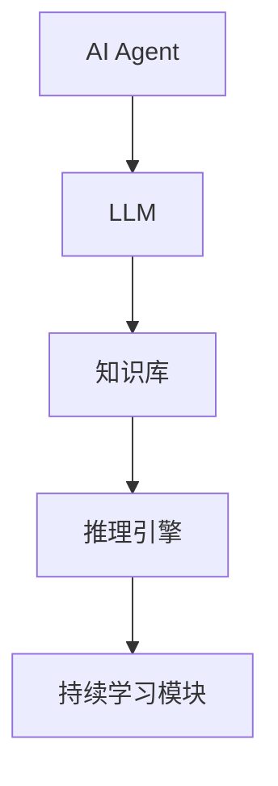
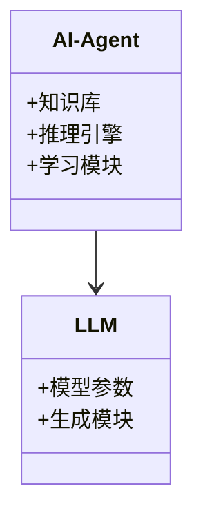

                 


# AI Agent 的持续学习：实现 LLM 的终身学习能力

## 关键词
AI Agent, 持续学习, LLM, 终身学习, 知识蒸馏, 经验重放, 模型优化

## 摘要
随着人工智能技术的快速发展，AI Agent 的持续学习能力成为提升其智能水平的关键。本文详细探讨了如何通过算法优化和系统设计，赋予大型语言模型（LLM）持续学习的能力，实现类似人类的终身学习。文章从背景、核心概念、算法原理、系统架构、项目实战等方面进行深入分析，结合具体案例和代码实现，为AI Agent 的持续学习能力提供系统化的解决方案。

---

# 第一部分: AI Agent 的持续学习概述

# 第1章: AI Agent 的持续学习背景

## 1.1 问题背景与问题描述
### 1.1.1 AI Agent 的定义与核心概念
AI Agent（人工智能代理）是指能够感知环境、执行任务并做出决策的智能实体。其核心能力包括感知、推理、学习和执行。AI Agent 的目标是通过与环境交互，不断优化自身的知识库和行为策略。

在实际应用中，AI Agent 面临的一个关键问题是知识的时效性和适应性。随着环境的变化，模型可能逐渐失效，例如语言模型在新领域或新数据上的表现下降。这就需要 AI Agent 具备持续学习的能力，能够通过不断获取新知识来保持或提升性能。

### 1.1.2 持续学习的必要性与挑战
持续学习（Lifelong Learning）是指模型在不遗忘已有知识的情况下，逐步学习新任务的能力。对于 AI Agent 来说，持续学习的必要性体现在以下几个方面：
- **动态环境适应**：AI Agent 需要应对不断变化的环境，例如新的数据、任务或用户需求。
- **知识积累与复用**：通过持续学习，AI Agent 可以积累长期知识，并在新任务中复用这些知识。
- **提升用户体验**：持续学习能够使 AI Agent 更加智能，从而提供更优质的服务。

然而，持续学习也面临一些挑战：
- **模型遗忘**：在学习新任务时，模型可能会遗忘之前学习的知识。
- **数据稀疏性**：新任务的数据可能较少，导致模型难以有效学习。
- **计算资源限制**：持续学习通常需要更多的计算资源。

### 1.1.3 LLM 的终身学习能力的重要性
大型语言模型（LLM）是当前 AI 技术的核心，但其能力受限于训练数据和模型参数。通过赋予 LLM 持续学习的能力，可以使其在实际应用中不断优化性能，适应新的任务和数据。例如，一个医疗领域的 AI Agent 可以通过持续学习新的医学研究和病例数据，不断提升其诊断和咨询能力。

## 1.2 AI Agent 的核心功能与边界
### 1.2.1 AI Agent 的核心功能模块
AI Agent 的核心功能模块包括：
1. **感知模块**：通过传感器或 API 获取环境信息。
2. **知识库**：存储已学习的知识和经验。
3. **推理引擎**：基于知识库进行逻辑推理和决策。
4. **学习模块**：通过持续学习算法优化自身知识库。

### 1.2.2 持续学习的边界与外延
持续学习的边界在于如何平衡新旧知识的学习，同时避免模型遗忘。外延则包括如何与其他模块（如感知和推理）协同工作，形成一个完整的 AI Agent 系统。

### 1.2.3 LLM 的能力结构与要素组成
LLM 的能力结构包括：
1. **语言理解**：通过自然语言处理技术理解输入文本。
2. **知识存储**：存储和管理知识库。
3. **生成能力**：生成符合上下文的文本输出。
4. **学习能力**：通过持续学习优化自身参数。

## 1.3 本章小结
本章从背景出发，介绍了 AI Agent 的定义、核心功能和持续学习的重要性。同时，分析了 LLM 的能力结构，并为后续章节奠定了基础。

---

# 第二部分: AI Agent 的核心概念与联系

# 第2章: AI Agent 与 LLM 的核心概念

## 2.1 核心概念原理
### 2.1.1 AI Agent 的知识表示与推理机制
AI Agent 的知识表示通常采用符号逻辑或向量表示。推理机制则基于知识库中的逻辑关系进行推导。

### 2.1.2 LLM 的语言模型原理
LLM 通过大规模数据训练，掌握了语言的分布规律。其核心是通过参数调整，生成与输入相关的文本输出。

### 2.1.3 持续学习的核心算法原理
持续学习的核心算法包括模型蒸馏和经验重放等方法，旨在通过知识迁移和经验复用来优化模型性能。

## 2.2 核心概念属性特征对比
### 2.2.1 AI Agent 的能力特征对比表
| 特征 | AI Agent | LLM |
|------|-----------|-----|
| 知识表示 | 符号化或向量化 | 向量化 |
| 学习能力 | 可持续学习 | 需要优化 |
| 推理能力 | 强大 | 较弱 |

### 2.2.2 LLM 的模型参数与性能对比表
| 参数 | 模型蒸馏 | 经验重放 |
|------|----------|----------|
| 参数量 | 较小 | 较大 |
| 计算成本 | 较低 | 较高 |
| 性能提升 | 显著 | 平缓 |

### 2.2.3 持续学习与监督学习的对比分析
持续学习与监督学习的主要区别在于数据分布和任务数量。持续学习涉及多个任务，而监督学习通常针对单任务。

## 2.3 实体关系图
### 2.3.1 AI Agent 的实体关系图


## 2.4 本章小结
本章详细讲解了 AI Agent 和 LLM 的核心概念，并通过对比分析和实体关系图，展示了它们之间的联系。

---

# 第三部分: 持续学习算法原理

# 第3章: 持续学习算法原理

## 3.1 持续学习算法概述
### 3.1.1 模型蒸馏
模型蒸馏是一种通过小模型学习大模型知识的技术。其核心是将大模型的输出作为小模型的标签，从而实现知识迁移。

### 3.1.2 经验重放
经验重放通过存储历史经验，以随机回放的方式优化模型。这种方法可以有效缓解模型遗忘问题。

### 3.1.3 知识蒸馏
知识蒸馏结合了模型蒸馏和经验重放的优势，通过蒸馏和重放的结合，实现知识的高效迁移。

## 3.2 持续学习算法的数学模型
### 3.2.1 经验重放算法的数学公式
$$ P(\tau) = \frac{1}{K} \sum_{k=1}^{K} \tau_k $$
其中，$\tau_k$ 表示第 $k$ 个经验，$K$ 是经验的总数。

### 3.2.2 知识蒸馏的数学公式
$$ p(y|x) = \argmax p(y|x) $$
其中，$p(y|x)$ 表示模型对输入 $x$ 的预测概率。

## 3.3 持续学习算法的实现步骤
### 3.3.1 模型蒸馏实现步骤
1. 初始化学生模型和教师模型。
2. 通过蒸馏损失函数优化学生模型。
3. 调整蒸馏温度，逐步降低。

### 3.3.2 经验重放实现步骤
1. 存储历史经验。
2. 随机回放经验。
3. 使用回放的经验优化模型。

## 3.4 本章小结
本章详细讲解了持续学习的几种核心算法，并通过数学公式和实现步骤，展示了这些算法的具体应用。

---

# 第四部分: 系统分析与架构设计方案

# 第4章: 系统分析与架构设计

## 4.1 问题场景介绍
AI Agent 需要在动态环境中持续学习，以应对新任务和数据的变化。

## 4.2 系统功能设计
### 4.2.1 系统功能模块
- **知识获取模块**：获取新数据。
- **学习模块**：执行持续学习算法。
- **推理模块**：基于优化后的知识库进行推理。

### 4.2.2 领域模型 mermaid 类图


## 4.3 系统架构设计
### 4.3.1 系统架构 mermaid 架构图


### 4.3.2 系统接口设计
- **知识库接口**：提供知识存储和查询功能。
- **推理引擎接口**：提供逻辑推理服务。
- **学习模块接口**：提供持续学习算法的调用功能。

## 4.4 本章小结
本章通过系统分析和架构设计，展示了 AI Agent 的整体结构和各模块之间的关系。

---

# 第五部分: 项目实战

# 第5章: 项目实战

## 5.1 环境安装与配置
1. 安装 Python 和相关库（如 PyTorch、Hugging Face Transformers）。
2. 下载 LLM 模型（如 GPT）。

## 5.2 系统核心实现源代码
### 5.2.1 模型蒸馏实现
```python
# 定义学生模型
class StudentModel(torch.nn.Module):
    def __init__(self):
        super().__init__()
        self.lm = AutoModelForCausalLM.from_pretrained('gpt2')

    def forward(self, input_ids, labels=None):
        outputs = self.lm(input_ids, labels=labels)
        return outputs.loss, outputs.logits

# 定义教师模型
class TeacherModel(torch.nn.Module):
    def __init__(self):
        super().__init__()
        self.lm = AutoModelForCausalLM.from_pretrained('gpt2-large')

    def forward(self, input_ids):
        outputs = self.lm(input_ids)
        return outputs.logits

# 模型蒸馏训练
def train_distillation(student, teacher, optimizer, scheduler, device, epochs=1):
    for epoch in range(epochs):
        student.train()
        for batch in train_loader:
            input_ids = batch['input_ids'].to(device)
            labels = batch['labels'].to(device)
            teacher_logits = teacher(input_ids).detach()
            student_loss, student_logits = student(input_ids, labels)
            loss = distillation_loss(student_logits, teacher_logits, labels, alpha=0.5)
            optimizer.zero_grad()
            loss.backward()
            optimizer.step()
            scheduler.step()
```

### 5.2.2 经验重放实现
```python
# 定义经验回放缓冲区
class ExperienceReplayBuffer:
    def __init__(self, buffer_size=1000):
        self.buffer = []
        self.buffer_size = buffer_size

    def add(self, experience):
        self.buffer.append(experience)
        if len(self.buffer) > self.buffer_size:
            self.buffer.pop(0)

    def sample(self, batch_size=32):
        random.sample(self.buffer, batch_size)

# 经验重放缓冲区的应用
buffer = ExperienceReplayBuffer()
for experience in experiences:
    buffer.add(experience)
    if buffer.size() >= batch_size:
        mini_batch = buffer.sample(batch_size)
        # 使用 mini_batch 进行训练
```

## 5.3 代码应用解读与分析
### 5.3.1 模型蒸馏代码解读
模型蒸馏通过小模型和大模型的协同训练，实现知识迁移。学生模型通过模仿教师模型的输出，逐步优化自身参数。

### 5.3.2 经验重放代码解读
经验重放通过存储和随机回放历史经验，缓解模型遗忘问题。每次训练时，从缓冲区中随机抽取一批经验，用于优化模型。

## 5.4 实际案例分析与详细讲解剖析
以医疗领域为例，展示如何通过持续学习优化 AI Agent 的诊断能力。具体步骤包括：
1. 获取新的医学研究数据。
2. 使用模型蒸馏和经验重放优化 LLM。
3. 验证优化后的模型在新任务中的表现。

## 5.5 项目小结
本章通过实际案例和代码实现，展示了 AI Agent 的持续学习能力的具体应用。

---

# 第六部分: 总结与建议

# 第6章: 总结与建议

## 6.1 全文总结
本文详细探讨了 AI Agent 的持续学习能力，通过算法优化和系统设计，赋予 LLM 终身学习的能力。

## 6.2 最佳实践 tips
- **模型优化**：定期优化 LLM 的参数，保持模型性能。
- **数据管理**：合理管理知识库，避免数据冗余。
- **系统监控**：实时监控 AI Agent 的性能，及时发现和解决问题。

## 6.3 小结
AI Agent 的持续学习能力是提升其智能水平的关键。通过不断优化算法和系统设计，可以实现 LLM 的终身学习能力。

---

# 参考文献

（此处可以列出相关的参考文献，如学术论文、技术文档等。）

---

通过以上结构和内容安排，本文系统地探讨了 AI Agent 的持续学习能力，为实现 LLM 的终身学习能力提供了理论支持和实践指导。

